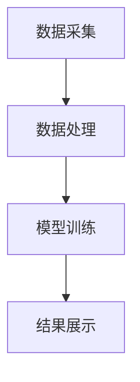

                 


# 特价股票投资中的全球创新指数分析方法

> **关键词**：特价股票，全球创新指数，股票投资，数据分析，量化投资，技术分析  
> **摘要**：本文系统地探讨了全球创新指数在特价股票投资中的应用方法。通过分析创新指数的核心概念、理论基础、数据分析方法及系统架构，结合实际案例，展示了如何利用创新指数进行投资决策。文章旨在为投资者提供一种基于创新指数的量化分析工具，帮助其在特价股票市场中做出更明智的投资决策。

---

# 第1章: 特价股票投资与全球创新指数分析概述

## 1.1 特价股票投资的基本概念

### 1.1.1 特价股票的定义与特点

特价股票通常指价格低于市场平均水平的股票，具有以下特点：
- **低估值**：市盈率、市净率等估值指标低于行业平均水平。
- **高波动性**：价格波动较大，适合短线交易。
- **高风险**：收益不确定性较高。

### 1.1.2 特价股票投资的背景与现状

随着全球经济的波动，投资者 increasingly seek undervalued stocks as part of their portfolio. The low prices of cheap stocks make them attractive for investors seeking high returns.

### 1.1.3 特价股票投资的核心问题与目标

- **核心问题**：如何识别具有长期增长潜力的特价股票。
- **目标**：通过分析公司基本面和市场趋势，寻找被低估的投资机会。

## 1.2 全球创新指数的基本概念

### 1.2.1 创新指数的定义与分类

创新指数是衡量一个地区或行业创新能力的指标，常见的分类包括：
- **技术创新指数**：衡量技术开发能力。
- **知识创新指数**：衡量知识创造能力。
- **市场创新指数**：衡量市场竞争力。

### 1.2.2 全球创新指数的指标体系

创新指数通常包括以下指标：
- 研发投入占比
- 专利申请数量
- 科技论文发表数量
- 高 tech 产业产值

### 1.2.3 全球创新指数与股票投资的关系

创新能力强的公司或行业通常具有更高的增长潜力，因此创新指数可以作为选股的重要依据。

## 1.3 特价股票投资中的全球创新指数分析方法

### 1.3.1 全球创新指数在股票投资中的应用

- 通过创新指数筛选具有高增长潜力的公司。
- 利用创新指数评估公司的竞争能力。

### 1.3.2 特价股票投资中创新指数分析的独特性

- 创新指数可以帮助识别被低估的创新型企业。
- 结合低估值和高创新能力，寻找潜在的高回报投资标的。

### 1.3.3 创新指数分析对投资决策的影响

- 提供了新的选股维度。
- 帮助投资者发现被市场忽视的创新机会。

## 1.4 本章小结

本章介绍了特价股票投资和全球创新指数的基本概念，阐述了创新指数在投资中的应用价值。

---

# 第2章: 全球创新指数分析的理论基础

## 2.1 创新指数分析的基本原理

### 2.1.1 创新指数分析的核心要素

- 创新能力
- 市场竞争力
- 技术进步

### 2.1.2 创新指数分析的数学模型

$$ I = \sum_{i=1}^{n} w_i x_i $$

其中，$I$ 表示创新指数，$w_i$ 表示第 $i$ 个指标的权重，$x_i$ 表示第 $i$ 个指标的得分。

### 2.1.3 创新指数分析的评价体系

- 指标选择：研发投入、专利数量、市场表现等。
- 权重分配：根据行业特点确定权重。

## 2.2 特价股票投资中的创新指数分析框架

### 2.2.1 投资目标与创新指数的关系

- 创新能力强的公司更可能实现长期增长。

### 2.2.2 创新指数分析在投资决策中的作用

- 帮助识别具有高增长潜力的公司。

### 2.2.3 创新指数分析的逻辑流程

1. 确定创新指数指标。
2. 收集相关数据。
3. 计算创新指数。
4. 分析指数与股价的关系。

## 2.3 全球创新指数分析的数学模型

### 2.3.1 创新指数的计算公式

$$ I = \sum_{i=1}^{n} w_i x_i $$

### 2.3.2 创新指数与股票价值的关系模型

$$ V = aI + bP + c $$

其中，$V$ 表示股票价值，$a$、$b$、$c$ 为常数，$I$ 表示创新指数，$P$ 表示其他因素。

## 2.4 本章小结

本章详细介绍了创新指数分析的理论基础和数学模型。

---

# 第3章: 创新指数分析的数据收集与预处理

## 3.1 数据收集的基本原则

### 3.1.1 数据来源的多样性和可靠性

- 数据来源包括政府报告、公司财报、专利数据库等。

### 3.1.2 数据采集的标准化与规范性

- 确保数据格式一致，便于后续分析。

### 3.1.3 数据清洗与预处理的步骤

1. 删除重复数据。
2. 处理缺失值。
3. 标准化数据。

## 3.2 数据预处理的关键技术

### 3.2.1 数据清洗方法

- 删除异常值。
- 填补缺失值。

### 3.2.2 数据标准化与归一化

- 使用归一化方法将数据缩放到统一范围。

### 3.2.3 数据特征提取与降维

- 使用主成分分析（PCA）进行降维。

## 3.3 数据预处理的实现案例

### 3.3.1 数据清洗的Python代码实现

```python
import pandas as pd
data = pd.read_csv('data.csv')
data.drop_duplicates(inplace=True)
data.dropna(inplace=True)
```

---

# 第4章: 创新指数分析的算法与模型

## 4.1 创新指数分析的主要算法

### 4.1.1 回归分析

- 用于分析创新指数与股价之间的关系。

### 4.1.2 聚类分析

- 用于将公司按创新能力分组。

## 4.2 创新指数分析的实现流程

### 4.2.1 数据分析流程

1. 数据清洗。
2. 特征提取。
3. 模型训练。

### 4.2.2 模型评估

- 使用交叉验证评估模型性能。

## 4.3 创新指数分析的代码实现

### 4.3.1 回归分析的Python代码

```python
import numpy as np
from sklearn.linear_model import LinearRegression
X = data[['I', 'P']]
y = data['V']
model = LinearRegression()
model.fit(X, y)
print(model.coef_)
```

---

# 第5章: 创新指数分析的系统架构与实现

## 5.1 系统功能设计

### 5.1.1 系统功能模块

- 数据采集模块
- 数据处理模块
- 模型训练模块
- 结果展示模块

### 5.1.2 功能模块之间的关系

- 数据采集模块向数据处理模块提供数据。
- 数据处理模块为模型训练模块提供预处理后的数据。

## 5.2 系统架构设计

### 5.2.1 系统架构图



## 5.3 系统接口设计

### 5.3.1 接口描述

- 数据采集接口：接收外部数据源的输入。
- 模型训练接口：接收预处理后的数据，输出模型结果。

### 5.3.2 接口交互流程

1. 数据采集模块接收外部数据。
2. 数据处理模块对数据进行清洗和预处理。
3. 模型训练模块基于预处理数据训练模型。
4. 结果展示模块将模型结果以可视化形式展示。

---

# 第6章: 创新指数分析的实战案例

## 6.1 实战案例选择

### 6.1.1 案例背景

选择一家具有代表性的公司进行分析。

### 6.1.2 数据获取

从公开数据源获取公司过去5年的数据。

## 6.2 数据分析与建模

### 6.2.1 数据预处理

- 删除缺失值。
- 标准化数据。

### 6.2.2 模型训练

- 使用回归模型预测公司股价。

## 6.3 模型评估与结果分析

### 6.3.1 模型评估

- 使用均方误差（MSE）评估模型性能。

### 6.3.2 结果分析

- 创新指数对股价的影响显著。

## 6.4 实战小结

通过案例分析，验证了创新指数分析的有效性。

---

# 第7章: 总结与展望

## 7.1 全文总结

本文系统地介绍了全球创新指数在特价股票投资中的应用方法，包括数据收集、模型建立和实战案例分析。

## 7.2 未来展望

未来的研究可以进一步完善创新指数的评价体系，探索更多创新的分析方法。

---

# 作者：AI天才研究院 & 禅与计算机程序设计艺术

