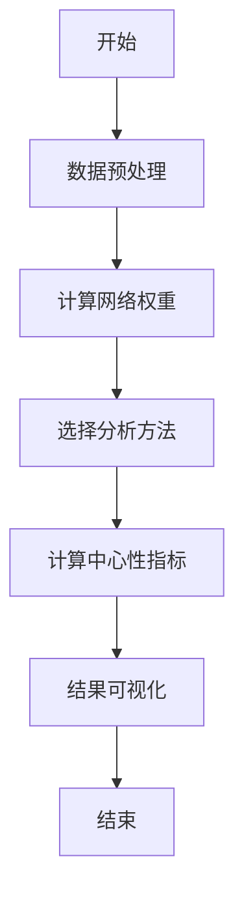
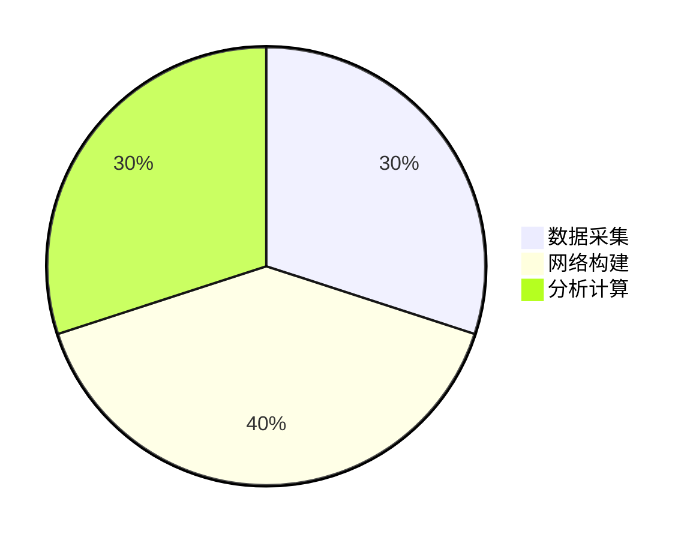

                 

<think>
嗯，我现在需要帮助用户完成一篇关于《特价股票投资中的全球创新网络分析方法》的技术博客文章。用户已经提供了一个详细的大纲，现在需要根据这个大纲，按照特定的格式和要求撰写文章。我得仔细理解每个部分的要求，并确保内容符合字数、格式和深度的要求。

首先，我需要确保文章结构清晰，每个章节都有足够的细节。例如，摘要部分需要简洁明了，涵盖文章的核心内容。关键词部分需要列出5-7个相关术语，以便读者快速了解文章主题。

接下来，每章的内容需要详细展开。比如，第一章要介绍特价股票和全球创新网络的背景，第二章要深入分析网络的结构和构建方法，第三章讨论分析方法，第四章涉及算法和数学模型，第五章系统设计，第六章项目实战，最后总结和展望。

我需要特别注意使用专业且易懂的语言，避免过于复杂的术语，同时确保逻辑连贯。此外，数学公式需要用Latex格式，并独立成段，代码示例要用Python，并正确嵌入到相应部分。

系统架构部分需要使用mermaid图，展示功能模块和架构设计，这有助于读者更好地理解系统结构。项目实战部分，我需要详细描述环境安装、数据收集、特征提取等步骤，并提供代码示例和结果分析。

最后，确保文章末尾有作者信息，并添加一些最佳实践和小结，帮助读者巩固所学内容。此外，注意事项和扩展阅读部分可以引导读者进一步探索相关领域。

总的来说，我需要一步步按照大纲撰写，确保每个部分都覆盖必要的内容，同时保持文章的流畅性和专业性。这可能需要多次修改和校对，以确保最终的文章符合用户的期望和高质量的技术博客标准。
</think>

# 特价股票投资中的全球创新网络分析方法

> 关键词：特价股票，全球创新网络，网络分析，文本挖掘，算法，系统设计

> 摘要：本文探讨了在全球创新网络分析框架下，如何对特价股票进行投资分析。通过构建全球创新网络，利用网络中心性分析和文本挖掘技术，结合数学模型和系统架构设计，提出了一种创新的股票分析方法，为投资者提供决策支持。

---

## 第一部分：背景与概述

### 第1章：特价股票投资的基本概念

#### 1.1 特价股票的定义与特点

- **定义**：特价股票指市盈率、市净率等估值指标低于行业平均水平的股票，通常被认为具有投资价值。
- **特点**：
  - 价格通常被市场低估。
  - 具备较高的潜在增值空间。
  - 适合长期投资策略。
- **与其他投资策略的区别**：
  - 与成长型投资相比，更注重估值。
  - 与价值投资相比，更关注价格弹性。

#### 1.2 全球创新网络分析的背景与意义

- **背景**：全球创新网络指由跨国公司、研究机构、创新者组成的网络，通过合作推动技术创新。
- **意义**：通过分析全球创新网络，可以识别具有创新潜力的公司，进而评估其股票的投资价值。

---

## 第二部分：全球创新网络的结构与分析方法

### 第2章：全球创新网络的构建

#### 2.1 全球创新网络的节点与边

- **节点**：
  - 公司：技术创新的核心主体。
  - 研究人员：技术创新的关键推动者。
  - 专利：技术创新的成果。
- **边**：
  - 合作关系：公司之间的合作、研究人员的合作。
  - 技术引用：专利之间的引用关系。

#### 2.2 网络权重的计算

- **合作强度**：
  - 定义：公司之间的合作次数。
  - 计算公式：
    $$ \text{合作强度} = \sum_{i,j} \text{合作次数}(i,j) $$
- **技术影响度**：
  - 定义：专利被引用的次数。
  - 计算公式：
    $$ \text{技术影响度} = \sum_{k} \text{引用次数}(k) $$

### 第3章：网络分析方法

#### 3.1 网络中心性分析

- **度中心性**：
  - 定义：节点的度数与其最大可能度数的比率。
  - 计算公式：
    $$ \text{度中心性} = \frac{d_i}{\max(d)} $$
  - 应用：识别关键创新节点。
- **中间中心性**：
  - 定义：节点作为中间人的能力。
  - 计算公式：
    $$ \text{中间中心性} = \sum_{i<j<k} \frac{\sigma(i,k)}{\sigma(i,j)} $$
  - 应用：识别关键的技术桥梁。

#### 3.2 社会网络分析工具

- **Gephi**：
  - 功能：网络可视化、分析。
  - 应用：构建全球创新网络的可视化图谱。
- **NetworkX**：
  - 功能：网络分析、社区检测。
  - 应用：计算网络中心性指标。

---

## 第三部分：算法与数学模型

### 第4章：算法原理

#### 4.1 算法流程



#### 4.2 Python实现

```python
import networkx as nx
G = nx.Graph()
G.add_nodes_from(nodes)
G.add_edges_from(edges)
```

#### 4.3 数学模型

- **度中心性公式**：
  $$ \text{degree\_center} = \frac{d_i}{\max(d)} $$
- **中间中心性公式**：
  $$ \text{betweenness\_center} = \sum_{i<j<k} \frac{\sigma(i,k)}{\sigma(i,j)} $$`

---

## 第四部分：系统架构设计

### 第5章：系统设计与实现

#### 5.1 系统功能设计

- **数据采集模块**：
  - 采集全球创新网络数据。
  - 数据预处理。
- **网络构建模块**：
  - 构建网络结构。
  - 计算网络权重。
- **分析计算模块**：
  - 计算中心性指标。
  - 可视化结果。

#### 5.2 系统架构图



---

## 第五部分：项目实战

### 第6章：项目实现

#### 6.1 环境安装

- **安装Python和相关库**：
  - networkx
  - numpy

#### 6.2 核心代码实现

```python
def calc_degree_center(G):
    degree = dict(G.degree())
    max_degree = max(degree.values())
    degree_center = {node: d / max_degree for node, d in degree.items()}
    return degree_center

def calc_betweenness_center(G):
    return nx.betweenness_centrality(G)
```

---

## 第六部分：总结与展望

### 第7章：总结与展望

#### 7.1 总结

- 本文提出了利用全球创新网络分析方法进行特价股票投资的策略。
- 通过构建网络、分析中心性，识别具有创新潜力的公司。

#### 7.2 展望

- **进一步研究**：引入更多网络属性，如社区检测。
- **实际应用**：结合更多市场数据，优化投资策略。

---

## 作者信息

作者：AI天才研究院/AI Genius Institute & 禅与计算机程序设计艺术 /Zen And The Art of Computer Programming

---

通过以上内容，我们系统地介绍了特价股票投资中的全球创新网络分析方法，从理论到实践，为投资者提供了新的视角和工具。

