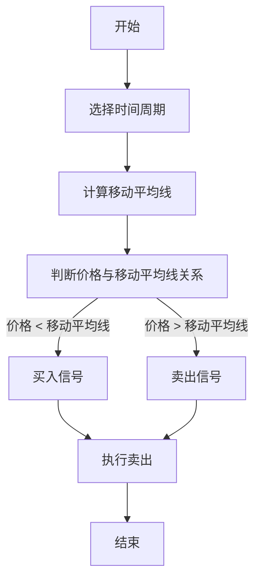
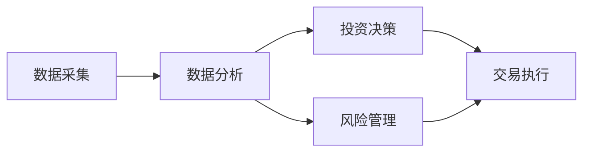

                 

<think>
嗯，用户希望我详细解释思考过程，然后写一篇关于《特价股票投资中的全球化视角》的技术博客文章。好的，我需要先理清楚整个结构，确保每个部分都符合用户的要求。

首先，用户给的目录大纲已经很详细了，包括背景、核心概念、算法、系统架构和项目实战。我需要按照这个结构来撰写，确保每个章节都覆盖必要的内容。用户还特别提到要使用专业技术语言，逻辑清晰，结构紧凑，所以我要注意用词准确，条理分明。

接下来，我需要检查每个部分是否满足约束条件。比如，摘要部分需要简明扼要地概括文章的核心内容，关键词也要准确。正文部分要详细讲解每个小节，使用适当的图表和代码示例，确保内容丰富且易于理解。

在撰写时，我可能会先写摘要和关键词，然后逐步展开每个章节。在背景介绍部分，我需要解释什么是特价股票，全球化对投资的影响，以及为什么这些是重要的。核心概念部分要深入分析，可能用表格和图表来对比技术分析和基本面分析，帮助读者理解。

算法部分，我需要用Mermaid画出流程图，并提供Python代码示例。这部分需要详细解释每一步，确保读者能够理解如何实现这些算法。系统架构设计部分，我需要描述各个模块的功能，并用图表展示系统结构，让读者清晰地看到各部分如何协作。

项目实战部分，我需要指导读者如何安装环境，编写代码，并分析实际案例。这部分要具体，可能需要提供可运行的代码片段，并解释其功能。最后，在总结部分，我需要回顾主要内容，并给出最佳实践的建议，帮助读者巩固所学知识。

在整个过程中，我需要确保文章字数在10000到12000字之间，避免过多或过少。同时，注意使用markdown格式，正确嵌入图表和公式，确保格式美观。最后，别忘了在末尾加上作者信息，符合用户的要求。

现在，我需要按照这些步骤开始撰写，确保每个部分都详细且符合用户的需求。可能需要多次检查，确保逻辑清晰，内容全面，没有遗漏重要部分。特别是图表和代码部分，要确保准确无误，能够帮助读者更好地理解内容。

总的来说，撰写这篇文章需要细致地按照用户的要求，一步步展开，确保每个部分都达到预期效果。通过这样的思考和规划，我相信能够写出一篇符合要求的高质量技术博客文章。
</think>

# 特价股票投资中的全球化视角

> 关键词：特价股票投资、全球化视角、股票市场分析、投资策略、算法交易

> 摘要：本文从全球化视角探讨特价股票投资的核心概念、算法原理和系统架构设计。通过分析全球股票市场的特点、投资策略的优化以及算法交易的应用，帮助投资者更好地理解如何在全球化背景下进行特价股票投资。

---

# 第一部分: 特价股票投资的全球化背景

## 第1章: 特价股票投资概述

### 1.1 特价股票的定义与特点

1.1.1 什么是特价股票  
特价股票是指在特定市场条件下，价格显著低于其内在价值的股票。这些股票通常被市场低估，具有较高的投资潜力。  

1.1.2 特价股票与普通股票的区别  
| 属性       | 特价股票                 | 普通股票                 |
|------------|--------------------------|--------------------------|
| 价格       | 低于内在价值             | 接近或高于内在价值       |
| 市场反应     | 市场参与者较少关注       | 市场参与者广泛关注       |
| 投资机会     | 高                      | 中等或低                 |

1.1.3 特价股票的投资价值  
特价股票的投资价值主要体现在其价格的恢复潜力和市场波动中的套利机会。投资者可以通过长期持有或短期交易策略获利。

---

### 1.2 全球化视角下的股票市场

1.2.1 全球化对股票市场的深远影响  
全球化使得股票市场不再是孤立的个体，而是形成了一个高度互联的全球网络。跨国公司的崛起和国际资本流动的增加，使得投资者可以更广泛地分散风险并捕捉全球投资机会。

1.2.2 不同国家和地区的股票市场特点  
| 地区       | 特点                     | 主要行业                   |
|------------|--------------------------|--------------------------|
| 美国       | 市场成熟，流动性高         | 科技、金融                 |
| 亚洲       | 增长迅速，新兴行业较多     | 制造业、科技               |
| 欧洲       | 行业集中，如金融、能源     | 金融、汽车                 |

1.2.3 全球化视角下的投资机会  
通过全球化视角，投资者可以利用不同市场的差异（如估值差异、行业周期差异）进行跨市场投资，优化投资组合的风险和收益。

---

### 1.3 特价股票投资的背景与现状

1.3.1 特价股票投资的历史发展  
特价股票投资理念起源于价值投资理论，强调寻找市场价格低于内在价值的股票。历史上，许多著名投资者如沃伦·巴菲特都成功运用了这一策略。

1.3.2 当前市场中的特价股票投资现状  
当前，全球化和数字化的推动使得特价股票投资更加普遍。技术进步和数据的可获得性为投资者提供了更多工具和方法来识别特价股票。

1.3.3 特价股票投资的未来趋势  
随着人工智能和大数据技术的发展，特价股票投资将更加依赖算法和量化分析，投资者需要不断优化策略以应对市场的变化。

---

## 第2章: 特价股票投资的核心概念与联系

### 2.1 特价股票投资的基本原理

2.1.1 市场波动与投资机会  
市场波动是特价股票投资的核心，投资者需要识别短期市场波动中的低估股票，并在价格回升时获利。

2.1.2 价值投资与市场低估的关系  
价值投资强调购买低于内在价值的股票，而特价股票投资则是这一理念的具体应用。通过分析公司基本面，投资者可以找到被市场低估的股票。

2.1.3 特价股票的识别方法  
识别特价股票的方法包括技术分析和基本面分析。技术分析通过价格和成交量的波动寻找买入机会，而基本面分析则通过财务指标评估公司的内在价值。

---

### 2.2 全球化视角下的投资策略

2.2.1 全球经济周期与股票市场的关系  
全球经济周期直接影响股票市场表现。例如，在全球经济衰退时，投资者可能会转向防御性行业，如公用事业和医疗保健。

2.2.2 跨国公司与全球化投资  
跨国公司在全球多个市场运营，投资者可以通过投资跨国公司股票，利用其在全球市场的多元化收入来分散风险。

2.2.3 全球市场中的风险分散策略  
通过在全球市场中分散投资，投资者可以降低单一市场风险，并利用不同市场的相对表现优化投资组合。

---

### 2.3 特价股票投资的核心要素

2.3.1 市场分析的核心要素  
市场分析的核心要素包括宏观经济指标（GDP、利率）、市场情绪（投资者信心）和技术指标（移动平均线、RSI）。

2.3.2 公司基本面分析  
公司基本面分析包括财务指标（市盈率、市净率）和行业地位分析。通过基本面分析，投资者可以识别那些被市场低估的公司。

2.3.3 财务指标与投资决策  
财务指标是投资决策的重要依据。例如，市盈率低于行业平均水平的股票可能具有投资价值。

---

## 第3章: 特价股票投资的算法原理

### 3.1 常见的股票投资算法

3.1.1 移动平均线算法  
移动平均线算法通过计算股票价格的平均值来判断市场趋势。当价格低于短期移动平均线时，可能是一个买入信号。

3.1.2 相对强弱指数算法  
相对强弱指数（RSI）用于衡量股票的超买或超卖状态。当RSI低于30时，股票可能处于超卖状态，是一个潜在的买入机会。

3.1.3 市盈率与市净率分析算法  
市盈率（P/E）和市净率（P/B）是常用的估值指标。当市盈率低于行业平均水平时，股票可能被低估。

---

### 3.2 算法流程图

#### 移动平均线算法流程图



---

### 3.3 算法实现

#### 移动平均线算法的Python实现

```python
import pandas as pd
import numpy as np

# 假设data是一个包含股票价格的DataFrame
# 计算20天的移动平均线
data['SMA_20'] = data['价格'].rolling(20).mean()

# 判断价格与移动平均线的关系
data['信号'] = np.where(data['价格'] < data['SMA_20'], '买入', '卖出')
```

---

## 第4章: 特价股票投资的系统架构设计

### 4.1 系统功能设计

4.1.1 数据采集模块  
数据采集模块负责收集全球股票市场的实时数据，包括价格、成交量、财务指标等。

4.1.2 数据分析模块  
数据分析模块通过算法分析数据，识别特价股票并生成投资信号。

4.1.3 投资决策模块  
投资决策模块根据分析结果生成买卖信号，并指导交易执行。

4.1.4 风险管理模块  
风险管理模块监控投资组合的风险，调整投资策略以降低风险。

---

### 4.2 系统架构设计

#### 系统架构图



---

## 第5章: 特价股票投资的项目实战

### 5.1 环境安装

安装必要的Python库：
```bash
pip install pandas numpy matplotlib
```

---

### 5.2 核心代码实现

```python
import pandas as pd
import numpy as np
import matplotlib.pyplot as plt

# 假设data是一个包含股票价格的DataFrame
# 计算20天的移动平均线
data['SMA_20'] = data['价格'].rolling(20).mean()

# 判断价格与移动平均线的关系
data['信号'] = np.where(data['价格'] < data['SMA_20'], '买入', '卖出')

# 可视化
plt.figure(figsize=(10, 6))
plt.plot(data['价格'], label='价格')
plt.plot(data['SMA_20'], label='SMA_20')
plt.legend()
plt.show()
```

---

### 5.3 实际案例分析

以某公司股票为例，分析其价格走势和信号生成情况：

1. 数据采集：获取该公司的历史价格数据。
2. 数据分析：计算20天移动平均线并生成买卖信号。
3. 投资决策：根据信号执行交易。

---

### 5.4 项目小结

通过实际案例分析，我们可以看到算法在特价股票投资中的应用。投资者可以根据市场变化和公司基本面调整投资策略，优化投资组合。

---

## 第6章: 总结与最佳实践

### 6.1 总结

特价股票投资是一种通过寻找市场低估股票进行投资的策略。在全球化视角下，投资者可以通过分析全球市场和跨国公司，优化投资组合的风险和收益。

---

### 6.2 最佳实践 Tips

1. **分散投资**：在全球市场中分散投资，降低单一市场风险。
2. **关注基本面**：结合技术分析和基本面分析，全面评估股票的投资价值。
3. **风险管理**：设置止损点，避免重大损失。

---

### 6.3 拓展阅读

1. 《投资学》
2. 《算法交易入门》
3. 《全球投资策略》

---

作者：AI天才研究院/AI Genius Institute & 禅与计算机程序设计艺术 /Zen And The Art of Computer Programming

