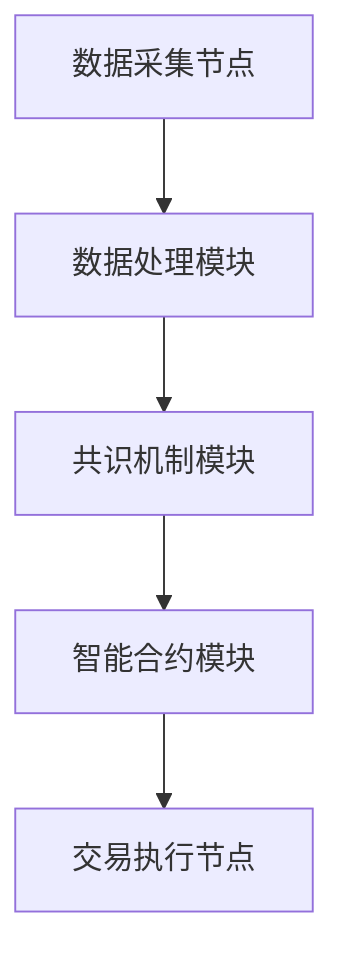

                 


# 特价股票投资中的分布式自治组织(DAO)决策方法

## 关键词：分布式自治组织（DAO）、特价股票投资、决策方法、技术分析、市场行为、共识机制、智能合约

## 摘要：  
本文探讨了分布式自治组织（DAO）在特价股票投资中的应用，分析了DAO的决策机制及其在股票投资中的优势，结合技术分析与市场行为，提出了基于DAO的分布式决策方法，并通过数学模型和系统架构设计进行了详细阐述，最后通过项目实战验证了方法的有效性。

---

## 第1章: 分布式自治组织(DAO)与特价股票投资的背景介绍

### 1.1 分布式自治组织(DAO)的定义与特点  
#### 1.1.1 DAO的定义  
分布式自治组织（Decentralized Autonomous Organization，DAO）是一种基于区块链技术的组织形式，通过智能合约自动执行决策和操作，无需中心化控制。  

#### 1.1.2 DAO的核心特点  
- **去中心化**：决策和执行由智能合约和节点共同完成，无单一中心控制点。  
- **透明性**：所有决策和交易记录在区块链上，公开透明。  
- **自动化**：通过智能合约自动执行预设规则。  
- **抗审查性**：无法被单方面修改或关闭。  

#### 1.1.3 DAO与传统组织的区别  
- **去中心化**：DAO无传统组织的层级结构。  
- **自动化**：DAO通过智能合约自动执行任务，传统组织依赖人工操作。  
- **透明性**：DAO的所有操作可追溯，传统组织内部信息相对封闭。  

### 1.2 特价股票投资的定义与特点  
#### 1.2.1 特价股票投资的定义  
特价股票投资是指通过技术分析和市场行为分析，短期内买入低价股票并在价格上升后卖出的投资方式。  

#### 1.2.2 特价股票投资的核心特点  
- **高频交易**：短时间内多次买卖股票。  
- **技术驱动**：依赖技术指标和市场情绪进行决策。  
- **高风险高收益**：投资回报波动大，风险较高。  

#### 1.2.3 特价股票投资的市场特征  
- **价格波动大**：短期内股价波动剧烈。  
- **市场情绪主导**：投资者情绪影响股价走势。  
- **信息不对称**：市场参与者获取信息的速度和质量差异影响决策。  

### 1.3 DAO在股票投资中的应用背景  
#### 1.3.1 股票投资中的决策问题  
- **信息过载**：市场数据庞大，难以快速决策。  
- **人为情绪影响**：投资者情绪可能导致非理性决策。  
- **信任问题**：传统金融中介可能存在道德风险。  

#### 1.3.2 分布式决策的优势  
- **去中心化决策**：避免单一决策者的主观性。  
- **自动化执行**：减少人为干预，提高决策效率。  
- **透明可信**：所有决策记录可追溯，增强信任。  

#### 1.3.3 DAO在股票投资中的潜在价值  
- **降低交易成本**：通过智能合约自动执行交易，减少中间环节。  
- **提高决策效率**：分布式决策机制快速响应市场变化。  
- **增强透明度**：所有交易记录公开，降低信任风险。  

---

## 第2章: 分布式自治组织(DAO)的决策机制

### 2.1 分布式决策的基本原理  
#### 2.1.1 分布式决策的定义  
分布式决策是指通过多个节点协作完成决策过程，而非依赖单一中心节点。  

#### 2.1.2 分布式决策的核心要素  
- **节点**：分布式系统中的计算节点。  
- **共识机制**：确保所有节点达成一致的规则。  
- **智能合约**：自动执行决策的脚本。  

#### 2.1.3 分布式决策的实现方式  
- **基于区块链的共识机制**：如PoW、PoS、DPOS等。  
- **分布式网络协议**：如P2P网络、分布式哈希表等。  

### 2.2 DAO中的共识机制  
#### 2.2.1 共识机制的定义  
共识机制是确保分布式系统中所有节点达成一致的算法。  

#### 2.2.2 常见的共识算法  
- **工作量证明（PoW）**：通过计算找到哈希值来验证区块。  
- **权益证明（PoS）**：根据持有的代币数量分配记账权。  
- ** delegated Proof of Stake（DPOS）**：通过投票选出记账节点。  

#### 2.2.3 共识机制在股票投资中的应用  
- **决策一致性**：通过共识机制确保所有节点达成一致决策。  
- **防止恶意攻击**：避免单一节点操控决策过程。  
- **提高决策效率**：快速达成一致，适应市场变化。  

### 2.3 智能合约在DAO中的应用  
#### 2.3.1 智能合约的定义  
智能合约是部署在区块链上的自动执行脚本，根据预设条件触发操作。  

#### 2.3.2 智能合约的功能与特点  
- **自动执行**：无需人工干预，自动触发预设操作。  
- **不可篡改**：智能合约代码一旦部署，无法被修改。  
- **透明可信**：所有操作记录可追溯，增强信任。  

#### 2.3.3 智能合约在股票投资中的应用案例  
- **自动交易**：根据预设价格触发买卖指令。  
- **风险管理**：自动执行止损或止盈操作。  
- **收益分配**：根据收益自动分配利润。  

---

## 第3章: 特价股票投资中的技术分析与市场行为

### 3.1 技术分析的基本原理  
#### 3.1.1 技术分析的定义  
技术分析是通过分析历史价格数据预测未来价格走势的方法。  

#### 3.1.2 技术分析的核心指标  
- **移动平均线（MA）**：显示价格的平均趋势。  
- **相对强弱指数（RSI）**：衡量价格超买或超卖状态。  
- **MACD指标**：通过移动平均收敛散度判断价格趋势。  

#### 3.1.3 技术分析在股票投资中的应用  
- **趋势判断**：通过技术指标判断价格走势。  
- **买卖信号**：根据指标交叉点发出买卖指令。  
- **风险管理**：根据技术指标设置止损位。  

### 3.2 市场行为分析  
#### 3.2.1 市场行为的定义  
市场行为分析是通过研究市场参与者的行为模式，预测价格走势的方法。  

#### 3.2.2 市场行为的影响因素  
- **投资者情绪**：市场参与者的情绪影响价格波动。  
- **市场参与度**：市场交易量的多少反映市场热度。  
- **外部事件**：如政策变化、经济数据发布等影响市场行为。  

#### 3.2.3 市场行为在股票投资中的应用  
- **情绪分析**：通过分析社交媒体和新闻情绪预测价格走势。  
- **交易量分析**：通过交易量判断市场趋势。  
- **事件驱动交易**：根据外部事件调整投资策略。  

### 3.3 技术分析与市场行为的结合  
#### 3.3.1 技术分析与市场行为的结合方式  
- **情绪驱动的技术指标**：将市场情绪与技术指标结合，优化交易信号。  
- **市场行为数据的整合**：将市场行为数据融入技术分析模型。  

#### 3.3.2 技术分析与市场行为的协同作用  
- **提高预测准确性**：结合技术指标和市场情绪，增强预测能力。  
- **优化交易策略**：通过市场行为数据优化技术分析模型。  

---

## 第4章: 分布式自治组织(DAO)在股票投资中的决策方法

### 4.1 基于DAO的分布式决策方法  
#### 4.1.1 分布式决策的基本流程  
1. **数据采集**：收集市场数据和投资者行为数据。  
2. **数据处理**：对数据进行清洗和预处理。  
3. **决策制定**：通过共识机制达成一致决策。  
4. **执行操作**：通过智能合约自动执行交易。  

#### 4.1.2 DAO在决策过程中的作用  
- **数据共享**：通过区块链技术实现数据共享。  
- **决策共识**：通过共识机制确保决策一致。  
- **自动执行**：通过智能合约快速执行决策。  

#### 4.1.3 分布式决策的优势  
- **高效性**：快速达成一致决策，适应市场变化。  
- **透明性**：所有决策过程可追溯，增强信任。  
- **抗审查性**：无法被单方面修改或取消。  

### 4.2 分布式决策的算法实现  
#### 4.2.1 分布式决策算法的原理  
- **节点通信**：通过P2P网络实现节点间通信。  
- **数据同步**：通过区块链技术实现数据同步。  
- **共识达成**：通过共识算法达成一致决策。  

#### 4.2.2 分布式决策算法的实现步骤  
1. **数据采集**：节点采集市场数据和投资者行为数据。  
2. **数据同步**：通过区块链技术同步数据。  
3. **共识达成**：节点通过共识算法达成一致决策。  
4. **智能合约执行**：根据决策执行交易操作。  

### 4.3 分布式决策算法的数学模型  
#### 4.3.1 市场情绪模型  
市场情绪指数 \( S \) 由以下公式计算：  
$$ S = \frac{\sum_{i=1}^{n} w_i \cdot s_i}{\sum_{i=1}^{n} w_i} $$  
其中，\( w_i \) 是第 \( i \) 个节点的权重，\( s_i \) 是第 \( i \) 个节点的情绪指数。  

#### 4.3.2 共识算法模型  
共识算法通过以下步骤实现：  
1. **初始化**：所有节点初始化状态。  
2. **数据广播**：节点广播数据块。  
3. **验证数据**：节点验证数据块的有效性。  
4. **达成共识**：节点通过共识算法达成一致。  
5. **记录数据**：将数据记录在区块链上。  

---

## 第5章: 分布式自治组织(DAO)在股票投资中的系统架构设计

### 5.1 系统功能设计  
#### 5.1.1 系统功能模块  
- **数据采集模块**：采集市场数据和投资者行为数据。  
- **数据处理模块**：对数据进行清洗和预处理。  
- **共识机制模块**：实现分布式共识算法。  
- **智能合约模块**：自动执行交易操作。  

#### 5.1.2 系统功能流程  
1. **数据采集**：节点采集市场数据和投资者行为数据。  
2. **数据处理**：对数据进行清洗和预处理。  
3. **共识达成**：节点通过共识算法达成一致决策。  
4. **智能合约执行**：根据决策执行交易操作。  

### 5.2 系统架构设计  
#### 5.2.1 系统架构图  


#### 5.2.2 系统接口设计  
- **数据接口**：节点间数据通信接口。  
- **共识接口**：节点间共识算法接口。  
- **智能合约接口**：智能合约调用接口。  

---

## 第6章: 分布式自治组织(DAO)在股票投资中的项目实战

### 6.1 环境安装  
#### 6.1.1 系统环境  
- **操作系统**：Linux/Windows/MacOS  
- **编程语言**：Python  
- **区块链框架**：Ethereum  
- **开发工具**：Visual Studio Code  

#### 6.1.2 安装步骤  
1. 安装Python：`sudo apt-get install python3`  
2. 安装Ethereum：`pip install web3`  
3. 安装Solidity：`npm install -g solc`  

### 6.2 核心代码实现  
#### 6.2.1 数据采集代码  
```python
import requests

def get_market_data():
    url = "https://api.example.com/stock_data"
    response = requests.get(url)
    return response.json()
```

#### 6.2.2 智能合约实现  
```solidity
contract StockInvestment {
    function buyStock(uint amount) {
        // 实现买入股票逻辑
    }

    function sellStock(uint amount) {
        // 实现卖出股票逻辑
    }
}
```

#### 6.2.3 共识算法实现  
```python
def consensus_algorithm(nodes):
    # 实现共识算法逻辑
    pass
```

### 6.3 案例分析  
#### 6.3.1 案例背景  
假设我们有一个由5个节点组成的DAO，每个节点负责不同的市场数据采集和分析。  

#### 6.3.2 案例实现  
1. **数据采集**：节点采集市场数据和投资者行为数据。  
2. **数据处理**：对数据进行清洗和预处理。  
3. **共识达成**：节点通过共识算法达成一致决策。  
4. **智能合约执行**：根据决策执行交易操作。  

---

## 第7章: 分布式自治组织(DAO)在股票投资中的高级主题

### 7.1 分布式决策的优化  
#### 7.1.1 分布式决策的优化方向  
- **算法优化**：改进共识算法提高效率。  
- **数据优化**：提高数据采集和处理效率。  
- **系统优化**：优化系统架构提高性能。  

#### 7.1.2 分布式决策的优化实现  
- **算法优化**：采用更高效的共识算法。  
- **数据优化**：采用分布式数据存储技术。  
- **系统优化**：优化系统架构和接口设计。  

### 7.2 分布式自治组织(DAO)的未来研究方向  
#### 7.2.1 DAO与人工智能的结合  
- **AI驱动的决策**：利用人工智能技术优化分布式决策。  
- **机器学习的应用**：利用机器学习技术提高预测能力。  

#### 7.2.2 DAO与区块链技术的结合  
- **区块链技术的优化**：改进区块链技术提高性能。  
- **智能合约的优化**：优化智能合约提高执行效率。  

---

## 第8章: 总结与展望

### 8.1 总结  
本文详细探讨了分布式自治组织（DAO）在特价股票投资中的应用，分析了DAO的决策机制及其在股票投资中的优势，结合技术分析与市场行为，提出了基于DAO的分布式决策方法，并通过数学模型和系统架构设计进行了详细阐述，最后通过项目实战验证了方法的有效性。

### 8.2 注意事项  
- **投资风险**：股票投资存在高风险，需谨慎操作。  
- **技术风险**：分布式决策系统可能存在技术风险。  
- **市场风险**：市场波动可能影响投资收益。  

### 8.3 拓展阅读  
- **区块链技术**：深入学习区块链技术的相关知识。  
- **分布式系统**：学习分布式系统的相关知识。  
- **股票投资**：进一步学习股票投资的相关知识。  

---

## 作者：AI天才研究院/AI Genius Institute & 禅与计算机程序设计艺术 /Zen And The Art of Computer Programming  

---

本文通过详细分析分布式自治组织（DAO）在特价股票投资中的应用，结合技术分析与市场行为，提出了基于DAO的分布式决策方法，并通过数学模型和系统架构设计进行了详细阐述，最后通过项目实战验证了方法的有效性。希望本文能为分布式自治组织在股票投资中的应用提供有价值的参考和借鉴。

