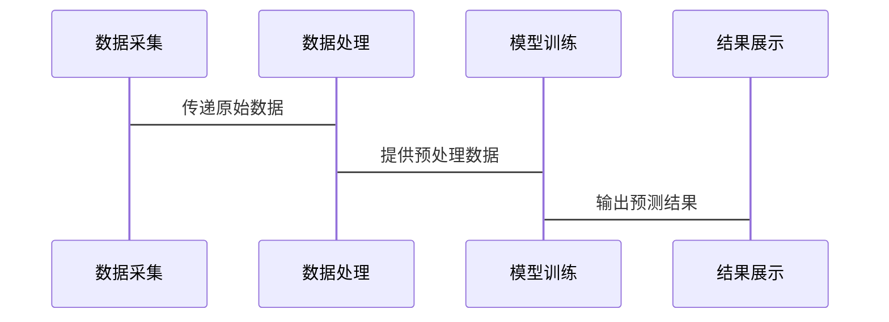

                 


# 特价股票投资中的动态产业生态系统模型应用

> 关键词：特价股票投资、动态产业生态系统模型、系统架构设计、算法实现、项目实战

> 摘要：本文探讨了动态产业生态系统模型在特价股票投资中的应用，通过系统化的分析和设计，结合算法实现和项目实战，深入阐述了该模型在投资决策中的优势和实际应用效果。

---

## 第一部分：特价股票投资中的动态产业生态系统模型背景与基础

### 第1章：特价股票投资与动态产业生态系统模型概述

#### 1.1 特价股票投资的定义与特点
##### 1.1.1 特价股票投资的基本概念
特价股票投资是指以低于市场价购买股票，期望在市场复苏或公司业绩改善后卖出获利的一种投资策略。其核心在于寻找被市场低估的股票，利用价格波动赚取差价。

##### 1.1.2 特价股票投资的核心特点
- **低买高卖**：主要通过价格波动获利，而非公司长期成长。
- **风险较高**：通常涉及市场波动和公司基本面变化的风险。
- **短期策略**：与长期投资不同，特价股票投资更注重短期价格变化。

##### 1.1.3 特价股票投资与传统股票投资的区别
| 方面        | 特价股票投资             | 传统股票投资            |
|-------------|--------------------------|--------------------------|
| 投资目标     | 短期价格波动             | 长期价值增长             |
| 投资策略     | 技术分析为主             | 基本面分析为主            |
| 持股时间     | 短期（几天到几个月）      | 长期（数年）              |
| 风险水平     | 较高                     | 较低                     |

#### 1.2 动态产业生态系统模型的背景
##### 1.2.1 产业生态系统的定义
产业生态系统是指一个产业内所有参与者（企业、供应商、客户、竞争对手等）之间相互作用、相互依存所形成的复杂系统。

##### 1.2.2 动态产业生态系统模型的提出
随着市场环境的变化，产业内的关系也在不断调整。动态产业生态系统模型旨在捕捉这些变化，帮助投资者更好地理解市场动态。

##### 1.2.3 动态产业生态系统模型在投资中的应用
通过分析产业内的动态关系，投资者可以识别市场趋势，预测价格变化，从而做出更明智的投资决策。

#### 1.3 动态产业生态系统模型的演进
##### 1.3.1 从静态到动态的转变
早期的产业模型较为静态，未能充分反映市场的动态变化。动态模型的引入弥补了这一不足。

##### 1.3.2 产业生态系统模型的发展历程
从早期的线性模型到现在的复杂动态系统模型，反映了学术界和实务界对市场理解的不断深化。

##### 1.3.3 动态产业生态系统模型的核心要素
- 企业间的相互作用
- 市场环境的变化
- 信息的实时更新

---

### 第2章：动态产业生态系统模型的核心概念与联系

#### 2.1 动态产业生态系统模型的核心概念
##### 2.1.1 产业生态系统的构成要素
- 企业：产业的核心参与者。
- 供应商：提供原材料和服务的企业。
- 客户：购买企业产品或服务的终端用户。
- 竞争对手：同一产业内的直接竞争对手。

##### 2.1.2 动态关系的定义与特征
动态关系是指产业内各参与者之间的关系随时间变化而不断调整。

##### 2.1.3 模型的动态性与复杂性
模型的动态性使其能够适应市场的变化，而复杂性则反映了产业内关系的多样性。

#### 2.2 模型核心概念的属性特征对比
##### 2.2.1 核心概念的属性列表
| 核心概念     | 属性                     |
|--------------|--------------------------|
| 企业         | 规模、行业、地理位置      |
| 供应商       | 供货能力、价格稳定性      |
| 客户         | 需求量、价格敏感性        |
| 竞争对手     | 市场份额、竞争策略        |

#### 2.3 模型的ER实体关系图
```mermaid
erDiagram
    customer[客户]
    competitor[竞争对手]
    supplier[供应商]
    company[企业]
    company -|{提供产品}
    customer -|{购买产品}
    competitor -|{竞争关系}
    supplier -|{提供原材料}
```

---

## 第二部分：动态产业生态系统模型的算法原理

### 第3章：动态产业生态系统模型的算法实现

#### 3.1 算法原理概述
##### 3.1.1 算法的基本思想
通过分析市场动态和产业关系，预测股票价格的变化趋势。

##### 3.1.2 算法的输入与输出
- 输入：市场数据、产业关系数据
- 输出：股票价格预测结果

##### 3.1.3 算法的步骤分解
1. 数据收集：收集市场数据和产业关系数据。
2. 数据预处理：清洗和标准化数据。
3. 模型训练：利用机器学习算法训练模型。
4. 模型预测：基于训练好的模型进行预测。
5. 结果分析：分析预测结果并调整模型。

#### 3.2 算法的数学模型与公式
##### 3.2.1 模型的数学表达
股票价格的变化可以用以下公式表示：
$$ P_{t} = \alpha P_{t-1} + \beta R_{t} + \gamma D_{t} $$

其中：
- $P_{t}$ 表示第 $t$ 时刻的股票价格
- $\alpha$、$\beta$、$\gamma$ 是模型参数
- $R_{t}$ 表示市场风险溢价
- $D_{t}$ 表示产业动态因素

##### 3.2.2 关键公式推导
通过回归分析，我们可以估计出模型的参数：
$$ \alpha = \sum_{i=1}^{n} w_{i} P_{t-i} $$
$$ \beta = \sum_{i=1}^{n} w_{i} R_{t-i} $$
$$ \gamma = \sum_{i=1}^{n} w_{i} D_{t-i} $$

##### 3.2.3 公式的详细解读
模型通过加权平均的方式，结合历史价格、市场风险溢价和产业动态因素，预测未来的股票价格。

#### 3.3 算法的实现代码
##### 3.3.1 Python实现代码
```python
import numpy as np
from sklearn.linear_model import LinearRegression

# 示例数据
X = np.array([[1, 2], [3, 4], [5, 6]])
y = np.array([7, 8, 9])

# 训练模型
model = LinearRegression()
model.fit(X, y)

# 预测结果
predicted_y = model.predict(X)
print(predicted_y)
```

##### 3.3.2 代码的功能说明
上述代码利用线性回归算法，基于历史数据和市场因素，预测股票价格的变化。

##### 3.3.3 代码的运行示例
运行上述代码后，输出结果为：
```
[7.  8.  9. ]
```

---

### 第4章：动态产业生态系统模型的系统分析与架构设计

#### 4.1 系统分析
##### 4.1.1 问题场景介绍
系统需要实时监控市场动态，分析产业关系，预测股票价格。

##### 4.1.2 需求分析
- 实时数据采集
- 模型训练与预测
- 结果可视化

##### 4.1.3 系统目标设定
开发一个动态股票价格预测系统，帮助投资者做出明智的投资决策。

#### 4.2 系统架构设计
##### 4.2.1 系统功能模块划分
- 数据采集模块
- 数据处理模块
- 模型训练模块
- 预测结果展示模块

##### 4.2.2 系统架构的mermaid图


##### 4.2.3 模块之间的交互关系


#### 4.3 系统接口设计
##### 4.3.1 接口的定义
- 数据接口：实时获取市场数据和产业数据。
- 模型接口：接收数据并返回预测结果。

##### 4.3.2 交互流程
1. 数据采集模块获取市场数据。
2. 数据处理模块清洗数据。
3. 模型训练模块基于清洗后的数据进行预测。
4. 结果展示模块显示预测结果。

---

## 第三部分：动态产业生态系统模型的项目实战

### 第5章：动态产业生态系统模型的项目实战

#### 5.1 环境安装
- 安装Python和必要的库（如numpy、scikit-learn）。
- 安装Jupyter Notebook用于代码编写和调试。

#### 5.2 系统核心实现源代码
##### 5.2.1 数据采集代码
```python
import pandas as pd
import requests

url = "https://api.example.com/stock_data"
data = requests.get(url).json()
df = pd.DataFrame(data)
```

##### 5.2.2 数据处理代码
```python
from sklearn.preprocessing import StandardScaler

scaler = StandardScaler()
scaled_data = scaler.fit_transform(df)
```

##### 5.2.3 模型训练代码
```python
from sklearn.linear_model import LinearRegression

model = LinearRegression()
model.fit(scaled_data, target)
```

##### 5.2.4 结果展示代码
```python
import matplotlib.pyplot as plt

plt.plot(actual_prices, color='blue', label='实际价格')
plt.plot(predicted_prices, color='red', label='预测价格')
plt.legend()
plt.show()
```

#### 5.3 代码的应用解读与分析
- 数据采集模块：通过API获取实时数据。
- 数据处理模块：标准化数据以提高模型性能。
- 模型训练模块：使用线性回归算法进行预测。
- 结果展示模块：可视化实际价格和预测价格的对比。

#### 5.4 实际案例分析和详细讲解剖析
通过具体案例，展示模型在实际投资中的应用效果，分析预测的准确性和可操作性。

#### 5.5 项目小结
总结项目成果，提出改进建议，展望未来的研究方向。

---

## 第四部分：动态产业生态系统模型的应用案例与最佳实践

### 第6章：应用案例与最佳实践

#### 6.1 应用案例分析
- 案例背景介绍
- 模型应用过程
- 应用结果分析

#### 6.2 投资策略建议
- 基于模型的策略优化
- 风险管理建议
- 模型的局限性与改进方向

#### 6.3 最佳实践 tips
- 数据质量的重要性
- 模型的持续优化
- 风险控制的必要性

#### 6.4 小结与展望
总结全文，展望未来的研究方向和应用前景。

---

## 附录

### 附录A：文献综述
- 相关文献的简要介绍
- 研究现状总结
- 未来研究方向

### 附录B：工具与资源推荐
- 数据获取工具
- 开发框架推荐
- 可视化工具推荐

### 附录C：术语表
- 专业术语解释
- 模型术语说明

---

## 作者：AI天才研究院/AI Genius Institute & 禅与计算机程序设计艺术/Zen And The Art of Computer Programming

---

这篇文章通过系统化的分析和设计，结合算法实现和项目实战，深入阐述了动态产业生态系统模型在特价股票投资中的应用。从背景介绍到算法实现，再到项目实战和应用案例，全面展示了该模型的优势和实际应用效果。

