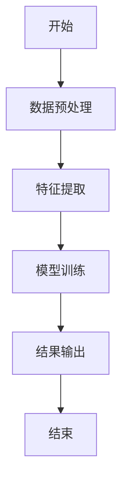
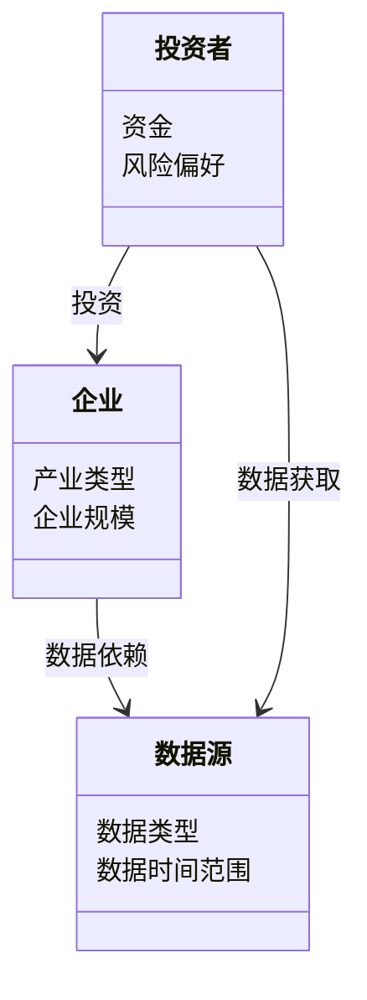
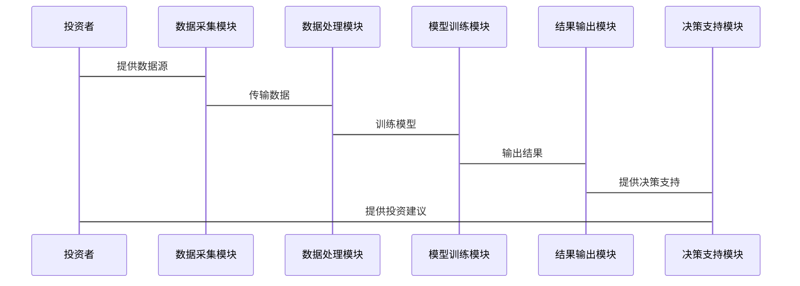

                 


# 特价股票投资中的动态数字产业生态系统模型应用

## 关键词：特价股票、动态数字生态系统、投资策略、产业分析、数据驱动

## 摘要：本文介绍了一种基于动态数字产业生态系统模型的特价股票投资方法。通过分析产业间的动态关系和数据流，构建数学模型，帮助企业进行投资决策。文章详细讲解了模型的核心概念、算法原理、系统架构，并通过实际案例展示其应用效果，为投资者提供科学的决策支持。

---

# 第一部分：特价股票投资中的动态数字产业生态系统模型背景介绍

## 第1章：特价股票投资的背景与概念

### 1.1 特价股票的定义与特点

#### 1.1.1 特价股票的定义
特价股票是指价格相对较低，具有较高增长潜力的股票。这类股票通常来自中小型企业或新兴行业，具有较高的投资回报潜力。

#### 1.1.2 特价股票的核心特点
- 价格低廉：相对于大盘股，特价股票的价格较低，适合小额投资者。
- 增长潜力：许多特价股票来自快速发展的行业，具有较高的增长潜力。
- 波动性较大：由于市场关注度较低，特价股票价格波动较大，投资风险较高。

#### 1.1.3 特价股票与普通股票的区别
- 投资门槛：特价股票的投资门槛较低，适合小额投资者。
- 风险与收益：特价股票的风险较高，但潜在收益也更大。
- 市场关注度：普通股票通常受到更多机构关注，而特价股票往往被市场忽视。

### 1.2 动态数字产业生态系统模型的背景

#### 1.2.1 数字化转型对企业的影响
随着数字化转型的推进，企业之间的关联性增强，数据成为企业竞争的核心资源。动态数字产业生态系统模型能够帮助企业更好地理解和把握这些变化。

#### 1.2.2 产业生态系统的概念
产业生态系统是指由多个行业、企业、技术、数据等因素构成的复杂网络。动态数字产业生态系统模型强调了这些要素之间的动态关系和相互作用。

#### 1.2.3 动态数字产业生态系统的特性
- 动态性：产业之间的关系和数据流随时间变化而变化。
- 数字化：数据成为核心资源，数据流驱动企业决策。
- 复杂性：产业生态系统由多个子系统组成，具有高度复杂性。

### 1.3 特价股票投资的现状与挑战

#### 1.3.1 特价股票投资的现状
目前，特价股票投资主要依赖于传统财务指标和市场情绪分析。然而，这种方法往往忽视了企业所处的产业生态系统和动态关系。

#### 1.3.2 投资中的主要挑战
- 数据不足：缺乏足够的数据支持投资决策。
- 动态变化：产业生态系统不断变化，投资策略需要动态调整。
- 风险控制：如何在高波动性中控制风险是投资者面临的主要挑战。

#### 1.3.3 数字技术在投资中的应用前景
通过动态数字产业生态系统模型，投资者可以更好地理解企业所处的产业环境，发现潜在的投资机会，并优化投资策略。

## 1.4 本章小结
本章介绍了特价股票的定义、特点以及投资中的挑战。同时，提出了动态数字产业生态系统模型的概念，为后续的分析奠定了基础。

---

## 第2章：动态数字产业生态系统模型的核心概念

### 2.1 模型的核心要素

#### 2.1.1 产业的定义与分类
- **产业**：指具有相似产品或服务的企业集合。例如，科技产业、制造业、金融产业等。
- **分类**：根据规模、地理位置、产品类型等进行分类。

#### 2.1.2 企业的角色与功能
- **企业**：产业生态系统的基本单元，通过提供产品或服务参与市场竞争。
- **功能**：生产、销售、研发、创新等。

#### 2.1.3 数据流的定义与作用
- **数据流**：指企业之间或企业内部传递的信息和数据。
- **作用**：数据流是企业决策的重要依据，也是产业生态系统运行的基础。

### 2.2 模型的属性与特征

#### 2.2.1 动态性分析
- **动态性**：产业生态系统中的关系和数据流随时间变化而变化。
- **驱动因素**：市场需求、技术创新、政策变化等。

#### 2.2.2 数字化特征
- **数据驱动**：数据成为企业决策的核心依据。
- **技术支撑**：大数据、人工智能等技术为模型提供支持。

#### 2.2.3 产业间的关系
- **互补性**：不同产业之间的互补关系，例如科技与制造业的结合。
- **竞争性**：同一产业内部的竞争关系。

### 2.3 模型的ER实体关系图

```mermaid
erDiagram
    actor 投资者 {
        <属性> 资金
        <属性> 风险偏好
    }
    actor 企业 {
        <属性> 产业类型
        <属性> 企业规模
    }
    actor 数据源 {
        <属性> 数据类型
        <属性> 数据时间范围
    }
    investor -> 企业 : 投资
    企业 -> 数据源 : 数据依赖
    投资者 -> 数据源 : 数据获取
```

### 2.4 本章小结
本章详细介绍了动态数字产业生态系统模型的核心概念，包括产业、企业、数据流等要素，并通过ER图展示了它们之间的关系。

---

## 第3章：动态数字产业生态系统模型的算法原理

### 3.1 模型的动态方程

#### 3.1.1 动态方程的定义
动态方程描述了产业生态系统中各要素之间的动态关系，用于预测企业价值的变化。

#### 3.1.2 数据流的计算公式
数据流的计算公式如下：
$$D(t) = a \cdot F(t) + b \cdot T(t)$$
其中，$D(t)$ 表示数据流，$F(t)$ 表示企业间的互动频率，$T(t)$ 表示时间因素，$a$ 和 $b$ 是系数。

#### 3.1.3 企业价值的评估方法
企业价值的评估公式如下：
$$V(t) = c \cdot D(t) + d \cdot S(t)$$
其中，$V(t)$ 表示企业价值，$S(t)$ 表示企业规模，$c$ 和 $d$ 是系数。

### 3.2 算法的实现流程



### 3.3 算法的数学模型

#### 3.3.1 动态方程的数学表达
$$V(t) = a \cdot D(t) + b \cdot S(t)$$
其中，$V(t)$ 表示企业价值，$D(t)$ 表示数据流，$S(t)$ 表示企业规模。

#### 3.3.2 数据流的计算公式
$$D(t) = \sum_{i=1}^{n} w_i \cdot x_i$$
其中，$w_i$ 是权重，$x_i$ 是输入变量。

### 3.4 本章小结
本章详细介绍了动态数字产业生态系统模型的算法原理，包括动态方程的定义、数据流的计算公式以及企业价值的评估方法。

---

## 第4章：动态数字产业生态系统模型的系统架构

### 4.1 系统功能设计

#### 4.1.1 领域模型


#### 4.1.2 系统架构设计


### 4.2 系统接口设计

#### 4.2.1 数据接口
- **输入接口**：接收企业数据和市场数据。
- **输出接口**：输出模型预测结果。

#### 4.2.2 用户接口
- **投资者界面**：显示投资建议和风险分析。
- **管理员界面**：管理数据和模型参数。

### 4.3 系统交互流程



### 4.4 本章小结
本章详细介绍了动态数字产业生态系统模型的系统架构，包括功能设计、接口设计和交互流程。

---

## 第5章：动态数字产业生态系统模型的应用与案例分析

### 5.1 特价股票投资中的应用

#### 5.1.1 数据采集与处理
- **数据来源**：企业财务数据、市场数据、行业报告等。
- **数据预处理**：清洗、转换、标准化。

#### 5.1.2 模型训练与优化
- **训练数据**：历史股价、财务指标、市场趋势等。
- **模型优化**：调整参数，提高预测精度。

### 5.2 案例分析

#### 5.2.1 案例背景
某科技公司是一家中小型企业，属于特价股票范畴。我们希望通过模型预测其股价走势。

#### 5.2.2 数据分析
- **数据来源**：公司财务报表、行业报告、市场数据。
- **数据处理**：清洗、转换、标准化。

#### 5.2.3 模型预测
通过模型预测，该公司股价在未来三个月内有较大增长潜力，适合投资。

### 5.3 投资策略优化

#### 5.3.1 策略制定
- **短期投资**：根据模型预测，短期内买入特价股票。
- **长期投资**：根据产业趋势，选择具有长期增长潜力的公司。

#### 5.3.2 风险控制
- **止损策略**：设定止损点，控制投资风险。
- **分散投资**：通过投资多个股票分散风险。

### 5.4 本章小结
本章通过实际案例展示了动态数字产业生态系统模型在特价股票投资中的应用，并提出了优化投资策略的方法。

---

## 第6章：动态数字产业生态系统模型的最佳实践

### 6.1 小结
动态数字产业生态系统模型为特价股票投资提供了科学的决策支持，帮助企业更好地把握市场机会。

### 6.2 注意事项
- **数据质量**：确保数据准确性和完整性。
- **模型更新**：根据市场变化及时更新模型。
- **风险控制**：制定合理的风险管理策略。

### 6.3 拓展阅读
- **相关书籍**：《投资学基础》、《数据科学与投资分析》。
- **学术论文**：推荐阅读相关领域的最新研究成果。

### 6.4 本章小结
本章总结了动态数字产业生态系统模型的应用效果，并提出了投资中的注意事项和拓展学习的方向。

---

# 作者信息

作者：AI天才研究院/AI Genius Institute & 禅与计算机程序设计艺术 /Zen And The Art of Computer Programming

---

**本文完**

