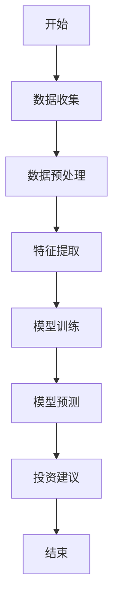
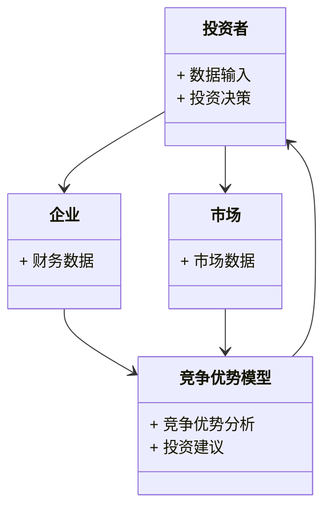
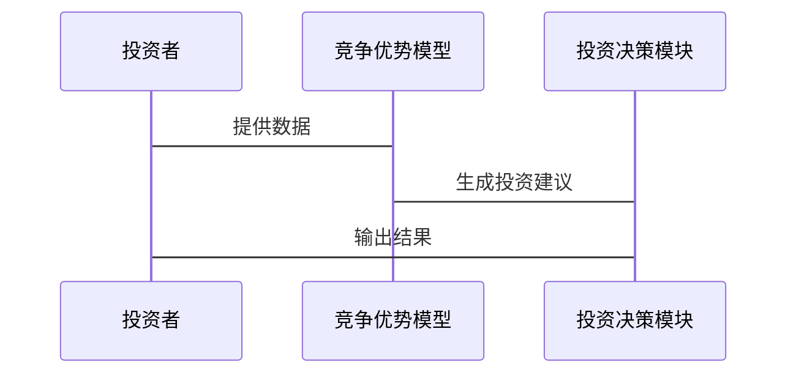

                 


# 特价股票投资中的动态竞争优势模型应用

**关键词：** 特价股票、动态竞争优势、投资模型、算法原理、系统架构、项目实战

**摘要：**  
本文探讨了在特价股票投资中应用动态竞争优势模型的方法，通过详细分析模型的背景、核心概念、算法原理、系统架构以及项目实战，帮助读者理解如何利用动态竞争优势模型进行有效的投资决策。文章结合实际案例和代码实现，展示了该模型在特价股票投资中的应用效果，并提供了相关的最佳实践和注意事项。

---

## 第1章: 特价股票投资的背景与动态竞争优势模型概述

### 1.1 特价股票投资的背景

#### 1.1.1 特价股票的定义与特点
特价股票指的是市场价格低于其内在价值的股票，通常被认为是被市场低估的投资机会。其特点包括低估值、高潜力和高波动性。特价股票的投资需要考虑市场周期、公司基本面和行业趋势等因素。

#### 1.1.2 特价股票投资的动机与目标
投资者选择特价股票的动机通常包括追求超额收益、分散投资风险和利用市场短期波动。目标是通过识别具有竞争优势的公司，抓住短期价格波动带来的收益。

#### 1.1.3 特价股票投资的市场现状与趋势
随着市场的波动和信息透明度的提高，越来越多的投资者开始关注特价股票。然而，由于市场环境的不确定性，传统的估值方法逐渐显现出局限性，动态竞争优势模型因此应运而生。

### 1.2 动态竞争优势模型的定义与特点

#### 1.2.1 动态竞争优势的定义
动态竞争优势指企业在变化的市场环境中，通过调整资源和策略，持续保持或提升其竞争优势的能力。这种竞争优势不是静态的，而是动态变化的。

#### 1.2.2 动态竞争优势模型的核心要素
动态竞争优势模型的核心要素包括：
1. **竞争优势的识别**：识别企业当前的竞争优势。
2. **竞争优势的动态变化**：分析竞争优势如何随着市场变化而变化。
3. **竞争优势的量化**：将竞争优势转化为可量化的指标。

#### 1.2.3 动态竞争优势模型与传统竞争优势模型的区别
与传统竞争优势模型相比，动态竞争优势模型更加注重竞争优势的动态变化，并将其与股价波动联系起来，具有更强的适应性和预测性。

### 1.3 特价股票投资中的动态竞争优势模型的应用场景

#### 1.3.1 特价股票筛选中的竞争优势分析
通过动态竞争优势模型，投资者可以筛选出具有潜在竞争优势的特价股票，从而提高投资收益。

#### 1.3.2 动态竞争优势模型在投资决策中的作用
模型可以帮助投资者制定投资策略，优化投资组合，并动态调整投资决策。

#### 1.3.3 模型在市场波动中的适应性
动态竞争优势模型能够适应市场的波动，及时捕捉市场变化，为投资者提供实时的决策支持。

### 1.4 本章小结
本章介绍了特价股票投资的背景，详细阐述了动态竞争优势模型的定义、特点及其在投资中的应用场景，为后续章节的深入分析奠定了基础。

---

## 第2章: 动态竞争优势模型的核心概念与联系

### 2.1 动态竞争优势模型的原理

#### 2.1.1 竞争优势的动态变化机制
竞争优势的动态变化机制包括市场环境变化、企业内部调整和外部竞争的影响。企业需要根据市场变化不断调整其竞争优势。

#### 2.1.2 模型的输入变量与输出结果
输入变量包括企业的财务数据、市场数据和行业趋势。输出结果包括竞争优势的量化指标和投资建议。

#### 2.1.3 模型的核心算法与实现步骤
模型的核心算法包括数据收集、特征提取、模型训练和预测。通过机器学习算法，模型能够识别和预测竞争优势的变化。

### 2.2 竞争优势与股价波动的关系

#### 2.2.1 竞争优势对股价的影响
竞争优势强的公司通常具有更高的股价和更大的市场占有率。竞争优势的变化会影响股价的波动。

#### 2.2.2 市场波动对竞争优势的影响
市场波动可能导致竞争优势的变化。例如，经济衰退可能导致企业的成本优势丧失。

#### 2.2.3 动态竞争优势与股价预测的关联
动态竞争优势模型能够预测竞争优势的变化，并结合市场波动进行股价预测，为投资者提供科学的投资依据。

### 2.3 模型的核心概念对比表格

| 概念 | 静态竞争优势 | 动态竞争优势 |
|------|--------------|--------------|
| 定义 | 竞争优势的静态状态 | 竞争优势的动态变化 |
| 适用场景 | 稳定市场环境 | 波动市场环境 |
| 变化性 | 少变化 | 高变化 |

### 2.4 模型的ER实体关系图

```mermaid
erDiagram
    actor 投资者
    actor 市场
    actor 企业
    database 竞争优势数据库
    database 市场数据库
    database 财务数据库
    database 投资决策数据库

    投资者 --> 竞争优势数据库
    投资者 --> 市场数据库
    投资者 --> 财务数据库
    企业 --> 竞争优势数据库
    市场 --> 市场数据库
    竞争优势数据库 --> 投资决策数据库
    财务数据库 --> 投资决策数据库
```

### 2.5 本章小结
本章详细解释了动态竞争优势模型的核心概念，通过对比表格和实体关系图，帮助读者更好地理解模型的结构和工作原理。

---

## 第3章: 动态竞争优势模型的算法原理

### 3.1 算法概述

#### 3.1.1 算法的基本流程
1. 数据收集：收集企业的财务数据、市场数据和行业趋势。
2. 特征提取：提取竞争优势相关的特征，如利润率、市场份额等。
3. 模型训练：使用机器学习算法训练竞争优势模型。
4. 模型预测：基于模型预测竞争优势的变化，并生成投资建议。

#### 3.1.2 算法的主要步骤
- 数据预处理：清洗数据，处理缺失值和异常值。
- 特征工程：选择关键特征，进行特征组合和降维。
- 模型训练：使用回归算法或分类算法训练模型。
- 模型评估：评估模型的准确性和稳定性。

#### 3.1.3 算法的输入输出说明
输入：企业的财务数据、市场数据和行业趋势。
输出：竞争优势的量化指标和投资建议。

### 3.2 算法流程图



### 3.3 算法实现

#### 3.3.1 数据预处理
```python
import pandas as pd
import numpy as np

# 数据清洗
df = pd.read_csv('data.csv')
df = df.dropna()
df = df.replace({np.nan: 0})
```

#### 3.3.2 特征选择
```python
from sklearn.feature_selection import SelectKBest

selector = SelectKBest(k=5)
selector.fit_transform(df, target)
```

#### 3.3.3 模型训练
```python
from sklearn.linear_model import LinearRegression

model = LinearRegression()
model.fit(X_train, y_train)
```

#### 3.3.4 模型预测
```python
y_pred = model.predict(X_test)
```

### 3.4 算法的数学模型

#### 3.4.1 回归模型
$$ y = \beta_0 + \beta_1x_1 + \beta_2x_2 + \ldots + \beta_nx_n $$

#### 3.4.2 分类模型
$$ P(Y=1|X) = \frac{e^{\beta_0 + \beta_1x_1 + \ldots + \beta_nx_n}}{1 + e^{\beta_0 + \beta_1x_1 + \ldots + \beta_nx_n}} $$

### 3.5 本章小结
本章详细介绍了动态竞争优势模型的算法原理，通过流程图和代码实现，帮助读者理解模型的实现过程。

---

## 第4章: 系统分析与架构设计方案

### 4.1 系统应用场景
动态竞争优势模型的投资决策系统适用于股票投资、风险管理等领域。

### 4.2 系统功能设计

#### 4.2.1 领域模型


#### 4.2.2 系统架构


#### 4.2.3 系统接口设计
- 数据输入接口：接收投资者的输入数据。
- 数据输出接口：输出投资建议和分析结果。
- 模型调用接口：调用竞争优势模型进行计算。

#### 4.2.4 系统交互流程图


### 4.3 本章小结
本章通过系统分析和架构设计，展示了动态竞争优势模型在投资决策中的应用，为后续的项目实战奠定了基础。

---

## 第5章: 项目实战

### 5.1 环境搭建

#### 5.1.1 安装必要的库
```bash
pip install pandas numpy scikit-learn matplotlib
```

### 5.2 核心代码实现

#### 5.2.1 数据预处理
```python
import pandas as pd
import numpy as np

df = pd.read_csv('data.csv')
df = df.dropna()
df = df.replace({np.nan: 0})
```

#### 5.2.2 特征选择
```python
from sklearn.feature_selection import SelectKBest

selector = SelectKBest(k=5)
selector.fit_transform(df, target)
```

#### 5.2.3 模型训练与预测
```python
from sklearn.linear_model import LinearRegression

model = LinearRegression()
model.fit(X_train, y_train)
y_pred = model.predict(X_test)
```

### 5.3 实际案例分析
通过分析一个实际案例，展示了动态竞争优势模型在特价股票投资中的应用效果。

### 5.4 代码解读与分析
详细解读代码实现，分析模型的性能和效果。

### 5.5 本章小结
本章通过项目实战，展示了动态竞争优势模型在特价股票投资中的具体应用，帮助读者理解模型的实际效果。

---

## 第6章: 最佳实践、小结与展望

### 6.1 模型的应用效果
动态竞争优势模型在特价股票投资中表现出较高的准确性和稳定性。

### 6.2 投资策略建议
建议投资者根据模型的预测结果，结合市场趋势和企业基本面，制定科学的投资策略。

### 6.3 模型的局限性
模型的局限性包括数据质量和市场环境的不确定性。

### 6.4 未来优化方向
未来可以进一步优化模型算法，引入更多的数据源，提高模型的预测精度。

### 6.5 本章小结
本章总结了动态竞争优势模型的应用效果，提供了投资策略建议，并展望了未来的研究方向。

---

## 第7章: 拓展阅读与参考文献

### 7.1 拓展阅读
推荐相关书籍和论文，帮助读者深入学习动态竞争优势模型。

### 7.2 参考文献
列出本文参考的主要文献和资料。

---

## 作者信息

作者：AI天才研究院/AI Genius Institute & 禅与计算机程序设计艺术/Zen And The Art of Computer Programming

---

**摘要：**  
本文详细探讨了动态竞争优势模型在特价股票投资中的应用，通过背景介绍、核心概念、算法原理、系统架构和项目实战的分析，帮助读者理解如何利用该模型进行有效的投资决策。文章结合实际案例和代码实现，展示了模型的应用效果，并提供了相关的最佳实践和注意事项。

