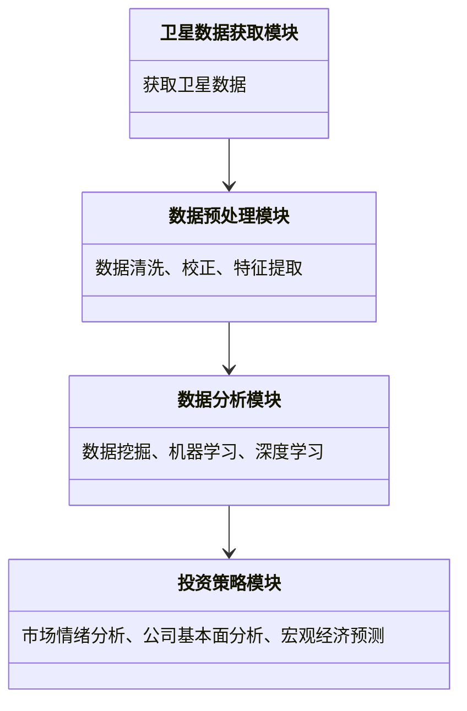

                 

<think>
嗯，用户希望我撰写一篇关于《特价股票投资中的卫星大数据分析与应用》的技术博客文章。首先，我需要理解用户的需求。用户是一位技术专家，希望文章结构清晰，逻辑严谨，内容专业且易于理解。文章需要包含详细的目录大纲，每个部分都要有背景介绍、核心概念、算法原理、系统架构设计、项目实战等内容。

用户给出的示例是一个软件2.0相关的书籍目录，结构分为七大部分，每个部分都有详细的子部分。我需要模仿这种结构，但专注于卫星大数据在股票投资中的应用。首先，我得确定文章的核心关键词和摘要，确保涵盖主要主题。

接下来，我需要规划文章的结构。第一部分应该是卫星大数据的概述，介绍其基本概念和特点。然后是数据获取与处理，包括数据源、预处理和特征提取。第三部分分析方法，涵盖数据挖掘、机器学习和深度学习的应用。第四部分讨论投资策略，如何将卫星数据应用于投资决策。第五部分系统架构设计，第六部分项目实战，最后是总结与展望。

在每个部分中，我需要详细展开，比如在卫星大数据概述中，解释卫星数据的定义、分类以及在金融中的应用。在数据获取与处理部分，讨论如何获取数据、清洗和特征提取。分析方法部分，需要详细讲解各种算法及其在卫星数据中的应用，可能包括数学公式和代码示例。

系统架构设计部分，我需要用mermaid绘制类图和架构图，展示系统的各个模块及其交互。项目实战部分，需要提供具体的案例，包括环境安装、代码实现和案例分析，可能需要使用Python编写代码，展示如何利用卫星数据进行股票预测。

另外，用户强调要使用逻辑清晰、结构紧凑、简单易懂的语言，并且每个部分都要有详细的解释和实例。我需要确保每个小节都有足够的细节，同时保持整体连贯性。可能需要多次调整结构，确保每个章节都涵盖必要的内容，并且深度足够。

最后，检查是否符合字数要求，确保文章在10000到12000字左右。同时，确保格式正确，使用markdown，并在末尾添加作者信息。可能还需要在某些部分插入数学公式和图表，用latex和mermaid格式表示，使文章更具专业性。

总的来说，我需要按照用户提供的结构，逐步展开每个部分，确保内容详实，逻辑清晰，同时满足所有技术要求和格式规范。
</think>

```markdown
# 特价股票投资中的卫星大数据分析与应用

## 关键词：卫星大数据、股票投资、数据分析、机器学习、深度学习、金融量化

## 摘要：  
随着卫星技术的快速发展，卫星大数据在金融领域的应用逐渐成为热点。本文将探讨卫星大数据在特价股票投资中的应用，从数据获取、处理、分析到投资策略的实现，全面解析卫星大数据在股票投资中的潜力与挑战。通过结合卫星数据与量化投资策略，本文将展示如何利用卫星大数据提升投资决策的科学性和准确性。

---

## 第一部分: 卫星大数据概述

### 第1章: 卫星大数据的基本概念与特点

#### 1.1 卫星数据的定义与分类
##### 1.1.1 卫星数据的定义
卫星数据是指通过卫星传感器获取的地球表面及大气层的各种物理、化学和生物信息。这些数据通常以图像、遥感数据或其他形式存在，并广泛应用于气象、农业、环境监测等领域。

##### 1.1.2 卫星数据的分类
卫星数据可以根据其来源和应用领域进行分类：
- **光学遥感数据**：如 Landsat、Sentinel-2 等，主要用于土地利用、植被监测等。
- **雷达遥感数据**：如 Sentinel-1、Radarsat 等，主要用于地形测绘、灾害监测等。
- **气象卫星数据**：如 NOAA、FY-4 等，主要用于天气预报和气候研究。

##### 1.1.3 卫星数据在金融领域的应用
卫星数据在金融领域的应用主要集中在以下几个方面：
- **市场情绪分析**：通过分析卫星图像中的交通、建筑密度等信息，推测经济活动的活跃程度。
- **公司基本面分析**：通过卫星图像监测企业的生产活动、库存变化等，辅助评估企业经营状况。
- **宏观经济预测**：通过分析卫星图像中的土地利用变化、城市化进程等，预测经济趋势。

#### 1.2 卫星大数据的特点
卫星大数据具有以下特点：
- **数据量大**：卫星每天产生的数据量以 TB 级计。
- **数据类型多样**：包括图像、文本、数值等多种形式。
- **数据更新频率高**：卫星数据可以实时或近实时更新，便于及时分析。
- **数据的时空分辨率高**：卫星数据可以提供高精度的空间和时间信息。

#### 1.3 卫星大数据在特价股票投资中的应用背景
##### 1.3.1 特价股票投资的基本概念
特价股票是指价格低于其内在价值的股票，通常是由于市场短期波动、信息不对称或其他因素导致的价格低估。投资者通过分析市场信息，寻找具有投资价值的特价股票。

##### 1.3.2 卫星大数据在股票投资中的潜在价值
卫星大数据可以提供传统的财务数据之外的额外信息，帮助投资者更全面地评估企业的经营状况和市场前景。例如：
- 通过卫星图像监测企业的生产活动，评估企业的实际生产能力。
- 通过分析卫星图像中的交通流量，推测企业的物流情况。
- 通过卫星图像监测自然灾害对企业的潜在影响。

##### 1.3.3 当前市场中的应用现状
目前，卫星大数据在股票投资中的应用仍处于起步阶段，但已经有一些成功的案例。例如：
- 使用卫星图像监测农业企业的种植面积和产量，辅助评估农业企业的经营状况。
- 使用卫星图像监测城市交通流量，推测企业的物流成本和效率。

---

## 第二部分: 卫星大数据的获取与处理

### 第2章: 卫星数据的获取渠道

#### 2.1 公共卫星数据源
- **NASA Earth Data**：提供丰富的卫星数据资源，如 Landsat、MODIS 等。
- **ESA Copernicus**：提供 Sentinel 系列卫星数据。
- **NOAA**：提供气象卫星数据。

#### 2.2 商业卫星数据服务
- **Planet Labs**：提供高分辨率的卫星图像。
- **Satellite imagery APIs**：如 Google Maps API、Mapbox API 等，可以通过 API 获取卫星数据。

#### 2.3 数据接口与 API
- **APIs for satellite data**：如 USGS Earth Explorer API、Copernicus API 等。

### 第3章: 卫星数据的预处理

#### 3.1 数据清洗与校正
- **数据清洗**：去除噪声、填补缺失值、标准化数据格式。
- **数据校正**：通过几何校正、辐射校正等技术，提高数据的准确性。

#### 3.2 数据格式转换
- **转换为统一格式**：如将不同卫星的数据统一转换为 GeoTIFF 格式。
- **数据融合**：将不同来源的数据进行融合，提高数据的综合分析能力。

#### 3.3 数据特征提取
- **基本特征提取**：如提取 NDVI（归一化差异植被指数）、地表温度等。
- **高级特征提取**：如提取时间序列特征、空间模式特征。

### 第4章: 卫星数据的分析方法

#### 4.1 数据挖掘与机器学习
- **数据挖掘**：通过聚类、分类、回归等方法，发现数据中的潜在规律。
- **机器学习**：如随机森林、支持向量机等算法，用于分类、回归等任务。
- **深度学习**：如卷积神经网络（CNN）、长短期记忆网络（LSTM）等，用于图像识别、时间序列预测等任务。

#### 4.2 时间序列分析
- **时间序列的基本概念**：时间序列是指按时间顺序排列的数据，常用于预测未来趋势。
- **卫星数据的时间序列建模**：如 ARIMA、GARCH 等模型。
- **基于时间序列的预测模型**：如 LSTM 网络。

#### 4.3 空间数据分析
- **空间数据的基本概念**：空间数据是指具有地理位置信息的数据，常用于空间分布分析。
- **空间数据分析方法**：如空间插值、空间统计、空间聚类等。
- **空间数据可视化**：如地图投影、热力图等。

---

## 第三部分: 卫星大数据在股票投资中的应用策略

### 第5章: 基于卫星大数据的市场情绪分析

#### 5.1 市场情绪的基本概念
- 市场情绪是指市场参与者对市场的整体看法和态度，通常可以通过市场行为数据、新闻数据、社交媒体数据等进行分析。

#### 5.2 卫星数据在市场情绪分析中的应用
- 通过分析卫星图像中的交通流量、建筑密度等信息，推测市场的活跃程度。

#### 5.3 基于卫星数据的市场情绪预测模型
- **模型设计**：通过机器学习算法（如随机森林、XGBoost）对卫星数据进行特征提取和分类，预测市场情绪。

### 第6章: 基于卫星大数据的公司基本面分析

#### 6.1 公司基本面的基本概念
- 公司基本面是指影响公司价值的内在因素，包括财务状况、生产能力、市场地位等。

#### 6.2 卫星数据在公司基本面分析中的应用
- 通过卫星图像监测公司的生产活动、库存变化、物流情况等，辅助评估公司的经营状况。

#### 6.3 基于卫星数据的公司基本面预测模型
- **模型设计**：通过深度学习算法（如 CNN、LSTM）对卫星图像进行分析，预测公司的生产能力、库存变化等。

### 第7章: 基于卫星大数据的宏观经济预测

#### 7.1 宏观经济的基本概念
- 宏观经济是指整体经济运行的状态，包括 GDP、就业率、通货膨胀率等指标。

#### 7.2 卫星数据在宏观经济预测中的应用
- 通过卫星图像监测城市化进程、土地利用变化等，辅助预测宏观经济趋势。

#### 7.3 基于卫星数据的宏观经济预测模型
- **模型设计**：通过时间序列分析和机器学习算法，结合卫星数据和其他宏观经济指标，进行预测。

---

## 第四部分: 卫星大数据分析系统的架构设计

### 第8章: 系统功能设计

#### 8.1 领域模型设计


#### 8.2 系统架构设计
```mermaid
rectangle 系统边界 {
    卫星数据获取模块
    数据预处理模块
    数据分析模块
    投资策略模块
    用户界面
}
```

#### 8.3 系统接口设计
- **数据接口**：与卫星数据源对接，获取实时数据。
- **用户接口**：提供用户友好的界面，展示分析结果和投资建议。

---

## 第五部分: 项目实战

### 第9章: 卫星大数据分析与投资实战

#### 9.1 环境安装
- **Python 环境**：安装 Anaconda 或 virtualenv，配置 Python 3.8 或更高版本。
- **卫星数据源**：注册并获取 API Key，如 NASA Earth Data、Copernicus Hub 等。

#### 9.2 系统核心实现源代码
```python
import numpy as np
import pandas as pd
from sklearn.ensemble import RandomForestClassifier
from sklearn.metrics import accuracy_score

# 数据预处理
def preprocess(data):
    # 假设 data 是卫星图像的特征数据
    # 这里进行数据清洗和特征提取
    data.dropna(inplace=True)
    return data

# 机器学习模型训练
def train_model(X_train, y_train):
    model = RandomForestClassifier(n_estimators=100, random_state=42)
    model.fit(X_train, y_train)
    return model

# 模型预测
def predict_stock_price(model, X_test):
    y_pred = model.predict(X_test)
    return y_pred

# 主程序
if __name__ == "__main__":
    # 获取卫星数据
    data = fetch_satellite_data(api_key="your_api_key")
    # 数据预处理
    processed_data = preprocess(data)
    # 训练模型
    model = train_model(processed_data.drop('label', axis=1), processed_data['label'])
    # 预测股票价格
    X_test = processed_data.drop('label', axis=1)
    y_pred = predict_stock_price(model, X_test)
    print("预测股票价格:", y_pred)
```

#### 9.3 实际案例分析
- **案例背景**：假设我们希望通过卫星数据预测某公司的股票价格。
- **数据来源**：获取该公司的卫星图像数据，包括生产活动、物流情况等。
- **模型训练**：使用随机森林算法进行训练，评估模型的准确率。
- **结果分析**：根据模型预测结果，制定投资策略。

#### 9.4 项目小结
通过本项目，我们展示了如何利用卫星大数据进行股票投资分析。通过数据预处理、特征提取和机器学习模型训练，我们可以从卫星数据中提取有用的信息，辅助投资决策。

---

## 第六部分: 总结与展望

### 第10章: 总结
卫星大数据在股票投资中的应用潜力巨大，但目前仍处于起步阶段。通过结合卫星数据与量化投资策略，我们可以从新的角度分析市场信息，提升投资决策的科学性和准确性。

### 第11章: 展望
未来，随着卫星技术的不断发展，卫星大数据在股票投资中的应用将更加广泛和深入。我们可以期待更多基于卫星数据的投资策略和工具的出现。

---

## 作者：AI天才研究院/AI Genius Institute & 禅与计算机程序设计艺术 /Zen And The Art of Computer Programming
```

