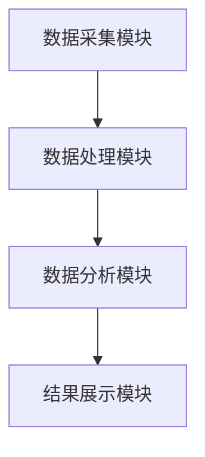

                 

# 特价股票投资中的卫星数据应用与分析

> **关键词**：卫星数据、股票分析、特价股票、金融投资、数据驱动
>
> **摘要**：随着科技的发展，卫星数据在金融领域的应用逐渐崭露头角。本文将探讨卫星数据如何在特价股票投资中发挥作用，分析其核心概念、算法原理、系统架构及实际应用案例。通过详细的技术分析和案例解读，揭示卫星数据在股票分析中的潜力与价值。

---

## 第一部分：卫星数据与特价股票投资的背景

### 第1章：卫星数据与股票分析的背景

#### 1.1 卫星数据的定义与特点

卫星数据是指通过卫星技术获取的各种地球表面及大气层的数据，包括光学图像、雷达数据、气象数据等。这些数据具有以下特点：

- **高分辨率**：卫星图像能够捕捉到地面上的细小结构，如建筑物、道路等。
- **广覆盖性**：卫星可以覆盖全球范围内的地理信息。
- **实时性**：卫星数据能够提供实时或接近实时的地理信息。
- **多样性**：卫星数据种类丰富，包括光学图像、雷达图像、气象数据等。

#### 1.2 卫星数据在金融领域的应用背景

在金融领域，卫星数据的应用尚处于起步阶段，但其潜力巨大。以下是卫星数据在金融领域中的几个潜在应用场景：

- **市场情绪分析**：通过分析卫星图像中的交通状况、建筑密度等，推测市场情绪。
- **供应链监控**：通过卫星图像监控物流运输情况，评估供应链稳定性。
- **自然灾害预警**：通过卫星数据监测自然灾害（如地震、洪水）的发生，评估其对股市的影响。

#### 1.3 卫星数据在特价股票投资中的应用潜力

特价股票通常指的是价格较低、流动性较低的股票。这类股票的投资机会往往被忽视，但其潜在收益可能较高。卫星数据可以通过以下方式帮助投资者分析特价股票：

- **公司位置分析**：通过卫星图像分析公司所在位置的地理特征，评估公司的潜在风险。
- **市场情绪分析**：通过分析卫星图像中的交通状况、建筑密度等，推测市场情绪。
- **供应链监控**：通过卫星图像监控物流运输情况，评估供应链稳定性。

### 第2章：卫星数据与股票分析的核心概念

#### 2.1 卫星数据的分类

卫星数据可以根据其类型和应用领域进行分类，主要包括以下几种：

- **光学卫星数据**：通过光学传感器获取的图像，主要用于地物识别。
- **雷达卫星数据**：通过雷达传感器获取的图像，主要用于地物特征提取。
- **气象卫星数据**：用于监测天气状况，如温度、湿度、风速等。

#### 2.2 卫星数据与股票分析的关联性

卫星数据与股票分析的关联性主要体现在以下几个方面：

- **地理特征分析**：通过卫星图像分析公司所在位置的地理特征，评估公司的潜在风险。
- **市场情绪分析**：通过分析卫星图像中的交通状况、建筑密度等，推测市场情绪。
- **供应链监控**：通过卫星图像监控物流运输情况，评估供应链稳定性。

#### 2.3 卫星数据在股票分析中的优势

卫星数据在股票分析中的优势主要体现在以下几个方面：

- **数据的实时性**：卫星数据能够提供实时或接近实时的地理信息，帮助投资者及时了解市场动态。
- **数据的广覆盖性**：卫星数据可以覆盖全球范围内的地理信息，帮助投资者分析不同地区的市场情况。
- **数据的多样性**：卫星数据种类丰富，可以提供多维度的信息，帮助投资者全面分析市场风险。

---

## 第二部分：卫星数据在股票分析中的算法原理

### 第3章：卫星数据的预处理与特征提取

#### 3.1 卫星数据的预处理

在进行股票分析之前，需要对卫星数据进行预处理，以确保数据的准确性和可用性。预处理步骤主要包括：

- **数据清洗**：去除噪声和干扰数据。
- **数据增强**：通过数据增强技术提高数据的质量。
- **数据标准化**：将数据标准化到统一的格式和尺度。

#### 3.2 卫星数据的特征提取

特征提取是卫星数据在股票分析中的关键步骤。以下是几种常用的特征提取方法：

- **图像分割**：通过图像分割技术提取卫星图像中的特定区域特征。
- **目标检测**：通过目标检测技术识别卫星图像中的特定目标，如建筑物、道路等。
- **图像分类**：通过图像分类技术将卫星图像分为不同的类别，如自然景观、城市区域等。

### 第4章：卫星数据驱动的股票预测模型

#### 4.1 基于卫星图像的股票预测模型

股票预测模型可以通过卫星图像中的地理特征进行预测。以下是几种常用的股票预测模型：

- **卷积神经网络（CNN）**：通过CNN提取卫星图像中的特征，进行股票价格预测。
- **支持向量机（SVM）**：通过SVM进行股票价格分类，预测股票价格的涨跌。
- **随机森林**：通过随机森林进行股票价格预测，评估市场的不确定性。

#### 4.2 基于卫星数据的时间序列分析

时间序列分析是股票预测的重要方法。以下是几种常用的时间序列分析方法：

- **ARIMA模型**：通过ARIMA模型进行股票价格的短期预测。
- **GARCH模型**：通过GARCH模型进行股票价格的波动预测。
- **LSTM网络**：通过LSTM网络进行股票价格的长期预测。

---

## 第三部分：卫星数据在股票分析中的系统架构

### 第5章：卫星数据分析系统的架构设计

#### 5.1 系统功能模块设计

卫星数据分析系统的功能模块设计主要包括以下几部分：

- **数据采集模块**：负责采集卫星数据。
- **数据处理模块**：负责对卫星数据进行预处理和特征提取。
- **数据分析模块**：负责对卫星数据进行分析，生成股票预测结果。
- **结果展示模块**：负责展示股票预测结果，供投资者参考。

#### 5.2 系统架构设计

以下是卫星数据分析系统的架构设计：

---

## 第四部分：卫星数据在股票分析中的项目实战

### 第6章：卫星数据驱动的股票预测实战

#### 6.1 环境搭建

以下是卫星数据分析系统的环境搭建步骤：

1. **安装Python**：安装Python编程语言，版本建议为3.6及以上。
2. **安装卫星数据处理库**：安装必要的卫星数据处理库，如`gdal`、`sentinelhub`等。
3. **安装机器学习库**：安装机器学习库，如`scikit-learn`、`tensorflow`等。

#### 6.2 数据采集与处理

以下是卫星数据的采集与处理步骤：

1. **数据采集**：通过卫星数据API获取卫星数据。
2. **数据预处理**：对卫星数据进行清洗、增强和标准化。
3. **特征提取**：通过图像分割、目标检测等技术提取卫星数据的特征。

#### 6.3 模型训练与预测

以下是股票预测模型的训练与预测步骤：

1. **数据分割**：将卫星数据和股票数据进行分割，分为训练集和测试集。
2. **模型训练**：使用训练数据训练股票预测模型。
3. **模型预测**：使用测试数据进行股票价格预测。

#### 6.4 结果分析

通过对预测结果进行分析，评估模型的准确性和可靠性。以下是几种常用的评估指标：

- **均方误差（MSE）**：衡量预测值与实际值之间的差距。
- **平均绝对误差（MAE）**：衡量预测值与实际值之间的绝对差距。
- **决定系数（R²）**：衡量模型的拟合优度。

---

## 第五部分：卫星数据在股票分析中的最佳实践

### 第7章：卫星数据驱动的股票分析总结

#### 7.1 小结

通过本文的分析，我们可以看到卫星数据在股票分析中的巨大潜力。卫星数据可以通过预处理和特征提取，结合机器学习算法，进行股票价格预测。

#### 7.2 注意事项

在实际应用中，需要注意以下几点：

- **数据质量**：确保卫星数据的准确性和完整性。
- **模型选择**：根据具体需求选择合适的模型和算法。
- **数据隐私**：注意保护数据隐私，遵守相关法律法规。

#### 7.3 拓展阅读

以下是拓展阅读的建议：

- **《卫星数据处理与分析》**：深入学习卫星数据的处理与分析方法。
- **《机器学习在金融中的应用》**：学习机器学习在金融中的应用技巧。
- **《股票预测模型的构建与优化》**：学习股票预测模型的构建与优化方法。

---

## 作者：AI天才研究院/AI Genius Institute & 禅与计算机程序设计艺术 /Zen And The Art of Computer Programming

