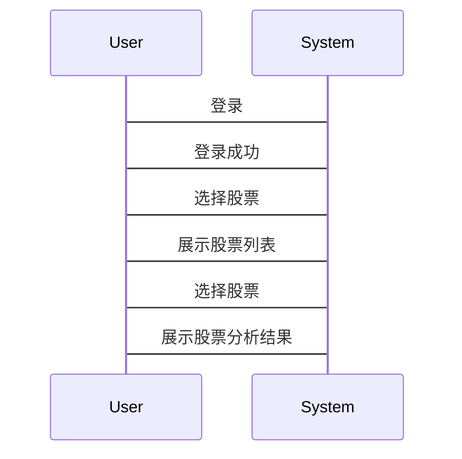

                 


# 特价股票投资中的另类数据挖掘与分析

## 关键词：特价股票，数据挖掘，另类数据，股票分析，投资策略，机器学习

## 摘要：  
本文深入探讨了特价股票投资中的另类数据挖掘与分析方法。通过分析特价股票的市场特点，结合另类数据的挖掘技术，提出了一套基于机器学习的股票分析与投资决策框架。文章从数据预处理、特征提取、算法选择到系统设计，全面详细地介绍了如何利用另类数据提升股票投资的准确性和效率。通过实际案例分析，展示了如何通过数据挖掘技术优化投资策略，降低风险，实现收益最大化。

---

## 第一部分: 特价股票投资中的另类数据挖掘与分析基础

### 第1章: 特价股票投资与另类数据挖掘概述

#### 1.1 特价股票投资的基本概念
##### 1.1.1 特价股票的定义与特点
特价股票是指那些市场价格低于其内在价值的股票，通常具有较高的投资潜力。其特点包括低估值、高成长性和较高的安全边际。

##### 1.1.2 特价股票投资的基本原理
特价股票投资基于“价值投资”理念，通过分析公司的基本面，寻找市场价格低于内在价值的投资机会。

##### 1.1.3 特价股票投资的市场环境
特价股票的市场环境受到宏观经济、行业周期、公司财务状况等多种因素的影响。

#### 1.2 另类数据挖掘的定义与特点
##### 1.2.1 另类数据的定义
另类数据是指那些传统金融数据之外的非结构化数据，例如社交媒体情绪、新闻标题、卫星图像等。

##### 1.2.2 另类数据的核心特征
- 非结构化：数据形式多样，包括文本、图像、语音等。
- 实时性：数据更新速度快，能够捕捉市场情绪的变化。
- 多样性：数据来源广泛，能够提供更多的市场信息。

##### 1.2.3 另类数据在金融领域的应用
- 市场情绪分析：通过社交媒体和新闻数据预测市场走势。
- 风险预警：通过新闻和舆情数据提前发现潜在风险。
- 投资决策支持：结合传统财务数据和另类数据优化投资策略。

#### 1.3 特价股票投资与另类数据挖掘的关系
##### 1.3.1 特价股票投资中另类数据的价值
另类数据能够提供传统财务数据之外的信息，帮助投资者更全面地评估公司价值。

##### 1.3.2 另类数据如何影响投资决策
通过分析另类数据，投资者可以更准确地预测市场趋势，发现潜在的投资机会。

##### 1.3.3 特价股票投资中的数据来源分析
- 公司财务数据：收入、利润、资产负债等。
- 市场情绪数据：社交媒体、新闻标题等。
- 行业数据：行业趋势、政策变化等。

#### 1.4 本章小结
本章介绍了特价股票投资的基本概念和另类数据的定义与特点，强调了另类数据在特价股票投资中的重要性。

---

## 第二部分: 特价股票投资中的数据挖掘与分析方法

### 第2章: 数据挖掘与分析的核心概念

#### 2.1 数据挖掘的基本原理
##### 2.1.1 数据挖掘的定义与流程
数据挖掘是从大量数据中提取有价值信息的过程，主要包括数据清洗、特征提取、模型建立和结果分析等步骤。

##### 2.1.2 数据挖掘的关键技术
- 数据清洗：去除噪声数据，提高数据质量。
- 特征提取：从数据中提取具有代表性的特征。
- 数据建模：建立数学模型进行预测和分类。

##### 2.1.3 数据挖掘与数据分析的区别
数据挖掘注重从数据中发现模式和规律，而数据分析更注重对数据的描述和解释。

#### 2.2 另类数据的特征分析
##### 2.2.1 另类数据的多样性
另类数据来源广泛，包括文本、图像、语音等多种形式。

##### 2.2.2 另类数据的实时性
另类数据能够快速反映市场变化，为投资决策提供实时支持。

##### 2.2.3 另类数据的可解释性
部分另类数据（如社交媒体情绪）具有较高的可解释性，能够帮助投资者理解市场情绪。

#### 2.3 数据挖掘在股票投资中的应用
##### 2.3.1 数据挖掘在市场预测中的作用
通过分析历史数据，预测未来市场走势。

##### 2.3.2 数据挖掘在风险控制中的应用
通过分析市场情绪和行业趋势，识别潜在风险。

##### 2.3.3 数据挖掘在投资组合优化中的价值
通过分析不同股票的关联性，优化投资组合的风险和收益。

#### 2.4 本章小结
本章详细介绍了数据挖掘的核心概念和技术，探讨了数据挖掘在股票投资中的多种应用。

---

## 第三部分: 特价股票投资中的算法与数学模型

### 第3章: 数据挖掘算法与股票投资

#### 3.1 常见数据挖掘算法概述
##### 3.1.1 监督学习算法
- 线性回归：用于预测股票价格。
- 支持向量机（SVM）：用于分类股票涨跌。

##### 3.1.2 非监督学习算法
- K-means：用于股票聚类分析。
- 层次聚类：用于分析股票之间的关联性。

##### 3.1.3 强化学习算法
- Q-Learning：用于制定动态投资策略。

#### 3.2 股票预测中的回归算法
##### 3.2.1 线性回归模型
$$ y = \beta_0 + \beta_1x + \epsilon $$
其中，y是股票价格，x是影响因素，$\beta_0$和$\beta_1$是回归系数。

##### 3.2.2 逻辑回归模型
$$ P(y=1|x) = \frac{e^{\beta_0 + \beta_1x}}{1 + e^{\beta_0 + \beta_1x}} $$

##### 3.2.3 回归算法的优缺点分析
- 优点：简单易懂，适合线性关系。
- 缺点：无法处理非线性关系，对异常值敏感。

#### 3.3 股票分类算法的应用
##### 3.3.1 支持向量机（SVM）
SVM通过构建超平面，将股票分为涨跌两类。

##### 3.3.2 决策树与随机森林
决策树通过特征分割进行分类，随机森林通过集成学习提高准确性。

##### 3.3.3 分类算法在股票投资中的案例
通过SVM分类算法，预测股票是否上涨。

#### 3.4 时间序列分析与股票预测
##### 3.4.1 时间序列的基本概念
时间序列是指按时间顺序排列的数据，常用于股票价格预测。

##### 3.4.2 ARIMA模型与股票预测
ARIMA模型通过分析历史价格数据，预测未来价格走势。

##### 3.4.3 LSTM模型在时间序列中的应用
LSTM通过记忆单元捕捉长期依赖关系，适用于股票价格的波动预测。

#### 3.5 本章小结
本章介绍了多种数据挖掘算法及其在股票投资中的应用，重点分析了回归、分类和时间序列预测算法。

---

## 第四部分: 系统架构与项目实战

### 第4章: 特价股票投资分析系统设计

#### 4.1 系统功能模块设计
##### 4.1.1 数据采集模块
负责采集股票价格、财务数据、社交媒体情绪等数据。

##### 4.1.2 数据处理模块
对采集到的数据进行清洗、特征提取和数据转换。

##### 4.1.3 数据分析模块
利用机器学习算法对数据进行建模和预测。

##### 4.1.4 结果展示模块
将分析结果以可视化形式展示，帮助投资者决策。

#### 4.2 系统架构设计
##### 4.2.1 分层架构设计
- 数据层：存储原始数据。
- 业务逻辑层：处理数据和业务逻辑。
- 表示层：展示分析结果。

##### 4.2.2 微服务架构设计
- 数据采集服务：负责数据采集。
- 数据处理服务：负责数据清洗和转换。
- 数据分析服务：负责模型训练和预测。
- 结果展示服务：负责数据可视化。

##### 4.2.3 系统架构的优缺点分析
- 优点：模块化设计，便于扩展和维护。
- 缺点：需要较高的开发和维护成本。

#### 4.3 系统接口设计
##### 4.3.1 数据接口设计
- 数据接口：从数据库中读取数据。
- 数据格式：JSON或CSV格式。

##### 4.3.2 API接口设计
- RESTful API：提供数据查询和分析结果接口。
- 安全机制：使用JWT进行身份验证。

##### 4.3.3 接口安全设计
- 认证：通过OAuth2进行用户认证。
- 授权：根据用户权限控制数据访问。

#### 4.4 系统交互流程设计
##### 4.4.1 用户登录与数据采集流程
用户登录系统，系统采集股票数据。

##### 4.4.2 数据分析与结果展示流程
系统对数据进行处理和分析，将结果展示给用户。

##### 4.4.3 数据更新流程
系统定期更新股票数据，保持数据的实时性。

#### 4.5 本章小结
本章详细设计了特价股票投资分析系统的功能模块、架构和接口，为实际开发提供了参考。

---

## 第五部分: 项目实战

### 第5章: 特价股票投资分析系统实现

#### 5.1 环境配置
- 操作系统：Windows 10或Linux
- 开发工具：PyCharm或Jupyter Notebook
- 依赖库：Pandas、NumPy、Scikit-learn、Keras、TensorFlow、Plotly

#### 5.2 系统核心实现源代码
##### 5.2.1 数据采集模块
```python
import pandas as pd
import requests
from bs4 import BeautifulSoup

def get_stock_data(ticker):
    url = f'https://finance.yahoo.com/quote/{ticker}'
    headers = {'User-Agent': 'Mozilla/5.0'}
    response = requests.get(url, headers=headers)
    soup = BeautifulSoup(response.text, 'html.parser')
    data = {
        'Ticker': ticker,
        'Price': soup.find('div', {'class': 'QuoteStream价格'}).text,
        'Volume': soup.find('div', {'class': 'volume').text
    }
    return data
```

##### 5.2.2 数据分析模块
```python
from sklearn.linear_model import LinearRegression
import numpy as np

def predict_stock_price(X_train, y_train, X_test):
    model = LinearRegression()
    model.fit(X_train, y_train)
    return model.predict(X_test)
```

##### 5.2.3 系统交互流程


#### 5.3 代码应用解读与分析
##### 5.3.1 数据采集模块
通过爬虫技术从Yahoo Finance获取股票数据，包括价格和成交量等信息。

##### 5.3.2 数据分析模块
使用线性回归模型对股票价格进行预测，输出预测结果。

##### 5.3.3 系统交互流程
用户登录系统后，选择需要分析的股票，系统展示股票分析结果。

#### 5.4 实际案例分析
##### 5.4.1 数据来源与预处理
从Yahoo Finance获取某只股票的历史价格数据，进行数据清洗和特征提取。

##### 5.4.2 模型训练与评估
使用线性回归模型训练，评估模型的准确性和稳定性。

##### 5.4.3 案例分析与解读
通过模型预测，发现某只股票具有较高的投资价值，符合特价股票的定义。

#### 5.5 项目小结
本章通过实际案例展示了如何利用数据挖掘技术进行股票分析，验证了模型的有效性和实用性。

---

## 第六部分: 最佳实践与总结

### 第6章: 最佳实践与总结

#### 6.1 最佳实践 tips
##### 6.1.1 数据预处理
- 清洗数据，去除噪声。
- 特征提取，选择关键特征。

##### 6.1.2 模型选择
- 根据数据特点选择合适的算法。
- 多算法对比，选择性能最优的模型。

##### 6.1.3 结果验证
- 通过回测验证模型的有效性。
- 定期更新模型，适应市场变化。

#### 6.2 小结
本文从理论到实践，全面介绍了特价股票投资中的另类数据挖掘与分析方法，为投资者提供了有效的工具和策略。

#### 6.3 注意事项
- 数据来源的可靠性。
- 模型的实时性和适应性。
- 投资风险的控制。

#### 6.4 拓展阅读
- 《机器学习实战》
- 《股票技术分析》
- 《数据挖掘导论》

---

## 作者：AI天才研究院/AI Genius Institute & 禅与计算机程序设计艺术 /Zen And The Art of Computer Programming

