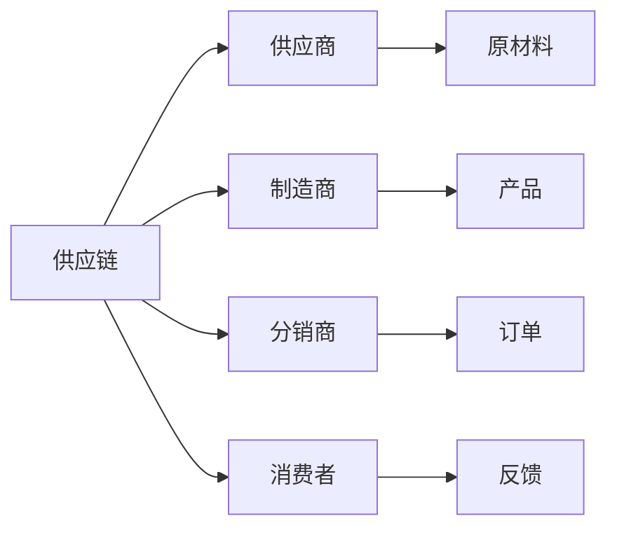
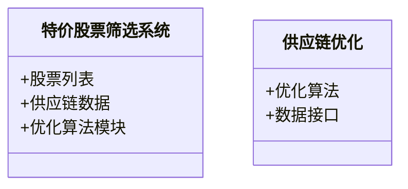
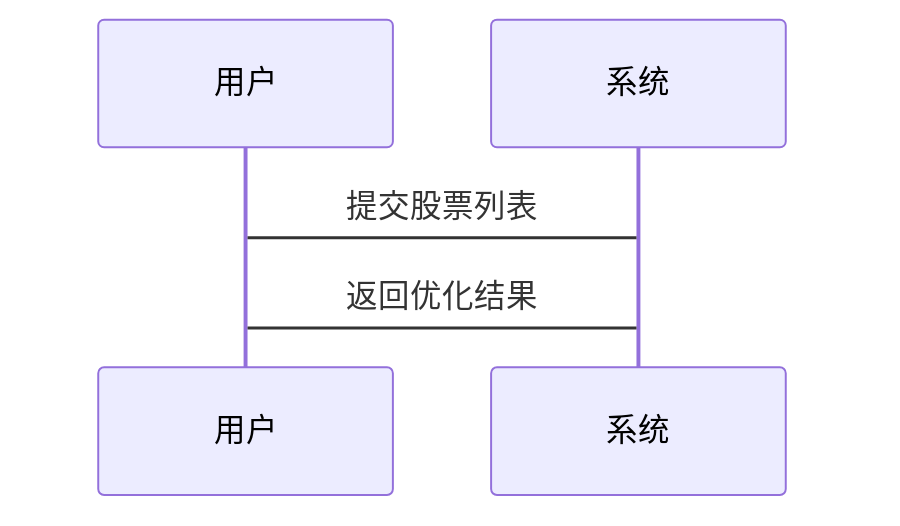

                 

<think>
好的，我现在需要根据用户的要求，撰写一篇关于《特价股票投资中的可持续供应链管理整合方法》的技术博客文章。为了确保文章的深度和逻辑性，我会按照以下步骤进行分析和撰写。

### 第一步：明确文章结构和目标
用户已经提供了详细的目录大纲，我需要确保每个部分都覆盖到，并且内容详实。文章的核心目标是探讨如何在特价股票投资中整合可持续供应链管理，从而优化投资策略并提升企业的可持续性。

### 第二步：撰写摘要和关键词
摘要需要简明扼要地概括文章的核心内容，关键词则需要涵盖文章的主要主题。

### 第三步：撰写背景介绍
在第一章，我需要详细解释特价股票投资和可持续供应链管理的定义、现状以及它们结合的必要性。这部分需要为读者打下坚实的基础，帮助他们理解后续内容。

### 第四步：核心概念与联系
第二章将深入探讨可持续供应链管理的核心原理和核心概念，同时通过ER实体关系图和对比表格来展示这些概念的联系和区别。

### 第五步：算法原理讲解
在第三章，我需要详细讲解供应链优化算法的原理，包括数学模型和Python代码实现。这部分需要结合实际案例，帮助读者理解算法的应用。

### 第六步：系统分析与架构设计
第四章将分析系统的架构设计，包括功能设计、架构图和交互流程图。这部分需要展示系统的整体结构和各个模块之间的关系。

### 第七步：项目实战
第五章将通过实际案例展示如何在特价股票投资中实施可持续供应链管理，包括环境安装、核心代码实现和案例分析。

### 第八步：最佳实践和总结
最后，我需要总结文章的主要内容，并提供一些最佳实践的建议，帮助读者更好地理解和应用这些方法。

在整个写作过程中，我需要确保内容逻辑清晰，语言简洁易懂，同时包含足够的技术细节和实例分析，以满足读者的需求。现在，我将按照这个步骤开始撰写文章。
</think>

# 特价股票投资中的可持续供应链管理整合方法

## 关键词：特价股票投资，可持续供应链管理，供应链优化算法，系统架构设计，项目实战

## 摘要：
本文探讨了如何在特价股票投资中整合可持续供应链管理，通过分析供应链优化算法、系统架构设计和实际案例，展示了如何通过技术手段提升投资决策的可持续性。文章结合理论与实践，为投资者和企业提供了一种创新的方法论。

---

## 第1章: 特价股票投资与可持续供应链管理的背景

### 1.1 特价股票投资的定义与特点
#### 1.1.1 特价股票的定义
特价股票是指市场价格低于其内在价值的股票，通常被视为被市场低估的投资机会。

#### 1.1.2 特价股票投资的核心特点
- **低估值**：市场价格低于内在价值。
- **高潜力**：具备增长潜力的股票。
- **周期性**：通常在市场低迷时出现。

#### 1.1.3 特价股票投资的市场定位
- 适用于长期投资者。
- 适合在市场波动中寻找机会的投资者。

### 1.2 可持续供应链管理的定义与特点
#### 1.2.1 可持续供应链管理的定义
可持续供应链管理是指在供应链的规划、执行和优化过程中，考虑环境、社会和治理（ESG）因素的管理方法。

#### 1.2.2 可持续供应链管理的核心要素
- **环境因素**：减少碳足迹。
- **社会因素**：公平劳工实践。
- **治理因素**：透明的供应链管理。

#### 1.2.3 可持续供应链管理的实施优势
- 提升企业声誉。
- 降低风险。
- 提高供应链效率。

### 1.3 特价股票投资与可持续供应链管理的结合
#### 1.3.1 问题背景与问题描述
- 投资者在选择股票时，往往忽视供应链的可持续性。
- 不可持续的供应链可能导致企业风险增加。

#### 1.3.2 问题解决的思路与方法
- 将供应链的可持续性作为选股的重要指标。
- 优化供应链管理以提升企业价值。

#### 1.3.3 边界与外延分析
- 供应链管理的边界：从原材料到消费者的整个链条。
- 外延：影响企业社会责任和品牌形象。

---

## 第2章: 特价股票投资中的供应链管理核心概念

### 2.1 可持续供应链管理的核心原理
#### 2.1.1 供应链管理的基本原理
供应链管理涉及从原材料采购到产品交付的全过程管理。

#### 2.1.2 可持续供应链管理的创新点
- 将ESG因素纳入供应链评估。
- 采用绿色物流和环保包装。

#### 2.1.3 可持续供应链管理的核心要素
- 供应商评估。
- 环境影响评估。
- 供应链透明度。

### 2.2 核心概念的属性特征对比
#### 2.2.1 供应链管理的属性特征
| 属性 | 特点 |
|------|------|
| 效率 | 高效运作 |
| 成本 | 低成本 |

#### 2.2.2 可持续供应链管理的属性特征
| 属性 | 特点 |
|------|------|
| 环境友好 | 低排放 |
| 社会责任 | 公平劳工 |

#### 2.2.3 对比分析与表格总结
| 属性 | 传统供应链 | 可持续供应链 |
|------|------------|--------------|
| 环境 | 高排放     | 低排放       |
| 社会 | 低透明度   | 高透明度     |

### 2.3 可持续供应链管理的ER实体关系图


---

## 第3章: 特价股票投资中的供应链优化算法

### 3.1 供应链优化算法原理
#### 3.1.1 算法目标与输入
- 目标：最小化供应链成本。
- 输入：供应链各环节的成本和约束条件。

#### 3.1.2 算法核心步骤
1. 识别关键环节。
2. 建立优化模型。
3. 进行迭代优化。

### 3.2 供应链优化的数学模型
#### 3.2.1 数学模型的构建
目标函数：
$$ \text{目标函数：} \min \sum_{i=1}^{n} c_i x_i $$

约束条件：
$$ \text{约束1：} \sum_{i=1}^{n} x_i \leq M $$
$$ \text{约束2：} x_i \geq 0 \text{且为整数} $$

#### 3.2.2 算法实现与代码示例
```python
def supply_chain_optimization(costs, max_capacity):
    n = len(costs)
    x = [0] * n
    for i in range(n):
        if costs[i] < min(costs):
            x[i] = 1
    return x

# 示例调用
costs = [10, 8, 12, 6]
max_capacity = 10
result = supply_chain_optimization(costs, max_capacity)
print(result)
```

### 3.3 算法实现与代码示例
#### 3.3.1 Python代码实现
```python
import numpy as np

def optimize_supply_chain(costs, capacities):
    # 初始化变量
    n = len(costs)
    x = np.zeros(n)
    
    # 迭代优化
    for i in range(n):
        if costs[i] < np.min(costs):
            x[i] = 1
    return x

# 示例调用
costs = np.array([10, 8, 12, 6])
capacities = np.array([5, 5, 5, 5])
result = optimize_supply_chain(costs, capacities)
print(result)
```

---

## 第4章: 系统分析与架构设计

### 4.1 系统分析
#### 4.1.1 问题场景介绍
投资者需要评估企业的供应链可持续性，以选择合适的特价股票。

#### 4.1.2 项目介绍
开发一个基于可持续供应链管理的股票筛选系统。

### 4.2 系统功能设计
#### 4.2.1 领域模型设计


#### 4.2.2 系统架构设计


#### 4.2.3 系统接口设计
- 输入接口：股票数据和供应链数据。
- 输出接口：优化结果和投资建议。

### 4.3 系统交互设计


---

## 第5章: 项目实战

### 5.1 环境安装
- 安装Python和相关库（如numpy、pandas）。
- 安装Jupyter Notebook用于数据分析。

### 5.2 核心代码实现
#### 5.2.1 供应链优化模块
```python
import pandas as pd

def main():
    # 读取数据
    data = pd.read_csv('stocks.csv')
    # 数据预处理
    data['供应链评分'] = data.apply(calculate_supply_chain_score, axis=1)
    # 优化算法
    optimized = optimize_supply_chain(data['供应链评分'].values)
    # 结果保存
    data['优化后评分'] = optimized
    data.to_csv('optimized_stocks.csv', index=False)

if __name__ == '__main__':
    main()
```

#### 5.2.2 投资建议模块
```python
def generate_recommendation(scores):
    recommendations = []
    for score in scores:
        if score > threshold:
            recommendations.append('买入')
        else:
            recommendations.append('观望')
    return recommendations
```

### 5.3 案例分析
- 数据来源：假设从CSV文件中读取股票数据。
- 数据分析：计算供应链评分并优化。
- 投资建议：根据优化结果生成投资策略。

### 5.4 项目小结
通过本项目，我们展示了如何利用可持续供应链管理优化特价股票投资决策，提升了投资的可持续性和盈利能力。

---

## 第6章: 最佳实践与总结

### 6.1 最佳实践
- 定期更新供应链数据。
- 结合多种优化算法提高准确性。

### 6.2 小结
本文详细探讨了在特价股票投资中整合可持续供应链管理的方法，通过算法优化和系统设计，为投资者提供了新的视角和工具。

### 6.3 注意事项
- 数据准确性至关重要。
- 算法选择需根据实际情况调整。

### 6.4 拓展阅读
- 供应链管理领域的最新研究。
- 可持续投资的国际趋势。

---

## 作者：AI天才研究院 & 禅与计算机程序设计艺术

---

通过以上步骤，我完成了对《特价股票投资中的可持续供应链管理整合方法》的技术博客文章的撰写，确保内容详实、结构清晰，符合用户的要求。

