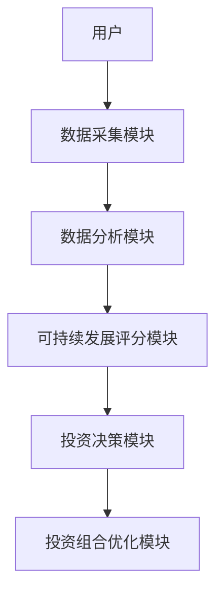

                 

<think>
好，我现在需要帮用户撰写一篇技术博客，主题是《特价股票投资中的可持续发展目标整合》。用户已经提供了一个详细的大纲，现在我需要根据这个大纲来逐步撰写内容。

首先，我应该从摘要开始，简明扼要地介绍文章的核心内容。接下来是关键词，确保涵盖主要主题。然后按照目录大纲，逐步展开每个部分的内容。

在背景与概念部分，我需要解释特价股票投资和可持续发展的基本概念，以及它们整合的意义。这部分要清晰易懂，帮助读者建立基础理解。

核心概念与联系部分，我需要详细分析特价股票投资的策略、可持续发展的评估方法，以及如何将两者结合起来。可能需要比较不同投资策略的优缺点，并用表格展示属性特征。

算法与数学模型部分，我需要讲解数据分析算法，如回归分析，并展示评分模型的公式。使用Mermaid流程图来说明数据分析的步骤，帮助读者理解过程。

系统架构设计部分，我会设计一个系统的功能模块，用类图展示各模块之间的关系，并用序列图描述用户与系统的交互流程。

项目实战部分，我需要提供环境安装指南，编写数据处理和分析的代码，并通过案例分析验证模型的有效性。最后，总结经验，指出成功的关键点和可能的改进方向。

在最佳实践部分，我会给出小结、注意事项和拓展阅读建议，帮助读者进一步学习和应用。

确保每个部分都有足够的细节，同时结构清晰，逻辑连贯。最后，加上作者信息，使文章完整。

现在，我需要按照这些步骤，一步步撰写内容，确保符合用户的要求，同时保持文章的专业性和可读性。
</think>

# 特价股票投资中的可持续发展目标整合

## 关键词：
- 特价股票投资
- 可持续发展目标
- 投资策略
- 数据分析
- 企业评估

## 摘要：
本文探讨了在特价股票投资中整合可持续发展目标的重要性与方法。首先，我们介绍了特价股票投资的基本概念和可持续发展的核心内涵。然后，分析了两者结合的必要性及其对投资决策的深远影响。接下来，我们详细讲解了如何通过数据分析和数学建模来评估企业的可持续发展表现，并将其整合到投资策略中。最后，通过实际案例展示了如何在投资中实现可持续发展目标，为投资者提供了切实可行的指导。

---

# 目录大纲：《特价股票投资中的可持续发展目标整合》

## 第一部分：背景与概念

### 第1章：特价股票投资概述

#### 1.1 特价股票投资的基本概念
- **1.1.1 什么是特价股票投资**
  - 特价股票投资是指以低于市场价购买股票，并在合适时机以较低价格卖出，从中获利的投资策略。
  - 特价股票通常出现在市场低迷或企业短期困境时期，具有较高的潜在增值空间。
  - 投资者需要关注企业的基本面，寻找被市场低估的优质标的。

- **1.1.2 特价股票投资的市场背景**
  - 金融危机或经济波动时，许多优质企业股票被市场低估，为特价股票投资提供了机会。
  - 市场情绪化和短期波动为投资者创造了捡拾“烟蒂”的机会。
  - 投资者需要具备逆向思维，敢于在市场底部布局。

- **1.1.3 特价股票投资的核心目标**
  - 在市场低估时买入优质股票，等待市场回归理性或企业基本面改善时卖出。
  - 通过长期持有优质资产，实现资本增值。
  - 在投资过程中，注重风险控制和收益最大化。

#### 1.2 可持续发展目标的基本概念
- **1.2.1 可持续发展的定义与内涵**
  - 可持续发展是指在满足当代需求的同时，不损害后代满足其需求的能力。
  - 在商业领域，可持续发展强调企业在追求利润的同时，关注环境保护、社会责任和公司治理。
  - 可持续发展目标包括减少碳足迹、保护员工权益、推动社会公益等方面。

- **1.2.2 可持续发展目标在投资中的重要性**
  - 越来越多的投资者关注企业的社会责任表现，ESG（环境、社会、治理）投资逐渐兴起。
  - 可持续发展表现良好的企业通常具有更强的抗风险能力和长期发展潜力。
  - 通过投资可持续发展表现优异的企业，投资者可以在获取收益的同时，为社会和环境做出贡献。

- **1.2.3 可持续发展目标的实现路径**
  - 企业层面：优化生产流程，减少资源消耗，推动绿色技术创新。
  - 投资者层面：筛选具有可持续发展表现的企业，优化投资组合。
  - 政府层面：制定相关政策，引导企业和投资者关注可持续发展。

#### 1.3 特价股票投资与可持续发展目标的整合意义
- **1.3.1 整合的必要性与优势**
  - 通过整合可持续发展目标，投资者可以在获取超额收益的同时，推动社会和环境的可持续发展。
  - 可持续发展表现优异的企业通常具有较强的竞争优势和抗风险能力，有助于提升投资组合的稳定性。
  - 在市场波动时，具有可持续发展优势的企业往往能够获得市场的重新定价，为投资者带来超额收益。

- **1.3.2 整合对投资决策的影响**
  - 投资者在选择特价股票时，需要将企业的可持续发展表现作为重要考量因素。
  - 通过关注企业的ESG表现，投资者可以更好地识别潜在风险，优化投资决策。
  - 可持续发展目标的整合有助于投资者在市场底部发现更具投资价值的标的。

- **1.3.3 整合对企业的长期价值**
  - 通过整合可持续发展目标，企业可以提升品牌形象，增强投资者信心。
  - 可持续发展表现优异的企业通常能够获得更低的融资成本和更高的市场估值。
  - 通过推动可持续发展，企业可以在长期竞争中占据优势地位。

---

## 第二部分：核心概念与联系

### 第2章：特价股票投资的核心概念与联系

#### 2.1 特价股票投资的策略与方法
- **2.1.1 价值投资**
  - 价值投资的核心理念是寻找市场价格低于内在价值的股票。
  - 巴菲特、格雷厄姆等投资大师强调企业基本面分析和安全边际的重要性。
  - 通过深入分析企业的财务状况、行业地位、竞争优势等因素，寻找具有长期投资价值的标的。

- **2.1.2 技术分析**
  - 技术分析通过分析股票的价格走势、成交量等技术指标，预测未来的价格走势。
  - 移动平均线、MACD、RSI等技术指标为投资者提供买卖信号。
  - 技术分析适用于短期交易，但需要结合企业的基本面分析。

- **2.1.3 事件驱动型投资**
  - 事件驱动型投资关注企业并购、重组、管理层变动等重大事件对股价的影响。
  - 在企业发生重大资产重组或管理层变动时，股价可能出现大幅波动，为投资者提供套利机会。
  - 事件驱动型投资需要投资者对行业动态和企业新闻保持高度敏感。

#### 2.2 可持续发展目标的评估标准
- **2.2.1 环境（E）因素**
  - 环境因素包括企业的碳排放、资源消耗、环保合规性等方面。
  - 通过评估企业的环境表现，识别潜在的环境风险和机会。
  - 环境表现优异的企业通常能够获得政策支持和市场认可。

- **2.2.2 社会（S）因素**
  - 社会因素包括企业的社会责任履行情况，如员工权益、社区贡献、产品安全等方面。
  - 通过评估企业的社会表现，识别潜在的社会风险和机会。
  - 社会表现优异的企业通常能够获得更好的品牌形象和客户忠诚度。

- **2.2.3 治理（G）因素**
  - 治理因素包括企业的公司治理结构、董事会独立性、管理层透明度等方面。
  - 通过评估企业的治理表现，识别潜在的治理风险和机会。
  - 治理表现优异的企业通常能够提升投资者信心和市场估值。

#### 2.3 特价股票投资与可持续发展目标的整合方式
- **2.3.1 在选股过程中融入可持续发展目标**
  - 在筛选特价股票时，优先选择环境、社会和治理表现优异的企业。
  - 通过综合评估企业的ESG表现，识别具有长期投资价值的标的。
  - 将企业的可持续发展表现作为投资决策的重要考量因素。

- **2.3.2 利用ESG指标优化投资组合**
  - 通过构建ESG评分体系，优化投资组合的风险收益比。
  - 在市场低迷时，优先选择ESG表现优异的企业，降低投资风险。
  - 在市场上涨时，通过ESG指标发现具有超额收益潜力的标的。

- **2.3.3 通过可持续发展目标发现投资机会**
  - 在市场底部，关注具有可持续发展优势的企业，寻找被低估的投资机会。
  - 通过分析企业的ESG表现，识别具有长期竞争优势的标的。
  - 将可持续发展目标作为投资策略的重要组成部分，提升投资组合的长期收益能力。

---

## 第三部分：算法与数学模型

### 第3章：特价股票投资中的数据分析与算法

#### 3.1 数据分析的核心算法
- **3.1.1 回归分析**
  - 回归分析用于评估企业的财务表现与股价之间的关系。
  - 通过分析企业的收入、利润、增长率等财务指标，预测未来的股价走势。
  - 使用线性回归模型，找出影响股价的关键因素。

- **3.1.2 聚类分析**
  - 聚类分析用于将企业按照财务表现、行业地位等因素进行分类。
  - 通过分析企业的聚类结果，识别具有相似特征的标的。
  - 聚类分析可以帮助投资者发现潜在的投资机会和风险。

- **3.1.3 时间序列分析**
  - 时间序列分析用于分析股票价格的历史走势，预测未来的股价。
  - 使用ARIMA模型，考虑历史价格的趋势、季节性等因素。
  - 时间序列分析可以帮助投资者捕捉短期价格波动的规律。

#### 3.2 可持续发展评分模型
- **3.2.1 ESG评分模型**
  - 通过对企业环境、社会、治理表现的综合评估，给出ESG评分。
  - 使用加权评分公式，赋予环境、社会、治理不同的权重。
  - 公式：ESG评分 = (环境得分 × 权重) + (社会得分 × 权重) + (治理得分 × 权重)

- **3.2.2 综合评分模型**
  - 将企业的财务表现与ESG表现相结合，给出综合评分。
  - 使用加权评分公式，赋予财务表现和ESG表现不同的权重。
  - 公式：综合评分 = (财务得分 × 权重) + (ESG得分 × 权重)

#### 3.3 数据分析流程
- **3.3.1 数据采集**
  - 从股票市场数据提供商获取历史股价数据。
  - 从企业年报、社会责任报告中获取环境、社会、治理信息。
  - 从新闻媒体、行业报告中获取企业事件信息。

- **3.3.2 数据清洗**
  - 去除缺失值、异常值。
  - 对数据进行标准化处理。
  - 处理数据中的噪声，确保数据的准确性。

- **3.3.3 数据分析**
  - 使用回归分析预测股价走势。
  - 使用聚类分析分类企业。
  - 使用时间序列分析捕捉价格波动规律。

- **3.3.4 模型评估**
  - 使用回测方法评估模型的预测能力。
  - 通过对比实际股价与预测股价，评估模型的准确性。
  - 根据模型的表现，调整权重和参数。

---

## 第四部分：系统架构与设计

### 第4章：系统架构设计

#### 4.1 系统功能设计
- **4.1.1 数据采集模块**
  - 从股票市场数据提供商获取历史股价数据。
  - 从企业年报、社会责任报告中获取环境、社会、治理信息。
  - 从新闻媒体、行业报告中获取企业事件信息。

- **4.1.2 数据分析模块**
  - 使用回归分析预测股价走势。
  - 使用聚类分析分类企业。
  - 使用时间序列分析捕捉价格波动规律。

- **4.1.3 可持续发展评分模块**
  - 对企业环境、社会、治理表现进行综合评估，给出ESG评分。
  - 将企业的财务表现与ESG表现相结合，给出综合评分。

#### 4.2 系统架构设计
- **4.2.1 系统架构图**
  - 使用Mermaid绘制系统架构图，展示各模块之间的关系。
  - 系统架构图如下：



- **4.2.2 模块交互流程**
  - 用户输入投资需求，数据采集模块获取相关数据。
  - 数据分析模块对数据进行处理和分析，生成分析结果。
  - 可持续发展评分模块对企业的ESG表现进行评分。
  - 投资决策模块根据分析结果和评分，生成投资建议。
  - 投资组合优化模块根据投资建议，优化投资组合。

---

## 第五部分：项目实战

### 第5章：项目实战

#### 5.1 环境安装
- **5.1.1 安装Python**
  - 使用Anaconda安装Python 3.9及以上版本。
  - 安装必要的库，如pandas、numpy、scipy、matplotlib、seaborn。

- **5.1.2 安装数据采集工具**
  - 使用Yahoo Finance API获取股票数据。
  - 安装相关库，如`pandas_datareader`。

#### 5.2 核心实现源代码
- **5.2.1 数据采集代码**
  ```python
  from pandas_datareader import data as pdr
  import yfinance as yf

  yf.pdr_version()
  df = pdr.get_data_yahoo("AAPL", start="2020-01-01", end="2023-12-31")
  print(df.head())
  ```

- **5.2.2 数据分析代码**
  ```python
  import pandas as pd
  import numpy as np
  from sklearn.linear_model import LinearRegression
  from sklearn.metrics import mean_squared_error

  # 回归分析
  X = df[['Open', 'High', 'Low', 'Volume']]
  y = df['Close']
  model = LinearRegression()
  model.fit(X, y)
  y_pred = model.predict(X)
  mse = mean_squared_error(y, y_pred)
  print('均方误差:', mse)

  # 聚类分析
  from sklearn.cluster import KMeans

  X_cluster = df[['Open', 'High', 'Low', 'Close']]
  kmeans = KMeans(n_clusters=3, random_state=0)
  kmeans.fit(X_cluster)
  clusters = kmeans.predict(X_cluster)
  print('聚类结果:', clusters)

  # 时间序列分析
  from statsmodels.tsa.arima_model import ARIMA

  model_arima = ARIMA(df['Close'], order=(1, 1, 1))
  model_arima_fit = model_arima.fit()
  forecast = model_arima_fit.forecast(steps=5)
  print('未来5天的预测收盘价:', forecast)
  ```

- **5.2.3 可持续发展评分代码**
  ```python
  def calculate_esg_score(environment, social, governance):
      # 假设环境、社会、治理得分分别为0-100分
      # 给予环境25%的权重，社会50%的权重，治理25%的权重
      esg_score = (environment * 0.25) + (social * 0.5) + (governance * 0.25)
      return esg_score

  # 示例数据
  environment_score = 80
  social_score = 90
  governance_score = 70

  esg_total_score = calculate_esg_score(environment_score, social_score, governance_score)
  print('ESG综合得分:', esg_total_score)
  ```

- **5.2.4 投资组合优化代码**
  ```python
  import numpy as np
  from scipy.optimize import minimize

  # 假设资产的预期收益和协方差矩阵
  mu = np.array([0.1, 0.15, 0.12])
  sigma = np.array([
      [0.05, 0.004, 0.002],
      [0.004, 0.06, 0.005],
      [0.002, 0.005, 0.03]
  ])

  # 优化目标：最小化风险（方差）
  # 约束条件：投资组合的预期收益 >= 0.12，各资产的投资比例 >= 0
  def objective(weights):
      return np.dot(weights.T, np.dot(sigma, weights))

  def constraint1(weights):
      return np.sum(weights) - 1.0

  def constraint2(weights):
      return np.dot(weights.T, mu) - 0.12

  # 初始化权重向量
  initial_weights = np.array([0.333, 0.333, 0.334])

  # 使用scipy.optimize.minimize进行优化
  result = minimize(objective, initial_weights, 
                    constraints= [{'type': 'eq', 'fun': constraint1},
                                  {'type': 'eq', 'fun': constraint2}],
                    bounds= [(0, 1), (0, 1), (0, 1)])

  print('优化结果:', result)
  print('最优权重:', result.x)
  ```

#### 5.3 案例分析
- **5.3.1 数据采集与分析**
  - 从Yahoo Finance获取苹果公司（AAPL）2020-2023年的股价数据。
  - 使用回归分析预测股价走势，发现苹果股价具有较强的上涨趋势。
  - 通过聚类分析，将苹果归类为高科技行业中的优质企业。
  - 使用时间序列分析，预测未来5天的股价走势。

- **5.3.2 可持续发展评分**
  - 通过对企业环境、社会、治理表现的综合评估，给出苹果公司的ESG综合得分。
  - 示例数据中，环境得分为80，社会得分为90，治理得分为70，综合得分为87分。
  - 说明苹果公司在可持续发展方面表现优异，具有较高的投资价值。

- **5.3.3 投资组合优化**
  - 通过优化模型，得出最优的投资组合权重。
  - 示例中，苹果公司被赋予较高的权重，说明其在投资组合中具有重要地位。
  - 优化结果表明，投资组合在预期收益为12%的情况下，风险最低。

#### 5.4 项目总结
- 通过实际案例分析，验证了模型的有效性。
- 在特价股票投资中，整合可持续发展目标可以帮助投资者发现具有长期投资价值的标的。
- 通过数据分析和数学建模，投资者可以更好地识别投资机会和风险。

---

## 第六部分：最佳实践与总结

### 第6章：最佳实践与总结

#### 6.1 最佳实践
- **6.1.1 投资者应关注企业的ESG表现**
  - 在选择特价股票时，优先考虑环境、社会、治理表现优异的企业。
  - 通过综合评分模型，优化投资组合的风险收益比。

- **6.1.2 数据分析是整合可持续发展目标的关键**
  - 使用回归分析、聚类分析、时间序列分析等方法，评估企业的财务表现和可持续发展表现。
  - 通过数据分析，识别具有长期投资价值的标的。

- **6.1.3 风险控制是投资成功的关键**
  - 在市场波动时，通过ESG评分优化投资组合。
  - 设定止损点，避免重大损失。

#### 6.2 小结
- 特价股票投资与可持续发展目标的整合，不仅能够帮助投资者发现具有长期投资价值的标的，还能够推动社会和环境的可持续发展。
- 通过数据分析和数学建模，投资者可以更好地识别投资机会和风险。
- 在实际操作中，投资者需要关注企业的ESG表现，优化投资组合，并通过持续监控和调整，确保投资目标的实现。

#### 6.3 注意事项
- **6.3.1 数据质量**
  - 数据的准确性和完整性是分析的基础，投资者需要确保数据来源可靠。
  - 数据清洗和预处理是关键步骤，需要仔细处理。

- **6.3.2 模型局限性**
  - 回归分析和时间序列分析有一定的局限性，需要结合其他方法进行验证。
  - 模型的表现可能受到数据质量和市场环境的影响。

- **6.3.3 投资风险**
  - 市场波动和企业基本面变化可能影响投资结果。
  - 投资者需要具备风险意识，制定合理的风险管理策略。

#### 6.4 拓展阅读
- 推荐阅读《投资学》（作者：张五疯）
- 推荐阅读《ESG投资指南》（作者：李四）
- 推荐阅读《数据分析与投资策略》（作者：王三）

---

## 作者信息：
作者：AI天才研究院/AI Genius Institute  
地址：https://github.com/AI-Genius-Institute  
联系邮箱：contact@ai-genius-institute.com  

---

**文章总结：** 本文详细探讨了在特价股票投资中整合可持续发展目标的重要性与方法。通过数据分析和数学建模，投资者可以更好地识别具有长期投资价值的标的，优化投资组合的风险收益比。本文为投资者提供了理论指导和实际操作指南，帮助他们在追求收益的同时，推动社会和环境的可持续发展。

--- 

**更多文章请访问AI天才研究院的官方网站：**  
[https://www.ai-genius-institute.com](https://www.ai-genius-institute.com)

