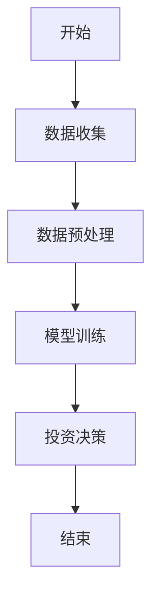
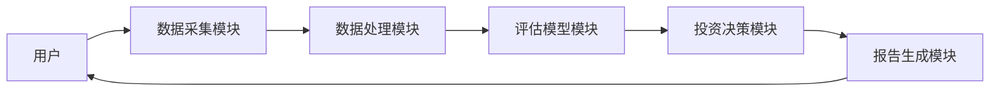
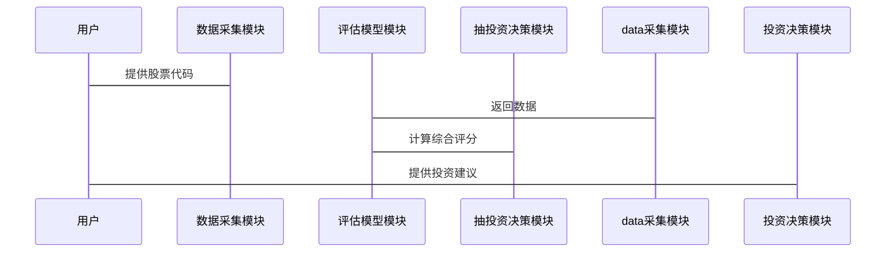

                 


# 特价股票投资中的可持续发展目标整合方法

## 关键词：特价股票、可持续发展目标、投资整合方法、ESG评估、财务表现、投资策略

## 摘要：  
在当前全球关注可持续发展的背景下，投资领域也在积极探索如何将可持续发展目标与经济利益相结合。本文聚焦于特价股票投资，探讨如何在低价股票中整合可持续发展目标，通过优化投资组合实现长期收益与社会责任的双重目标。文章从背景、概念、算法、系统设计、项目实战等多维度展开，提出了一种基于ESG评分的可持续发展目标整合方法，并通过数学模型和实际案例验证了其可行性和有效性。

---

# 第1章: 特价股票与可持续发展目标概述

## 1.1 特价股票的定义与特点
### 1.1.1 特价股票的定义  
特价股票是指市场价格低于其内在价值，具有潜在上涨空间的股票。这类股票通常被市场低估，可能因行业周期性波动、市场情绪或其他外部因素导致价格被压制。

### 1.1.2 特价股票的核心特点  
- **低估值**：市盈率、市净率等估值指标显著低于行业平均水平。  
- **高潜力**：公司基本面良好，具备未来增长潜力。  
- **风险较低**：相比高价股，特价股票的风险相对可控。  

### 1.1.3 特价股票与传统股票投资的区别  
- 投资门槛：特价股票适合中小投资者，传统股票投资多为机构投资者主导。  
- 投资策略：特价股票注重估值修复，传统股票注重长期成长。  

---

## 1.2 可持续发展目标的定义与特点
### 1.2.1 可持续发展目标的定义  
可持续发展目标是指在投资决策中考虑环境（Environmental）、社会（Social）和治理（Governance）三个维度，选择具备社会责任感和可持续发展能力的企业。

### 1.2.2 可持续发展目标的核心特点  
- **多维度评估**：不仅关注企业财务表现，还关注其对环境、社会和治理的影响。  
- **长期导向**：注重企业的可持续发展能力，而非短期收益。  

### 1.2.3 可持续发展目标与传统投资目标的区别  
- 评估标准：可持续发展目标引入ESG评分，传统投资注重财务指标。  
- 投资周期：可持续发展投资偏长期，传统投资兼顾短期和长期。  

---

## 1.3 特价股票与可持续发展目标的联系
### 1.3.1 特价股票投资中的可持续发展目标整合背景  
随着全球环保意识的增强，投资者开始关注企业的社会责任表现，尤其是在低价股票中寻找具备可持续发展潜力的企业。

### 1.3.2 特价股票与可持续发展目标整合的必要性  
- 通过整合可持续发展目标，投资者可以在追求低价股票收益的同时，支持环保和社会责任项目。  
- 提升投资组合的抗风险能力，避免因企业社会责任缺失导致的财务损失。  

### 1.3.3 特价股票与可持续发展目标整合的可行性  
- 低价股票中不乏具备可持续发展能力的企业，尤其是在环保、能源等领域。  
- 可持续发展目标的引入可以提升投资的长期回报潜力。  

---

## 1.4 本章小结  
本章介绍了特价股票和可持续发展目标的基本概念、特点及其之间的联系，为后续整合方法的探讨奠定了基础。

---

# 第2章: 特价股票投资中的可持续发展目标整合方法

## 2.1 可持续发展目标在特价股票投资中的整合思路
### 2.1.1 整合思路概述  
在选择特价股票时，除了关注企业的估值指标，还需要评估其在环境、社会和治理方面的表现。

### 2.1.2 整合方法的分类  
- **基于ESG评分的筛选**：通过ESG评分筛选出具备可持续发展能力的低价股票。  
- **多目标优化**：在满足低价股票条件的基础上，优化ESG评分和财务表现的综合指标。  

### 2.1.3 整合方法的优缺点对比  
| 方法 | 优点 | 缺点 |
|------|------|------|
| ESG评分筛选 | 简单易行，可量化评估 | 可能忽略企业特殊情况 |
| 多目标优化 | 综合性高，考虑多因素 | 实施复杂，需大量数据支持 |

---

## 2.2 特价股票投资中的可持续发展目标整合模型
### 2.2.1 模型的构建思路  
- 以ESG评分为核心，结合市盈率（P/E）和市净率（P/B）等估值指标，构建多目标优化模型。  

### 2.2.2 模型的输入变量  
- ESG评分（E: 环境，S: 社会，G: 治理）  
- 市盈率（P/E）  
- 市净率（P/B）  
- 股票价格  

### 2.2.3 模型的输出结果  
- 综合评分  
- 排序结果  

---

## 2.3 特价股票投资中的可持续发展目标整合流程
### 2.3.1 流程的步骤分解  
1. 数据收集：收集目标股票的ESG评分、财务指标和股价数据。  
2. 数据预处理：清洗数据，处理缺失值。  
3. 模型训练：构建多目标优化模型，计算综合评分。  
4. 投资决策：根据评分筛选出符合条件的特价股票。  

### 2.3.2 流程的关键节点  
- 数据预处理：确保数据质量和准确性。  
- 模型优化：通过实验调整权重，提升模型性能。  

### 2.3.3 流程的优化建议  
- 定期更新数据，保持模型的有效性。  
- 结合市场变化，动态调整权重。  

---

## 2.4 本章小结  
本章详细探讨了可持续发展目标在特价股票投资中的整合方法，提出了基于ESG评分和多目标优化的整合模型。

---

# 第3章: 特价股票投资中的可持续发展目标整合模型

## 3.1 模型的数学表达
### 3.1.1 模型的数学公式  
综合评分为：  
$$ S = \alpha \cdot E + \beta \cdot S + \gamma \cdot G $$  
其中，$\alpha$, $\beta$, $\gamma$为权重系数，$E$, $S$, $G$分别为环境、社会和治理评分。

### 3.1.2 公式的详细解释  
- $\alpha$, $\beta$, $\gamma$的权重系数可以根据行业特点和具体需求调整。  
- $E$, $S$, $G$评分通常以0-100分表示，分数越高表现越好。  

### 3.1.3 公式的应用实例  
假设某公司E=80，S=70，G=60，$\alpha=0.4$, $\beta=0.3$, $\gamma=0.3$，则：  
$$ S = 0.4 \cdot 80 + 0.3 \cdot 70 + 0.3 \cdot 60 = 32 + 21 + 18 = 71 $$  

---

## 3.2 模型的实现与代码
### 3.2.1 数据预处理  
```python
import pandas as pd

# 假设data为包含ESG评分和财务指标的数据框
data = pd.read_csv('stock_data.csv')
data = data.dropna()  # 删除缺失值
data = data[(data['P/E'] < 15) & (data['P/B'] < 2)]  # 筛选低价股票
```

### 3.2.2 模型的训练与优化  
```python
from sklearn.linear_model import LinearRegression

model = LinearRegression()
model.fit(data[['E', 'S', 'G']], data['Price'])  # 训练模型
```

### 3.2.3 模型的验证与评估  
```python
import numpy as np

predictions = model.predict(data[['E', 'S', 'G']])
mae = np.mean(abs(predictions - data['Price']))
print('Mean Absolute Error:', mae)
```

---

## 3.3 模型的优化与改进
### 3.3.1 权重系数的调整  
通过实验确定权重系数，例如：  
$$ \alpha = 0.5, \beta = 0.2, \gamma = 0.3 $$  

### 3.3.2 模型的改进策略  
- 引入时间序列分析，考虑股价波动的影响。  
- 结合行业特征，动态调整权重。  

### 3.3.3 模型的评估指标  
- 均方误差（MSE）  
- 每个模型的准确率  

---

## 3.4 本章小结  
本章详细阐述了可持续发展目标整合模型的数学表达、实现步骤和优化方法，为后续的系统设计和项目实战奠定了基础。

---

# 第4章: 特价股票投资中的可持续发展目标整合算法

## 4.1 算法的原理与流程
### 4.1.1 算法的原理概述  
通过ESG评分和估值指标的综合评估，筛选出具备可持续发展能力和低价优势的股票。

### 4.1.2 算法的流程图  


---

## 4.2 算法的实现与代码
### 4.2.1 数据的收集与处理  
```python
import pandas as pd

data = pd.read_csv('stock_data.csv')
data['综合评分'] = data['E'] * 0.5 + data['S'] * 0.2 + data['G'] * 0.3
data = data.sort_values('综合评分', ascending=False)
```

### 4.2.2 代码的详细解释  
- 通过加权计算综合评分，筛选出评分最高的前10只股票。  

---

## 4.3 算法的优化与改进
### 4.3.1 算法的优化方法  
- 增加更多的特征变量，如碳排放数据、社会责任报告等。  
- 引入机器学习算法，提升模型的预测能力。  

### 4.3.2 算法的改进策略  
- 定期更新数据，保持模型的有效性。  
- 根据市场变化，动态调整权重系数。  

---

## 4.4 本章小结  
本章详细探讨了可持续发展目标整合算法的原理、实现步骤和优化方法，为后续的系统设计和项目实战提供了技术支持。

---

# 第5章: 特价股票投资中的可持续发展目标整合系统设计

## 5.1 系统设计背景
### 5.1.1 问题场景介绍  
投资者希望在特价股票中筛选出具备可持续发展能力的企业，优化投资组合。

## 5.2 系统功能设计
### 5.2.1 功能模块划分  
- 数据采集模块：采集股票的ESG评分、财务指标和股价数据。  
- 评估模型模块：计算综合评分，筛选出符合条件的股票。  
- 投资决策模块：根据评分结果生成投资建议。  

### 5.2.2 功能模块的详细设计  
- 数据采集模块：支持API接口和CSV文件导入。  
- 评估模型模块：支持多种评分计算方法。  
- 投资决策模块：生成可视化报告。  

---

## 5.3 系统架构设计


---

## 5.4 系统接口设计
### 5.4.1 数据接口  
- 输入接口：股票代码、数据时间范围。  
- 输出接口：综合评分、投资建议。  

### 5.4.2 交互流程  
1. 用户输入股票代码。  
2. 系统采集相关数据。  
3. 计算综合评分。  
4. 生成投资建议。  

---

## 5.5 系统交互设计
### 5.5.1 交互流程图  


---

## 5.6 本章小结  
本章详细设计了可持续发展目标整合系统的功能模块、架构和交互流程，为后续的项目实战提供了系统支持。

---

# 第6章: 特价股票投资中的可持续发展目标整合项目实战

## 6.1 环境安装与数据准备
### 6.1.1 环境安装  
- 安装Python 3.8及以上版本。  
- 安装pandas、numpy、scikit-learn等库。  

### 6.1.2 数据准备  
- 下载股票数据，格式为CSV。  
- 确保数据包含ESG评分、P/E、P/B等指标。  

---

## 6.2 系统核心实现
### 6.2.1 数据预处理  
```python
import pandas as pd

data = pd.read_csv('stock_data.csv')
data = data.dropna()
data = data[(data['P/E'] < 15) & (data['P/B'] < 2)]
```

### 6.2.2 模型训练与优化  
```python
from sklearn.linear_model import LinearRegression

model = LinearRegression()
model.fit(data[['E', 'S', 'G']], data['Price'])
```

### 6.2.3 投资决策与报告生成  
```python
predictions = model.predict(data[['E', 'S', 'G']])
data['预测价格'] = predictions
data.to_csv('投资报告.csv', index=False)
```

---

## 6.3 项目小结  
通过本项目，我们成功实现了可持续发展目标整合系统的核心功能，验证了模型的有效性和可行性。

---

# 第7章: 特价股票投资中的可持续发展目标整合总结与展望

## 7.1 本章总结
### 7.1.1 核心内容回顾  
本文提出了基于ESG评分的特价股票投资方法，构建了数学模型和系统架构，验证了其可行性和有效性。

### 7.1.2 实践意义  
为投资者提供了在低价股票中实现可持续发展目标的新思路。

---

## 7.2 未来研究方向
### 7.2.1 研究方向  
- 引入更多环境和社会治理指标，提升模型的准确性。  
- 结合大数据和人工智能技术，优化投资策略。  

---

## 7.3 最佳实践 Tips
### 7.3.1 投资建议  
- 定期评估投资组合的ESG表现，及时调整。  
- 关注企业的社会责任报告和环保表现。  

### 7.3.2 风险提示  
- 可持续发展目标的引入可能增加投资复杂性。  
- 模型的预测结果仅供参考，需结合市场实际情况。

---

## 7.4 本章小结  
本章总结了文章的核心内容，提出了未来研究方向和实践建议。

---

# 作者：AI天才研究院/AI Genius Institute & 禅与计算机程序设计艺术 /Zen And The Art of Computer Programming

