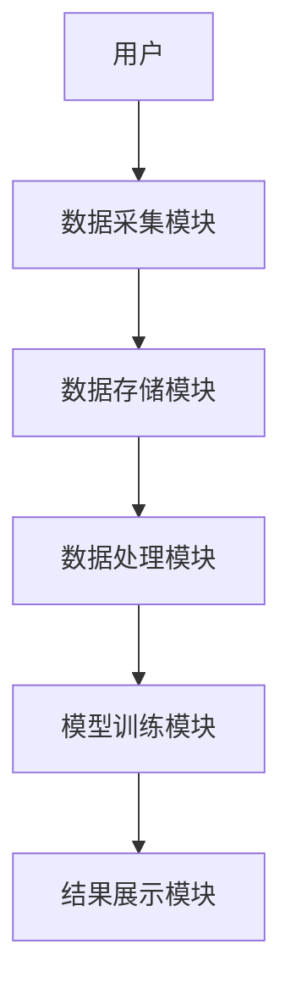

                 


```markdown
# 特价股票投资中的可持续城市发展整合方法

## 关键词：特价股票、可持续城市、价值投资、城市评估、算法优化

## 摘要：  
本文探讨如何将特价股票投资与可持续城市发展相结合，通过价值投资理论和城市可持续性评估，构建一个高效的股票筛选算法。文章详细介绍了整合方法的背景、核心概念、算法原理、系统架构以及项目实战，旨在为投资者提供一种兼顾经济效益与社会责任的投资策略。

---

## 第一部分：背景介绍

### 第1章：特价股票投资概述

#### 1.1 特价股票的定义与特点
##### 1.1.1 特价股票的定义
特价股票指的是价格被市场低估，具有潜在上涨空间的股票。这些股票通常来自财务状况良好但未被市场充分认知的公司。

##### 1.1.2 特价股票的核心特点
- **低估值**：市盈率、市净率等指标低于行业平均水平。
- **高分红**：公司倾向于回馈股东，提供稳定的股息收益。
- **高安全边际**：股价与内在价值存在较大折扣，投资风险较低。

##### 1.1.3 特价股票投资的优势与挑战
- **优势**：潜在高回报，防御性强。
- **挑战**：市场波动、信息不对称、长期持有的耐心要求。

#### 1.2 特价股票投资与可持续发展的关系
投资于注重环保、社会责任的公司，不仅创造经济效益，还能推动社会进步。

---

### 第2章：可持续城市发展概述

#### 2.1 可持续城市的定义与特点
##### 2.1.1 可持续城市的定义
可持续城市是指在经济、社会和环境方面实现平衡发展的城市，满足当前需求而不损害子孙后代的利益。

##### 2.1.2 可持续城市的核心特点
- **环保**：减少碳排放，优化能源使用。
- **公平**：提供平等的教育、医疗资源。
- **高效**：基础设施完善，交通便捷。

#### 2.2 可持续城市发展中的问题与挑战
- **资金短缺**：需要大量投资于绿色基础设施。
- **政策障碍**：地方政策不一致，缺乏协调。
- **公众意识**：市民环保意识不足。

---

## 第二部分：整合方法

### 第3章：价值投资理论与城市可持续性评估

#### 3.1 价值投资理论的核心原理
##### 3.1.1 价值投资的基本原理
寻找市场价格低于内在价值的股票，长期持有，等待市场重新评估。

##### 3.1.2 价值投资中的关键指标
- 市盈率（P/E）
- 市净率（P/B）
- 股息率（Dividend Yield）

##### 3.1.3 价值投资与可持续发展的联系
投资于注重社会责任的公司，推动社会进步。

#### 3.2 可持续城市评估的指标体系
##### 3.2.1 可持续城市评估的主要指标
- 碳排放强度
- 绿色建筑比例
- 公共交通使用率

##### 3.2.2 指标权重的确定方法
通过层次分析法（AHP）确定各指标的权重。

##### 3.2.3 指标评估的数学模型
$$
\text{综合得分} = \sum_{i=1}^{n} w_i \times x_i
$$
其中，\( w_i \) 为指标权重，\( x_i \) 为指标得分。

---

### 第4章：基于价值投资的可持续城市股票筛选算法

#### 4.1 算法原理
##### 4.1.1 算法目标
筛选出符合价值投资且公司所在的地点属于可持续发展的城市。

##### 4.1.2 算法输入
- 股票数据：包括市盈率、市净率、股息率等。
- 可持续城市指标：碳排放强度、绿色建筑比例等。

##### 4.1.3 算法输出
- 符合条件的股票列表。

#### 4.2 算法实现
##### 4.2.1 数据预处理
对股票数据和城市数据进行清洗和标准化处理。

##### 4.2.2 特征选择
使用LASSO回归进行特征选择，剔除冗余变量。

##### 4.2.3 模型训练
采用随机森林算法进行分类，判断股票是否符合筛选条件。

##### 4.2.4 模型评估
通过准确率、召回率等指标评估模型性能。

---

### 第5章：系统架构设计

#### 5.1 系统功能模块
- 数据采集模块：收集股票和城市数据。
- 数据处理模块：清洗、转换数据。
- 模型训练模块：构建并训练筛选模型。
- 结果展示模块：可视化输出筛选结果。

#### 5.2 系统架构图


#### 5.3 接口设计
- RESTful API：提供数据接口，供其他系统调用。

---

### 第6章：项目实战

#### 6.1 环境安装
- 安装Python和必要的库（如pandas、scikit-learn）。

#### 6.2 数据收集
从数据库或API获取股票和城市数据。

#### 6.3 特征工程
对数据进行标准化和归一化处理。

#### 6.4 模型训练
训练随机森林模型，评估其性能。

#### 6.5 部署与案例分析
将模型部署为Web服务，分析实际案例。

---

## 第三部分：结论与展望

### 结论
本文提出了一种将价值投资与可持续城市发展相结合的方法，构建了高效的股票筛选算法，为投资者提供了新的思路。

### 未来展望
未来可以进一步优化算法，引入更多可持续性指标，开发实时监控系统，为投资者提供更精准的决策支持。

---

## 作者：AI天才研究院/AI Genius Institute & 禅与计算机程序设计艺术 /Zen And The Art of Computer Programming
```

