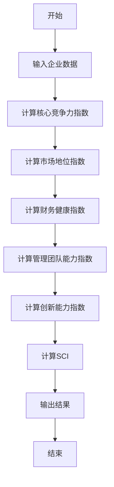
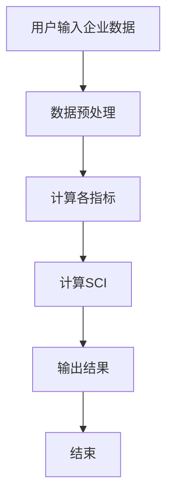

                 


# 特价股票投资中的可持续竞争优势模型应用

> 关键词：特价股票投资、可持续竞争优势模型、投资策略、企业竞争优势、数据分析、投资风险管理

> 摘要：本文详细探讨了特价股票投资中的可持续竞争优势模型应用，通过分析模型的核心概念、数学基础、算法原理及系统架构设计，结合实际案例，展示了如何利用该模型提升投资决策的科学性和准确性。文章最后总结了模型的优势与局限，并提出了进一步优化的方向。

---

# 正文

## 第一部分: 特价股票投资与可持续竞争优势模型概述

## 第1章: 特价股票投资的背景与概念

### 1.1 特价股票的定义与特点

#### 1.1.1 特价股票的定义
特价股票是指在特定市场条件下，由于公司基本面变化、市场波动或其他因素导致股票价格被低估，但具有潜在增长潜力的股票。

#### 1.1.2 特价股票的特点
- **低估值**：市盈率、市净率等指标低于行业平均水平。
- **高潜力**：具备未来增长的可能性。
- **市场波动性**：价格受市场情绪影响较大。
- **周期性**：通常出现在市场低迷或行业调整期。

#### 1.1.3 特价股票的投资价值
- **价值回归**：价格低估，未来可能反弹。
- **风险与收益平衡**：相对于高价股，风险较低，收益潜力大。
- **分散投资风险**：通过选择具有竞争优势的公司，降低投资风险。

---

### 1.2 可持续竞争优势模型的定义与特点

#### 1.2.1 可持续竞争优势的定义
可持续竞争优势是指企业在长期经营中，通过独特的资源、能力、战略和文化，在市场上获得并保持的竞争优势。

#### 1.2.2 可持续竞争优势的核心要素
- **核心竞争力**：企业的核心技术和创新能力。
- **市场地位**：品牌影响力和市场份额。
- **财务健康状况**：盈利能力、资产负债情况。
- **管理团队能力**：领导力和战略执行力。
- **创新能力**：持续改进和产品迭代能力。

#### 1.2.3 可持续竞争优势与企业价值的关系
- **正相关性**：竞争优势越强，企业价值越高。
- **长期视角**：竞争优势的持续性决定了企业的长期盈利能力。

---

## 第2章: 特价股票投资中的可持续竞争优势模型

### 2.1 特价股票投资的背景

#### 2.1.1 特价股票投资的市场环境
- **经济周期**：在经济低迷期，许多优质企业因市场波动而股价被低估。
- **行业调整**：行业整合或技术变革导致部分企业暂时估值偏低。
- **投资者情绪**：市场恐慌导致股票价格下跌，但优质企业受影响较小。

#### 2.1.2 特价股票投资的市场参与者
- **机构投资者**：通过分析企业基本面进行投资。
- **个人投资者**：寻找低估值股票进行投资。
- **研究机构**：提供企业分析报告和投资建议。

#### 2.1.3 特价股票投资的市场周期
- **低估阶段**：股票价格低于内在价值。
- **回升阶段**：市场逐渐认识到企业的价值，股价开始回升。
- **泡沫阶段**：价格被炒高，投资者需谨慎。

---

### 2.2 可持续竞争优势模型的背景

#### 2.2.1 可持续竞争优势模型的发展历程
- **起源**：20世纪80年代，迈克尔·波特提出竞争优势理论。
- **发展**：随着企业战略管理的发展，竞争优势模型不断优化。
- **现状**：广泛应用于企业价值评估和投资决策。

#### 2.2.2 可持续竞争优势模型的理论基础
- **波特的五力模型**：分析行业竞争结构。
- **资源基础视角**：强调企业内部资源和能力。
- **价值链分析**：优化企业运营流程。

#### 2.2.3 可持续竞争优势模型的应用现状
- **广泛应用**：企业战略管理、投资分析等领域。
- **动态调整**：根据市场变化不断优化模型。

---

### 2.3 特价股票投资与可持续竞争优势模型的结合

#### 2.3.1 特价股票投资中引入可持续竞争优势模型的意义
- **科学评估**：通过模型量化企业的竞争优势。
- **降低风险**：选择具有长期竞争优势的企业，减少投资风险。
- **提高收益**：精准识别低估股票，抓住投资机会。

#### 2.3.2 特价股票投资中可持续竞争优势模型的应用范围
- **企业筛选**：评估企业的核心竞争力和市场地位。
- **投资决策**：基于模型结果制定投资策略。
- **风险控制**：通过模型评估企业的财务健康状况。

#### 2.3.3 特价股票投资中可持续竞争优势模型的实施步骤
1. **数据收集**：收集企业的财务数据、市场数据等。
2. **模型构建**：根据模型框架构建评估体系。
3. **企业评估**：对目标企业进行竞争优势分析。
4. **投资决策**：基于评估结果制定投资策略。
5. **持续监控**：定期更新模型，跟踪企业表现。

---

## 第二部分: 可持续竞争优势模型的核心概念与数学基础

## 第3章: 可持续竞争优势模型的核心概念

### 3.1 可持续竞争优势模型的核心要素

#### 3.1.1 企业核心竞争力
- **定义**：企业在市场中独特的能力，如技术创新、成本优势。
- **衡量指标**：研发投入占比、专利数量等。

#### 3.1.2 市场地位
- **定义**：企业在市场中的影响力和知名度。
- **衡量指标**：市场份额、品牌价值。

#### 3.1.3 财务健康状况
- **定义**：企业的财务状况是否稳健。
- **衡量指标**：净利润率、资产负债率。

#### 3.1.4 管理团队能力
- **定义**：管理团队的战略规划和执行能力。
- **衡量指标**：管理层稳定性、历史业绩。

#### 3.1.5 创新能力
- **定义**：企业的产品和服务创新能力。
- **衡量指标**：新产品推出频率、研发投入占比。

---

### 3.2 可持续竞争优势模型的属性特征对比表

表3.1 可持续竞争优势模型的属性特征对比

| 属性 | 特征 |
|------|------|
| 核心竞争力 | 技术创新、成本优势 |
| 市场地位 | 市场份额、品牌影响力 |
| 财务健康 | 净利润率、资产负债率 |
| 管理团队 | 管理层稳定性、历史业绩 |
| 创新能力 | 新产品推出频率、研发投入 |

---

### 3.3 可持续竞争优势模型的ER实体关系图

图3.1 可持续竞争优势模型的ER实体关系图

```mermaid
erd
  entity 企业 {
    <公司ID, 主键>
    <公司名称, �惟一>
    <行业, 外键>
  }
  entity 行业 {
    <行业ID, 主键>
    <行业名称, �惟一>
  }
  entity 核心竞争力 {
    <核心竞争力ID, 主键>
    <竞争力指标, 文本>
    <企业ID, 外键>
  }
  entity 管理团队 {
    <管理团队ID, 主键>
    <团队稳定性, 文本>
    <企业ID, 外键>
  }
```

---

## 第4章: 可持续竞争优势模型的数学基础

### 4.1 可持续竞争优势模型的数学公式

公式4.1 可持续竞争优势指数计算公式

$$ SCI = \frac{C \cdot M \cdot F \cdot T \cdot I}{N} $$

其中：
- $C$：核心竞争力指数（0-1分）
- $M$：市场地位指数（0-1分）
- $F$：财务健康指数（0-1分）
- $T$：管理团队能力指数（0-1分）
- $I$：创新能力指数（0-1分）
- $N$：调整系数，通常取1。

---

### 4.2 可持续竞争优势模型的算法原理

图4.1 可持续竞争优势模型的算法流程图



---

## 第三部分: 系统分析与架构设计方案

## 第5章: 系统分析与架构设计

### 5.1 系统功能设计

#### 5.1.1 系统功能模块
- **数据输入模块**：接收企业数据。
- **模型计算模块**：计算各指标并得出SCI。
- **结果输出模块**：展示评估结果。

#### 5.1.2 系统功能流程
图5.1 系统功能流程图



---

### 5.2 系统架构设计

图5.2 系统架构图


---

### 5.3 系统接口设计

#### 5.3.1 API接口设计
- **输入接口**：接收企业数据。
- **输出接口**：返回SCI评估结果。

#### 5.3.2 交互流程
图5.3 交互流程图

```mermaid
sequence
    用户 -> 系统: 输入企业数据
    系统 -> 用户: 返回SCI评估结果
```

---

## 第四部分: 项目实战

## 第6章: 项目实战

### 6.1 环境安装

#### 6.1.1 安装Python
```bash
pip install python
```

#### 6.1.2 安装依赖库
```bash
pip install numpy pandas matplotlib
```

---

### 6.2 系统核心实现源代码

代码6.1 可持续竞争优势模型的Python实现

```python
def compute_sci(core_competence, market_position, financial_health, management_team, innovation):
    return (core_competence * market_position * financial_health * management_team * innovation)

# 示例数据
core_competence = 0.9
market_position = 0.8
financial_health = 0.85
management_team = 0.75
innovation = 0.9

sci = compute_sci(core_competence, market_position, financial_health, management_team, innovation)
print(f"可持续竞争优势指数: {sci}")
```

---

### 6.3 代码实现与解读

#### 6.3.1 代码解读
- **compute_sci函数**：计算SCI指数。
- **输入参数**：各竞争力指标。
- **输出结果**：SCI指数。

#### 6.3.2 算法优化
- **动态调整系数**：根据市场变化调整各指标权重。
- **数据清洗**：处理缺失或异常数据。

---

### 6.4 案例分析

#### 6.4.1 实际案例
假设某企业各指标如下：
- 核心竞争力：0.9
- 市场地位：0.8
- 财务健康：0.85
- 管理团队：0.75
- 创新能力：0.9

计算SCI指数：
$$ SCI = \frac{0.9 \times 0.8 \times 0.85 \times 0.75 \times 0.9}{1} = 0.405 $$

---

## 第五部分: 最佳实践与总结

## 第7章: 最佳实践与总结

### 7.1 最佳实践

#### 7.1.1 持续优化模型
- 定期更新指标权重和计算公式。
- 结合市场变化调整模型参数。

#### 7.1.2 数据质量管理
- 确保数据来源可靠。
- 处理数据异常值。

#### 7.1.3 风险控制
- 分散投资，降低风险。
- 定期评估投资组合。

---

### 7.2 小结

- **优势**：模型帮助企业识别具有长期竞争优势的特价股票，提升投资决策的科学性。
- **局限**：模型依赖于数据质量和模型假设，需结合市场实际情况进行调整。

---

### 7.3 注意事项

- **数据准确性**：确保输入数据的准确性。
- **模型适用性**：根据市场变化调整模型。
- **风险管理**：合理分散投资，控制风险。

---

### 7.4 拓展阅读

- 《竞争优势：如何打造不可复制的商业模式》
- 《投资学原理与应用》
- 《企业战略管理》

---

## 作者

作者：AI天才研究院/AI Genius Institute & 禅与计算机程序设计艺术 /Zen And The Art of Computer Programming

