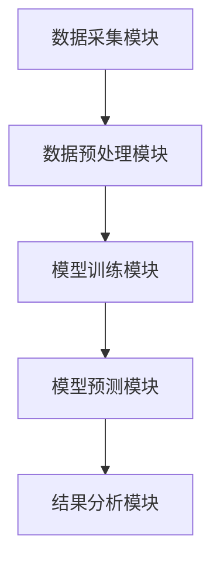
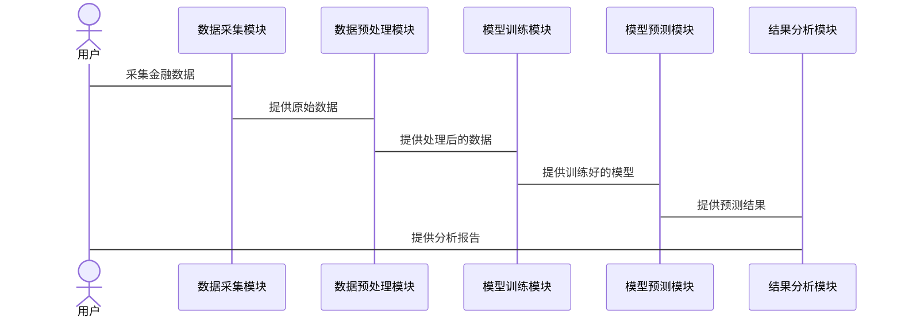

                 


# 特价股票投资中的图神经网络模型构建与优化

## 关键词：特价股票投资、图神经网络、深度学习、股票预测、金融数据分析、模型优化

## 摘要：  
本文探讨了如何利用图神经网络（Graph Neural Network, GNN）构建和优化股票投资模型，特别是在特价股票投资中的应用。通过对图神经网络的原理、算法及系统架构的详细分析，本文展示了如何从金融数据中提取有价值的信息，构建高效的股票预测模型，并通过优化提升模型的性能。文章还结合实际案例，展示了图神经网络在特价股票投资中的潜力和优势。

---

# 第一部分: 特价股票投资中的图神经网络模型构建与优化

## 第1章: 特价股票投资与图神经网络概述

### 1.1 特价股票投资的基本概念

#### 1.1.1 什么是特价股票
特价股票是指在特定市场条件下，价格被低估或具有较大上涨潜力的股票。这些股票通常具有较高的投资回报率，但因其市场价格波动较大，投资风险较高。特价股票的投资价值主要体现在其价格与实际价值的偏差上。

#### 1.1.2 特价股票的投资价值
特价股票的投资价值主要体现在以下几个方面：
1. **低估价值**：市场价格低于实际价值，具有较大的上涨空间。
2. **高增长潜力**：公司未来具有较高的增长潜力，但当前市场未充分反映。
3. **市场波动性**：市场价格波动较大，为投资者提供了套利机会。

#### 1.1.3 特价股票与普通股票的区别
| 特性 | 特价股票 | 普通股票 |
|------|----------|----------|
| 价格 | 通常被低估 | 市场价格合理 |
| 波动性 | 波动性较大 | 波动性较小 |
| 投资风险 | 风险较高 | 风险适中 |

### 1.2 图神经网络的基本概念

#### 1.2.1 图论基础
图论是研究图的数学理论，图由节点（顶点）和边（连接节点的边）组成。在金融领域，节点可以表示股票、公司、交易行为等，边可以表示相关性、影响关系等。

#### 1.2.2 图神经网络的定义
图神经网络是一种基于图结构数据的深度学习模型，能够处理图中的节点和边的关系，提取图的结构特征和节点表示。图神经网络的核心思想是通过传播机制，将节点的特征信息传递给相邻节点，最终得到每个节点的表示向量。

#### 1.2.3 图神经网络的特点
1. **全局视角**：能够捕捉图中的全局结构信息。
2. **节点关系建模**：能够建模节点之间的复杂关系。
3. **鲁棒性**：对图结构的噪声具有较强的鲁棒性。

### 1.3 图神经网络在金融领域的应用潜力

#### 1.3.1 金融数据分析的挑战
金融数据具有高度的复杂性、相关性和不确定性。传统的统计方法难以捕捉复杂的市场关系，而深度学习模型虽然在某些任务上表现优异，但难以建模金融数据的图结构特征。

#### 1.3.2 图神经网络在金融中的优势
1. **捕捉复杂关系**：能够建模金融数据中的复杂关系，如公司之间的关联、市场波动的传播路径等。
2. **图结构特征提取**：能够从图中提取节点的表示向量，用于后续的分类、预测任务。
3. **实时性**：能够实时处理金融数据，适用于高频交易等场景。

#### 1.3.3 特价股票投资中的应用场景
1. **股票价格预测**：基于图神经网络模型，预测特价股票的价格走势。
2. **风险评估**：评估特价股票的投资风险，帮助投资者做出决策。
3. **市场情绪分析**：分析市场情绪对特价股票的影响。

### 1.4 本章小结
本章介绍了特价股票投资的基本概念和图神经网络的基本原理，分析了图神经网络在金融领域的应用潜力，特别是其在特价股票投资中的应用场景。接下来的章节将深入探讨图神经网络的核心概念与联系，以及如何构建和优化图神经网络模型。

---

## 第2章: 图神经网络的核心概念与联系

### 2.1 图结构数据的处理

#### 2.1.1 图的表示方法
图的表示方法包括邻接矩阵、边列表和节点特征向量等。邻接矩阵是常用的图表示方法，能够清晰地反映节点之间的关系。

#### 2.1.2 图的特征提取
图的特征提取是将图结构信息转化为节点的表示向量。常用的图特征提取方法包括基于邻接矩阵的特征提取和基于图遍历的特征提取。

#### 2.1.3 图的节点与边的关系
节点之间的关系可以通过边的权重和方向来表示。在金融领域，节点之间的关系可以表示为正相关、负相关或无相关。

#### 2.1.4 图的嵌入技术
图的嵌入技术是将图中的节点映射到低维空间，得到节点的表示向量。常用的图嵌入技术包括节点嵌入和边嵌入。

### 2.2 图神经网络的原理

#### 2.2.1 图神经网络的基本结构
图神经网络的基本结构包括输入层、隐藏层和输出层。输入层接收图的节点特征和边信息，隐藏层通过传播机制计算节点的表示向量，输出层用于分类或回归任务。

#### 2.2.2 图神经网络的传播机制
传播机制是图神经网络的核心，通过将节点的特征信息传递给相邻节点，最终得到每个节点的表示向量。常用的传播机制包括基于聚合函数和基于注意力机制的传播方法。

#### 2.2.3 图神经网络的聚合函数
聚合函数是将相邻节点的特征信息聚合到当前节点的方法。常用的聚合函数包括平均聚合、加权聚合和注意力聚合。

### 2.3 图神经网络与股票投资的联系

#### 2.3.1 股票市场的图结构特征
股票市场的图结构特征包括公司之间的关联、市场波动的传播路径等。这些特征可以通过图神经网络进行建模和分析。

#### 2.3.2 图神经网络在股票预测中的应用
图神经网络可以用于股票价格预测、市场趋势分析等任务。通过建模股票市场的图结构特征，图神经网络能够捕捉市场的复杂关系和潜在风险。

#### 2.3.3 特价股票投资中的图模型构建
在特价股票投资中，可以通过构建公司之间的关联图，分析市场波动的传播路径，预测特价股票的价格走势。

### 2.4 本章小结
本章详细介绍了图神经网络的核心概念与联系，分析了图结构数据的处理方法和图神经网络的传播机制。接下来的章节将深入探讨图神经网络的算法原理及其在股票投资中的应用。

---

## 第3章: 图神经网络算法原理

### 3.1 图神经网络的数学模型

#### 3.1.1 图的邻接矩阵表示
邻接矩阵是图的常用表示方法，其中 $A_{ij}$ 表示节点 $i$ 和节点 $j$ 之间是否存在边。$$ A_{ij} = 1 \text{ 如果节点 } i \text{ 和节点 } j \text{ 之间存在边，否则 } 0 $$

#### 3.1.2 图的节点表示向量
节点表示向量是通过图神经网络的传播机制得到的，用于表示节点的特征信息。节点表示向量可以通过矩阵乘法和非线性激活函数进行计算。

#### 3.1.3 图神经网络的传播函数
传播函数是图神经网络的核心，用于将节点的特征信息传递给相邻节点。传播函数可以表示为：$$ h_i^{(l+1)} = f(h_i^{(l)}, \{h_j^{(l)} | j \in N(i)\}) $$

### 3.2 图卷积网络（GCN）算法

#### 3.2.1 GCN的基本原理
GCN是一种基于图卷积的深度学习模型，能够处理图结构数据。GCN的核心思想是通过卷积操作，将节点的特征信息传递给相邻节点。

#### 3.2.2 GCN的数学公式
GCN的传播函数可以表示为：$$ h_i^{(l+1)} = \sigma(\sum_{j \in N(i)} A_{ij} h_j^{(l)}) $$ 其中，$\sigma$ 是非线性激活函数。

#### 3.2.3 GCN的图结构分析
GCN能够捕捉图中的局部结构特征，适用于处理小规模图数据。在股票价格预测中，GCN可以用于建模公司之间的关联关系。

### 3.3 图注意力机制（GAT）

#### 3.3.1 注意力机制的基本概念
注意力机制是一种用于捕捉序列数据中重要部分的方法。在图神经网络中，注意力机制可以用于建模节点之间的关系。

#### 3.3.2 GAT的注意力计算公式
GAT的注意力计算公式为：$$ \alpha_{ij} = \text{softmax}(\frac{W h_i + b}{d}) $$ 其中，$W$ 是权重矩阵，$b$ 是偏置项，$d$ 是归一化因子。

#### 3.3.3 GAT在股票预测中的应用
GAT可以通过注意力机制，捕捉股票价格的波动特征，适用于处理大规模图数据。

### 3.4 本章小结
本章详细介绍了图神经网络的数学模型和两种常用的算法，即GCN和GAT。接下来的章节将结合实际案例，展示如何构建和优化图神经网络模型。

---

## 第4章: 图神经网络在特价股票投资中的系统分析与架构设计

### 4.1 系统分析

#### 4.1.1 项目背景与目标
本项目旨在利用图神经网络技术，构建一个高效的特价股票投资模型，帮助投资者做出科学的决策。

#### 4.1.2 系统需求分析
系统需求包括数据采集、模型训练、模型预测和结果分析等功能。

#### 4.1.3 系统功能设计
系统功能包括数据采集模块、数据预处理模块、模型训练模块、模型预测模块和结果分析模块。

### 4.2 系统架构设计

#### 4.2.1 系统架构图


#### 4.2.2 系统架构设计
系统架构包括前端和后端两部分。前端用于用户交互，后端用于数据处理和模型训练。

#### 4.2.3 系统接口设计
系统接口包括数据接口、模型接口和结果接口。

#### 4.2.4 系统交互流程


### 4.3 本章小结
本章详细介绍了系统的架构设计和交互流程，为后续的项目实施奠定了基础。

---

## 第5章: 图神经网络模型的构建与优化

### 5.1 项目实战

#### 5.1.1 环境安装
需要安装的环境包括Python、TensorFlow、Keras和NetworkX等库。

#### 5.1.2 核心代码实现
以下是图神经网络模型的核心代码示例：
```python
import tensorflow as tf
from tensorflow.keras import layers

class GraphConvolution(layers.Layer):
    def __init__(self, input_dim, output_dim):
        super(GraphConvolution, self).__init__()
        self.input_dim = input_dim
        self.output_dim = output_dim
        self.W = self.add_weight(shape=(input_dim, output_dim), 
                                 initializer='glorot_uniform',
                                 name='W')
    
    def call(self, inputs, training=None):
        A, x = inputs
        return tf.matmul(A, x)
    
    def get_config(self):
        config = super(GraphConvolution, self).get_config()
        config.update({'input_dim': self.input_dim, 'output_dim': self.output_dim})
        return config

class GNNModel:
    def __init__(self, input_dim, hidden_dim, output_dim):
        self.model = tf.keras.Sequential([
            GraphConvolution(input_dim, hidden_dim),
            layers.ReLU(),
            layers.Dense(output_dim, activation='sigmoid')
        ])
    
    def train(self, A, X, y, epochs=100):
        self.model.compile(optimizer='adam', loss='binary_crossentropy')
        self.model.fit([A, X], y, epochs=epochs)
    
    def predict(self, A, X):
        return self.model.predict([A, X])
```

#### 5.1.3 代码解读与分析
上述代码实现了一个简单的图卷积网络模型，包括图卷积层、激活函数和全连接层。模型的输入包括邻接矩阵和节点特征向量，输出为股票价格的预测结果。

#### 5.1.4 实际案例分析
通过实际数据的分析，验证模型的预测效果。例如，可以使用历史股票数据进行训练，然后预测未来的股票价格走势。

#### 5.1.5 项目小结
本项目通过实际案例，展示了如何利用图神经网络模型进行股票价格预测，验证了模型的有效性和可行性。

### 5.2 模型优化

#### 5.2.1 模型优化方法
模型优化包括参数调整、模型结构优化和训练策略优化。常用的优化方法包括学习率调整、批量归一化和Dropout等。

#### 5.2.2 模型性能评估
模型性能评估包括准确率、召回率、F1分数等指标。在股票价格预测中，可以使用均方误差（MSE）和平均绝对误差（MAE）等指标评估模型的预测效果。

#### 5.2.3 模型的可解释性
模型的可解释性是金融应用中的重要问题。通过可视化图结构和特征重要性分析，可以提高模型的可解释性。

### 5.3 本章小结
本章详细介绍了图神经网络模型的构建与优化方法，通过实际案例展示了模型的应用效果。接下来的章节将总结最佳实践，并展望未来的研究方向。

---

## 第6章: 图神经网络在特价股票投资中的最佳实践

### 6.1 小结
本章总结了图神经网络在特价股票投资中的应用，强调了模型构建与优化的重要性。

### 6.2 注意事项
在实际应用中，需要注意数据质量、模型选择和风险控制等问题。特别是在金融领域，模型的鲁棒性和可解释性是至关重要的。

### 6.3 未来趋势
随着深度学习技术的不断发展，图神经网络在金融领域的应用前景广阔。未来的研究方向包括更高效的图神经网络算法、多模态数据融合和实时性优化等。

### 6.4 拓展阅读
推荐读者阅读以下书籍和论文，以深入理解图神经网络在金融领域的应用：
1. 《深度学习》（Deep Learning）—— Ian Goodfellow
2. 《图神经网络：理论与实践》（Graph Neural Networks: Theory and Practice）—— Jiaqi Liu 等

### 6.5 本章小结
本章总结了图神经网络在特价股票投资中的应用，并提出了未来的研究方向和拓展阅读建议。

---

## 作者：AI天才研究院/AI Genius Institute & 禅与计算机程序设计艺术/Zen And The Art of Computer Programming

---

以上是《特价股票投资中的图神经网络模型构建与优化》的完整目录和内容概览。通过逐步分析，我们详细介绍了图神经网络在特价股票投资中的应用，从背景知识到算法原理，再到系统设计和项目实战，为读者提供了全面的指导。希望本文能为读者在利用图神经网络进行股票投资时提供有价值的参考和启发。

