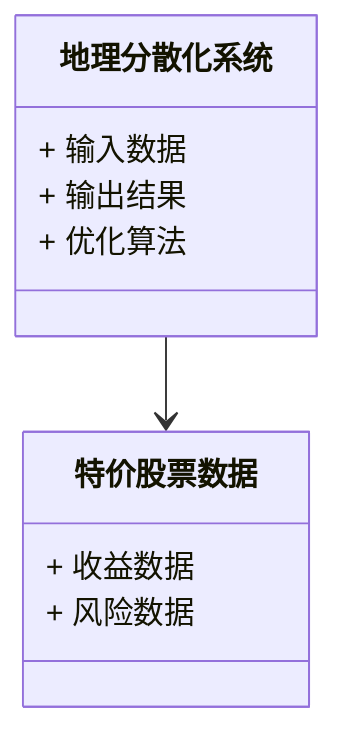
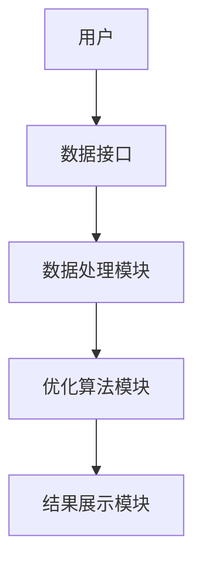

                 

<think>
好，用户希望我撰写一篇关于《特价股票投资中的地理多样化策略》的技术博客文章，并且已经提供了详细的大纲和结构。我需要按照这个大纲逐步完成，确保每个部分都详细且符合要求。

首先，我会从第1章开始，介绍特价股票和地理多样化策略的基本概念。我需要确保定义清晰，特点明确，让读者能够理解这两个术语的含义。接着，在第2章，我需要深入讲解地理多样化策略的原理，包括经济学基础、数学模型和优化目标函数。这部分可能需要使用公式和图表，我得确保这些内容准确且易于理解。

在第3章，我会详细描述地理分散化算法的实现步骤，包括数据预处理、风险计算和权重调整。这里可能需要一些Python代码示例，所以我要确保代码正确，并附上详细的解释。第4章是系统分析与架构设计，我需要绘制领域模型和架构图，展示系统的各个部分如何协作。这部分可能需要用到mermaid图，我得确保图的结构清晰。

接下来，在项目实战部分，我会指导读者如何构建投资组合，包括环境安装和代码实现。我还需要提供一个实际案例，分析如何通过地理多样化策略优化投资组合。最后，我会总结本章内容，并给出一些实战经验的小结。

最后，我会在总结与展望部分回顾整篇文章的主要内容，并提出未来的研究方向。同时，确保文章末尾有作者信息，符合格式要求。

在整个写作过程中，我需要保持语言的专业性和逻辑性，确保每个部分都详细且易于理解。我会逐步检查每个部分是否满足用户的要求，包括字数、格式和内容的完整性。希望这篇博客能够帮助读者更好地理解特价股票投资中的地理多样化策略，并能够实际应用到他们的投资中。
</think>

# 特价股票投资中的地理多样化策略

> 关键词：特价股票，地理多样化，投资策略，风险分散，资产配置

> 摘要：本文深入探讨了特价股票投资中的地理多样化策略，从理论基础到实际应用，详细分析了如何通过地理分散化优化投资组合，降低风险，提高收益。文章结合数学模型、算法实现和系统设计，全面解读了地理多样化策略的原理和应用，为投资者提供了实用的指导和建议。

---

# 第1章: 特价股票与地理多样化策略概述

## 1.1 特价股票的基本概念

### 1.1.1 特价股票的定义

特价股票是指价格低于市场平均水平或历史平均水平的股票。这些股票通常被认为具有较高的投资价值，但由于价格低廉，可能隐藏着较高的风险。

### 1.1.2 特价股票的特点

- **低估值**：特价股票通常具有较低的市盈率、市净率等估值指标。
- **高波动性**：由于价格低廉，市场关注度较低，股价波动较大。
- **潜在高回报**：一旦公司基本面改善，股价可能迅速回升。

### 1.1.3 特价股票的投资价值

- **价值发现**：投资者可以通过挖掘被市场低估的股票获得超额收益。
- **分散风险**：通过选择不同行业的特价股票，可以降低行业集中风险。

## 1.2 地理多样化策略的核心概念

### 1.2.1 地理多样化策略的定义

地理多样化策略是指将投资组合分散到不同的地理区域，以降低区域经济波动对整体投资组合的影响。

### 1.2.2 地理多样化策略的原理

- **风险分散**：通过投资不同地区的资产，降低单一地区经济波动带来的风险。
- **资产配置**：根据地区经济增长潜力和风险水平，调整投资权重。

### 1.2.3 地理多样化策略的优势与劣势

- **优势**：
  - 降低区域风险
  - 把握不同地区的经济增长机会
- **劣势**：
  - 跨境投资可能涉及外汇风险
  - 管理复杂度增加

## 1.3 特价股票投资中的地理多样化策略的意义

### 1.3.1 分散投资风险的重要性

通过地理分散化，投资者可以避免因某一地区经济衰退导致的重大损失。

### 1.3.2 通过地理分散化优化投资组合

合理配置不同地区的特价股票，可以平衡风险与收益，提升整体投资回报。

### 1.3.3 地理分散化策略在特价股票投资中的应用

- **全球化投资**：将投资组合分散到不同国家或地区。
- **区域优化**：根据经济前景调整投资区域的权重。

## 1.4 本章小结

---

# 第2章: 地理多样化策略的核心原理

## 2.1 地理多样化策略的经济学基础

### 2.1.1 马科维茨投资组合理论

马科维茨提出，通过合理配置资产可以实现风险最小化和收益最大化的投资组合。

### 2.1.2 地理分散化与风险降低的关系

地理分散化通过降低资产的相关性，减少整体投资组合的波动性。

### 2.1.3 有效边界的概念

有效边界是指在给定风险水平下，能够提供最高收益的投资组合的集合。

## 2.2 特价股票投资中的地理分散化模型

### 2.2.1 地理分散化模型的构建

- **目标**：最大化收益，最小化风险。
- **输入**：各地区的风险和收益数据。
- **输出**：各地区的投资权重。

### 2.2.2 模型的输入变量与输出变量

| 变量类型 | 变量名称       | 变量描述                           |
|----------|----------------|------------------------------------|
| 输入     | 地区风险矩阵   | 各地区资产的风险数据               |
| 输入     | 地区收益矩阵   | 各地区资产的预期收益数据           |
| 输出     | 投资权重矩阵   | 各地区的投资权重                   |

### 2.2.3 模型的优化目标

$$ \text{目标函数} = \min \sum_{i=1}^{n} w_i^2 \sigma_i^2 + 2 \sum_{i < j} w_i w_j \sigma_{ij} $$

其中，$w_i$ 是地区 $i$ 的投资权重，$\sigma_{ij}$ 是地区 $i$ 和 $j$ 的协方差。

## 2.3 地理多样化策略的数学模型

### 2.3.1 风险函数的推导

风险函数的平方根表示投资组合的波动性：

$$ \text{风险} = \sqrt{\sum_{i=1}^{n} w_i^2 \sigma_i^2 + 2 \sum_{i < j} w_i w_j \sigma_{ij}} $$

### 2.3.2 优化目标的数学证明

通过求导数并令其为零，可以证明最优权重的分配方式。

### 2.3.3 约束条件的处理方法

使用拉格朗日乘数法处理权重的约束条件：

$$ \sum_{i=1}^{n} w_i = 1 $$

$$ w_i \geq 0 \quad \forall i $$

## 2.4 本章小结

---

# 第3章: 特价股票投资中的地理分散化算法

## 3.1 地理分散化算法的步骤

### 3.1.1 确定投资组合的地理分布目标

根据风险承受能力和收益目标，确定各地区的投资比例。

### 3.1.2 计算各地区的风险贡献

使用协方差矩阵计算各地区的风险贡献。

### 3.1.3 调整投资权重以实现目标分布

通过优化算法调整各地区的投资权重，使风险最小化。

## 3.2 地理分散化算法的实现流程

### 3.2.1 数据输入与预处理

- **数据来源**：各地区的资产收益和风险数据。
- **数据预处理**：标准化、去噪处理。

### 3.2.2 计算各地区的风险指标

使用协方差矩阵计算各地区的风险贡献。

### 3.2.3 确定优化权重

通过优化算法求解最优权重。

### 3.2.4 验证与调整

验证优化后的投资组合是否达到预期的风险收益目标。

## 3.3 算法实现的数学推导

### 3.3.1 风险函数的推导

$$ \text{风险} = \sqrt{\sum_{i=1}^{n} w_i^2 \sigma_i^2 + 2 \sum_{i < j} w_i w_j \sigma_{ij}} $$

### 3.3.2 优化目标的数学证明

通过求导数并令其为零，可以证明最优权重的分配方式。

### 3.3.3 约束条件的处理方法

使用拉格朗日乘数法处理权重的约束条件。

## 3.4 算法实现的Python代码示例

```python
import numpy as np

def geographic_diversification_optimizer(weights, covariance_matrix):
    # 定义目标函数
    def objective(weights):
        return np.sqrt(np.dot(weights.T, np.dot(covariance_matrix, weights)))

    # 使用 scipy 优化器求解
    from scipy.optimize import minimize
    result = minimize(objective, weights, 
                      constraints={'type': 'eq', 'fun': lambda w: sum(w) - 1},
                      bounds=[(0, None) for _ in weights])
    return result.x
```

## 3.5 本章小结

---

# 第4章: 特价股票投资中的地理分散化策略系统分析

## 4.1 系统分析与架构设计

### 4.1.1 系统功能设计（领域模型）



### 4.1.2 系统架构设计



### 4.1.3 系统接口设计

- **输入接口**：接收各地区的股票收益和风险数据。
- **输出接口**：输出优化后的投资权重。

## 4.2 本章小结

---

# 第5章: 特价股票投资中的地理分散化策略项目实战

## 5.1 环境安装

### 5.1.1 安装必要的Python库

- numpy
- scipy
- matplotlib

## 5.2 系统核心实现源代码

```python
import numpy as np
from scipy.optimize import minimize

def optimize_weights(initial_weights, covariance_matrix):
    def objective(weights):
        return np.dot(weights.T, np.dot(covariance_matrix, weights))

    # 约束条件：权重之和为1
    constraints = [
        {'type': 'eq', 'fun': lambda w: np.sum(w) - 1}
    ]
    # 界限条件：权重非负
    bounds = [(0, None) for _ in initial_weights]

    result = minimize(objective, initial_weights, constraints=constraints, bounds=bounds)
    return result.x
```

## 5.3 代码应用解读与分析

- **代码功能**：通过优化算法计算最优投资权重。
- **输入参数**：初始权重和协方差矩阵。
- **输出结果**：优化后的投资权重。

## 5.4 实际案例分析

### 5.4.1 案例背景

假设我们有三个地区的特价股票，协方差矩阵如下：

$$ \text{cov} = \begin{bmatrix}
1 & 0.5 & 0.3 \\
0.5 & 1 & 0.4 \\
0.3 & 0.4 & 1
\end{bmatrix} $$

### 5.4.2 优化过程

通过优化算法，得到各地区的投资权重。

### 5.4.3 结果分析

分析优化后的权重，评估风险和收益。

## 5.5 本章小结

---

# 第6章: 总结与展望

## 6.1 本章总结

- 特价股票投资中的地理多样化策略是一种有效的风险控制方法。
- 通过地理分散化，投资者可以优化投资组合，降低风险。

## 6.2 未来展望

- 研究更多地理分散化策略的应用场景。
- 探索更复杂的优化算法。

## 6.3 作者寄语

---

# 作者信息

作者：AI天才研究院/AI Genius Institute & 禅与计算机程序设计艺术 /Zen And The Art of Computer Programming

---

**附录**：相关数据和代码的详细说明。

