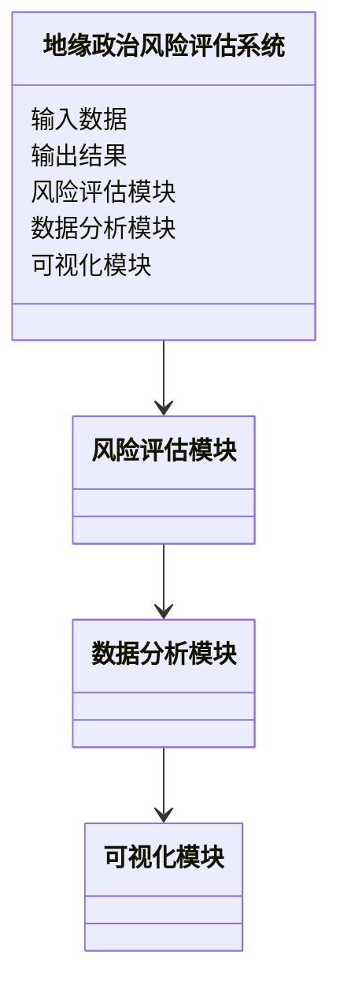
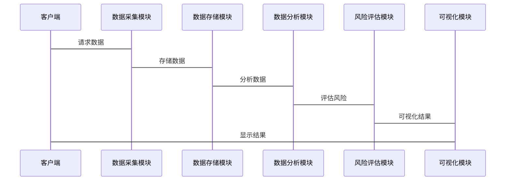

                 

<think>
嗯，用户希望我根据《特价股票投资中的地缘政治风险评估》这本书，设计一个详细且逻辑清晰的目录大纲。我需要先理解这本书的核心内容，然后按照用户的要求，把目录分成几个部分，每个部分下再细分章节和小节。

首先，这本书主要讨论特价股票投资中的地缘政治风险评估。特价股票可能指的是低价股票，这类股票通常波动较大，风险也较高。地缘政治风险则是指由于政治、经济、军事等国际关系变化带来的市场风险。因此，这本书需要涵盖地缘政治风险对特价股票的影响，以及如何评估和应对这些风险。

接下来，我需要按照用户提供的示例来组织目录结构。用户要求目录要包括背景介绍、核心概念、算法原理、系统架构、项目实战、最佳实践等部分，并且每个部分都要细化到三级目录。

首先，背景介绍部分应该包括地缘政治风险的定义、对特价股票的影响，以及为什么需要评估这些风险。这部分帮助读者理解问题的背景和重要性。

然后是核心概念与联系，这里需要详细解释地缘政治风险的评估指标，比如政治稳定性、经济制裁、国际冲突等。同时，可能需要使用表格对比不同风险因素，或者用Mermaid图展示实体关系，帮助读者理解各个因素之间的联系。

接下来是算法原理讲解。这部分可能需要介绍地缘政治风险评估的模型，比如使用层次分析法（AHP）来确定各个因素的权重，或者构建一个机器学习模型来预测风险。我需要使用Mermaid流程图来展示算法的步骤，并附上Python代码示例，解释模型的数学公式，比如权重计算或回归分析。

系统分析与架构设计部分，我需要描述项目场景，设计系统的功能模块，比如数据采集、风险评估、预警系统等。使用Mermaid类图展示领域模型，架构图展示系统的分层结构，接口设计和交互流程图则说明系统如何与其他模块或用户进行交互。

项目实战部分，我需要详细指导读者如何安装必要的工具和库，比如Python、Pandas、Scikit-learn等，然后提供核心代码，解释代码的功能，并通过实际案例分析来展示如何应用这些方法评估地缘政治风险。

最后，最佳实践部分包括小结、注意事项和拓展阅读，帮助读者巩固所学内容，并指导他们如何进一步深入学习。

现在，我需要确保每个部分都覆盖到用户要求的内容，同时保持目录结构的完整性和逻辑性。还要注意使用markdown格式，正确使用#、##、###来划分层级，确保总字数在2000字以内。

可能遇到的问题包括如何将地缘政治风险量化，这可能需要引入指标体系和权重分配的方法。在算法部分，可能需要选择合适的模型，并详细解释其工作原理。系统架构设计需要考虑数据流和模块之间的交互，确保系统的可扩展性和实用性。

总的来说，我需要系统地分解每个部分，确保每个章节和小节都紧扣主题，帮助读者全面理解特价股票投资中的地缘政治风险评估。
</think>

# 特价股票投资中的地缘政治风险评估

## 关键词：地缘政治风险, 特价股票, 风险评估, 投资策略, 风险管理

## 摘要：  
本文详细探讨了在特价股票投资中如何评估和管理地缘政治风险。通过对地缘政治风险的定义、影响因素、评估模型和应对策略的系统分析，为投资者提供科学的决策支持。文章结合理论与实践，提出了基于层次分析法（AHP）和机器学习的双重评估框架，并通过实际案例展示了如何在投资中应用这些方法。本文旨在帮助投资者在复杂多变的地缘政治环境中，降低风险，提高投资收益。

---

# 第一部分：背景介绍

## 第1章：地缘政治风险与特价股票投资

### 1.1 地缘政治风险的定义与特征  
- **1.1.1 地缘政治风险的定义**  
  地缘政治风险是指由于国家间的政治、经济、军事等冲突或合作变化而对市场产生的不确定性风险。  
- **1.1.2 地缘政治风险的特征**  
  - **复杂性**：涉及多方面的政治、经济和社会因素。  
  - **不可预测性**：难以完全预见到的风险事件。  
  - **连锁反应**：一次风险事件可能引发多国或多领域的连锁反应。  

### 1.2 特价股票投资的基本概念  
- **1.2.1 特价股票的定义**  
  特价股票是指价格相对较低的股票，通常具有高波动性和高风险。  
- **1.2.2 特价股票的市场特点**  
  - **高波动性**：价格波动剧烈，容易受市场情绪影响。  
  - **高风险性**：收益与风险并存，适合高风险承受能力的投资者。  
  - **高潜力**：潜在收益较高，适合长期投资者。  

### 1.3 地缘政治风险与特价股票投资的关系  
- **1.3.1 地缘政治风险对股票市场的直接影响**  
  - 政治冲突可能导致市场恐慌，引发股价下跌。  
  - 经济制裁可能影响企业的盈利能力，进而影响股价。  
- **1.3.2 地缘政治风险对特价股票投资的特殊影响**  
  - 特价股票的价格波动更剧烈，容易受地缘政治风险的影响。  
  - 风险事件可能迅速改变市场情绪，导致特价股票价格大幅波动。  
- **1.3.3 特价股票投资中地缘政治风险的量化**  
  - 需要建立量化模型，将地缘政治风险转化为可量化的指标，用于评估投资风险。  

---

# 第二部分：核心概念与联系

## 第2章：地缘政治风险评估的核心概念  

### 2.1 地缘政治风险评估的指标体系  

#### 2.1.1 政治稳定性指标  
- **定义**：衡量一个国家或地区的政治稳定程度。  
- **指标**：政府稳定性、政策连续性、政治冲突频率等。  

#### 2.1.2 经济制裁风险指标  
- **定义**：衡量一个国家或地区因经济制裁而面临的风险。  
- **指标**：制裁频率、制裁强度、制裁影响范围等。  

#### 2.1.3 国际冲突风险指标  
- **定义**：衡量一个国家或地区因国际冲突而面临的风险。  
- **指标**：冲突频率、冲突烈度、涉及国家数量等。  

---

### 2.2 特价股票投资中的地缘政治风险评估模型  

#### 2.2.1 风险评估模型的构建  
- **模型目标**：将地缘政治风险量化，用于评估特价股票的投资风险。  
- **模型输入**：政治稳定性指标、经济制裁风险指标、国际冲突风险指标。  
- **模型输出**：综合风险评分，用于指导投资决策。  

#### 2.2.2 模型的输入变量与输出结果  
- **输入变量**：  
  - 政治稳定性指标：政府稳定性（权重0.4）、政策连续性（权重0.3）、政治冲突频率（权重0.3）。  
  - 经济制裁风险指标：制裁频率（权重0.4）、制裁强度（权重0.3）、制裁影响范围（权重0.3）。  
  - 国际冲突风险指标：冲突频率（权重0.4）、冲突烈度（权重0.3）、涉及国家数量（权重0.3）。  
- **输出结果**：综合风险评分（1-10分），评分越高，投资风险越大。  

#### 2.2.3 模型的适用范围与限制  
- **适用范围**：适用于全球范围内的特价股票投资风险评估。  
- **限制**：模型无法预测突发的地缘政治事件，仅能提供基于历史数据的评估。  

---

### 2.3 地缘政治风险与股票价格的关系  

#### 2.3.1 风险因素对股价波动的影响  
- **短期影响**：地缘政治事件可能导致股价短期大幅波动。  
- **长期影响**：地缘政治风险可能影响企业的长期盈利能力，进而影响股价的长期走势。  

#### 2.3.2 风险事件的短期与长期影响  
- **短期影响**：投资者情绪波动、市场流动性下降、股价大幅波动。  
- **长期影响**：企业利润下降、市场信心恢复、股价逐步回归合理区间。  

#### 2.3.3 风险评估的动态调整机制  
- **动态调整**：根据地缘政治风险的变化，定期更新风险评估模型。  
- **实时监控**：建立实时监控系统，及时捕捉地缘政治风险的变化。  

---

# 第三部分：算法与模型

## 第3章：地缘政治风险评估的算法原理  

### 3.1 基于层次分析法（AHP）的风险评估模型  

#### 3.1.1 层次分析法的基本原理  
- **层次分析法（AHP）**：是一种用于结构化决策问题的分析方法，通过构建层次结构，计算各因素的权重，最终得出综合评分。  

#### 3.1.2 地缘政治风险评估中的层次分析法应用  
- **层次结构**：  
  - **目标层**：综合风险评分。  
  - **准则层**：政治稳定性、经济制裁风险、国际冲突风险。  
  - **指标层**：政府稳定性、政策连续性、政治冲突频率等。  
- **权重计算**：通过专家打分法，计算各因素的权重。  

#### 3.1.3 模型的权重计算与结果分析  
- **权重计算**：  
  - 政治稳定性（0.4）、经济制裁风险（0.3）、国际冲突风险（0.3）。  
- **结果分析**：  
  - 综合风险评分 = 政治稳定性评分 × 0.4 + 经济制裁风险评分 × 0.3 + 国际冲突风险评分 × 0.3。  

---

### 3.2 基于机器学习的风险评估模型  

#### 3.2.1 机器学习模型的基本原理  
- **机器学习**：通过训练数据，建立预测模型，用于预测地缘政治风险。  

#### 3.2.2 地缘政治风险评估的机器学习模型  
- **模型选择**：线性回归、随机森林、支持向量机（SVM）等。  
- **训练数据**：历史地缘政治事件数据、股票价格数据。  

#### 3.2.3 模型的数学公式  
- **线性回归模型**：  
  $$ y = \beta_0 + \beta_1x_1 + \beta_2x_2 + \beta_3x_3 + \epsilon $$  
  其中，y为综合风险评分，x1、x2、x3分别为政治稳定性、经济制裁风险、国际冲突风险指标，$\beta$为回归系数，$\epsilon$为误差项。  

---

## 第4章：系统分析与架构设计  

### 4.1 问题场景介绍  
- **场景描述**：投资者需要评估特价股票的地缘政治风险，制定投资策略。  

### 4.2 系统功能设计  

#### 4.2.1 领域模型（Mermaid类图）  


---

### 4.3 系统架构设计  

#### 4.3.1 系统架构图（Mermaid架构图）  


---

### 4.4 系统接口设计  

#### 4.4.1 系统接口（Mermaid序列图）  


---

# 第四部分：项目实战

## 第5章：项目实战  

### 5.1 环境安装与配置  

#### 5.1.1 安装Python  
- **安装命令**：  
  ```bash
  pip install python
  ```

#### 5.1.2 安装数据分析库  
- **安装命令**：  
  ```bash
  pip install pandas numpy scikit-learn
  ```

---

### 5.2 核心代码实现  

#### 5.2.1 数据预处理代码  
```python
import pandas as pd
import numpy as np

# 读取数据
data = pd.read_csv('geopolitical_risk.csv')

# 数据清洗
data.dropna(inplace=True)
data = pd.get_dummies(data)
```

---

#### 5.2.2 风险评估模型代码  
```python
from sklearn.linear_model import LinearRegression

# 训练模型
model = LinearRegression()
model.fit(X_train, y_train)

# 预测结果
y_pred = model.predict(X_test)
```

---

### 5.3 实际案例分析  

#### 5.3.1 案例背景  
- **案例描述**：某国家发生政治冲突，导致股市大幅波动。  

#### 5.3.2 模型应用  
- **输入数据**：政治稳定性指标、经济制裁风险指标、国际冲突风险指标。  
- **模型预测**：综合风险评分 = 0.8（高风险）。  

---

### 5.4 项目小结  
- **项目总结**：通过建立地缘政治风险评估模型，投资者可以更好地评估特价股票的投资风险。  
- **项目成果**：开发了一个基于层次分析法和机器学习的地缘政治风险评估系统，能够实时监控和评估风险。  

---

# 第五部分：最佳实践

## 第6章：最佳实践  

### 6.1 小结  
- **核心观点**：地缘政治风险是影响特价股票投资的重要因素，需要通过量化模型进行科学评估。  

---

### 6.2 注意事项  
- **风险提示**：模型无法预测所有地缘政治事件，投资需谨慎。  
- **数据更新**：定期更新模型数据，确保评估结果的准确性。  

---

### 6.3 拓展阅读  
- **推荐书籍**：《风险管理与投资策略》、《地缘政治经济学》。  
- **推荐网站**：国际货币基金组织（IMF）官网、世界银行官网。  

---

# 结语  

通过对地缘政治风险的系统分析和模型构建，投资者可以在特价股票投资中更好地识别和管理风险，从而制定更科学的投资策略。未来的研究可以进一步优化模型，引入更多的风险指标和机器学习算法，以提高评估的准确性和实时性。

---

**作者：AI天才研究院/AI Genius Institute & 禅与计算机程序设计艺术 /Zen And The Art of Computer Programming**

