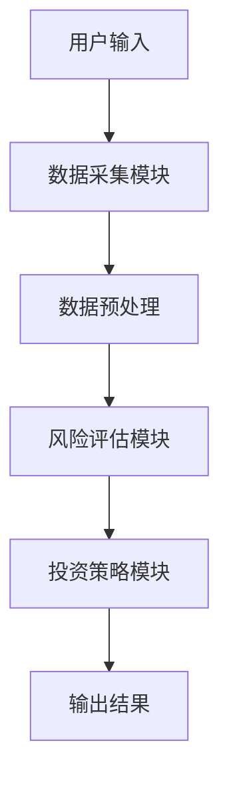
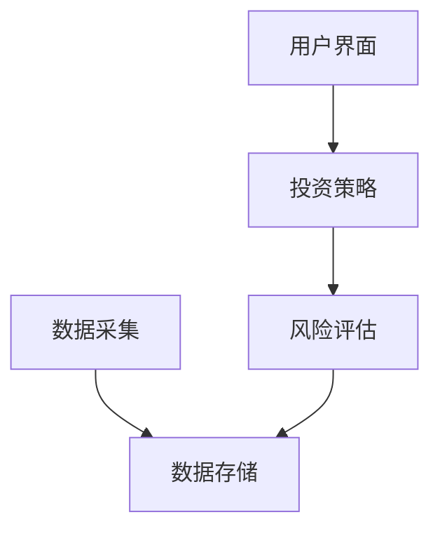

                 

# 特价股票投资中的地缘科技与数字经济主权风险动态评估策略

> 关键词：特价股票，地缘科技，数字经济主权，风险评估，投资策略

> 摘要：本文探讨了在当前全球化和数字化背景下，特价股票投资中地缘科技与数字经济主权风险的动态评估策略。通过分析地缘政治风险、科技制裁、数字经济主权等关键因素，本文提出了一个综合性的风险评估模型，并结合实际案例，展示了如何将这些因素纳入投资决策中。文章还讨论了动态评估的算法原理和系统架构，为投资者提供了一种新的视角和方法。

---

## 第1章: 特价股票投资概述

### 1.1 特价股票的定义与特点

#### 1.1.1 特价股票的定义
特价股票是指在特定市场环境下，由于市场波动、公司基本面变化或其他外部因素影响，股价暂时低于其内在价值的股票。这类股票通常具有较高的投资潜力，但伴随着较高的风险。

#### 1.1.2 特价股票的特点
- **低估值**：股价通常低于行业平均水平或历史平均水平。
- **高波动性**：市场波动较大，容易受到外部因素的影响。
- **周期性**：通常出现在市场低迷或经济衰退时期。
- **高风险-高回报**：潜在回报高，但风险也较高。

#### 1.1.3 特价股票与传统股票的区别
- 投资策略：传统股票注重长期价值，特价股票更关注短期价格波动。
- 风险特征：传统股票风险相对分散，特价股票风险集中。
- 投资门槛：特价股票投资需要更高的市场敏感性和风险承受能力。

### 1.2 特价股票投资的基本原理

#### 1.2.1 投资的基本概念
投资是通过购买资产（如股票、债券等）来实现财富增值的过程。投资的核心在于识别潜在价值，并在合适的价格买入，以期在未来的市场波动中获利。

#### 1.2.2 特价股票投资的核心要素
- 市场分析：识别市场趋势和周期。
- 公司基本面：分析公司的财务状况、盈利能力等。
- 风险评估：评估投资的潜在风险。

#### 1.2.3 投资者行为与市场波动的关系
投资者行为会加剧市场波动，特别是在市场下跌时，恐慌性抛售会进一步压低股价，反之亦然。投资者情绪和行为是影响市场的重要因素。

### 1.3 特价股票投资的市场环境

#### 1.3.1 经济周期对股票市场的影响
经济周期分为扩张期、衰退期、复苏期和繁荣期。在衰退期，许多公司会打折出售股票，此时可能是购买特价股票的好时机。

#### 1.3.2 政治环境与市场波动
政治不稳定或政策变化可能导致市场波动，影响股价。例如，贸易摩擦、地缘政治冲突等都会引发市场不确定性。

#### 1.3.3 科技发展对股票市场的影响
科技的进步会改变行业格局，推动创新，但也可能引发技术性泡沫。投资者需要关注科技发展的趋势及其对相关行业的影响。

## 1.4 本章小结
本章介绍了特价股票的基本概念、特点及其与传统股票的区别，分析了投资的基本原理和市场环境的影响。接下来，我们将探讨地缘科技对股票投资的具体影响。

---

## 第2章: 地缘科技对股票投资的影响

### 2.1 地缘政治风险的定义与特征

#### 2.1.1 地缘政治风险的定义
地缘政治风险是指由于地理位置、资源分配、政治冲突等因素导致的市场风险。这类风险通常与国家间的冲突、贸易摩擦或政策变化相关。

#### 2.1.2 地缘政治风险的特征
- **不可预测性**：地缘政治事件往往难以预测。
- **传染性**：局部冲突可能引发全球市场的波动。
- **长期性**：某些地缘政治问题可能长期存在，影响市场的稳定性。

#### 2.1.3 地缘政治风险的分类
- **主权风险**：国家违约或政治动荡导致的投资损失风险。
- **政治风险**：政策变化或政治不稳定导致的市场波动。
- **军事风险**：战争或武装冲突引发的市场恐慌。

### 2.2 科技发展对地缘政治的影响

#### 2.2.1 科技在地缘政治中的作用
科技的进步改变了地缘政治格局，例如人工智能、5G技术等领域的竞争成为国际政治的重要议题。

#### 2.2.2 科技制裁与技术依赖
技术制裁（如出口限制）会影响相关行业的供应链，而技术依赖（如芯片依赖）则可能成为被制裁的目标。

#### 2.2.3 数字化战争与网络攻击
网络攻击已成为地缘政治冲突的重要手段，例如通过攻击关键基础设施破坏对方的经济和政治稳定。

### 2.3 地缘科技对股票投资的具体影响

#### 2.3.1 地缘政治事件对股价的影响
地缘政治事件（如贸易战、地缘冲突）通常会导致相关行业的股价波动，投资者需要及时调整投资策略。

#### 2.3.2 科技制裁对行业的影响
科技制裁可能限制某些公司的技术发展，进而影响其市场地位和盈利能力。例如，半导体行业的技术制裁会影响全球电子产业。

#### 2.3.3 地缘科技风险的评估方法
- **行业分析**：分析公司所在的行业是否受地缘政治影响。
- **政策解读**：密切关注相关政策变化，评估其对市场的潜在影响。
- **情景分析**：模拟不同地缘政治情景下的投资回报。

## 2.4 本章小结
本章分析了地缘政治风险的定义和特征，并探讨了科技发展对地缘政治的影响。地缘科技风险对股票投资有着重要的影响，投资者需要在投资决策中充分考虑这些因素。下一章将重点讨论数字经济主权风险对股票投资的影响。

---

## 第3章: 数字经济主权风险与股票投资

### 3.1 数字经济的定义与特征

#### 3.1.1 数字经济的定义
数字经济是指以数字技术为核心驱动力，通过数据的生产、传输、处理和应用来实现经济活动的新型经济形态。

#### 3.1.2 数字经济的核心特征
- **数据驱动**：数据成为最重要的生产要素。
- **技术驱动**：依赖于数字技术的创新和应用。
- **全球化**：数字经济超越国界，具有全球性。

#### 3.1.3 数字经济与传统经济的区别
- 数字经济更依赖于技术创新，传统经济更依赖于劳动力和资本。
- 数字经济具有更高的效率和更低的交易成本，传统经济效率较低。

### 3.2 数字经济主权的定义与挑战

#### 3.2.1 数字经济主权的定义
数字经济主权是指一个国家对数字资源、数字技术和数字经济活动的控制权和影响力。它包括数据主权、技术主权和网络主权等多个方面。

#### 3.2.2 数字经济主权的核心要素
- **数据主权**：对数据的生成、存储和使用的控制。
- **技术主权**：对关键技术的自主研发和控制。
- **网络主权**：对网络基础设施和安全的控制。

#### 3.2.3 数字经济主权面临的挑战
- **技术依赖**：许多国家在关键技术上依赖外国企业。
- **数据跨境流动**：数据的跨国流动可能威胁国家主权。
- **国际竞争**：数字经济领域的国际竞争日益激烈。

### 3.3 数字经济主权风险对股票投资的影响

#### 3.3.1 数字经济主权风险的来源
- **数据安全**：数据泄露或被滥用可能引发法律和声誉风险。
- **技术封锁**：关键技术和设备的进口限制可能影响公司运营。
- **政策变化**：政府可能出台新的政策，限制外国企业的市场准入。

#### 3.3.2 数字经济主权风险对行业的影响
- **科技行业**：依赖进口技术的公司可能面临更高的风险。
- **金融行业**：数据跨境流动的限制可能影响金融服务的提供。
- **制造业**：数字化转型中的制造企业可能面临技术封锁的风险。

#### 3.3.3 数字经济主权风险的评估方法
- **行业分析**：评估公司所在行业的技术依赖程度。
- **政策解读**：密切关注相关政策变化，评估其对市场的潜在影响。
- **情景分析**：模拟不同政策情景下的投资回报。

## 3.4 本章小结
本章探讨了数字经济的定义和特征，并分析了数字经济主权的定义和挑战。数字经济主权风险对股票投资有着重要的影响，投资者需要在投资决策中充分考虑这些因素。下一章将重点讨论地缘科技与数字经济主权风险的动态关系。

---

## 第4章: 地缘科技与数字经济主权风险的动态关系

### 4.1 地缘科技与数字经济主权风险的相互作用

#### 4.1.1 地缘科技对数字经济主权的影响
地缘科技的发展可能会影响数字经济主权的实现。例如，某些国家通过技术封锁限制其他国家的数字经济发展。

#### 4.1.2 数字经济主权对地缘科技的影响
数字经济主权的实现可能会影响地缘科技的发展。例如，国家对关键技术的自主研发可能减少对外部技术的依赖。

#### 4.1.3 两者关系的动态变化
地缘科技与数字经济主权风险的关系是动态变化的，随着技术进步和政策变化而不断调整。

### 4.2 地缘科技与数字经济主权风险的协同效应

#### 4.2.1 协同效应的定义
协同效应是指两个或多个因素相互作用，产生比单独存在时更大的效果。

#### 4.2.2 协同效应的表现形式
- **技术协同**：地缘科技的发展促进数字经济主权的实现。
- **政策协同**：地缘科技与数字经济主权风险的政策变化相互影响。
- **市场协同**：地缘科技与数字经济主权风险共同影响市场波动。

#### 4.2.3 协同效应的量化分析
通过建立数学模型，分析地缘科技与数字经济主权风险的协同效应，评估其对股票投资的影响。

### 4.3 地缘科技与数字经济主权风险的动态评估模型

#### 4.3.1 模型的构建
动态评估模型需要考虑地缘科技和数字经济主权风险的相互作用，以及它们对股票投资的影响。

#### 4.3.2 模型的实现
通过数学公式和算法，实现动态评估模型。例如，使用回归分析或时间序列分析方法，评估地缘科技和数字经济主权风险对股价的影响。

#### 4.3.3 模型的应用
通过实际案例分析，验证模型的有效性，并为投资者提供参考。

## 4.4 本章小结
本章分析了地缘科技与数字经济主权风险的动态关系，并提出了一个动态评估模型。投资者可以根据模型的评估结果，调整投资策略，降低风险。下一章将讨论风险动态评估的具体方法。

---

## 第5章: 风险动态评估模型的构建与实现

### 5.1 风险动态评估模型的构建

#### 5.1.1 模型的核心要素
- **地缘科技风险因子**：包括地缘政治事件、科技制裁等。
- **数字经济主权风险因子**：包括数据安全、技术封锁等。
- **股价波动因子**：包括市场波动、投资者情绪等。

#### 5.1.2 模型的构建步骤
1. 收集相关数据，包括历史股价、地缘政治事件、政策变化等。
2. 确定影响股价的关键因子。
3. 建立数学模型，评估各因子对股价的影响。

#### 5.1.3 模型的数学公式
通过回归分析，建立股价与各风险因子之间的关系。例如：
$$ y = \beta_0 + \beta_1 x_1 + \beta_2 x_2 + \epsilon $$
其中，$y$ 是股价，$x_1$ 和 $x_2$ 是地缘科技和数字经济主权风险因子，$\beta$ 是回归系数，$\epsilon$ 是误差项。

### 5.2 模型的实现与优化

#### 5.2.1 数据的获取与预处理
- 数据来源：股票历史数据、新闻事件、政策变化等。
- 数据预处理：清洗数据，处理缺失值，标准化数据。

#### 5.2.2 模型的训练与验证
- 训练数据：使用历史数据训练模型。
- 验证数据：使用部分数据验证模型的准确性。
- 优化参数：通过交叉验证优化模型参数。

#### 5.2.3 模型的应用
- 预测股价：根据模型预测未来股价的变化。
- 风险评估：评估地缘科技和数字经济主权风险对股价的影响。

### 5.3 模型的实际应用案例

#### 5.3.1 案例背景
选择一个具体的地缘政治事件，分析其对股价的影响。

#### 5.3.2 案例分析
通过模型分析地缘科技和数字经济主权风险对股价的具体影响。

#### 5.3.3 案例总结
总结模型的应用效果，并提出改进建议。

## 5.4 本章小结
本章详细介绍了风险动态评估模型的构建与实现，并通过实际案例展示了模型的应用。下一章将讨论如何将模型应用于实际投资决策中。

---

## 第6章: 投资策略与风险管理

### 6.1 投资策略的制定

#### 6.1.1 投资目标的设定
- 短期目标：抓住特价股票的短期价格波动。
- 长期目标：通过投资特价股票实现财富增值。

#### 6.1.2 投资组合的构建
- 分散投资：通过投资不同行业的股票降低风险。
- 仓位管理：根据市场波动调整投资仓位。

#### 6.1.3 投资策略的调整
- 定期评估：根据市场变化调整投资策略。
- 事件驱动：根据地缘科技和数字经济主权风险的变化调整投资策略。

### 6.2 风险管理的实施

#### 6.2.1 风险识别
- 识别潜在的地缘科技和数字经济主权风险。
- 分析风险的来源和影响程度。

#### 6.2.2 风险量化
- 使用动态评估模型量化风险。
- 确定风险的容忍度和承受能力。

#### 6.2.3 风险控制
- 设置止损点：当股价达到一定亏损时，立即卖出股票。
- 风险对冲：通过期货、期权等工具对冲风险。

### 6.3 投资策略与风险管理的结合

#### 6.3.1 策略的动态调整
- 根据风险评估结果调整投资策略。
- 根据市场变化优化投资组合。

#### 6.3.2 风险管理的持续改进
- 定期回顾投资策略的有效性。
- 根据新数据和新情况进行优化。

## 6.4 本章小结
本章讨论了投资策略的制定和风险管理的实施，并提出了将投资策略与风险管理相结合的方法。通过动态调整投资策略，投资者可以有效应对地缘科技和数字经济主权风险，实现投资目标。

---

## 第7章: 系统架构与实现

### 7.1 系统功能设计

#### 7.1.1 系统目标
- 实现地缘科技与数字经济主权风险的动态评估。
- 提供投资策略建议。

#### 7.1.2 功能模块
- 数据采集模块：采集股票数据、新闻数据等。
- 风险评估模块：评估地缘科技和数字经济主权风险。
- 投资策略模块：根据风险评估结果制定投资策略。

#### 7.1.3 功能流程图
使用mermaid绘制功能流程图，展示系统的整体流程。

### 7.2 系统架构设计

#### 7.2.1 架构选择
- 分层架构：将系统分为数据层、业务逻辑层和用户界面层。
- 微服务架构：将系统功能分解为多个微服务。

#### 7.2.2 系统架构图
使用mermaid绘制系统架构图，展示系统的各个组件及其关系。

### 7.3 系统接口设计

#### 7.3.1 API设计
- 数据接口：提供数据查询和数据存储的API。
- 风险评估接口：提供风险评估结果的API。
- 投资策略接口：提供投资策略建议的API。

#### 7.3.2 接口文档
详细描述每个接口的输入、输出和使用方法。

### 7.4 系统实现

#### 7.4.1 环境安装
- 安装Python、Jupyter Notebook等开发工具。
- 安装数据处理库（如Pandas、NumPy）和机器学习库（如Scikit-learn）。

#### 7.4.2 核心代码实现
- 数据采集：编写代码从网络获取股票数据和新闻数据。
- 风险评估：实现动态评估模型，评估地缘科技和数字经济主权风险。
- 投资策略：根据风险评估结果，制定投资策略。

## 7.5 本章小结
本章详细介绍了系统的架构设计和实现过程，展示了如何将地缘科技与数字经济主权风险的动态评估模型应用于实际系统中。通过系统的实现，投资者可以更方便地进行风险评估和投资决策。

---

## 第8章: 数学模型与算法实现

### 8.1 数学模型的建立

#### 8.1.1 风险评估模型
通过回归分析，建立地缘科技和数字经济主权风险对股价的影响模型。

$$ y = \beta_0 + \beta_1 x_1 + \beta_2 x_2 + \epsilon $$

其中，$x_1$ 和 $x_2$ 分别代表地缘科技和数字经济主权风险因子，$\beta$ 是回归系数，$\epsilon$ 是误差项。

#### 8.1.2 模型的优化
通过交叉验证优化模型参数，提高模型的预测精度。

### 8.2 算法实现

#### 8.2.1 数据预处理
- 清洗数据：处理缺失值和异常值。
- 标准化数据：对数据进行标准化处理，使其具有相同的尺度。

#### 8.2.2 模型训练
- 使用训练数据训练模型。
- 通过交叉验证优化模型参数。

#### 8.2.3 模型验证
- 使用验证数据评估模型的准确性。
- 调整模型参数，提高模型的预测能力。

## 8.3 本章小结
本章详细介绍了数学模型的建立和算法的实现过程，展示了如何通过数学模型评估地缘科技和数字经济主权风险。通过算法的实现，投资者可以更准确地预测股价的变化，制定投资策略。

---

## 第9章: 项目实战与案例分析

### 9.1 项目实战

#### 9.1.1 项目背景
选择一个具体的地缘政治事件，分析其对股价的影响。

#### 9.1.2 数据采集
从网络获取相关股票的历史数据和新闻数据。

#### 9.1.3 数据分析
使用数据分析工具（如Python）分析数据，评估地缘科技和数字经济主权风险对股价的影响。

#### 9.1.4 模型应用
应用动态评估模型，预测未来股价的变化。

### 9.2 案例分析

#### 9.2.1 案例背景
选择一个具体的案例，例如某国的地缘政治冲突对公司股价的影响。

#### 9.2.2 案例分析
通过模型分析地缘科技和数字经济主权风险对股价的具体影响。

#### 9.2.3 案例总结
总结案例分析的结果，提出投资建议。

## 9.3 本章小结
本章通过项目实战和案例分析，展示了如何将地缘科技与数字经济主权风险的动态评估模型应用于实际投资决策中。通过案例分析，投资者可以更好地理解模型的应用和效果。

---

## 第10章: 总结与展望

### 10.1 总结
本文探讨了特价股票投资中的地缘科技与数字经济主权风险的动态评估策略。通过分析地缘科技和数字经济主权风险对股价的影响，提出了一个动态评估模型，并结合实际案例展示了模型的应用。

### 10.2 展望
未来的研究可以进一步完善动态评估模型，探索更多的风险因子，提高模型的预测精度。同时，可以研究如何将模型应用于更多的投资领域，实现更广泛的应用。

---

## 作者：AI天才研究院/AI Genius Institute & 禅与计算机程序设计艺术 /Zen And The Art of Computer Programming

---

本文通过系统的分析和详细的案例，展示了如何在特价股票投资中考虑地缘科技与数字经济主权风险的动态关系，并提出了相应的风险评估模型和投资策略。希望本文能够为投资者提供有价值的参考，帮助他们在复杂的市场环境中做出更明智的投资决策。

