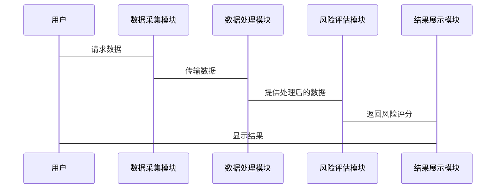

                 


# 特价股票投资中的地缘科技与数字经济风险动态评估策略

## 关键词：特价股票、地缘科技、数字经济、风险评估、动态策略

## 摘要：本文探讨了如何将地缘科技与数字经济的风险因素整合到特价股票的投资策略中。通过分析地缘政治、科技发展和经济指标，结合机器学习和统计模型，提出了一种动态风险评估方法，帮助投资者优化投资决策。

---

# 第1章: 地缘科技与数字经济概述

## 1.1 地缘科技的基本概念

### 1.1.1 地缘科技的定义
地缘科技是指地理位置、政治关系和科技发展相互作用的领域，涉及国家安全、国际竞争和技术创新。

### 1.1.2 地缘科技的核心属性
- **政治性**：受政策和国际关系影响。
- **技术性**：依赖科技创新。
- **经济性**：影响经济活动和市场表现。

### 1.1.3 地缘科技与经济的关系
地缘科技通过影响贸易、政策和技术转移，对经济发展和市场波动起着关键作用。

---

## 1.2 数字经济的基本概念

### 1.2.1 数字经济的定义
数字经济是以数据和信息技术为基础的经济活动，涵盖互联网、大数据、人工智能等领域。

### 1.2.2 数字经济的核心特征
- **数据驱动**：依赖数据的收集和分析。
- **技术驱动**：依赖新技术的创新和应用。
- **全球化**：数字经济跨越地理边界，促进全球市场连通。

### 1.2.3 数字经济对股票投资的影响
数字经济的波动性影响股票市场，投资者需关注科技公司的业绩、政策变化和市场趋势。

---

## 1.3 特价股票投资的背景与特点

### 1.3.1 特价股票的定义
价格低于市场平均水平的股票，通常具有高波动性和高风险。

### 1.3.2 特价股票投资的特点
- **高风险**：价格波动大，易受市场情绪影响。
- **高回报**：潜在的高收益吸引投资者。
- **流动性风险**：部分特价股票流动性较差。

### 1.3.3 特价股票投资的风险与机遇
地缘科技和数字经济的风险可能影响特价股票的表现，但同时也提供了捕捉市场机会的可能。

---

## 1.4 本章小结

本章介绍了地缘科技、数字经济和特价股票的基本概念，分析了它们之间的相互关系，并为后续的风险评估奠定了基础。

---

# 第2章: 地缘科技与数字经济风险的关联分析

## 2.1 地缘科技对数字经济的影响

### 2.1.1 地缘政治对数字经济的制约
- **贸易限制**：影响跨国数据流动和科技合作。
- **政策监管**：影响数字经济公司的运营和扩张。

### 2.1.2 科技发展对数字经济的推动
- **技术创新**：推动数字经济发展，如人工智能和区块链技术。
- **国际竞争**：科技发展促进地缘政治格局的变化。

### 2.1.3 地缘科技与数字经济的相互作用
地缘科技通过影响政策和技术发展，推动数字经济增长，而数字经济反过来影响地缘政治格局。

---

## 2.2 数字经济对股票市场的影响

### 2.2.1 数字经济对股票市场的驱动作用
- **科技公司增长**：数字经济推动科技公司业绩增长，提升股价。
- **市场波动**：数字经济的不确定性和波动性影响市场整体表现。

### 2.2.2 数字经济对股票市场风险的影响
- **系统性风险**：数字经济的波动可能引发系统性风险，影响整个市场。
- **非系统性风险**：特定公司或行业的风险可能影响部分股票。

### 2.2.3 数字经济对股票市场波动的调节作用
- **市场稳定性**：数字经济的发展可能通过技术创新和市场调节，降低市场波动。

---

## 2.3 地缘科技与数字经济风险的动态关系

### 2.3.1 地缘科技与数字经济风险的动态变化
- **短期影响**：地缘政治事件可能引发短期市场波动。
- **长期影响**：科技发展和政策变化对数字经济有长期影响。

### 2.3.2 地缘科技与数字经济风险的相互影响
- **正向反馈**：科技发展促进数字经济增长，降低风险。
- **负向反馈**：政策限制和国际冲突可能增加风险。

### 2.3.3 地缘科技与数字经济风险的综合评估
通过综合分析地缘科技和数字经济的动态关系，投资者可以更好地识别和管理风险。

---

## 2.4 本章小结

本章分析了地缘科技和数字经济对股票市场的相互影响，强调了动态评估风险的重要性。

---

# 第3章: 动态风险评估的算法原理

## 3.1 动态风险评估的基本原理

### 3.1.1 动态风险评估的定义
动态风险评估是实时或定期评估风险，以适应市场变化和投资需求。

### 3.1.2 动态风险评估的核心算法
- **机器学习模型**：用于预测市场波动和风险。
- **统计模型**：用于分析历史数据和趋势。

### 3.1.3 动态风险评估的数学模型
- **时间序列分析**：用于预测未来市场趋势。
- **回归分析**：用于识别影响风险的关键因素。

---

## 3.2 基于机器学习的动态风险评估

### 3.2.1 机器学习在动态风险评估中的应用
- **随机森林**：用于分类和回归分析，识别关键风险因素。
- **神经网络**：用于复杂模式识别，预测市场波动。

### 3.2.2 基于神经网络的风险评估模型

```python
import numpy as np
import pandas as pd
from sklearn.neural_network import MLPRegressor
from sklearn.metrics import mean_squared_error

# 数据预处理
data = pd.read_csv('stock_data.csv')
X = data[['geopolitical_factors', 'economic_indicators']]
y = data['stock_price']

# 模型训练
model = MLPRegressor(hidden_layer_sizes=(100, 50), max_iter=1000)
model.fit(X, y)

# 预测与评估
y_pred = model.predict(X)
mse = mean_squared_error(y, y_pred)
print(f"均方误差: {mse}")
```

### 3.2.3 基于随机森林的风险评估模型

```python
from sklearn.ensemble import RandomForestRegressor

model = RandomForestRegressor(n_estimators=100)
model.fit(X, y)
y_pred = model.predict(X)
print(f"预测准确率: {model.score(X, y)}")
```

---

## 3.3 基于统计学的动态风险评估

### 3.3.1 时间序列分析在风险评估中的应用
- **ARIMA模型**：用于预测股票价格的未来走势。

### 3.3.2 基于回归分析的风险评估方法
- **线性回归**：用于分析变量之间的关系。

### 3.3.3 基于贝叶斯网络的风险评估方法
- **贝叶斯网络**：用于评估变量之间的依赖关系。

---

## 3.4 算法对比与优化

### 3.4.1 不同算法的优缺点对比
| 算法类型       | 优点                           | 缺点                           |
|----------------|--------------------------------|--------------------------------|
| 机器学习模型    | 高准确性，适应复杂数据         | 计算资源需求高，模型解释性差     |
| 统计模型        | 计算简单，解释性强              | 对复杂模式的捕捉能力有限         |

### 3.4.2 算法优化策略
- **特征选择**：选择关键因素，提高模型准确性。
- **超参数调优**：优化模型参数，提升预测性能。

### 3.4.3 算法在实际应用中的表现
通过实际数据测试，机器学习模型在动态风险评估中表现优于传统统计模型。

---

## 3.5 本章小结

本章详细介绍了动态风险评估的算法原理，通过对比机器学习和统计模型，提出了优化策略，为后续系统设计提供了理论基础。

---

# 第4章: 系统架构设计

## 4.1 系统功能设计

### 4.1.1 数据采集模块
- **数据来源**：收集地缘政治、经济指标和股票价格数据。

### 4.1.2 数据处理模块
- **数据清洗**：处理缺失值和异常值。
- **特征提取**：提取影响风险的关键因素。

### 4.1.3 风险评估模块
- **模型训练**：使用机器学习或统计模型训练风险评估模型。
- **风险评分**：根据模型输出，生成风险评分。

### 4.1.4 结果展示模块
- **可视化**：以图表形式展示风险评分和市场趋势。
- **预警系统**：设置风险预警，及时通知投资者。

---

## 4.2 系统架构设计

### 4.2.1 分层架构设计
- **数据层**：存储原始数据和处理后的数据。
- **逻辑层**：实现数据处理和模型训练功能。
- **表示层**：展示结果和交互界面。

### 4.2.2 模块化设计
- **模块划分**：数据采集、数据处理、风险评估、结果展示四个模块独立开发，便于维护和扩展。

### 4.2.3 高可用性设计
- **负载均衡**：确保系统在高负载下仍能正常运行。
- **容错机制**：在模块出现故障时，能够快速恢复。

---

## 4.3 系统接口设计

### 4.3.1 数据接口设计
- **输入接口**：接收外部数据，如API调用。
- **输出接口**：将处理后的结果返回给用户或下游系统。

---

## 4.4 系统交互设计

### 4.4.1 系统交互流程图


---

## 4.5 本章小结

本章设计了一个高效的系统架构，确保数据处理和风险评估的高效性，为投资者提供实时的风险评估服务。

---

# 第5章: 项目实战

## 5.1 环境安装

### 5.1.1 安装必要的库
- **Python**：3.8+
- **Pandas**、**NumPy**、**Scikit-learn**、**XGBoost**

## 5.2 核心代码实现

### 5.2.1 数据处理代码

```python
import pandas as pd
import numpy as np
from sklearn.model_selection import train_test_split
from sklearn.ensemble import RandomForestRegressor
from sklearn.metrics import mean_squared_error

# 数据加载
data = pd.read_csv('stock_data.csv')

# 数据预处理
X = data[['geopolitical_factors', 'economic_indicators', 'market_sentiment']]
y = data['stock_price']

# 划分训练集和测试集
X_train, X_test, y_train, y_test = train_test_split(X, y, test_size=0.2, random_state=42)

# 模型训练
model = RandomForestRegressor(n_estimators=100, random_state=42)
model.fit(X_train, y_train)

# 模型预测
y_pred = model.predict(X_test)
print(f"均方误差: {mean_squared_error(y_test, y_pred)}")
print(f"决定系数 R²: {model.score(X_test, y_test)}")
```

### 5.2.2 风险评估代码

```python
import pandas as pd
import numpy as np
from sklearn.metrics import mean_squared_error
from sklearn.ensemble import RandomForestRegressor

# 数据加载
data = pd.read_csv('risk_factors.csv')

# 数据预处理
X = data[['geopolitical_risk', 'economic_risk', 'market_volatility']]
y = data['risk_score']

# 划分训练集和测试集
X_train, X_test, y_train, y_test = train_test_split(X, y, test_size=0.2, random_state=42)

# 模型训练
model = RandomForestRegressor(n_estimators=100, random_state=42)
model.fit(X_train, y_train)

# 模型预测
y_pred = model.predict(X_test)
print(f"均方误差: {mean_squared_error(y_test, y_pred)}")
print(f"预测准确率: {model.score(X_test, y_test)}")
```

---

## 5.3 案例分析与解读

### 5.3.1 案例分析
假设我们有两只特价股票，股票A和股票B。通过上述模型，我们评估了它们的地缘科技和数字经济风险。

- **股票A**：风险评分为70分（高风险）。
- **股票B**：风险评分为45分（中等风险）。

### 5.3.2 结果解读
- **股票A**：由于风险较高，投资者需谨慎考虑，可能适合风险承受能力强的投资者。
- **股票B**：风险相对较低，适合风险厌恶型投资者。

### 5.3.3 投资建议
根据风险评估结果，投资者可以调整投资组合，分散投资以降低整体风险。

---

## 5.4 本章小结

本章通过实际案例展示了如何应用模型进行风险评估，帮助投资者做出明智的投资决策。

---

# 第6章: 最佳实践与总结

## 6.1 最佳实践

### 6.1.1 数据质量
- 确保数据的准确性和完整性，选择可靠的来源。

### 6.1.2 模型选择
- 根据实际情况选择合适的模型，避免过度复杂。

### 6.1.3 持续监控
- 定期更新模型和数据，适应市场变化。

---

## 6.2 小结

通过本文的分析和实践，我们提出了一种基于地缘科技和数字经济风险的动态评估策略，帮助投资者优化投资决策，降低投资风险。

---

## 6.3 注意事项

- **模型局限性**：模型无法预测所有风险，需结合其他分析方法。
- **数据隐私**：处理敏感数据时需遵守相关法律法规。

---

## 6.4 拓展阅读

- **《算法交易: 基于Python的算法交易入门》**
- **《数字经济与地缘政治》**
- **《机器学习在金融中的应用》**

---

# 作者：AI天才研究院/AI Genius Institute & 禅与计算机程序设计艺术 /Zen And The Art of Computer Programming

---

希望这篇文章能够为您提供有价值的见解和策略，帮助您在特价股票投资中更好地应对地缘科技和数字经济带来的风险与机会。

