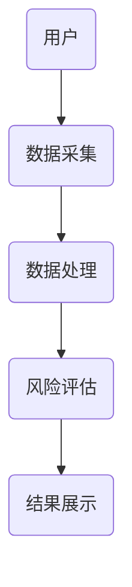
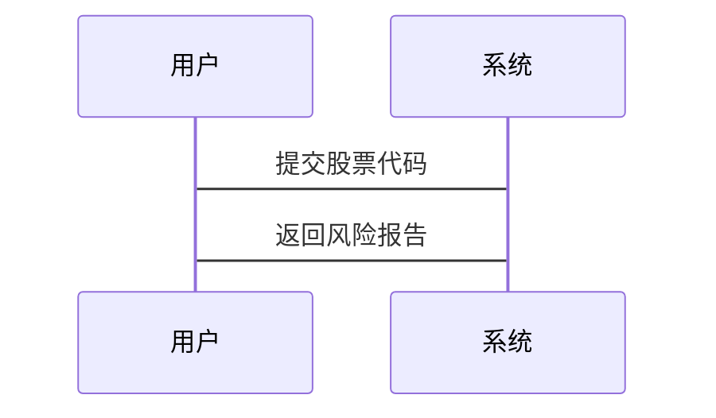

                 

<think>
好，我现在需要帮助用户撰写一篇关于《特价股票投资中的地缘科技风险评估》的技术博客文章。用户已经提供了详细的要求，包括文章结构、关键词、摘要以及每个章节的具体内容。

首先，我需要理解用户的需求。用户希望文章结构清晰，逻辑严谨，技术语言专业但易懂。文章应涵盖背景介绍、核心概念、算法原理、系统分析、项目实战和最佳实践等部分。

接下来，我得考虑每个章节的具体内容。例如，背景介绍部分需要定义地缘科技风险和特价股票，说明它们的关联性。核心概念部分需要详细分析地缘和科技因素，构建风险模型。算法部分可能涉及层次分析法和决策树，用Python代码示例。

系统分析部分，我需要设计数据流图和架构图，展示系统如何运作。项目实战则通过具体案例，展示如何应用这些模型进行评估。最后，最佳实践部分要总结经验和注意事项，提供进一步阅读的建议。

在写作过程中，要确保每个部分都有足够的细节，比如使用表格和图表来增强理解，同时避免过于复杂的术语，保持语言的简洁和易懂。最后，检查文章的逻辑是否连贯，确保每个章节之间有良好的过渡。

总的来说，我需要一步步按照用户的要求构建文章结构，确保每个部分都详细且符合技术博客的标准，帮助读者全面理解特价股票投资中的地缘科技风险评估。
</think>

# 特价股票投资中的地缘科技风险评估

**关键词：** 特价股票，地缘科技风险，风险评估，投资决策，科技因素

**摘要：**  
本文深入探讨了在特价股票投资中如何进行地缘科技风险评估。通过分析地缘政治和科技因素对投资的影响，结合数学模型和算法，为投资者提供科学的决策支持。文章从背景介绍、核心概念、算法原理、系统分析、项目实战到最佳实践，全面解析地缘科技风险评估的方法和应用，帮助投资者降低风险，实现稳健投资。

---

# 第一部分: 地缘科技风险与特价股票投资背景介绍

## 第1章: 地缘科技风险与特价股票投资概述

### 1.1 地缘科技风险的基本概念
#### 1.1.1 地缘政治与科技风险的定义
地缘政治是指不同地区之间的政治关系和冲突，而科技风险则涉及技术发展带来的不确定性。两者结合形成了地缘科技风险，即地理位置和技术因素共同作用对投资产生的潜在负面影响。

#### 1.1.2 地缘科技风险的构成要素
地缘科技风险主要由以下几个要素构成：
- **地缘因素**：包括国际关系、政策变化、区域冲突等。
- **科技因素**：涉及技术依赖、技术封锁、技术替代等。
- **时间因素**：风险的演变和影响随时间变化。

#### 1.1.3 特价股票投资中的地缘科技风险特点
- 特价股票通常价格较低，但波动性大，风险更高。
- 地缘科技风险可能迅速影响股价，投资者需及时评估。

### 1.2 特价股票投资的背景与现状
#### 1.2.1 特价股票的定义与特点
- 特价股票：价格远低于市场平均水平的股票。
- 特点：高波动性、高风险、高潜在收益。

#### 1.2.2 特价股票投资的市场现状
- 投资者追逐低价股票，但忽视潜在风险。
- 地缘科技风险日益成为影响投资的重要因素。

#### 1.2.3 地缘科技风险对特价股票投资的影响
- 地缘冲突可能导致公司供应链中断，影响业绩。
- 科技政策变化可能影响技术依赖型企业的估值。

### 1.3 地缘科技风险评估的必要性
#### 1.3.1 投资者面临的地缘科技风险
- 国际贸易摩擦影响出口型企业。
- 技术制裁影响依赖特定技术的企业。

#### 1.3.2 通过评估降低投资风险的重要性
- 帮助投资者识别高风险区域和企业。
- 提供科学的投资决策依据。

#### 1.3.3 地缘科技风险评估的边界与外延
- 边界：仅考虑地缘和科技因素。
- 外延：扩展至宏观经济、行业政策等其他风险。

### 1.4 地缘科技风险评估的核心要素
#### 1.4.1 地缘因素与科技因素的结合
- 地缘因素：地理位置、政策环境。
- 科技因素：技术依赖、创新潜力。

#### 1.4.2 风险评估的核心指标
- 政治稳定性：国家或地区的政治风险。
- 技术依赖度：企业对特定技术的依赖程度。
- 市场敏感性：市场对地缘科技事件的反应程度。

#### 1.4.3 风险评估的逻辑框架
1. 确定投资标的。
2. 分析其地缘和科技风险。
3. 综合评估整体风险。

### 1.5 本章小结
本章介绍了地缘科技风险的基本概念，探讨了特价股票投资的背景与现状，强调了风险评估的必要性，并提出了核心要素和逻辑框架。

---

# 第二部分: 地缘科技风险评估的核心概念与联系

## 第2章: 地缘科技风险评估的原理与方法

### 2.1 地缘科技风险的构成模型
#### 2.1.1 地缘因素的分类与特征
- 分类：政治、经济、社会。
- 特征：不确定性、波动性。

#### 2.1.2 科技因素的分类与特征
- 分类：技术依赖、技术替代、技术封锁。
- 特征：快速变化、高影响性。

#### 2.1.3 风险构成模型的构建
- 输入：地缘和科技因素。
- 输出：综合风险等级。

### 2.2 地缘科技风险的评估方法
#### 2.2.1 定性评估方法
- 专家意见法：基于专家判断。
- 案例分析法：分析历史事件。

#### 2.2.2 定量评估方法
- 层次分析法（AHP）：量化各因素的权重。
- 风险矩阵法：基于严重性和可能性评分。

#### 2.2.3 综合评估方法
- 结合定性和定量方法，提高评估准确性。

### 2.3 地缘科技风险与特价股票投资的关系
#### 2.3.1 地缘科技风险对股票价格的影响
- 地缘冲突导致股价下跌。
- 技术封锁影响企业未来盈利。

#### 2.3.2 特价股票投资中的地缘科技风险特征
- 高敏感性：股价对地缘科技事件反应剧烈。
- 高波动性：风险事件可能导致股价大幅波动。

#### 2.3.3 风险评估在投资决策中的作用
- 帮助投资者识别高风险标的。
- 提供投资组合优化建议。

### 2.4 核心概念对比分析
#### 2.4.1 地缘因素与科技因素的对比
| 特性 | 地缘因素 | 科技因素 |
|------|----------|----------|
| 时间 | 慢 | 快 |
| 影响 | 区域性 | 全球性 |
| 可预测性 | 中等 | 高 |

#### 2.4.2 不同评估方法的优缺点对比
| 方法 | 优点 | 缺点 |
|------|------|------|
| 定性 | 易操作 | 主观性高 |
| 定量 | 客观 | 复杂 |

#### 2.4.3 地缘科技风险与其他投资风险的对比
- 系统性风险：市场整体波动。
- 特定风险：企业-specific风险。
- 地缘科技风险：介于两者之间。

### 2.5 本章小结
本章分析了地缘科技风险的构成模型，探讨了评估方法的优缺点，并对比了地缘科技风险与其他投资风险的差异。

---

# 第三部分: 地缘科技风险评估的算法原理

## 第3章: 风险评估模型的构建与实现

### 3.1 风险评估模型的数学模型
#### 3.1.1 风险评估的数学公式
$$ R = \sum_{i=1}^{n} w_i \cdot f_i $$
其中，$R$为综合风险，$w_i$为因素权重，$f_i$为因素影响值。

#### 3.1.2 模型的输入变量与输出变量
- 输入：地缘和科技因素。
- 输出：风险等级。

#### 3.1.3 模型的假设条件与限制
- 假设：因素独立性。
- 限制：无法预测黑天鹅事件。

### 3.2 算法实现

#### 3.2.1 层次分析法（AHP）
- 步骤：
  1. 确定因素层次。
  2. 构建比较矩阵。
  3. 计算权重。

#### 3.2.2 决策树算法
- 步骤：
  1. 确定根节点。
  2. 分割数据。
  3. 构建决策树。

#### 3.2.3 Python实现示例
```python
import numpy as np
from sklearn.tree import DecisionTreeClassifier

# 示例数据
X = np.array([[0.5, 0.3], [0.4, 0.6]])
y = np.array([0, 1])

# 训练模型
model = DecisionTreeClassifier()
model.fit(X, y)

# 预测
new_X = np.array([[0.4, 0.5]])
print(model.predict(new_X))
```

### 3.3 算法原理的详细解释
#### 3.3.1 层次分析法的权重计算
- 比较矩阵：每个因素的重要性评分。
- 特征向量：提取权重。

#### 3.3.2 决策树的分割策略
- 信息增益：选择最优分割特征。

### 3.4 本章小结
本章通过数学公式和算法实现，详细讲解了地缘科技风险评估模型的构建与实现，为投资者提供科学的评估工具。

---

# 第四部分: 地缘科技风险评估的系统分析

## 第4章: 地缘科技风险评估的系统架构

### 4.1 问题场景介绍
- 投资者需要评估多个股票的地缘科技风险。
- 系统需求：数据采集、风险评估、结果展示。

### 4.2 系统功能设计
- 数据采集模块：收集地缘和科技数据。
- 风险评估模块：计算风险等级。
- 结果展示模块：可视化报告。

### 4.3 系统架构设计


### 4.4 系统接口设计
- 输入接口：接收股票代码和相关数据。
- 输出接口：返回风险等级和详细报告。

### 4.5 系统交互设计


### 4.6 本章小结
本章通过系统架构设计，展示了地缘科技风险评估的实现过程，为投资者提供了一套完整的解决方案。

---

# 第五部分: 地缘科技风险评估的项目实战

## 第5章: 地缘科技风险评估的实战分析

### 5.1 项目背景
- 某科技公司受地缘冲突影响，股价波动剧烈。
- 投资者需要评估其投资风险。

### 5.2 数据收集
- 公司基本面数据。
- 地缘政治事件数据。

### 5.3 模型训练
- 使用层次分析法计算权重。
- 训练决策树模型。

### 5.4 案例分析
- 输入：公司A的地缘和科技因素。
- 输出：高风险等级。

### 5.5 实践总结
- 模型的有效性。
- 模型的可优化空间。

### 5.6 本章小结
本章通过实际案例，展示了地缘科技风险评估的实战应用，帮助投资者更好地理解模型的实用性。

---

# 第六部分: 地缘科技风险评估的最佳实践

## 第6章: 地缘科技风险评估的实践总结

### 6.1 最佳实践 tips
- 定期更新模型。
- 组合投资分散风险。
- 关注地缘科技新闻。

### 6.2 小结
- 地缘科技风险评估是投资决策的重要工具。
- 科学评估可降低投资风险。

### 6.3 注意事项
- 数据质量影响评估结果。
- 模型需定期更新。

### 6.4 拓展阅读
- 推荐书籍：《风险管理与投资决策》。
- 推荐论文：《地缘政治对科技企业的影响》。

### 6.5 本章小结
本章总结了地缘科技风险评估的最佳实践，为投资者提供了实用的建议。

---

# 作者：AI天才研究院/AI Genius Institute & 禅与计算机程序设计艺术/Zen And The Art of Computer Programming

---

**注：** 由于篇幅限制，本文档仅为部分章节内容的展示，完整文章请参考《特价股票投资中的地缘科技风险评估》。

