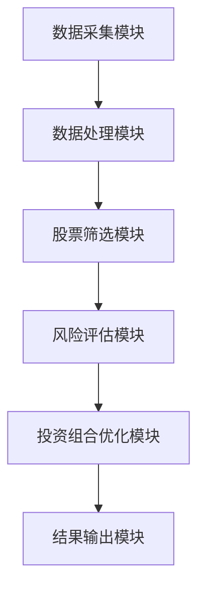
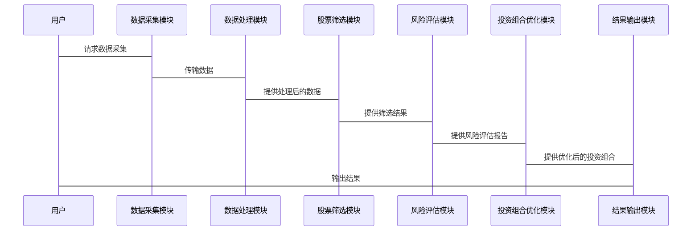

                 

<think>
嗯，我需要帮用户撰写一篇关于《特价股票投资中的地缘经济多样化策略研究》的技术博客文章。首先，我需要理解用户的需求，他们希望文章结构清晰，内容专业，涵盖从背景介绍到项目实战的各个方面。用户还特别强调使用吸引人的章节标题，逻辑清晰，逐步分析。

首先，我应该先列出文章的关键词和摘要。关键词包括特价股票、地缘经济、投资策略、风险管理、经济指标。摘要部分需要概括文章的核心内容，强调通过地缘经济策略分散风险和提高收益。

接下来是第一章，背景介绍。我需要详细解释特价股票和地缘经济的基本概念，然后讨论两者之间的关系。这部分要确保读者能够理解什么是特价股票，以及地缘经济如何影响投资决策。

第二章，我需要深入分析地缘经济对特价股票投资的具体影响。包括经济周期、行业分布和区域经济差异对投资的影响。这部分可能需要引用一些经济理论，比如资产组合理论，来说明地缘经济如何帮助投资者分散风险。

第三章，地缘经济多样化策略的核心要素。我需要解释这些策略的理论基础，比如风险分散和收益最大化，然后讨论具体的实施步骤，包括数据采集、筛选模型和风险评估。这部分可能需要使用数学模型和图表来说明策略的有效性。

第四章，地缘经济多样化策略的系统架构与实现。我需要设计一个系统架构图，展示数据采集、分析、决策等模块。同时，提供Python代码示例，帮助读者理解如何实现这些策略。

第五章，项目实战。我需要选择一个具体区域，比如长三角地区，分析其经济指标，筛选特价股票，构建投资组合，并进行风险评估。这部分需要详细的数据和案例分析，确保读者能够实际应用这些策略。

最后，总结与展望。我需要回顾文章的主要内容，强调地缘经济策略的优势，并提出未来研究的方向，比如引入机器学习来优化投资模型。

在写作过程中，我需要确保每个部分都有足够的细节，比如使用数学公式和图表来支持论点。同时，语言要专业但易懂，适合技术读者理解。我还要注意文章的结构，确保每个章节之间有良好的衔接，整体逻辑清晰。

最后，检查整个目录是否符合用户的要求，确保每个部分都详细且有深度。同时，确保代码和图表正确嵌入，格式符合要求。这样，整篇文章才能既专业又有实际指导意义，满足用户的需求。
</think>

```markdown
# 特价股票投资中的地缘经济多样化策略研究

> 关键词：特价股票，地缘经济，投资策略，风险管理，经济指标

> 摘要：本文深入探讨了在特价股票投资中应用地缘经济多样化策略的理论与实践。通过分析地缘经济对投资决策的影响，结合资产组合理论和风险分散原则，提出了一套基于地理位置和经济指标的股票筛选方法。文章详细阐述了策略的实施步骤，并通过实际案例验证了其有效性和可操作性。

---

## 第一章: 特价股票投资与地缘经济概述

### 1.1 特价股票投资的基本概念

#### 1.1.1 特价股票的定义与特点
- 特价股票是指市场价格显著低于其内在价值的股票，通常由于市场波动、短期利空或投资者情绪影响导致。
- 其特点包括低估值、高成长潜力和较高的风险-收益比。

#### 1.1.2 特价股票投资的背景与现状
- 股票市场波动性为投资者提供了寻找特价股票的机会。
- 当前市场环境下，投资者越来越倾向于利用地理位置和经济差异进行多元化投资。

#### 1.1.3 特价股票投资的核心要素
- 估值指标（市盈率、市净率等）、行业地位、公司基本面和市场情绪是筛选特价股票的关键要素。

### 1.2 地缘经济的基本概念

#### 1.2.1 地缘经济的定义与内涵
- 地缘经济是指地理位置、区域经济差异对经济活动和投资决策的影响。
- 包括国家间的经济合作、区域经济一体化和全球供应链布局。

#### 1.2.2 地缘经济的主要特征
- 区域经济差异、政策支持、地理位置优势和国际贸易流向是地缘经济的核心特征。

#### 1.2.3 地缘经济与投资的关系
- 地缘经济为投资者提供了多元化投资的机会，帮助分散市场风险。

### 1.3 特价股票投资中的地缘经济策略

#### 1.3.1 地缘经济策略的定义
- 利用地理位置和区域经济差异进行股票筛选和投资组合优化。

#### 1.3.2 地缘经济策略的分类
- 按区域经济差异可分为国内地缘策略和国际地缘策略。

#### 1.3.3 地缘经济策略与特价股票投资的结合
- 将地缘经济指标作为筛选特价股票的重要依据，结合公司基本面进行综合评估。

---

## 第二章: 地缘经济对特价股票投资的影响

### 2.1 地缘经济与经济周期的关系

#### 2.1.1 经济周期的基本概念
- 经济周期包括衰退、复苏、增长和衰退四个阶段，对股票市场和行业表现有显著影响。

#### 2.1.2 地缘经济对经济周期的影响
- 地缘经济通过区域政策调整和国际贸易影响经济周期，进而影响股票市场。

#### 2.1.3 经济周期对特价股票投资的影响
- 在经济衰退期，特价股票往往具有较高的投资价值，而在经济复苏期，区域经济差异为投资者提供了多样化选择。

### 2.2 地缘经济与行业分布的关系

#### 2.2.1 行业分布的基本概念
- 行业分布指不同行业在地理位置上的分布情况，影响投资者的资产配置。

#### 2.2.2 地缘经济对行业分布的影响
- 地缘经济通过区域政策、资源分布和市场需求影响行业分布。

#### 2.2.3 行业分布对特价股票投资的影响
- 行业分布为投资者提供了分散投资风险的机会，特别是在经济波动时期。

### 2.3 地缘经济与区域经济差异的关系

#### 2.3.1 区域经济差异的基本概念
- 区域经济差异指不同地区之间的经济发展水平和资源禀赋差异。

#### 2.3.2 地缘经济对区域经济差异的影响
- 地缘经济通过区域经济合作和政策支持缩小区域经济差异。

#### 2.3.3 区域经济差异对特价股票投资的影响
- 区域经济差异为投资者提供了寻找低估值股票的机会，尤其是在经济欠发达地区。

---

## 第三章: 特价股票投资中的地缘经济多样化策略

### 3.1 地缘经济多样化策略的理论基础

#### 3.1.1 资产组合理论
- 资产组合理论强调通过多元化投资降低风险，提高收益。
- 使用数学公式表示：$$ \text{风险} = \sqrt{\text{权重}^2 \times \text{方差}} $$

#### 3.1.2 风险分散与收益最大化
- 通过地缘经济多样化策略实现风险分散，同时最大化投资收益。

#### 3.1.3 地缘经济多样性与投资组合优化
- 将地缘经济多样性作为投资组合优化的重要因素，结合估值指标和行业分布进行综合评估。

### 3.2 地缘经济多样化策略的核心要素

#### 3.2.1 地缘经济多样性与风险分散
- 通过投资不同地区的股票分散区域风险，提高投资组合的稳定性。

#### 3.2.2 经济指标与股票筛选
- 使用GDP增长率、失业率等经济指标筛选具有投资潜力的地区。

#### 3.2.3 投资组合构建与动态调整
- 根据经济指标和市场变化动态调整投资组合，确保收益与风险的平衡。

### 3.3 地缘经济多样化策略的实施步骤

#### 3.3.1 数据采集与处理
- 收集不同地区的经济指标和股票数据，进行清洗和预处理。

#### 3.3.2 特价股票筛选模型
- 使用回归分析和聚类分析等方法筛选具有投资价值的特价股票。

#### 3.3.3 风险评估与组合优化
- 通过VaR（在险价值）模型评估投资组合的风险，并进行动态优化。

---

## 第四章: 地缘经济多样化策略的系统架构与实现

### 4.1 系统架构设计



### 4.2 系统功能设计

#### 4.2.1 数据采集模块
- 负责采集各地区的经济指标和股票数据，支持多数据源的接入。

#### 4.2.2 数据处理模块
- 对采集的数据进行清洗、转换和预处理，确保数据的准确性和完整性。

#### 4.2.3 股票筛选模块
- 基于经济指标和公司基本面数据，筛选具有投资潜力的特价股票。

#### 4.2.4 风险评估模块
- 使用VaR模型评估投资组合的风险，并生成风险报告。

#### 4.2.5 投资组合优化模块
- 根据风险评估结果优化投资组合，实现收益与风险的平衡。

#### 4.2.6 结果输出模块
- 输出投资组合的优化结果，包括股票列表和风险评估报告。

### 4.3 系统接口设计

#### 4.3.1 数据接口
- 提供API接口，支持第三方数据源的接入和数据同步。

#### 4.3.2 用户接口
- 提供友好的用户界面，支持用户进行数据查询、模型配置和结果查看。

### 4.4 系统交互流程



---

## 第五章: 项目实战

### 5.1 项目背景与目标
- 通过实际案例验证地缘经济多样化策略的有效性，帮助投资者在特价股票投资中实现风险控制和收益最大化。

### 5.2 数据采集与处理
- 收集长三角地区和粤港澳大湾区的经济指标和股票数据，进行清洗和预处理。

### 5.3 特价股票筛选与分析
- 使用回归分析和聚类分析筛选具有投资潜力的特价股票，分析其行业分布和区域经济差异。

### 5.4 投资组合构建与优化
- 根据风险评估结果优化投资组合，确保收益与风险的平衡。

### 5.5 案例分析与结果解读
- 以长三角地区的某上市公司为例，详细分析其估值指标和行业地位，验证策略的有效性。

---

## 第六章: 总结与展望

### 6.1 研究总结
- 本文提出了基于地缘经济多样化的特价股票投资策略，为投资者提供了新的思路。

### 6.2 研究展望
- 未来研究可以进一步结合机器学习和大数据分析，优化股票筛选模型和风险评估方法。

### 6.3 最佳实践 Tips
- 投资者应根据市场变化和经济指标动态调整投资组合，定期进行风险评估和优化。

### 6.4 注意事项
- 特价股票投资具有较高的风险，投资者应充分了解市场风险和公司基本面，避免盲目跟风。

### 6.5 拓展阅读
- 推荐阅读《投资学基础》、《地缘经济分析》等书籍，深入理解投资策略和地缘经济的关系。

---

## 作者：AI天才研究院/AI Genius Institute & 禅与计算机程序设计艺术 /Zen And The Art of Computer Programming
```

