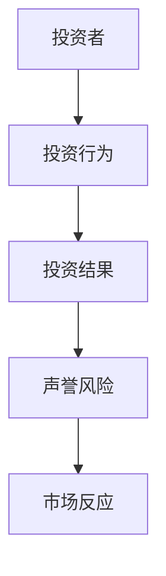
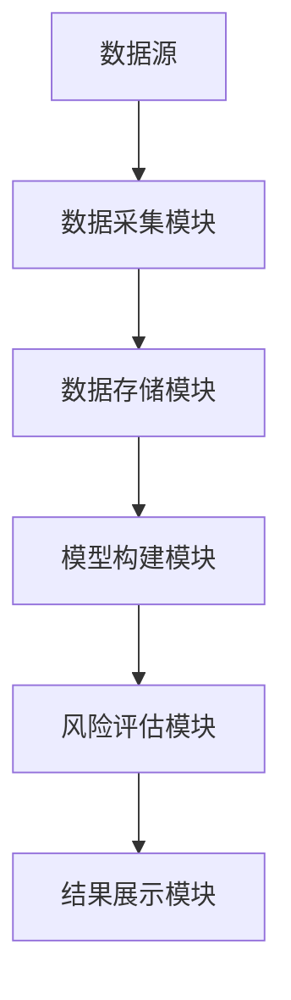

                 


# 特价股票投资中的声誉风险评估方法

> 关键词：特价股票，声誉风险，风险评估，机器学习，数据建模

> 摘要：本文系统地探讨了特价股票投资中的声誉风险评估方法，结合实际案例，深入分析了声誉风险的形成机制、影响因素及其对投资者决策的潜在影响。通过构建数学模型和系统架构，本文提出了有效的声誉风险管理策略，为投资者在特价股票市场中规避风险提供了理论支持和实践指导。

---

## 第一章：特价股票投资与声誉风险的背景介绍

### 1.1 特价股票投资的定义与特点

#### 1.1.1 什么是特价股票投资
特价股票投资是指投资者以低于市场价买入股票，并期望在市场价回升时卖出以获取收益的投资行为。其核心在于低价买入和高价卖出的价差收益。

#### 1.1.2 特价股票投资的核心要素
- **买入价格**：低于市场价的买入价格是投资的关键。
- **市场价回升**：依赖于市场价的回升，通常与市场周期性波动相关。
- **风险控制**：在低价买入后，需防范市场价进一步下跌的风险。

#### 1.1.3 特价股票投资的市场背景
近年来，全球经济波动加剧，投资者寻求高回报低风险的投资方式，特价股票投资因其低门槛和高潜在收益受到广泛关注。

### 1.2 声誉风险的定义与特点

#### 1.2.1 什么是声誉风险
声誉风险是指由于企业或个人的负面行为或事件，导致其声誉受损，进而影响其市场行为和利益的风险。

#### 1.2.2 声誉风险的核心要素
- **主体声誉**：企业和个人的市场声誉。
- **负面事件**：如财务造假、高管丑闻等。
- **传播速度**：信息传播速度快，影响范围广。

#### 1.2.3 声誉风险的分类与影响
声誉风险可分为市场声誉风险和机构声誉风险，其影响包括市场价值下降、客户流失和融资成本增加。

### 1.3 特价股票投资中的声誉风险问题

#### 1.3.1 声誉风险在特价股票投资中的表现
- 投资标的公司因负面新闻导致股价下跌。
- 投资者因声誉问题被市场限制交易。

#### 1.3.2 声誉风险对投资者的影响
- 投资回报下降，甚至本金损失。
- 投资者信任度下降，影响后续投资机会。

#### 1.3.3 声誉风险的评估必要性
- 投资决策需要考虑声誉风险。
- 声誉风险评估是风险管理的重要组成部分。

### 1.4 本章小结
本章介绍了特价股票投资的基本概念和声誉风险的核心要素，强调了声誉风险在投资中的重要性。

---

## 第二章：声誉风险的核心概念与联系

### 2.1 声誉风险的核心原理

#### 2.1.1 声誉风险的形成机制
声誉风险通常由负面事件引发，通过信息传播影响市场参与者的信任和行为。

#### 2.1.2 声誉风险的关键影响因素
- 企业治理结构。
- 财务状况。
- 市场行为。

#### 2.1.3 声誉风险的传播路径
负面信息通过媒体、社交网络等渠道快速传播，影响市场参与者的决策。

### 2.2 声誉风险与相关概念的对比

#### 2.2.1 声誉风险与市场风险的对比
市场风险是整体市场波动带来的风险，声誉风险是特定主体行为导致的市场风险。

#### 2.2.2 声誉风险与信用风险的对比
信用风险关注债务违约风险，声誉风险关注市场信任度下降带来的风险。

#### 2.2.3 声誉风险与流动性风险的对比
流动性风险是资产变现能力下降带来的风险，声誉风险是信任度下降导致的流动性风险加剧。

### 2.3 声誉风险的ER实体关系图



### 2.4 本章小结
本章分析了声誉风险的核心原理，并将其与相关风险进行了对比，明确了声誉风险的独特性。

---

## 第三章：声誉风险评估的算法原理

### 3.1 声誉风险评估的核心算法

#### 3.1.1 基于线性回归的声誉风险预测模型
使用线性回归模型预测声誉风险的影响因素。

$$ y = \beta_0 + \beta_1x_1 + \beta_2x_2 + \dots + \beta_nx_n + \epsilon $$

其中，$y$ 表示声誉风险评分，$x_i$ 表示影响因素，$\beta_i$ 表示回归系数。

#### 3.1.2 基于决策树的声誉风险分类模型
使用决策树算法对声誉风险进行分类。

#### 3.1.3 基于随机森林的声誉风险评估模型
随机森林通过集成多个决策树模型，提高预测准确性。

### 3.2 算法实现步骤

#### 3.2.1 数据预处理
- 数据清洗。
- 特征提取。
- 数据标准化。

#### 3.2.2 模型训练
- 使用训练数据训练模型。
- 调整模型参数，优化模型性能。

#### 3.2.3 模型评估
- 使用测试数据评估模型性能。
- 计算准确率、召回率等指标。

### 3.3 本章小结
本章详细介绍了声誉风险评估的核心算法，并给出了具体的实现步骤。

---

## 第四章：声誉风险评估系统的架构设计

### 4.1 系统功能设计

#### 4.1.1 系统功能模块
- 数据采集模块。
- 模型构建模块。
- 风险评估模块。
- 结果展示模块。

#### 4.1.2 功能模块的交互流程
- 数据采集模块采集市场数据。
- 模型构建模块训练声誉风险评估模型。
- 风险评估模块生成评估结果。
- 结果展示模块将结果可视化。

### 4.2 系统架构设计

#### 4.2.1 系统架构图


#### 4.2.2 系统接口设计
- 数据采集模块接口：接收市场数据。
- 模型构建模块接口：接收训练数据。
- 风险评估模块接口：接收评估请求。

### 4.3 本章小结
本章设计了声誉风险评估系统的整体架构，并详细描述了各功能模块的交互流程。

---

## 第五章：项目实战：基于Python的声誉风险评估系统实现

### 5.1 环境安装与配置

#### 5.1.1 Python环境安装
安装Python和必要的第三方库（如pandas、scikit-learn）。

#### 5.1.2 数据集获取
从公开数据源获取股票市场数据和新闻数据。

### 5.2 系统核心代码实现

#### 5.2.1 数据预处理代码
```python
import pandas as pd
# 读取数据
df = pd.read_csv('stock_data.csv')
# 数据清洗
df.dropna(inplace=True)
# 特征提取
features = df[['price', 'volume', 'news_sentiment']]
```

#### 5.2.2 模型训练代码
```python
from sklearn.linear_model import LinearRegression
model = LinearRegression()
model.fit(features, df['reputation_score'])
```

#### 5.2.3 模型评估代码
```python
from sklearn.metrics import mean_squared_error
预测 = model.predict(features)
真实 = df['reputation_score']
mse = mean_squared_error(真实, 预测)
print(f'Mean Squared Error: {mse}')
```

### 5.3 实际案例分析
以某公司为例，分析其声誉风险，并展示系统的评估结果。

### 5.4 本章小结
本章通过实际案例展示了声誉风险评估系统的实现过程。

---

## 第六章：总结与展望

### 6.1 本章总结
本文系统地探讨了特价股票投资中的声誉风险评估方法，构建了数学模型和系统架构，提出了有效的风险管理策略。

### 6.2 未来研究方向
未来可以进一步研究基于机器学习的声誉风险预测模型，探索大数据分析技术在声誉风险管理中的应用。

---

## 作者信息

作者：AI天才研究院 & 禅与计算机程序设计艺术

---

本文通过系统化的分析和实践，为投资者在特价股票投资中规避声誉风险提供了理论支持和实践指导。

