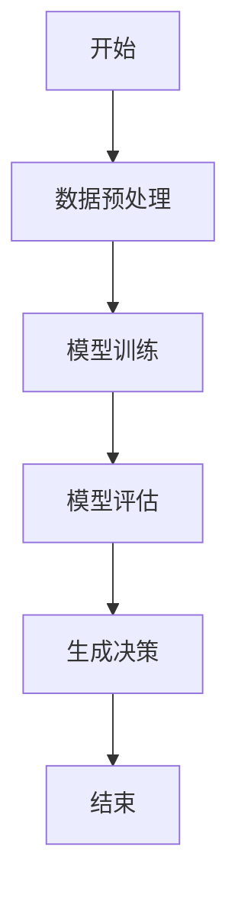

                 

<think>
好，我现在需要帮助用户撰写一篇关于《特价股票投资中的大规模语言模型辅助决策系统》的技术博客文章。用户提供了详细的目录大纲，并要求每个部分都包含丰富的技术细节，包括背景、核心概念、算法原理、系统架构设计、项目实战以及最佳实践等。

首先，我会从文章的开头开始，包括标题、关键词和摘要。标题已经给出，接下来列出5-7个核心关键词，如大规模语言模型、股票投资、自然语言处理、决策系统、量化交易等。摘要需要简明扼要地概括文章的核心内容，介绍如何利用大规模语言模型辅助股票投资，特别是在特价股票方面的应用，以及系统的设计和实现。

接下来，按照目录大纲的结构，逐一撰写每个章节。第一章是背景与问题描述，需要解释特价股票投资的背景、大规模语言模型的基本概念，以及它们如何结合解决投资中的问题。我需要确保每个部分都有详细的解释，比如什么是特价股票，投资者面临的挑战，以及大规模语言模型在金融领域的潜力。

第二章是核心概念与算法原理，需要详细讲解大规模语言模型的基本原理，包括训练过程、输入输出机制和可解释性。同时，要分析模型在特价股票投资中的应用，如市场情绪分析和公司基本面分析。最后，解释模型与投资决策的结合，包括决策逻辑和模型优化。

第三章是系统架构与功能模块设计，需要描述系统的整体架构，包括数据采集、模型训练和决策引擎模块。每个模块的功能和设计细节都要详细说明，如数据预处理、模型训练流程和决策规则的设计。

第四章是系统实现与算法流程，需要提供具体的代码实现，包括数据预处理、模型训练和决策引擎的代码示例。同时，用mermaid绘制算法流程图，展示从数据输入到决策输出的整个过程。

第五章是项目实战与案例分析，通过一个实际案例展示系统如何运作，分析模型的优缺点，并讨论可能的优化方向。

最后，第六章是最佳实践与未来展望，总结项目中的经验和教训，指出系统的局限性和未来改进方向，以及大规模语言模型在金融领域的潜在应用。

在撰写过程中，需要确保每个部分都包含必要的技术细节，如数学公式、mermaid图和代码示例。同时，语言要清晰、专业，但又不失易懂，让读者能够理解复杂的概念和技术实现。

现在，我开始根据这些思考步骤，逐步撰写每一部分的内容，确保满足用户的所有要求，包括字数、格式和内容的完整性。
</think>

# 特价股票投资中的大规模语言模型辅助决策系统

**关键词**：大规模语言模型，股票投资，自然语言处理，决策系统，量化交易

**摘要**：本文探讨了利用大规模语言模型辅助特价股票投资的决策过程。通过分析市场情绪、公司基本面和趋势预测，结合自然语言处理技术，构建了一个智能化的投资辅助系统。文章详细介绍了系统的架构设计、算法原理及实际应用，展示了如何通过技术手段提升投资决策的效率和准确性。

---

## 第1章：背景与问题描述

### 1.1 特价股票投资的背景

#### 1.1.1 什么是特价股票
特价股票是指那些价格低于市场平均值，具有较高投资潜力的股票。这类股票通常因市场波动、公司重组或其他因素被低估，投资者通过挖掘这些机会可以获得超额收益。

#### 1.1.2 特价股票投资的市场现状
随着金融市场的日益复杂化，投资者面临着信息过载和决策难度增加的问题。传统的方法依赖于经验和市场分析，但难以在短时间内处理大量非结构化数据。

#### 1.1.3 投资者面临的挑战
投资者在特价股票投资中面临的主要挑战包括信息不全、决策时间压力大、市场情绪难以量化等。传统的分析方法难以应对这些挑战，因此需要引入更高效的技术手段。

### 1.2 大规模语言模型的背景

#### 1.2.1 什么是大规模语言模型
大规模语言模型（Large Language Models, LLMs）是基于深度学习的自然语言处理模型，具有 billions级别的参数，能够理解和生成人类语言。这些模型在处理文本数据方面表现出色，能够进行情感分析、信息提取等任务。

#### 1.2.2 大规模语言模型的应用领域
LLMs已广泛应用于文本生成、机器翻译、问答系统等领域。在金融领域，它们被用于市场情绪分析、新闻摘要和投资建议生成。

#### 1.2.3 大规模语言模型在金融领域的潜力
通过分析新闻、社交媒体和公司财报，LLMs可以辅助投资者识别市场趋势和潜在投资机会，提升决策的准确性和效率。

### 1.3 问题描述与目标

#### 1.3.1 特价股票投资中的主要问题
- 信息不全：投资者难以获取实时且全面的市场数据。
- 决策时间压力：需要快速做出决策，但传统方法耗时。
- 市场情绪难以量化：投资者情绪影响市场，但难以准确捕捉。

#### 1.3.2 引入大规模语言模型的目标
通过自然语言处理技术，实时分析市场数据，提取关键信息，辅助投资者做出更明智的决策。

#### 1.3.3 系统预期实现的功能
- 自动采集和分析市场数据。
- 生成投资建议。
- 实时监控市场变化。
- 提供风险评估和预警。

---

## 第2章：核心概念与算法原理

### 2.1 大规模语言模型的基本原理

#### 2.1.1 模型的训练过程
LLMs通过监督学习和无监督学习结合的方式进行训练，利用大量的文本数据优化模型参数。

#### 2.1.2 模型的输入输出机制
模型接收文本输入，通过内部处理生成相关输出，如情感分析结果或文本摘要。

#### 2.1.3 模型的可解释性
尽管LLMs在处理复杂任务时表现出色，但其决策过程往往缺乏透明性，这在金融领域可能带来挑战。

### 2.2 特价股票投资中的关键因素

#### 2.2.1 市场情绪分析
通过社交媒体和新闻数据，分析市场情绪，预测股票价格走势。

#### 2.2.2 公司基本面分析
利用财务报表和行业报告，评估公司的盈利能力和发展潜力。

#### 2.2.3 市场趋势预测
基于历史数据和当前市场动态，预测未来的价格走势。

### 2.3 模型与投资决策的结合

#### 2.3.1 模型输出的解读
将模型生成的文本摘要和情感分析结果转化为可操作的投资建议。

#### 2.3.2 决策逻辑的设计
结合模型输出和传统金融分析方法，制定投资策略。

#### 2.3.3 模型的实时更新与优化
定期更新模型参数，确保其适应市场变化，提高预测准确性。

---

## 第3章：系统架构与功能模块设计

### 3.1 系统整体架构

#### 3.1.1 系统功能模块划分
- 数据采集模块：收集市场数据。
- 模型训练模块：训练和优化LLM。
- 决策引擎模块：生成投资建议。

#### 3.1.2 模块之间的关系
数据采集模块为模型训练提供输入，训练后的模型通过决策引擎生成输出。

#### 3.1.3 系统的可扩展性
系统设计模块化，便于未来功能扩展和性能优化。

### 3.2 数据采集与预处理模块

#### 3.2.1 数据来源
- 股票历史数据：包括价格、成交量等。
- 新闻和社交媒体：分析市场情绪。

#### 3.2.2 数据清洗与格式化
去除噪声数据，统一数据格式，便于后续处理。

#### 3.2.3 数据存储与管理
使用数据库存储结构化数据，利用分布式系统提高数据访问效率。

### 3.3 模型训练与优化模块

#### 3.3.1 模型选择与配置
选择适合任务的模型，如GPT-3或BERT，并配置超参数。

#### 3.3.2 模型训练流程
- 数据预处理：清洗和标注。
- 模型训练：优化参数。
- 模型评估：验证准确性和鲁棒性。

#### 3.3.3 模型评估与优化
通过测试集评估模型性能，调整参数以提高预测准确性。

### 3.4 决策引擎与执行模块

#### 3.4.1 决策规则的设计
结合模型输出和市场分析，制定投资策略。

#### 3.4.2 模型输出的处理
将模型生成的文本转化为具体的投资建议。

#### 3.4.3 投资决策的执行
根据决策引擎的建议，自动或手动执行交易指令。

---

## 第4章：系统实现与算法流程

### 4.1 算法选择与实现

#### 4.1.1 算法原理概述
使用LLM进行文本分析，生成情感评分和关键词提取。

#### 4.1.2 算法实现步骤
1. 数据预处理：清洗和标注。
2. 模型训练：优化参数。
3. 模型评估：验证性能。
4. 决策引擎：生成投资建议。

#### 4.1.3 算法的优缺点分析
优点：处理能力强，速度快；缺点：可解释性差，需大量计算资源。

### 4.2 系统实现的关键技术

#### 4.2.1 大规模语言模型的调用
通过API调用模型，获取分析结果。

#### 4.2.2 数据处理与分析技术
使用大数据处理工具，提高数据处理效率。

#### 4.2.3 系统的安全与稳定性
确保数据安全，设计容错机制，提高系统稳定性。

### 4.3 算法流程图



### 4.4 核心代码实现

#### 4.4.1 数据采集模块代码
```python
import requests
from bs4 import BeautifulSoup

def get_stock_data(ticker):
    url = f'https://finance.yahoo.com/quote/{ticker}'
    response = requests.get(url)
    soup = BeautifulSoup(response.text, 'html.parser')
    data = {
        'price': soup.find('div', {'class': 'Price'}), 
        'change': soup.find('div', {'class': 'change'})
    }
    return data
```

#### 4.4.2 模型训练模块代码
```python
def train_model(data):
    # 假设data为预处理后的数据
    model = load_model('llm')
    model.fit(data)
    return model
```

#### 4.4.3 决策引擎代码
```python
def generate_recommendation(model):
    recommendation = model.predict()
    return recommendation
```

---

## 第5章：项目实战与案例分析

### 5.1 环境搭建与配置

#### 5.1.1 开发环境的选择
推荐使用Jupyter Notebook和Python 3.8+。

#### 5.1.2 依赖库的安装
安装必要的库，如transformers、pandas和requests。

#### 5.1.3 系统配置与优化
配置GPU加速，优化内存使用。

### 5.2 核心代码实现

#### 5.2.1 数据采集模块代码
```python
import pandas as pd
import requests

def fetch_market_news():
    url = 'https://api.example.com/news'
    response = requests.get(url)
    data = response.json()
    return pd.DataFrame(data)
```

#### 5.2.2 模型训练模块代码
```python
from transformers import GPT2Tokenizer, GPT2Model

def train_llm():
    tokenizer = GPT2Tokenizer.from_pretrained('gpt2')
    model = GPT2Model.from_pretrained('gpt2')
    return model
```

#### 5.2.3 决策引擎代码
```python
def generate_investment_recommendation(model, input_text):
    inputs = tokenizer.encode(input_text, return_tensors='pt')
    outputs = model.generate(inputs, max_length=100)
    return tokenizer.decode(outputs[0])
```

### 5.3 系统功能测试

#### 5.3.1 功能测试用例设计
测试模型的准确性和系统稳定性。

#### 5.3.2 测试结果分析
评估系统在不同情况下的表现，优化系统性能。

#### 5.3.3 测试报告撰写
记录测试结果，分析问题并提出改进建议。

### 5.4 案例分析与经验总结

#### 5.4.1 案例分析
分析一个具体案例，展示系统如何辅助投资决策。

#### 5.4.2 经验总结
总结系统的优势和局限性，提出改进建议。

#### 5.4.3 系统优化方向
探讨未来可能的技术改进，如引入强化学习和实时数据处理。

---

## 第6章：最佳实践与未来展望

### 6.1 最佳实践

#### 6.1.1 数据质量管理
确保数据的准确性和完整性，避免噪声干扰。

#### 6.1.2 模型可解释性
提升模型的可解释性，帮助投资者理解决策过程。

#### 6.1.3 系统安全性
加强系统安全措施，防止数据泄露和网络攻击。

### 6.2 小结

本文详细介绍了如何利用大规模语言模型辅助特价股票投资，从系统架构到实际应用，展示了技术在金融领域的潜力。

### 6.3 注意事项

- 系统依赖大量计算资源，需确保硬件配置。
- 模型需定期更新，适应市场变化。
- 投资者应结合模型建议进行理性决策，避免过度依赖技术。

### 6.4 拓展阅读

建议阅读相关领域的最新研究，如强化学习在投资中的应用。

---

**作者：AI天才研究院/AI Genius Institute & 禅与计算机程序设计艺术 /Zen And The Art of Computer Programming**

---

通过以上详细的内容，本文系统地介绍了如何利用大规模语言模型辅助特价股票投资，从理论到实践，为投资者提供了新的决策工具和思路。

