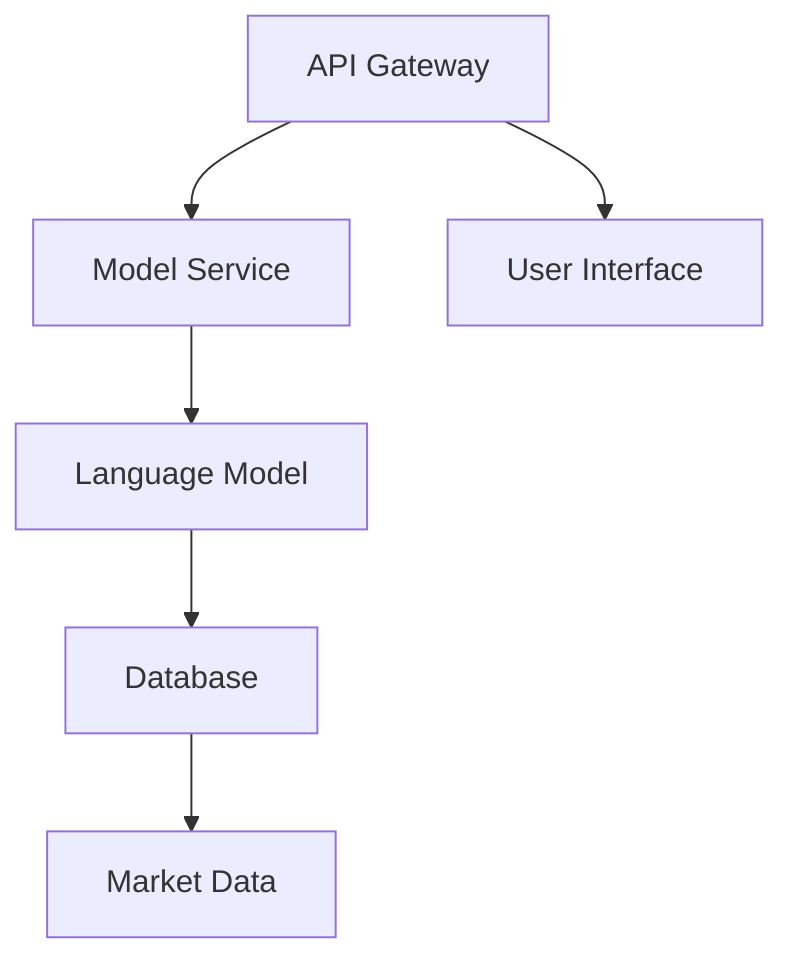

                 


# 特价股票投资中的大规模语言模型辅助情景分析系统

## 关键词：特价股票投资，大规模语言模型，情景分析系统，股票市场分析，AI投资辅助

## 摘要：  
本文探讨了如何利用大规模语言模型辅助特价股票投资的情景分析系统。通过分析特价股票投资的特点和挑战，结合大规模语言模型的优势，提出了一种基于语言模型的情景分析方法，旨在提升投资决策的准确性和效率。文章详细介绍了系统的架构设计、算法原理、数学模型以及实现步骤，为投资者提供了一种创新的解决方案。

---

## 第一部分: 特价股票投资与大规模语言模型概述

### 1.1 特价股票投资的背景与特点

#### 1.1.1 特价股票投资的定义与背景
特价股票投资是指在特定市场条件下，投资者利用价格波动、市场情绪等因素，寻找被低估的股票进行投资。这种投资方式通常需要对市场数据、公司基本面和市场趋势有深刻的理解。随着市场波动加剧，投资者对实时分析和决策支持的需求日益增加。

#### 1.1.2 特价股票投资的特点与挑战
- **特点**：  
  - 数据量大：涉及股票价格、市场新闻、公司财报等多维度数据。  
  - 市场波动性高：突发事件（如疫情、经济政策变化）对股价影响显著。  
  - 需要实时分析：投资者需要快速响应市场变化。  

- **挑战**：  
  - 数据复杂性高：如何从海量数据中提取有效信息？  
  - 市场情绪难以量化：如何准确捕捉投资者情绪？  
  - 决策风险高：如何降低误判风险？  

#### 1.1.3 大规模语言模型在投资中的潜力
大规模语言模型（如GPT）通过处理海量文本数据，能够识别市场情绪、预测趋势，并辅助投资者做出决策。其优势在于：  
1. 能够分析非结构化数据（如新闻、社交媒体评论），提取隐含信息。  
2. 可以实时更新市场动态，提供动态分析支持。  
3. 通过生成式模型，提供个性化投资建议。  

---

### 1.2 大规模语言模型的定义与特点

#### 1.2.1 大规模语言模型的定义
大规模语言模型是一种基于深度学习的自然语言处理模型，通过预训练和微调，能够理解和生成人类语言。其核心在于对上下文的理解和生成能力。

#### 1.2.2 大规模语言模型的核心特点
1. **大规模训练**：基于海量数据的预训练，模型具备广泛的知识覆盖。  
2. **生成能力**：能够生成连贯的文本，适用于多种任务（如文本摘要、预测）。  
3. **可微调性**：通过微调，模型可以适应特定领域（如金融）的任务需求。  
4. **实时性**：能够快速处理实时数据，提供动态分析支持。  

#### 1.2.3 大规模语言模型与传统数据分析的区别
| **特点**         | **传统数据分析**                     | **大规模语言模型**                     |
|------------------|------------------------------------|----------------------------------------|
| 数据处理能力     | 善于处理结构化数据                   | 能够处理非结构化数据（如文本）           |
| 任务灵活性       | 适用于固定模式的分析任务             | 适用于多种任务（如预测、生成）           |
| 决策支持方式     | 提供统计分析结果                     | 提供生成式建议和预测                     |
| 实时性           | 较低                                | 较高                                    |

---

### 1.3 本章小结

#### 1.3.1 特价股票投资的核心问题
- 如何快速分析市场数据？  
- 如何捕捉市场情绪变化？  
- 如何降低投资决策风险？  

#### 1.3.2 大规模语言模型在投资中的应用前景
通过分析市场文本数据，大规模语言模型能够辅助投资者做出更明智的决策，尤其是在市场波动剧烈的情况下。

---

## 第二部分: 大规模语言模型辅助情景分析的核心概念

### 2.1 大规模语言模型辅助情景分析的背景

#### 2.1.1 情景分析的定义与作用
情景分析是一种通过模拟不同市场条件下的投资结果，帮助投资者制定策略的方法。其作用在于：  
1. 评估投资组合在不同市场环境下的表现。  
2. 识别潜在风险并制定应对策略。  

#### 2.1.2 大规模语言模型在情景分析中的应用
大规模语言模型可以通过分析新闻、社交媒体等文本数据，生成多种市场情景，并预测其对股价的影响。例如：  
- 预测疫情对某行业的影响。  
- 分析政策变化对市场情绪的影响。  

#### 2.1.3 大规模语言模型辅助情景分析的核心要素
| **要素**         | **描述**                           |
|------------------|----------------------------------|
| 数据来源         | 新闻、社交媒体、公司财报等         |
| 模型能力         | 文本生成、情感分析、预测能力       |
| 交互方式         | 用户输入情景，模型生成分析结果     |

---

### 2.2 大规模语言模型与情景分析的关系

#### 2.2.1 大规模语言模型在情景分析中的优势
1. **多维度分析**：能够同时考虑市场、行业、公司等多个维度。  
2. **实时更新**：能够快速响应市场变化，提供实时分析。  
3. **个性化建议**：根据用户需求生成定制化分析结果。  

#### 2.2.2 大规模语言模型与情景分析的结合方式
1. **文本生成**：根据用户输入生成市场情景描述。  
2. **情感分析**：分析市场情绪，辅助情景判断。  
3. **预测模型**：基于情景预测股价变化。  

#### 2.2.3 大规模语言模型在情景分析中的潜在问题
1. **数据偏差**：模型可能受到训练数据的限制。  
2. **预测准确性**：市场复杂性可能导致预测误差。  
3. **计算成本**：大规模模型的计算资源需求较高。  

---

### 2.3 本章小结

#### 2.3.1 大规模语言模型辅助情景分析的核心概念
- 情景分析的核心是模拟不同市场条件下的投资结果。  
- 大规模语言模型通过分析文本数据，提供情景生成和预测支持。  

#### 2.3.2 未来发展趋势与挑战
- 技术挑战：如何提高模型的预测准确性？  
- 数据挑战：如何获取高质量的市场数据？  
- 应用挑战：如何将模型应用于实际投资决策？  

---

## 第三部分: 大规模语言模型辅助情景分析的算法原理

### 3.1 大规模语言模型的训练与微调

#### 3.1.1 预训练过程
1. **目标**：通过大量通用文本数据的预训练，使模型具备基本的语言理解能力。  
2. **过程**：  
   - 使用大规模文本数据（如书籍、网页）进行无监督学习。  
   - 采用自监督任务（如预测下一个词）进行训练。  

#### 3.1.2 微调过程
1. **目标**：将通用模型调整为适用于特定任务（如股票分析）。  
2. **过程**：  
   - 使用特定领域的文本数据（如财经新闻、公司财报）进行微调。  
   - 采用有监督学习，优化模型在特定任务上的表现。  

#### 3.1.3 微调策略的优劣分析
| **策略**         | **优点**                           | **缺点**                           |
|------------------|----------------------------------|------------------------------------|
| 数据增强         | 提高模型泛化能力                   | 需要额外的数据处理                 |
| 小样本微调       | 适用于数据量有限的情况             | 效果可能不如全样本微调             |

---

### 3.2 生成式模型的原理与实现

#### 3.2.1 生成式模型的原理
1. **目标**：根据输入生成相关文本（如市场情景描述）。  
2. **实现步骤**：  
   - 输入市场相关文本（如“疫情期间对航空业的影响”）。  
   - 模型生成详细的情景分析文本。  

#### 3.2.2 生成式模型的数学模型
1. **损失函数**：交叉熵损失函数，用于衡量预测概率与真实概率的差异。  
   $$ L = -\sum_{i=1}^{n} y_i \log p(y_i) $$  
2. **生成概率**：模型生成文本的概率分布。  
   $$ P(y|x) = \text{模型生成的概率分布} $$  

#### 3.2.3 Python代码示例
```python
import torch
import torch.nn as nn

# 定义生成式模型
class Generator(nn.Module):
    def __init__(self, vocab_size, embedding_dim, hidden_size):
        super(Generator, self).__init__()
        self.embedding = nn.Embedding(vocab_size, embedding_dim)
        self.lstm = nn.LSTM(embedding_dim, hidden_size, batch_first=True)
        self.fc = nn.Linear(hidden_size, vocab_size)

    def forward(self, input, hidden):
        embed = self.embedding(input)
        output, hidden = self.lstm(embed, hidden)
        output = self.fc(output.view(-1, output.size(2)))
        return output, hidden

# 初始化模型
vocab_size = 10000
embedding_dim = 256
hidden_size = 512
generator = Generator(vocab_size, embedding_dim, hidden_size)

# 定义损失函数
criterion = nn.CrossEntropyLoss()
```

---

### 3.3 本章小结

#### 3.3.1 大规模语言模型的训练与微调
- 预训练使模型具备基本的语言理解能力。  
- 微调使模型适应特定任务需求。  

#### 3.3.2 生成式模型的实现与应用
- 生成式模型能够根据输入生成相关文本，适用于市场情景分析。  

---

## 第四部分: 大规模语言模型辅助情景分析的数学模型

### 4.1 情景分析的数学模型

#### 4.1.1 情景分析的定义与分类
1. **定义**：情景分析是通过模拟不同市场条件下的投资结果，评估投资组合的风险和收益。  
2. **分类**：  
   - 基准情景：当前市场状态。  
   - 最佳情景：市场表现最优的情况。  
   - 最坏情景：市场表现最差的情况。  

#### 4.1.2 情景分析的数学模型
1. **概率模型**：  
   $$ P(s) = \text{情景 } s \text{ 的概率} $$  
2. **收益模型**：  
   $$ R(s) = \text{情景 } s \text{ 下的投资收益} $$  

#### 4.1.3 情景分析的实现步骤
1. **定义情景**：明确需要分析的市场情景。  
2. **计算概率**：根据市场数据，计算各情景的概率。  
3. **预测收益**：根据情景，预测投资收益。  

---

### 4.2 语言模型在情景分析中的应用

#### 4.2.1 语言模型的概率计算
1. **目标**：根据市场文本数据，计算情景的概率。  
2. **公式**：  
   $$ P(s) = \prod_{i=1}^{n} P(w_i | s) $$  
   其中，\( w_i \) 是文本中的单词，\( s \) 是情景。  

#### 4.2.2 语言模型的生成与预测
1. **目标**：根据输入生成情景描述。  
2. **公式**：  
   $$ P(w | s) = \text{模型生成的概率分布} $$  

---

### 4.3 本章小结

#### 4.3.1 情景分析的数学模型
- 概率模型和收益模型是情景分析的核心工具。  

#### 4.3.2 语言模型在情景分析中的应用
- 语言模型通过概率计算和生成，辅助情景分析。  

---

## 第五部分: 大规模语言模型辅助情景分析的系统分析与架构设计

### 5.1 问题场景介绍

#### 5.1.1 问题背景
投资者需要在复杂市场环境下，快速分析市场数据，制定投资策略。  

#### 5.1.2 问题描述
如何利用大规模语言模型，辅助投资者进行情景分析，优化投资决策？  

#### 5.1.3 解决方案
构建一个基于大规模语言模型的情景分析系统，提供实时市场分析和投资建议。  

---

### 5.2 系统功能设计

#### 5.2.1 领域模型设计
1. **核心实体**：  
   - 投资者：用户角色。  
   - 市场数据：股票价格、新闻、财报等。  
   - 情景分析：生成的情景描述和预测结果。  

2. **关系模型**：  
   - 投资者输入需求，系统生成情景分析。  

   ```mermaid
   graph TD
   A[Investor] --> B[Market Data]
   B --> C[Scenario Analysis]
   C --> D[Investment Recommendations]
   ```

---

### 5.3 系统架构设计

#### 5.3.1 系统架构图


#### 5.3.2 系统接口设计
1. **API接口**：  
   - 输入：投资者需求（如“分析疫情期间对航空业的影响”）。  
   - 输出：情景分析结果（如“航空业可能面临较大的下行压力”）。  

2. **数据库接口**：  
   - 输入：市场数据（如股票价格、新闻）。  
   - 输出：数据查询结果。  

---

### 5.4 本章小结

#### 5.4.1 系统功能设计
- 系统通过分析市场数据，生成情景分析结果。  

#### 5.4.2 系统架构设计
- 分层架构：API Gateway、Model Service、Language Model、Database。  

---

## 第六部分: 大规模语言模型辅助情景分析的项目实战

### 6.1 环境安装与配置

#### 6.1.1 安装Python环境
```bash
python --version
pip install --upgrade pip
```

#### 6.1.2 安装依赖库
```bash
pip install torch transformers
```

---

### 6.2 系统核心实现

#### 6.2.1 核心代码实现
```python
from transformers import GPT2LMHeadModel, GPT2Tokenizer

# 初始化模型
model_name = "gpt2"
tokenizer = GPT2Tokenizer.from_pretrained(model_name)
model = GPT2LMHeadModel.from_pretrained(model_name)

# 定义生成函数
def generate_scenario(prefix):
    inputs = tokenizer(prefix, return_tensors="np")
    outputs = model.generate(inputs.input_ids, max_length=100)
    scenario = tokenizer.decode(outputs[0], skip_special_tokens=True)
    return scenario

# 示例生成
prefix = "Analyze the impact of COVID-19 on the airline industry:"
print(generate_scenario(prefix))
```

#### 6.2.2 代码解读
- 使用GPT-2模型进行文本生成。  
- 通过输入情景前缀，生成详细的情景描述。  

---

### 6.3 实际案例分析

#### 6.3.1 案例背景
分析疫情期间对航空业的影响。  

#### 6.3.2 案例分析
1. **输入**：  
   ```python
   prefix = "Analyze the impact of COVID-19 on the airline industry:"
   ```  
2. **输出**：  
   ```python
   The airline industry is expected to face significant challenges due to the COVID-19 pandemic. Passenger demand has dropped sharply, leading to reduced revenue. Many airlines are cutting costs and seeking government aid. The industry is likely to recover slowly, but profitability will remain low in the near term.
   ```

---

### 6.4 本章小结

#### 6.4.1 项目实战总结
- 通过Python代码实现大规模语言模型的情景分析。  
- 提供了实际案例，展示了系统的应用价值。  

---

## 第七部分: 最佳实践与总结

### 7.1 最佳实践 tips

#### 7.1.1 数据处理建议
- 确保数据质量，避免噪声干扰。  
- 处理多语言数据时，注意模型的适应性。  

#### 7.1.2 模型优化建议
- 根据具体任务调整模型参数。  
- 使用小样本数据进行微调时，注意数据增强。  

#### 7.1.3 系统部署建议
- 部署时考虑计算资源限制。  
- 优化API接口，提高响应速度。  

---

### 7.2 小结

#### 7.2.1 本文总结
- 大规模语言模型在特价股票投资中的应用前景广阔。  
- 情景分析系统能够有效辅助投资者做出决策。  

#### 7.2.2 未来展望
- 更高效的模型优化方法。  
- 更多领域（如国际市场）的应用探索。  

---

### 7.3 注意事项

#### 7.3.1 数据隐私
- 处理市场数据时，需遵守相关法律法规。  
- 注意数据隐私保护。  

#### 7.3.2 模型风险管理
- 由于模型可能存在偏差，需结合人工判断。  
- 定期更新模型，避免过时。  

---

### 7.4 拓展阅读

#### 7.4.1 推荐书籍
- 《Deep Learning》——Ian Goodfellow  
- 《Python机器学习》——Andreas Müller  

#### 7.4.2 推荐博客与资源
- [Hugging Face官方文档](https://huggingface.co/transformers)  
- [Kaggle金融数据分析竞赛](https://www.kaggle.com/competitions)  

---

## 作者：AI天才研究院  
联系邮箱：contact@aitianjiayanju.com  

---

**本文作者：AI天才研究院（AI Genius Institute）**

