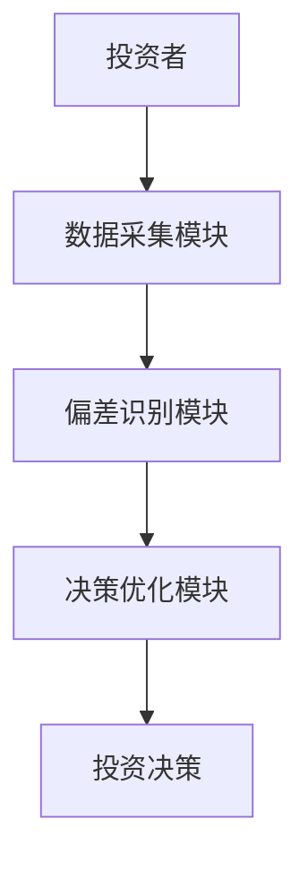
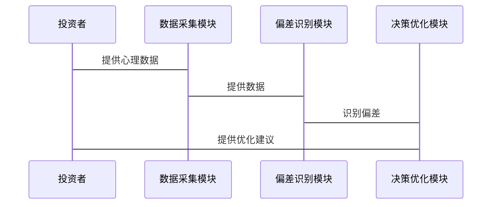

                 


# 特价股票投资中的心理偏差和如何克服

> 关键词：特价股票、心理偏差、理性决策、投资策略、系统分析

> 摘要：本文深入探讨了特价股票投资中常见的心理偏差及其对投资决策的影响。通过分析确认偏差、损失厌恶等偏差的内在机制，提出构建理性决策框架、制定投资策略等解决方案，并结合实际案例，展示了如何克服心理偏差，提升投资决策的质量。

---

# 第一章：特价股票投资的背景与特点

## 1.1 特价股票的定义与特点

### 1.1.1 什么是特价股票
特价股票指的是价格相对较低的股票，通常被认为具有较高的投资价值。这些股票可能来自业绩不佳、市场波动或公司转型等背景。投资者认为这些股票被市场低估，具有较大的上涨潜力。

### 1.1.2 特价股票的投资价值
特价股票的投资价值主要体现在其低估值和潜在的上涨空间。投资者通常通过分析市盈率、市净率等指标，寻找那些价格低于内在价值的股票。然而，特价股票也伴随着较高的风险，包括公司基本面恶化、市场流动性不足等。

### 1.1.3 特价股票的市场定位
特价股票在市场中通常被归类为价值股，与成长股、蓝筹股等其他类型的股票不同。投资者在选择特价股票时，需要考虑市场整体走势、行业周期以及公司的财务状况等因素。

## 1.2 投资者心理偏差的背景

### 1.2.1 投资者的心理特征
投资者在面对特价股票时，往往容易受到贪婪和恐惧情绪的影响。贪婪可能导致投资者过度买入，而恐惧则可能导致错失投资机会或过度卖出。

### 1.2.2 特价股票投资中的常见心理偏差
在特价股票投资中，常见的心理偏差包括确认偏差、损失厌恶、从众心理和过度自信等。这些偏差会导致投资者做出非理性的决策，影响投资结果。

### 1.2.3 心理偏差对投资决策的影响
心理偏差会导致投资者在分析股票时过于乐观或悲观，忽视重要的风险因素。例如，确认偏差使得投资者倾向于寻找支持自己观点的信息，而忽略反面证据，从而做出错误的投资决策。

---

# 第二章：心理偏差的分类与影响

## 2.1 常见心理偏差的分类

### 2.1.1 确认偏差
确认偏差是指投资者倾向于寻找与自己已有观点一致的信息，而忽略相反的证据。这种偏差可能导致投资者忽视特价股票的真实风险，从而做出错误的投资决策。

### 2.1.2 损失厌恶
损失厌恶是指投资者对损失的厌恶程度远高于对收益的追求。在特价股票投资中，投资者可能因为担心亏损而错过投资机会，或者在亏损后急于止损，导致更大的损失。

### 2.1.3 从众心理
从众心理是指投资者盲目跟随市场趋势或他人的决策，而不考虑自己的分析和判断。这种心理偏差可能导致投资者在市场恐慌时盲目卖出，或者在市场狂热时盲目买入。

### 2.1.4 过度自信
过度自信是指投资者对自己分析的过度信任，导致高估自己的判断能力。在特价股票投资中，过度自信的投资者可能会忽视市场的复杂性和不确定性，从而做出错误的决策。

## 2.2 心理偏差对投资决策的具体影响

### 2.2.1 错误判断的形成
心理偏差会导致投资者在分析股票时出现错误判断。例如，确认偏差可能导致投资者只关注正面信息，而忽视负面信息，从而高估股票的价值。

### 2.2.2 过度交易的风险
心理偏差可能导致投资者频繁买卖股票，从而增加交易成本，并降低投资收益。例如，从众心理可能导致投资者在市场波动时频繁调整投资组合，从而增加风险。

### 2.2.3 投资决策的非理性化
心理偏差会导致投资决策的非理性化。例如，损失厌恶可能导致投资者在亏损时急于卖出，而忽视了长期投资的价值。

---

# 第三章：心理偏差的内在机制

## 3.1 心理偏差的形成原因

### 3.1.1 认知偏差的来源
认知偏差的形成与人类大脑的信息处理方式有关。大脑在处理信息时，会根据已有经验和知识进行简化和归纳，从而导致认知偏差。例如，确认偏差是因为大脑倾向于寻找支持已有观点的信息。

### 3.1.2 情绪波动的影响
情绪波动也是心理偏差的重要影响因素。投资者在面对市场波动时，容易受到贪婪和恐惧情绪的支配，从而做出非理性的决策。

### 3.1.3 社会环境的作用
社会环境，如市场趋势、他人的行为等，也会影响投资者的心理偏差。例如，从众心理是由于投资者受到市场氛围的影响，而忽视了自己的分析和判断。

## 3.2 心理偏差与投资行为的关系

### 3.2.1 投资者心理与市场行为
投资者的心理偏差会影响市场行为。例如，确认偏差可能导致投资者只关注支持自己观点的信息，从而影响市场的信息不对称。

### 3.2.2 心理偏差对市场定价的影响
心理偏差可能导致股票价格的偏离其实际价值。例如，从众心理可能导致市场出现泡沫，而损失厌恶可能导致市场出现恐慌性抛售。

### 3.2.3 投资者决策的非理性特征
心理偏差导致投资者决策的非理性化。例如，过度自信可能导致投资者高估自己的判断能力，从而做出错误的投资决策。

---

# 第四章：克服心理偏差的方法与策略

## 4.1 理性决策框架的构建

### 4.1.1 理性决策的基本原则
理性决策需要基于充分的信息和客观的分析，避免情绪和偏见的干扰。投资者需要明确自己的投资目标、风险承受能力和投资期限，制定合理的投资策略。

### 4.1.2 理性决策在特价股票投资中的应用
在特价股票投资中，理性决策需要投资者在分析股票时，既关注正面信息，也关注负面信息，全面评估股票的价值和风险。投资者可以通过制定详细的分析框架和决策流程，减少心理偏差的影响。

## 4.2 投资策略的制定

### 4.2.1 投资策略的核心要素
投资策略的核心要素包括投资目标、资产配置、风险管理和绩效评估。投资者需要根据自身的风险偏好和市场环境，制定合理的投资策略。

### 4.2.2 特价股票投资中的风险管理
在特价股票投资中，风险管理尤为重要。投资者需要设定止损点，避免过度亏损。同时，投资者可以通过分散投资，降低单一股票的风险。

## 4.3 情绪管理与自我反思

### 4.3.1 情绪管理的重要性
情绪管理是克服心理偏差的关键。投资者需要学会控制贪婪和恐惧情绪，避免做出冲动的决策。

### 4.3.2 自我反思与改进
投资者需要定期反思自己的投资行为，识别和纠正心理偏差。通过不断学习和总结，投资者可以逐步提高自己的投资能力。

---

# 第五章：系统分析与架构设计方案

## 5.1 问题场景介绍
特价股票投资中的心理偏差是一个复杂的问题，需要通过系统的分析和设计来解决。投资者需要构建一个能够识别和克服心理偏差的系统，以提升投资决策的质量。

## 5.2 系统功能设计

### 5.2.1 领域模型设计
领域模型是系统设计的核心，需要涵盖投资者心理偏差的识别、分析和克服。领域模型包括以下几个部分：
1. **数据采集模块**：采集投资者的心理数据和市场数据。
2. **偏差识别模块**：通过分析投资者的行为和决策，识别心理偏差。
3. **决策优化模块**：根据识别的偏差，提供优化的决策建议。

## 5.3 系统架构设计

### 5.3.1 系统架构图
以下是系统架构的Mermaid图：



### 5.3.2 关键模块设计
1. **数据采集模块**：负责采集投资者的心理数据和市场数据，包括投资者的交易记录、情绪指标等。
2. **偏差识别模块**：通过分析投资者的行为数据和情绪指标，识别常见的心理偏差，如确认偏差、损失厌恶等。
3. **决策优化模块**：根据识别的偏差，提供优化的投资决策建议，帮助投资者克服心理偏差。

## 5.4 系统接口设计

### 5.4.1 系统接口
系统接口包括：
1. **投资者接口**：投资者可以通过界面输入心理数据和市场数据。
2. **数据接口**：系统与外部数据源（如市场数据、投资者行为数据）进行交互。

## 5.5 系统交互设计

### 5.5.1 交互流程
以下是系统交互的Mermaid序列图：



---

# 第六章：项目实战与案例分析

## 6.1 环境安装
为了实现心理偏差分析系统，投资者需要安装必要的工具和软件，包括数据分析工具（如Python、R）、可视化工具（如Tableau）、以及心理测量工具。

## 6.2 系统核心实现

### 6.2.1 心理偏差识别算法
以下是心理偏差识别的Python代码：

```python
import pandas as pd
from sklearn.tree import DecisionTreeClassifier

# 数据预处理
data = pd.read_csv('investor_data.csv')
data = data.dropna()

# 特征工程
features = data[['greed', 'fear', 'confidence']]
labels = data['bias_type']

# 模型训练
model = DecisionTreeClassifier()
model.fit(features, labels)

# 预测偏差类型
new_investor = [[0.8, 0.2, 0.7]]
predicted_bias = model.predict(new_investor)
print(predicted_bias)
```

### 6.2.2 投资决策优化算法
以下是投资决策优化的Python代码：

```python
import numpy as np

def optimize_decision(prices, risk_tolerance):
    # 计算风险调整后的收益
    adjusted_prices = prices * (1 - risk_tolerance)
    # 选择最优投资组合
    optimal_portfolio = np.argmax(adjusted_prices)
    return optimal_portfolio

# 示例数据
prices = [10, 15, 20, 25]
risk_tolerance = 0.1

result = optimize_decision(prices, risk_tolerance)
print(result)
```

## 6.3 案例分析
通过实际案例分析，展示如何应用心理偏差识别算法和投资决策优化算法，帮助投资者克服心理偏差，实现理性的投资决策。

---

# 第七章：总结与展望

## 7.1 总结
本文深入分析了特价股票投资中的心理偏差，并提出了克服这些偏差的方法和策略。通过构建理性决策框架、制定投资策略、情绪管理和系统分析，投资者可以有效克服心理偏差，提升投资决策的质量。

## 7.2 展望
未来，随着人工智能和大数据技术的发展，心理偏差分析和克服将更加系统化和智能化。投资者可以通过更先进的工具和技术，进一步提升自己的投资能力，实现长期稳健的投资收益。

---

# 作者：AI天才研究院 & 禅与计算机程序设计艺术

