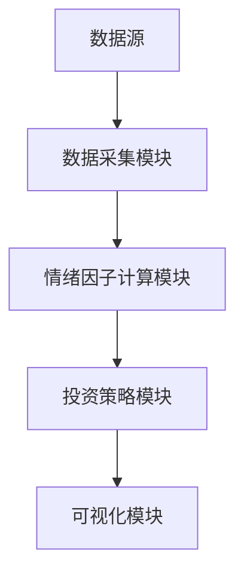
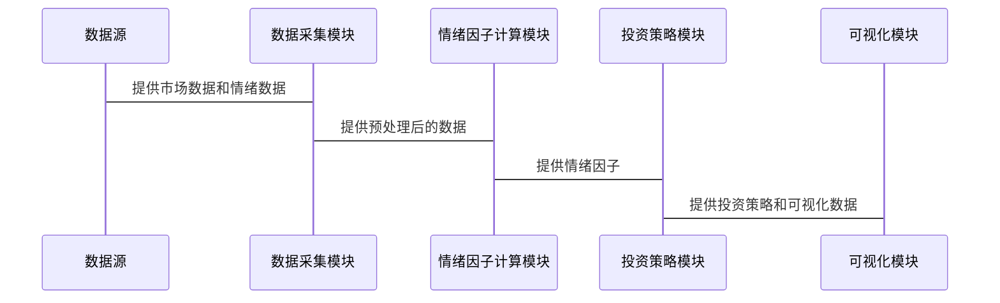

                 


# 特价股票投资中的情绪因子分析

---

## 关键词：特价股票，情绪因子，行为金融学，投资决策，情绪指标

---

## 摘要

本文深入探讨了特价股票投资中的情绪因子分析，从情绪因子的定义、影响机制到具体的投资策略，结合行为金融学理论，分析了情绪因子在特价股票投资中的重要作用。通过量化情绪因子的方法，提出了基于情绪因子的选股策略和风险控制建议，为投资者提供了科学的参考。

---

# 第1章：特价股票与情绪因子概述

## 1.1 特价股票的基本概念

### 1.1.1 特价股票的定义与特点

特价股票是指市场价格低于面值的股票，通常反映公司财务困境或市场对公司的负面预期。其特点包括价格波动大、风险高、投资机会与风险并存。

### 1.1.2 特价股票的市场背景

特价股票常见于市场低迷期或公司重组阶段，投资者需关注公司基本面和市场情绪的双重影响。

### 1.1.3 特价股票的投资价值分析

投资者需综合考虑公司财务状况、行业前景和市场情绪，理性判断投资价值。

## 1.2 情绪因子的基本概念

### 1.2.1 情绪因子的定义

情绪因子是投资者情绪波动对市场行为的影响，通常表现为市场波动率和投资者行为偏差。

### 1.2.2 情绪因子的分类与特征

情绪因子包括市场恐慌、乐观情绪、投资者情绪波动等，具有周期性、波动性和传染性特征。

### 1.2.3 情绪因子在金融市场的应用

情绪因子可用于预测市场波动、辅助投资决策和风险控制。

## 1.3 特价股票与情绪因子的关系

### 1.3.1 情绪因子对特价股票的影响

投资者情绪波动直接影响特价股票的市场表现，情绪恐慌可能导致股价暴跌，情绪乐观可能推动股价反弹。

### 1.3.2 特价股票市场中的情绪波动

特价股票市场情绪波动剧烈，投资者需警惕情绪驱动的非理性决策。

### 1.3.3 情绪因子在特价股票投资中的作用

情绪因子分析可帮助投资者识别市场情绪拐点，优化投资策略。

---

# 第2章：行为金融学与情绪因子

## 2.1 行为金融学概述

### 2.1.1 行为金融学的基本理论

行为金融学研究投资者心理和行为偏差对市场的影响，强调情绪和认知偏差在决策中的作用。

### 2.1.2 行为金融学与传统金融学的区别

传统金融学假设投资者理性，而行为金融学关注投资者情绪和行为偏差。

## 2.2 情绪与投资决策

### 2.2.1 投资者情绪的来源

情绪来源包括市场环境、个人心理和外部信息。

### 2.2.2 情绪对投资决策的影响

情绪波动导致投资者过度交易、羊群效应和非理性决策。

### 2.2.3 情绪周期与市场波动

情绪周期与市场波动密切相关，情绪高峰对应市场顶部，情绪低谷对应市场底部。

---

# 第3章：情绪因子的分析方法

## 3.1 情绪因子的量化分析

### 3.1.1 情绪指标的构建

常用情绪指标包括恐慌指数（VIX）、投资者情绪指数和市场波动率。

### 3.1.2 情绪因子的数学模型

情绪因子模型通过量化情绪指标，分析其与股价的相关性。

### 3.1.3 情绪因子的计算公式

$$ 情绪因子 = \alpha \times 情绪指标 + \beta \times 市场波动率 $$

---

# 第4章：情绪因子的算法实现

## 4.1 情绪因子的算法原理

### 4.1.1 数据采集与预处理

数据来源包括市场数据、新闻情绪和投资者行为数据。

### 4.1.2 情绪因子的计算方法

通过机器学习算法对情绪数据进行特征提取和模型训练。

### 4.1.3 情绪因子的优化算法

使用遗传算法优化情绪因子模型参数。

## 4.2 情绪因子的代码实现

### 4.2.1 数据处理代码

```python
import pandas as pd

def preprocess(data):
    data['情绪因子'] = data['情绪指标'] * 0.5 + data['波动率'] * 0.5
    return data
```

### 4.2.2 情绪因子计算代码

```python
import numpy as np

def calculate_emotion_factor(data):
    emotion_factor = np.zeros(len(data))
    for i in range(len(data)):
        emotion_factor[i] = 0.3 * data['情绪指标'][i] + 0.7 * data['波动率'][i]
    return emotion_factor
```

---

# 第5章：情绪因子分析系统设计

## 5.1 系统架构设计

### 5.1.1 系统功能模块划分

- 数据采集模块：采集市场数据和情绪数据。
- 情绪因子计算模块：计算情绪因子。
- 投资策略模块：基于情绪因子制定投资策略。
- 可视化模块：展示情绪因子和股价走势。

### 5.1.2 系统架构图



## 5.2 数据接口设计

### 5.2.1 数据输入接口

- 市场数据接口：接收股票价格、成交量等数据。
- 情绪数据接口：接收新闻情绪、投资者情绪数据。

### 5.2.2 数据输出接口

- 情绪因子输出接口：提供情绪因子值。
- 投资策略输出接口：提供买卖信号和仓位建议。

### 5.2.3 系统交互流程图



---

# 第6章：情绪因子在特价股票中的应用

## 6.1 特价股票市场情绪分析

### 6.1.1 特价股票市场的情绪特征

特价股票市场情绪波动剧烈，投资者情绪容易受到市场环境影响。

### 6.1.2 情绪因子对特价股票的影响

情绪因子可以预测特价股票的市场波动和投资机会。

## 6.2 情绪因子驱动的投资策略

### 6.2.1 基于情绪因子的选股策略

结合情绪因子和基本面分析，选择具有投资价值的特价股票。

### 6.2.2 情绪因子与风险控制

通过情绪因子分析，制定动态的风险控制策略，避免情绪驱动的非理性投资。

### 6.2.3 实证分析与案例研究

通过实证分析，验证情绪因子在特价股票投资中的有效性。

---

# 第7章：总结与展望

## 7.1 情绪因子分析的总结

情绪因子在特价股票投资中具有重要作用，可以帮助投资者制定科学的投资策略。

## 7.2 投资策略的优化建议

结合情绪因子和基本面分析，优化投资策略，提高投资收益。

---

# 作者：AI天才研究院 & 禅与计算机程序设计艺术

---

通过本文的分析，投资者可以更好地理解情绪因子在特价股票投资中的作用，制定更科学的投资策略。

