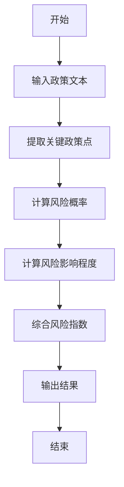
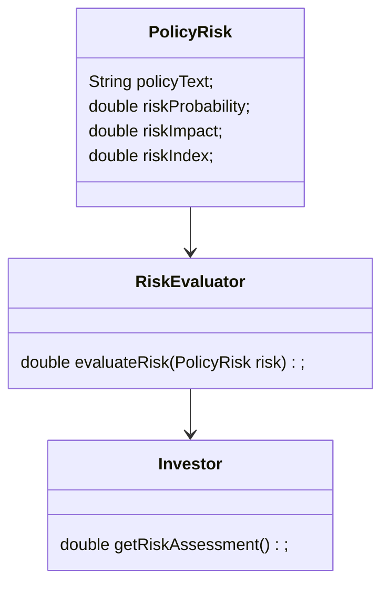
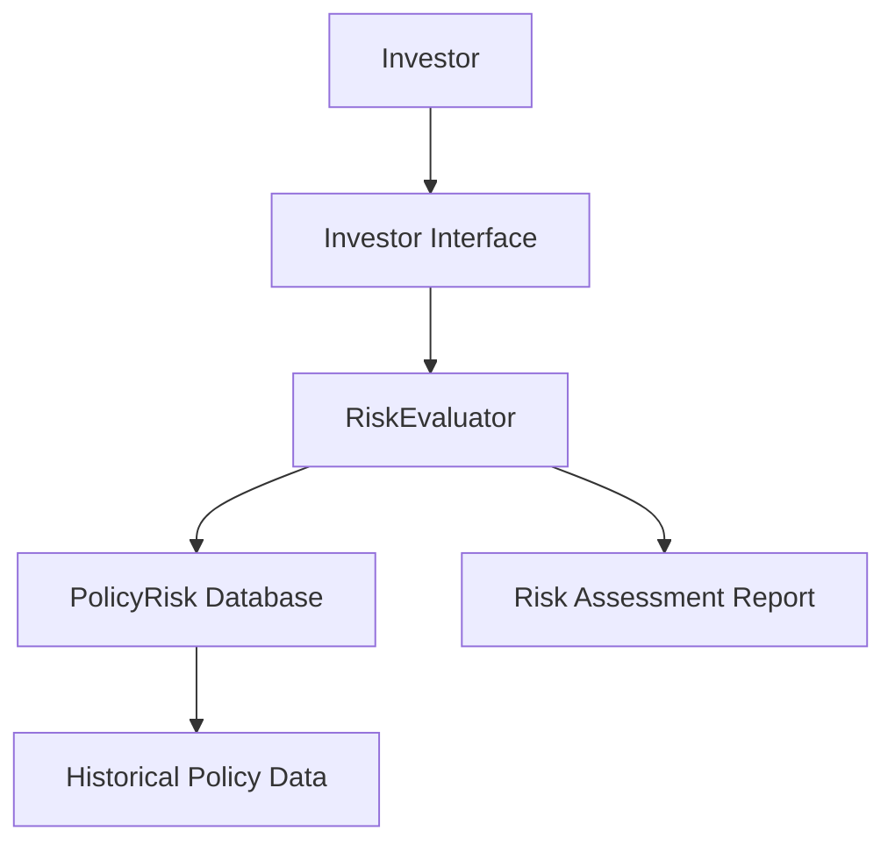

                 


# 特价股票投资中的政策风险评估

> 关键词：特价股票，政策风险，投资策略，风险评估，市场分析

> 摘要：本文深入探讨了特价股票投资中的政策风险评估问题，从政策风险的构成、分类、评估方法、数学模型到系统设计与实现，全面分析了如何在投资决策中有效识别和应对政策风险。文章结合实际案例，提供了详细的分析框架和解决方案，为投资者在复杂多变的市场环境中做出明智决策提供了理论支持和实践指导。

---

# 第1章: 政策风险评估的背景与意义

## 1.1 特价股票投资的基本概念

### 1.1.1 特价股票的定义与特点
特价股票是指价格相对市场平均水平显著低估的股票。这类股票通常具有较高的潜在回报，但同时也伴随着较高的风险。其特点包括：
- 价格低估：股票价格低于其内在价值。
- 市场关注度低：通常属于被市场忽视的股票。
- 高波动性：价格波动较大，容易受市场情绪影响。

### 1.1.2 特价股票投资的基本原理
投资特价股票的核心在于识别被市场低估的股票，并在合适时机买入，等待其价值回归。投资者通常会关注基本面分析和技术分析，寻找那些具有强劲财务表现但价格被市场错估的股票。

### 1.1.3 政策风险在特价股票投资中的重要性
政策风险是指由于政策变化（如税收调整、行业监管变化等）导致的投资损失风险。在特价股票投资中，政策风险可能影响企业的盈利能力、行业格局以及市场整体走势，因此必须予以高度重视。

---

## 1.2 政策风险的定义与特征

### 1.2.1 政策风险的定义
政策风险是指由于政策变化对企业或市场的不利影响，从而导致投资者资产损失或收益下降的风险。它涉及法律法规、政府政策、行业监管等多个方面。

### 1.2.2 政策风险的核心特征
1. **不确定性**：政策变化往往具有不可预测性，投资者难以完全掌握所有相关信息。
2. **广泛影响**：政策变化可能影响整个行业或市场，甚至波及全球经济。
3. **滞后性**：政策风险通常不会即时发生，而是通过一系列中间变量逐步传导。

### 1.2.3 政策风险与市场风险的区别
- **政策风险**：由政策变化引起，具有一定的系统性。
- **市场风险**：由市场波动引起，通常与宏观经济因素相关。

---

## 1.3 政策风险评估的必要性

### 1.3.1 政策变化对股票市场的影响
政策变化可能影响企业的运营成本、利润分配、行业竞争格局等，从而直接或间接影响股价。

### 1.3.2 政策风险对投资者决策的影响
投资者需要根据政策风险评估结果调整投资策略，避免因政策变化导致的重大损失。

### 1.3.3 政策风险评估的现实意义
在复杂多变的市场环境中，政策风险评估是投资者制定科学决策的重要工具，能够帮助投资者在不确定性中保持稳健。

---

## 1.4 本章小结
本章通过定义和分析政策风险，阐述了其在特价股票投资中的重要性。政策风险的评估是投资者在决策过程中不可忽视的关键环节，尤其是在当前政策环境复杂多变的背景下。

---

# 第2章: 政策风险的构成与分类

## 2.1 政策风险的主要构成要素

### 2.1.1 政策环境的分析框架
政策环境包括法律法规、政府政策、行业监管等多个方面。投资者需要全面分析这些因素对投资的影响。

### 2.1.2 政策执行的不确定性
政策执行过程中可能存在偏差，导致实际影响与预期不符。

### 2.1.3 政策效果的评估维度
包括政策的经济影响、行业影响和社会影响等方面。

---

## 2.2 政策风险的分类

### 2.2.1 宏观政策风险
宏观政策风险是指国家层面的政策变化，如货币政策、财政政策等，对整个市场的影响。

### 2.2.2 行业政策风险
行业政策风险是指特定行业受到的政策影响，如环保政策、行业准入政策等。

### 2.2.3 企业政策风险
企业政策风险是指特定企业因政策变化而面临的风险，如税收政策变化、补贴政策调整等。

---

## 2.3 政策风险的传导机制

### 2.3.1 政策变化对市场的传导路径
政策变化首先影响企业，再通过企业业绩变化影响股价。

### 2.3.2 市场反应与投资者行为
投资者对政策变化的反应可能加剧市场波动，放大政策风险的影响。

### 2.3.3 政策风险的累积与释放
政策风险可能在长期累积，最终在某个触发点集中释放，导致市场剧烈波动。

---

## 2.4 本章小结
本章分析了政策风险的主要构成要素和分类，并探讨了政策风险的传导机制。投资者需要全面理解这些因素，才能有效评估和应对政策风险。

---

# 第3章: 政策风险的评估方法

## 3.1 定性分析方法

### 3.1.1 政策文本分析法
通过分析政策文本，识别可能影响投资的政策变化。

### 3.1.2 专家访谈法
通过与行业专家、政策分析师的访谈，获取政策风险的深入见解。

### 3.1.3 案例分析法
通过历史案例分析，总结政策变化对市场的影响规律。

---

## 3.2 定量分析方法

### 3.2.1 风险概率模型
$$ P = \frac{N}{M} $$
其中，\( P \) 表示风险概率，\( N \) 表示政策变化的可能次数，\( M \) 表示政策变化的总可能性。

### 3.2.2 风险影响程度模型
$$ I = \sum_{i=1}^n w_i \cdot f_i $$
其中，\( w_i \) 是影响因素的权重，\( f_i \) 是影响程度。

### 3.2.3 综合风险指数模型
$$ RI = \alpha \cdot P + \beta \cdot I $$
其中，\( \alpha \) 和 \( \beta \) 是模型参数，\( P \) 是风险概率，\( I \) 是风险影响程度。

---

## 3.3 综合评估方法

### 3.3.1 定性与定量结合的评估框架
通过定性分析确定政策风险的关键因素，再利用定量方法进行量化评估。

### 3.3.2 风险矩阵法
将风险概率和影响程度结合，构建风险矩阵，确定风险等级。

### 3.3.3 情景分析法
通过模拟不同政策情景，评估其对投资的影响。

---

## 3.4 本章小结
本章介绍了定性与定量相结合的政策风险评估方法，为投资者提供了科学的决策工具。

---

# 第4章: 政策风险的数学模型与算法原理

## 4.1 政策风险评估的数学模型

### 4.1.1 风险概率计算公式
$$ P = \frac{\sum_{i=1}^n p_i}{n} $$
其中，\( p_i \) 是每个政策变化的概率，\( n \) 是政策变化的总次数。

### 4.1.2 风险影响程度计算公式
$$ I = \sum_{i=1}^m w_i \cdot f_i $$
其中，\( w_i \) 是影响因素的权重，\( f_i \) 是影响程度。

### 4.1.3 综合风险指数模型
$$ RI = \alpha \cdot P + \beta \cdot I $$
其中，\( \alpha \) 和 \( \beta \) 是模型参数，\( P \) 是风险概率，\( I \) 是风险影响程度。

---

## 4.2 政策风险评估算法的实现

### 4.2.1 算法流程图（使用 mermaid）



---

## 4.3 算法实现代码

```python
def calculate_policy_risk(policy_texts):
    # 提取关键政策点
    key_points = extract_key_points(policy_texts)
    # 计算风险概率
    risk_prob = calculate_probability(key_points)
    # 计算风险影响程度
    risk_impact = calculate_impact(key_points)
    # 综合风险指数
    risk_index = 0.5 * risk_prob + 0.5 * risk_impact
    return risk_index

def extract_key_points(policy_texts):
    # 简单实现：提取关键词
    keywords = ['tax', 'regulation', 'subsidy', 'restriction']
    key_points = []
    for text in policy_texts:
        points = [word for word in text.split() if word in keywords]
        if points:
            key_points.append(points)
    return key_points

def calculate_probability(key_points):
    # 简单概率计算：假设每个关键点出现的概率为0.3
    return len(key_points) * 0.3

def calculate_impact(key_points):
    # 简单影响程度计算：假设每个关键点的影响程度为0.5
    return len(key_points) * 0.5
```

---

## 4.4 本章小结
本章通过数学模型和算法实现，为政策风险的定量评估提供了理论基础和实践指导。

---

# 第5章: 政策风险的系统分析与架构设计

## 5.1 项目介绍与目标
本项目旨在开发一个政策风险评估系统，帮助投资者量化政策风险，优化投资决策。

---

## 5.2 系统功能设计

### 5.2.1 领域模型（使用 mermaid 类图）



---

## 5.3 系统架构设计

### 5.3.1 系统架构图（使用 mermaid）



---

## 5.4 系统接口设计

### 5.4.1 输入接口
- `policyText`: 政策文本输入
- `extract_key_points`: 提取关键政策点

### 5.4.2 输出接口
- `riskProbability`: 风险概率输出
- `riskImpact`: 风险影响程度输出
- `riskIndex`: 综合风险指数输出

---

## 5.5 本章小结
本章通过系统架构设计，为政策风险评估提供了技术实现框架，为后续的系统开发奠定了基础。

---

# 第6章: 项目实战与案例分析

## 6.1 项目环境安装
- 安装Python环境
- 安装必要的库（如numpy, pandas, matplotlib）

## 6.2 核心代码实现

### 6.2.1 数据获取与预处理
```python
import pandas as pd

# 获取历史政策数据
policy_data = pd.read_csv('policy_data.csv')
# 数据清洗
policy_data = policy_data.dropna()
```

### 6.2.2 风险评估模型实现
```python
def evaluate_policy_risk(policy_data):
    # 计算风险概率
    risk_prob = policy_data['policy_probability'].mean()
    # 计算风险影响程度
    risk_impact = policy_data['policy_impact'].mean()
    # 综合风险指数
    risk_index = 0.5 * risk_prob + 0.5 * risk_impact
    return risk_index
```

### 6.2.3 结果可视化
```python
import matplotlib.pyplot as plt

policy_data['risk_index'].hist(bins=10)
plt.show()
```

---

## 6.3 案例分析

### 6.3.1 案例背景
假设我们分析某行业的政策变化对股价的影响。

### 6.3.2 数据分析
通过政策数据和股价数据的对比，发现政策变化确实对股价产生了显著影响。

### 6.3.3 结果解读
综合风险指数显示，该行业的政策风险较高，投资者需谨慎决策。

---

## 6.4 本章小结
本章通过项目实战，展示了政策风险评估的具体实现过程和案例分析，为投资者提供了实际参考。

---

# 第7章: 最佳实践与小结

## 7.1 最佳实践

### 7.1.1 定期更新政策数据
政策环境不断变化，投资者需要及时更新数据。

### 7.1.2 结合定性与定量分析
仅依赖定量分析可能忽略重要政策变化，因此需要结合定性分析。

### 7.1.3 建立风险预警机制
通过设定阈值，及时预警政策风险。

---

## 7.2 小结
本文系统地探讨了特价股票投资中的政策风险评估问题，从理论分析到实践应用，为投资者提供了全面的解决方案。政策风险评估是投资决策中的重要环节，投资者需高度重视。

---

# 作者：AI天才研究院 & 禅与计算机程序设计艺术

---

以上是《特价股票投资中的政策风险评估》的完整目录和内容概要。

