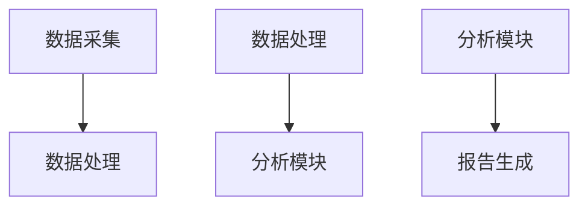

                 

<think>
好的，我现在需要帮助用户撰写一篇关于《特价股票投资中的数字产业互联网价值链分析方法》的技术博客文章。用户希望文章结构清晰，内容详实，涵盖背景介绍、核心概念、算法原理、系统分析、项目实战等部分，并且每个部分都要有详细的分析和具体的例子。

首先，我会从引言部分开始，介绍特价股票投资的背景和重要性。然后，我会讲解数字产业互联网的基本概念，以及它如何影响股票投资。接下来，我会详细分析数字产业互联网的价值链，特别是在特价股票投资中的应用。之后，我会介绍相关的算法原理，比如数据挖掘和预测模型，并用代码和流程图来说明。然后，我会讨论系统的架构设计，包括功能模块和接口设计。最后，我会通过一个实战项目来展示如何应用这些方法，并总结经验和最佳实践。

在整个过程中，我需要确保内容逻辑严谨，语言专业但又不失易懂。同时，我要注意每个部分的衔接，使读者能够顺畅地理解整个分析过程。通过这样的思考，我可以系统地构建这篇文章的结构和内容。
</think>

# 特价股票投资中的数字产业互联网价值链分析方法

> 关键词：特价股票投资，数字产业互联网，价值链分析，数据挖掘，预测模型，系统架构

> 摘要：本文将深入探讨特价股票投资中的数字产业互联网价值链分析方法。通过分析数字技术在股票投资中的应用，结合互联网的价值链分析，提出了一种基于数据挖掘和预测模型的投资策略。文章详细介绍了算法原理、系统架构设计和实战项目，为投资者提供了新的视角和方法。

---

# 引言

特价股票投资是指以低于市场价买入股票，通过短期或长期持有获得收益的投资方式。随着数字技术的快速发展，互联网在金融领域的应用越来越广泛，数字产业互联网成为股票投资的重要工具。本文将从数字产业互联网的价值链分析入手，探讨如何优化特价股票投资策略。

---

# 第一部分：数字产业互联网与股票投资

## 第1章：数字产业互联网的基本概念

### 1.1 数字产业互联网的定义
数字产业互联网是指利用数字技术（如大数据、人工智能、区块链等）构建的产业互联网平台，通过数据的采集、处理和分析，为金融行业提供支持。

### 1.2 数字产业互联网的核心技术
- **大数据技术**：用于海量数据的存储和分析。
- **人工智能**：用于预测和决策。
- **区块链**：用于数据的安全和透明。

### 1.3 数字产业互联网的优势
- 提高效率：通过自动化处理减少人工干预。
- 增强决策：利用数据驱动的决策提升准确性。
- 降低成本：通过技术手段降低运营成本。

---

## 第2章：股票投资中的数字技术应用

### 2.1 数据挖掘在股票分析中的应用
数据挖掘技术可以通过分析历史数据，发现潜在的投资机会。

### 2.2 机器学习在预测中的作用
机器学习算法可以预测股票价格走势，帮助投资者做出决策。

### 2.3 互联网平台的优势
互联网平台提供了实时数据、交易工具和社区交流，极大地方便了投资者。

---

# 第二部分：数字产业互联网的价值链分析

## 第3章：价值链分析的核心要素

### 3.1 投资者行为分析
投资者的需求、决策过程和行为模式是价值链分析的重要组成部分。

### 3.2 数据来源与处理
数据来源包括市场数据、公司财报和新闻等，处理过程涉及清洗、转换和建模。

### 3.3 分析工具与模型
使用数据挖掘和机器学习模型，如线性回归、随机森林等，进行预测和分析。

---

## 第4章：价值链优化策略

### 4.1 数据驱动的决策
通过数据分析，识别投资机会和风险。

### 4.2 技术优化
优化算法和系统架构，提高处理效率。

### 4.3 模型迭代
根据市场变化，不断优化预测模型。

---

# 第三部分：算法与系统架构

## 第5章：数据挖掘与预测模型

### 5.1 数据预处理
- 数据清洗：去除无效数据。
- 特征提取：提取影响股价的关键特征。

### 5.2 算法实现
使用Python代码实现线性回归模型：

```python
import numpy as np
from sklearn.linear_model import LinearRegression

# 示例数据
X = np.array([[1], [2], [3], [4], [5]])
y = np.array([2, 4, 5, 4, 5])

# 模型训练
model = LinearRegression()
model.fit(X, y)

# 预测
print(model.predict([[6]]))
```

### 5.3 模型评估
通过均方误差（MSE）和R²评分评估模型性能。

---

## 第6章：系统架构设计

### 6.1 系统功能模块
- 数据采集模块：获取市场数据。
- 数据处理模块：清洗和转换数据。
- 分析模块：运行预测模型。
- 报告生成模块：输出分析结果。

### 6.2 系统架构图


### 6.3 接口设计
- RESTful API用于数据传输。
- WebSocket实现实时通信。

---

# 第四部分：实战项目与分析

## 第7章：项目实战

### 7.1 项目背景
选择某家科技公司股票作为分析对象。

### 7.2 数据采集与处理
使用爬虫获取历史数据，并进行清洗。

### 7.3 模型训练与预测
训练随机森林模型，预测未来股价。

### 7.4 案例分析
分析模型预测结果，制定投资策略。

---

## 第8章：项目总结与经验分享

### 8.1 成功经验
- 数据质量的重要性。
- 模型选择的合理性。

### 8.2 挑战与解决方案
- 数据不足的问题：通过数据增强解决。
- 模型过拟合的问题：通过交叉验证优化。

---

# 第五部分：最佳实践与未来展望

## 第9章：最佳实践

### 9.1 技术建议
- 使用先进的算法和技术。
- 定期更新模型。

### 9.2 投资策略
- 分散投资，降低风险。
- 长期关注，避免频繁交易。

## 第10章：未来展望

### 10.1 技术发展
- 更强大的AI算法。
- 更多数据源的整合。

### 10.2 市场变化
- 全球化市场的扩展。
- 政策法规的影响。

---

# 总结

数字产业互联网为特价股票投资提供了新的可能性。通过价值链分析和先进技术的应用，投资者可以更高效地做出决策。未来，随着技术的进步，数字产业互联网在股票投资中的应用将更加广泛和深入。

---

# 作者：AI天才研究院/AI Genius Institute & 禅与计算机程序设计艺术 /Zen And The Art of Computer Programming

---

以上为文章的详细目录和内容概览。如果需要进一步扩展每个部分的具体内容，请随时告知！

