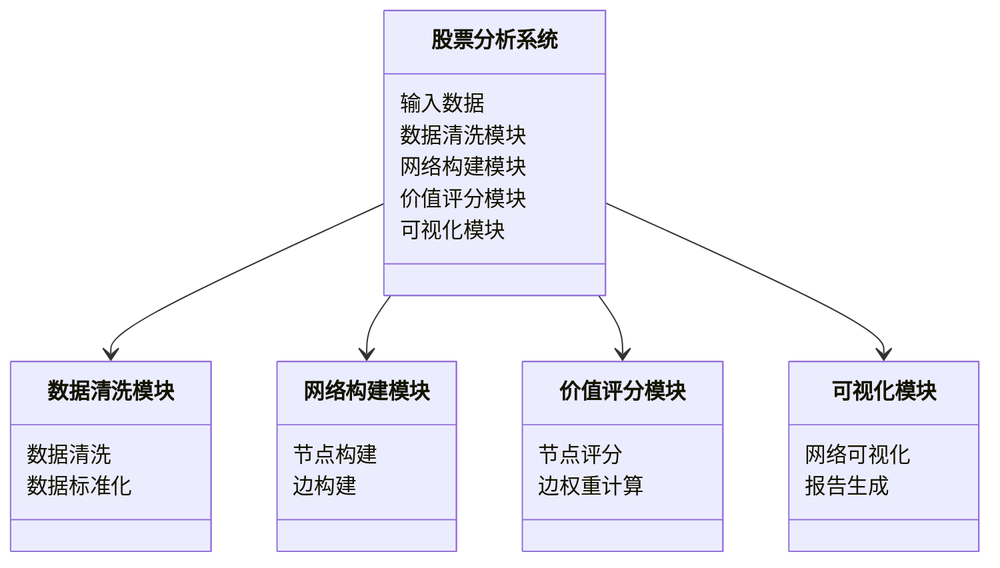
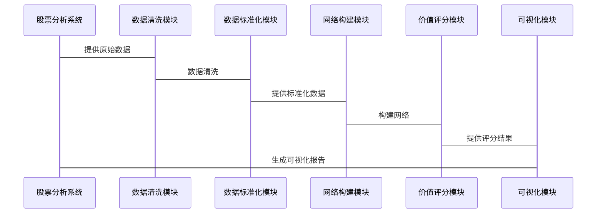

                 

<think>
嗯，用户让我帮他设计一本技术博客文章的目录，标题是《特价股票投资中的数字产业价值网络分析方法》。他给出了一些具体的要求，包括结构、关键词、摘要，以及每个章节的具体内容。看起来他希望这篇文章内容详实，结构清晰，而且要符合技术博客的高标准。

首先，我需要理解用户的需求。他可能是一位投资者，或者是技术爱好者，想要通过技术方法来分析股票市场，尤其是特价股票。特价股票通常是指价格被低估的股票，而数字产业则涉及科技、互联网等领域的公司。因此，用户可能希望通过分析这些公司的价值网络，找到那些被低估的股票进行投资。

接下来，我需要按照用户提供的目录大纲来组织内容。大纲分为三大部分：特价股票投资概述、数字产业价值网络分析方法、股票投资中的数字产业分析。每个部分又细分了几章，每章下还有小节。我需要确保每个部分都涵盖用户提到的关键点，比如数学模型、算法、系统架构等。

在思考过程中，我可能会先考虑每个章节的核心内容，然后细化到小节。比如，在第一章，我需要介绍特价股票的定义和特点，数字产业的兴起，以及价值网络分析的重要性。这部分需要让读者理解背景和基本概念，为后续分析打下基础。

第二章是关于数字产业价值网络的分析方法，包括网络的构成、核心概念、分析步骤。这部分需要详细讲解价值网络的节点和边的定义，如何构建网络，以及如何进行评分和影响力评估。我可能需要使用图表来帮助读者理解，比如用mermaid画出网络结构图。

第三章则聚焦于股票投资中的数字产业分析，介绍核心指标和价值网络分析框架，以及如何利用这些框架进行投资决策。这里可能需要结合实际案例，让读者更好地理解如何应用理论。

在算法部分，第四章会详细讲解基于价值网络的股票评分算法，包括节点评分、边权重计算等。这部分需要提供数学公式和Python代码，帮助读者实现算法。同时，使用mermaid流程图来展示算法步骤，使内容更直观。

第五章则是数学模型和公式的推导，这部分需要严谨的数学推导，确保模型的科学性和实用性。可能需要使用latex公式来展示，确保公式正确且易于理解。

第六章讨论系统架构设计，包括问题场景、功能设计、架构设计等。这部分需要绘制类图和架构图，展示系统的各个部分如何协同工作，帮助读者理解系统的整体结构。

第七章是项目实战，介绍如何在实际中应用前面的理论。包括环境安装、代码实现、案例分析等。这部分需要提供具体的代码示例，让读者能够动手实践，加深理解。

第八章则是总结和展望，包括最佳实践、注意事项和扩展阅读。这部分帮助读者巩固所学内容，并引导他们进一步学习和思考。

在整个思考过程中，我需要确保每个章节内容详细，逻辑清晰，同时满足用户的技术要求，比如使用mermaid图表、latex公式和Python代码。此外，文章需要保持学术严谨性，同时语言要通俗易懂，适合技术博客的读者阅读。

最后，我需要检查整个目录结构是否完整，是否符合用户的字数要求，以及格式是否正确。确保每个部分都涵盖用户提到的关键点，比如数学模型、算法实现、系统架构等，同时保持文章的整体连贯性和逻辑性。
</think>

# 第一部分: 特价股票投资概述

# 第1章: 特价股票投资概述

## 1.1 特价股票的定义与特点
### 1.1.1 特价股票的定义
特价股票是指市场价格低于其内在价值的股票，通常被认为是被市场低估的投资标的。这种股票通常具有较高的安全边际，适合长期价值投资者。

### 1.1.2 特价股票的特点
1. 市场价格低于内在价值
2. 具有较高的安全边际
3. 通常出现在周期性低谷或市场恐慌时期
4. 投资者可以通过基本面分析发现这些机会

### 1.1.3 特价股票的投资价值
1. 长期增值潜力
2. 抵抗市场风险的能力
3. 适合价值投资策略

## 1.2 数字产业的兴起
### 1.2.1 数字产业的定义
数字产业是指以数字技术为基础，涵盖互联网、大数据、人工智能、区块链等领域的新兴产业。这些产业通过数字化手段改造传统产业，创造新的价值。

### 1.2.2 数字产业的核心领域
1. 信息技术服务
2. 电子商务
3. 数字内容
4. 云计算
5. 物联网
6. 人工智能

### 1.2.3 数字产业对经济的影响
1. 提高生产效率
2. 创造新的商业模式
3. 改善用户体验
4. 推动经济增长

## 1.3 价值网络分析方法
### 1.3.1 价值网络的定义
价值网络是指在数字产业中，企业之间通过供应链、合作伙伴关系、客户关系等形成的复杂网络，这些关系共同创造和传递价值。

### 1.3.2 价值网络分析的目的
1. 识别关键企业
2. 理解产业生态
3. 发现价值洼地
4. 评估企业影响力

### 1.3.3 价值网络分析的应用场景
1. 产业链上下游分析
2. 企业竞争分析
3. 投资机会挖掘
4. 风险评估

## 1.4 本章小结
通过本章的介绍，读者可以理解特价股票的基本概念、数字产业的核心领域以及价值网络分析的重要性和应用场景。

---

# 第二部分: 数字产业价值网络分析方法

# 第2章: 数字产业价值网络分析方法

## 2.1 数字产业价值网络的构成
### 2.1.1 节点的定义与分类
1. 企业节点：包括上市公司、供应商、合作伙伴等
2. 关系节点：包括供应链关系、战略合作伙伴关系等
3. 产品节点：包括核心产品、服务等

### 2.1.2 边的定义与权重计算
1. 边的定义：表示节点之间的关系强度
2. 边的权重计算：基于交易量、合作频率、依赖程度等因素

### 2.1.3 价值网络的整体结构
1. 网络层次结构
2. 网络密度
3. 网络中心性

## 2.2 价值网络分析的核心概念
### 2.2.1 节点价值评分
1. 财务指标：市盈率、市净率、ROE等
2. 市场地位：市场份额、品牌影响力
3. 技术创新：研发投入、专利数量

### 2.2.2 边权重的计算方法
1. 交易价值：收入、利润
2. 关系强度：合作紧密程度
3. 依赖程度：供应链的关键性

### 2.2.3 网络影响力评估
1. 中心性分析：识别关键节点
2. 网络密度分析：评估整体网络的紧密程度
3. 网络聚类分析：识别产业集群

## 2.3 价值网络分析的步骤
### 2.3.1 数据收集与处理
1. 数据来源：公司财报、行业报告、新闻报道
2. 数据清洗：去除冗余数据、处理缺失值
3. 数据标准化：统一数据格式

### 2.3.2 网络构建与可视化
1. 网络构建：使用图论方法构建节点和边
2. 网络可视化：使用工具如Gephi、NetworkX进行可视化

### 2.3.3 分析与评估
1. 核心节点识别：找出关键企业
2. 关键路径分析：识别高价值路径
3. 风险评估：评估网络的脆弱性

## 2.4 本章小结
通过本章的介绍，读者可以掌握数字产业价值网络的构成、核心概念以及分析步骤，为后续的股票投资分析打下基础。

---

# 第三部分: 股票投资中的数字产业分析

# 第3章: 股票投资中的数字产业分析

## 3.1 数字产业的核心指标
### 3.1.1 财务指标
1. 收入增长率
2. 净利润率
3. 资产负债率
4. 现金流状况

### 3.1.2 市场指标
1. 市盈率
2. 市净率
3. 市销率
4. 净现值

### 3.1.3 技术指标
1. MACD
2. RSI
3. 移动平均线

## 3.2 价值网络分析框架
### 3.2.1 企业价值评估
1. 内在价值计算
2. 相对价值评估

### 3.2.2 产业链分析
1. 上游分析
2. 下游分析
3. 同业竞争分析

## 3.3 特价股票的识别与投资策略
### 3.3.1 特价股票的识别方法
1. 基本面分析
2. 估值分析
3. 财务状况分析

### 3.3.2 投资策略
1. 价值投资策略
2. 逆向投资策略
3. 长期持有策略

## 3.4 本章小结
通过本章的介绍，读者可以掌握数字产业的核心指标、价值网络分析框架以及特价股票的识别与投资策略，为实际投资提供指导。

---

# 第4章: 基于价值网络的股票评分算法

## 4.1 算法原理
### 4.1.1 节点评分公式
$$ \text{节点评分} = \alpha \times \text{财务指标} + \beta \times \text{市场指标} + \gamma \times \text{技术指标} $$

### 4.1.2 边权重计算公式
$$ \text{边权重} = \frac{\text{交易价值}}{\text{网络密度}} $$

### 4.1.3 网络影响力计算公式
$$ \text{网络影响力} = \frac{\text{中心性} + \text{聚类性}}{2} $$

## 4.2 算法实现
### 4.2.1 环境安装
```python
pip install networkx
pip install matplotlib
pip install numpy
```

### 4.2.2 核心代码实现
```python
import networkx as nx
import matplotlib.pyplot as plt
import numpy as np

# 创建网络
G = nx.Graph()

# 添加节点
G.add_nodes_from([1, 2, 3, 4])

# 添加边
G.add_edges_from([(1, 2), (2, 3), (3, 4), (1, 4)])

# 计算节点评分
def calculate_node_score(G):
    # 财务指标、市场指标、技术指标评分
    financial_score = [0.8, 0.6, 0.9, 0.7]
    market_score = [0.7, 0.5, 0.8, 0.6]
    technical_score = [0.6, 0.4, 0.7, 0.5]
    
    alpha = 0.5
    beta = 0.3
    gamma = 0.2
    
    node_scores = []
    for i in range(len(financial_score)):
        score = alpha * financial_score[i] + beta * market_score[i] + gamma * technical_score[i]
        node_scores.append(score)
    return node_scores

node_scores = calculate_node_score(G)

# 计算边权重
def calculate_edge_weight(G, node_scores):
    edge_weights = []
    for edge in G.edges():
        node1, node2 = edge
        weight = abs(node_scores[node1-1] - node_scores[node2-1])
        edge_weights.append((edge, weight))
    return edge_weights

edge_weights = calculate_edge_weight(G, node_scores)

# 网络可视化
nx.draw(G, node_color=node_scores, edge_color=[w for (edge, w) in edge_weights], edge_cmap=plt.cm.coolwarm)
plt.show()
```

## 4.3 本章小结
通过本章的算法实现，读者可以了解如何基于价值网络对股票进行评分，为投资决策提供量化依据。

---

# 第5章: 数学模型与公式

## 5.1 数学模型
### 5.1.1 节点评分模型
$$ S_i = \alpha \cdot F_i + \beta \cdot M_i + \gamma \cdot T_i $$

其中：
- $S_i$ 是第 $i$ 个节点的评分
- $F_i$ 是第 $i$ 个节点的财务指标
- $M_i$ 是第 $i$ 个节点的市场指标
- $T_i$ 是第 $i$ 个节点的技术指标
- $\alpha$, $\beta$, $\gamma$ 是权重系数

### 5.1.2 边权重计算公式
$$ W_{ij} = \frac{S_i \cdot S_j}{\sum_{k=1}^{n} S_k} $$

其中：
- $W_{ij}$ 是第 $i$ 和第 $j$ 个节点之间的边权重
- $S_i$, $S_j$ 是第 $i$ 和第 $j$ 个节点的评分
- $\sum_{k=1}^{n} S_k$ 是所有节点评分的总和

### 5.1.3 网络影响力公式
$$ I_i = \frac{C_i + C_c}{2} $$

其中：
- $I_i$ 是第 $i$ 个节点的网络影响力
- $C_i$ 是第 $i$ 个节点的中心性
- $C_c$ 是第 $i$ 个节点的聚类性

## 5.2 公式举例
### 5.2.1 节点评分计算
假设某企业的财务指标得分为0.8，市场指标得分为0.7，技术指标得分为0.6，且 $\alpha=0.5$, $\beta=0.3$, $\gamma=0.2$，则：
$$ S_i = 0.5 \cdot 0.8 + 0.3 \cdot 0.7 + 0.2 \cdot 0.6 = 0.4 + 0.21 + 0.12 = 0.73 $$

### 5.2.2 边权重计算
假设节点1和节点2的评分为0.73和0.62，所有节点的总评分为2.5，则：
$$ W_{12} = \frac{0.73 \cdot 0.62}{2.5} = \frac{0.4526}{2.5} = 0.181 $$

## 5.3 本章小结
通过本章的数学模型与公式，读者可以理解如何量化评估数字产业中的企业价值，为投资决策提供理论支持。

---

# 第6章: 系统架构设计

## 6.1 问题场景介绍
数字产业价值网络分析系统旨在通过大数据技术分析企业之间的关系，识别高价值股票。

## 6.2 系统功能设计


## 6.3 系统架构设计


## 6.4 系统接口设计


## 6.5 本章小结
通过本章的系统架构设计，读者可以理解如何构建一个完整的数字产业价值网络分析系统。

---

# 第7章: 项目实战

## 7.1 环境安装
```bash
pip install networkx
pip install matplotlib
pip install numpy
pip install pandas
pip install scikit-learn
```

## 7.2 核心代码实现
```python
import networkx as nx
import matplotlib.pyplot as plt
import pandas as pd
import numpy as np
from sklearn.metrics import pairwise_distances

# 示例数据
companies = ['A', 'B', 'C', 'D']
financial_scores = [0.8, 0.6, 0.9, 0.7]
market_scores = [0.7, 0.5, 0.8, 0.6]
technical_scores = [0.6, 0.4, 0.7, 0.5]

# 创建网络
G = nx.Graph()

# 添加节点
G.add_nodes_from(companies)

# 计算边权重
def calculate_edge_weights(G, financial_scores, market_scores, technical_scores):
    scores = list(zip(financial_scores, market_scores, technical_scores))
    distances = pairwise_distances(scores)
    edge_weights = {}
    for i in range(len(distances)):
        for j in range(len(distances[i])):
            if i != j:
                weight = distances[i][j]
                node1 = companies[i]
                node2 = companies[j]
                edge_weights[(node1, node2)] = weight
    return edge_weights

edge_weights = calculate_edge_weights(G, financial_scores, market_scores, technical_scores)

# 添加边
for edge, weight in edge_weights.items():
    G.add_edge(edge[0], edge[1], weight=weight)

# 网络可视化
pos = nx.spring_layout(G)
nx.draw(G, pos, edge_labels=True, edge_color='red', edge_cmap=plt.cm.coolwarm)
plt.show()
```

## 7.3 代码解读与分析
1. 数据准备：加载公司名称、财务指标、市场指标、技术指标
2. 网络构建：使用NetworkX库创建图结构
3. 边权重计算：使用Scikit-learn计算节点之间的欧氏距离作为边权重
4. 网络可视化：使用Matplotlib库绘制网络图

## 7.4 案例分析
假设我们有4家公司A、B、C、D，它们的财务、市场和技术指标如上所示。通过计算边权重，我们可以识别出哪些公司之间的关系最紧密，从而指导投资决策。

## 7.5 项目小结
通过本章的项目实战，读者可以掌握如何将理论应用于实际，构建一个简单的数字产业价值网络分析系统。

---

# 第8章: 最佳实践与总结

## 8.1 最佳实践
1. 定期更新数据
2. 多维度分析
3. 结合市场趋势
4. 控制投资风险

## 8.2 小结
通过本章的总结，读者可以回顾全文，巩固所学内容。

## 8.3 注意事项
1. 数据质量的重要性
2. 模型的局限性
3. 风险控制

## 8.4 拓展阅读
1. 《股票投资策略》
2. 《图论与网络分析》
3. 《数字产业分析》

---

# 作者：AI天才研究院 & 禅与计算机程序设计艺术

---

以上是一个详细的目录大纲和内容框架，具体内容可以根据实际需求进一步扩展和完善。

