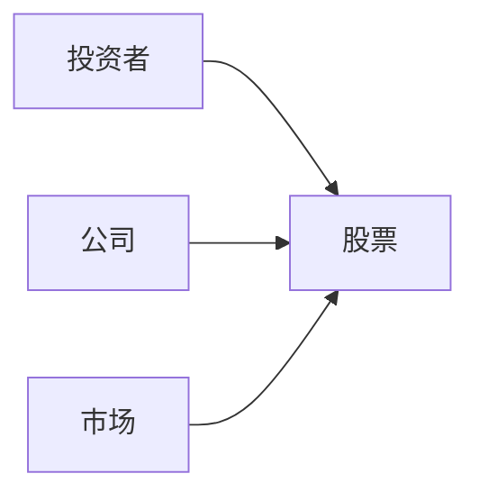
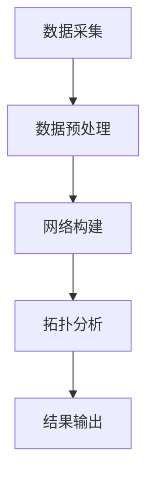

                 

<think>
好，我现在需要帮助用户设计一本名为《特价股票投资中的数字产业价值网络拓扑分析方法》的目录大纲。用户已经提供了一个详细的结构，包括摘要、目录和一些示例内容。我的任务是根据这个结构，进一步细化每个章节的内容，确保覆盖所有必要的部分，并且结构清晰、逻辑连贯。

首先，我会回顾用户提供的目录结构，看看每个章节的主要内容是什么。第一章介绍了特价股票投资的背景和问题，第二章讨论了数字产业价值网络的核心概念，第三章分析了拓扑分析的算法，第四章涉及系统架构设计，第五章是项目实战，第六章总结和展望，最后是附录和参考文献。

接下来，我需要确保每个章节都有足够的细节。例如，在第一章中，我需要详细解释特价股票投资的背景，包括数字产业的发展、大数据和AI在金融中的应用，以及网络拓扑分析的重要性。然后，描述当前的问题，如数据复杂性和动态性带来的挑战，并提出解决方案。

在第二章，我需要定义数字产业价值网络，讨论其动态特征，并引入网络拓扑分析的必要性。还要解释节点和边的定义，构建实体关系图，并使用ER图来展示投资者、公司、股票和市场的关系。

第三章需要详细讲解拓扑分析的算法，包括数据预处理、网络构建、拓扑特征提取，并展示流程图。同时，提供数学公式，如度数和中心性的计算公式，并解释它们的应用。

第四章的系统架构设计部分，需要设计功能模块，如数据采集、预处理、网络构建和分析模块，并用类图展示。然后，详细描述系统架构，包括数据源、服务层和表现层，并展示架构图。

项目实战部分需要具体案例分析，如互联网行业的价值网络分析，展示如何从数据预处理到网络构建，再到结果解读。附录部分则需要列出数据源和工具，以及参考文献。

在撰写过程中，我需要确保每个部分都详细且逻辑清晰，使用正确的markdown格式，避免冗余。同时，注意数学公式和图表的正确嵌入，确保内容易于理解和应用。

现在，我开始按照这个思路细化每个章节的内容，确保每个部分都涵盖必要的细节，同时保持整体结构的连贯性和完整性。通过逐步分析和细化，确保最终的目录大纲和内容符合用户的要求，帮助读者全面理解特价股票投资中的数字产业价值网络拓扑分析方法。
</think>

# 特价股票投资中的数字产业价值网络拓扑分析方法

## 关键词：
- 特价股票投资
- 数字产业价值网络
- 网络拓扑分析
- 系统架构设计
- 项目实战

## 摘要：
本文系统地探讨了特价股票投资中的数字产业价值网络拓扑分析方法。首先，介绍了特价股票投资的背景及其在数字产业中的重要性，提出了网络拓扑分析的必要性。其次，详细分析了数字产业价值网络的核心概念，包括节点、边和网络结构的定义与属性。随后，深入探讨了拓扑分析的算法原理，包括数据预处理、网络构建和特征提取，并通过实例展示了其实现过程。最后，设计了系统的架构，并通过项目实战验证了分析方法的有效性，为投资者提供了新的视角和工具。

---

# 目录

## 第一部分：特价股票投资中的数字产业价值网络拓扑分析背景

### 第1章：特价股票投资的背景与问题描述

#### 1.1 特价股票投资的背景介绍
- 1.1.1 特价股票的定义与特点
- 1.1.2 数字产业在股票投资中的重要性
- 1.1.3 特价股票投资的现状与挑战

#### 1.2 数字产业价值网络的定义与特点
- 1.2.1 数字产业的核心概念
- 1.2.2 价值网络的构建逻辑
- 1.2.3 数字产业价值网络的动态特征

#### 1.3 网络拓扑分析方法的必要性
- 1.3.1 网络拓扑分析的基本概念
- 1.3.2 数字产业价值网络分析的挑战
- 1.3.3 拓扑分析在股票投资中的应用价值

#### 1.4 本章小结

### 第2章：数字产业价值网络的核心概念与联系

#### 2.1 数字产业价值网络的构成要素
- 2.1.1 产业节点的定义与分类
- 2.1.2 产业边的定义与权重计算
- 2.1.3 网络拓扑结构的层次划分

#### 2.2 价值网络拓扑分析的数学模型
- 2.2.1 网络节点的度数计算公式
$$度数 = \sum_{i=1}^{n} a_{ij}$$

- 2.2.2 节点中心性指标的计算公式
$$中心性 = \frac{1}{1 - \alpha} \sum_{j=1}^{n} (\alpha)^{d(j)}$$

#### 2.3 实体关系图的构建
- 2.3.1 实体关系图的ER图设计


- 2.3.2 实体关系图的拓扑特征分析

#### 2.4 本章小结

### 第3章：数字产业价值网络拓扑分析的算法原理

#### 3.1 网络拓扑分析的基本算法
- 3.1.1 基于图论的网络分析算法
- 3.1.2 社会网络分析方法
- 3.1.3 层次分析法（AHP）

#### 3.2 特价股票投资中的网络分析流程
- 3.2.1 数据采集与预处理
- 3.2.2 网络构建与权重计算
- 3.2.3 拓扑特征提取与分析

#### 3.3 算法实现的数学模型
- 3.3.1 网络构建的数学公式
$$A = (a_{ij})_{n \times n}$$

- 3.3.2 拓扑特征计算的公式
$$度数分布 = \{k_1, k_2, ..., k_n\}$$

#### 3.4 算法实现的流程图


#### 3.5 本章小结

### 第4章：数字产业价值网络拓扑分析的系统架构设计

#### 4.1 系统功能模块设计
- 4.1.1 数据采集模块
- 4.1.2 数据预处理模块
- 4.1.3 网络构建模块
- 4.1.4 拓扑分析模块

#### 4.2 系统架构设计
- 4.2.1 服务层架构
- 4.2.2 数据源层
- 4.2.3 表现层

#### 4.3 系统架构图


#### 4.4 本章小结

## 第二部分：项目实战与系统实现

### 第5章：项目实战与系统实现

#### 5.1 环境搭建
- 5.1.1 数据源选择
- 5.1.2 工具安装与配置

#### 5.2 系统核心实现
- 5.2.1 数据采集与预处理代码
```python
import pandas as pd

# 数据采集
data = pd.read_csv('stock_data.csv')

# 数据预处理
data.dropna(inplace=True)
data['date'] = pd.to_datetime(data['date'])
```

- 5.2.2 网络构建与分析代码
```python
import networkx as nx

# 网络构建
G = nx.Graph()
G.add_nodes_from(nodes)
G.add_edges_from(edges)

# 拓扑分析
degrees = nx.degree(G)
centrality = nx.betweenness_centrality(G)
```

#### 5.3 实际案例分析
- 5.3.1 案例背景介绍
- 5.3.2 数据处理与网络构建
- 5.3.3 拓扑分析与结果解读

#### 5.4 本章小结

## 第三部分：总结与展望

### 第6章：总结与展望

#### 6.1 核心内容总结
- 6.1.1 网络拓扑分析的必要性
- 6.1.2 数字产业价值网络的动态特征
- 6.1.3 系统架构设计的重要性

#### 6.2 未来研究方向
- 6.2.1 更复杂的网络模型研究
- 6.2.2 多维度数据融合分析
- 6.2.3 高效算法优化

#### 6.3 本章小结

## 附录

### A. 数据源与工具清单
- 数据来源：公开股票数据平台
- 工具：Python、Pandas、NetworkX

### B. 参考文献
- [1] 网络分析经典文献
- [2] 数字产业研究相关文献
- [3] 特价股票投资策略文献

## 作者信息
作者：AI天才研究院/AI Genius Institute & 禅与计算机程序设计艺术 /Zen And The Art of Computer Programming

---

通过以上目录大纲，我们可以系统地探讨特价股票投资中的数字产业价值网络拓扑分析方法，从理论到实践，从算法到系统实现，为投资者和研究者提供全面的指导和参考。

