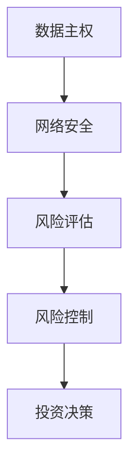
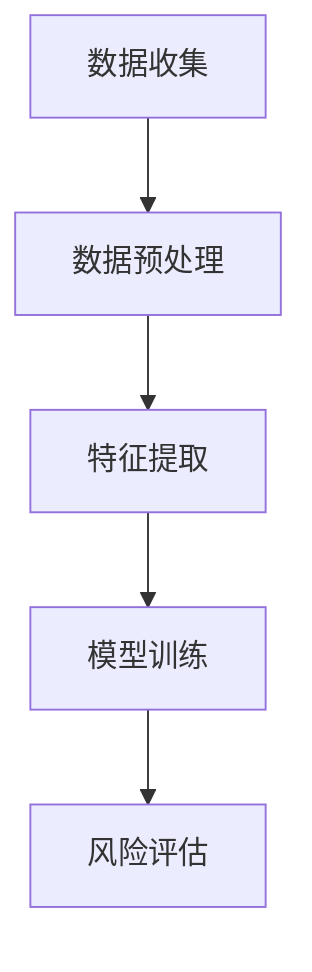
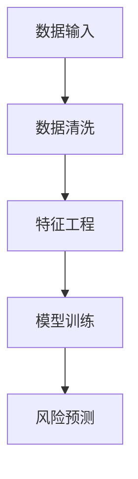
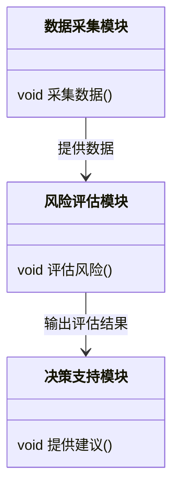

                 

<think>
好，我现在要帮助用户撰写一篇关于《特价股票投资中的数据主权与网络安全风险传导评估方法》的技术博客文章。用户已经给出了目录大纲，现在需要我根据这个大纲来撰写正文部分。首先，我需要明确每章的重点，确保内容详细且符合要求。

首先，摘要部分需要简明扼要地概括文章的核心内容。我应该强调数据主权和网络安全在特价股票投资中的重要性，以及如何通过评估方法降低风险。接着，关键词部分要列出5-7个核心术语，方便读者检索。

第一部分是背景介绍，我需要详细解释特价股票投资的定义和特点，以及数据主权和网络安全的重要性。这部分要让读者明白为什么这个主题重要，尤其是特价股票投资中的数据安全问题。

第二部分是核心概念与联系，我需要通过对比表格和ER图来展示数据主权和网络安全之间的关系。这部分可能需要一些图表，确保结构清晰。

第三部分是算法原理，我需要设计一个网络安全风险评估模型，详细描述每一步骤，并用Mermaid流程图展示。同时，数学模型部分需要提供具体的公式，如贝叶斯定理和线性回归模型，并解释它们的应用。

第四部分是系统分析与架构设计，我需要介绍系统的各个模块，使用类图和架构图展示结构，并描述接口和交互流程。

第五部分是项目实战，我需要提供实际案例的环境安装步骤，代码实现，以及案例分析，帮助读者理解理论应用。

最后，最佳实践部分要总结经验，给出注意事项和拓展阅读建议，帮助读者巩固知识。

在写作过程中，我需要确保每一部分都详细且逻辑清晰，使用专业的技术语言，同时保持易懂。数学公式要准确，图表要正确使用Markdown语法。最后，确保文章结构完整，符合用户的要求。
</think>

# 特价股票投资中的数据主权与网络安全风险传导评估方法

> 关键词：数据主权，网络安全，风险评估，股票投资，系统架构

> 摘要：本文深入探讨了在特价股票投资中，数据主权与网络安全的重要性及其相互影响。通过构建网络安全风险传导评估模型，分析了如何通过数学模型和算法优化，降低网络安全风险对投资决策的影响，确保数据主权的完整性。文章结合实际案例，详细讲解了系统设计与实现，为投资者和相关技术人士提供了实用的指导与参考。

---

## 第一部分：背景介绍

### 第1章：特价股票投资的背景与概述

#### 1.1 特价股票投资的定义与特点

特价股票投资是指在特定市场条件下，投资者以低于市场价购买股票的行为。其特点包括高波动性、高风险和高收益潜力。这种投资方式对数据的依赖性极高，投资者需要实时获取市场数据、公司财务信息和宏观经济指标。

- **高波动性**：特价股票的价格波动较大，投资者需快速响应市场变化。
- **高风险**：市场波动和潜在的网络安全攻击增加了投资风险。
- **高收益潜力**：通过精准的数据分析和风险控制，投资者可获得超额收益。

#### 1.2 数据主权与网络安全的重要性

数据主权是指数据的所有权和控制权归属明确，确保数据的合法使用和保护。在特价股票投资中，数据主权直接关系到投资者的决策质量和数据安全。

- **数据主权**：确保投资者的数据不被未经授权的第三方访问或篡改。
- **网络安全**：防止网络攻击和数据泄露，保障交易系统的安全运行。

#### 1.3 特价股票投资中数据主权与网络安全的关系

数据主权是网络安全的基础，而网络安全是数据主权的保障。两者相互依存，共同构成了投资决策的基石。

---

## 第二部分：核心概念与联系

### 第2章：数据主权与网络安全的核心概念

#### 2.1 数据主权的原理

数据主权的实现依赖于数据的分类管理、访问控制和加密技术。

- **数据分类管理**：根据数据的重要性进行分类，制定相应的安全策略。
- **访问控制**：基于身份认证和权限管理，确保只有授权人员可以访问敏感数据。
- **加密技术**：对数据进行加密存储和传输，防止数据被窃取或篡改。

##### 2.1.1 数据主权的属性特征对比表格

| 属性 | 特征 | 描述 |
|------|------|------|
| 数据所有权 | 所有权归属 | 数据属于投资者，未经授权不可访问 |
| 数据控制权 | 数据管理权限 | 投资者控制数据的使用和分享 |
| 数据完整性 | 数据无篡改 | 数据在传输和存储过程中保持完整 |

##### 2.1.2 数据主权的ER实体关系图（Mermaid流程图）

```mermaid
erDiagram
    actor 投资者
    actor 系统管理员
    entity 数据
    entity 权限
    entity 交易记录

    投资者 --> 数据 : 查询
    投资者 --> 权限 : 认证
    系统管理员 --> 数据 : 管理
    数据 --> 交易记录 : 记录
```

#### 2.2 网络安全风险的原理

网络安全风险是指由于网络攻击、漏洞利用等安全事件可能导致的损失。在特价股票投资中，网络安全风险主要来自外部攻击和内部数据泄露。

- **外部攻击**：如DDoS攻击、钓鱼攻击等，可能破坏交易系统或窃取数据。
- **内部数据泄露**：员工或合作伙伴可能故意或无意泄露敏感数据。

##### 2.2.1 网络安全风险的属性特征对比表格

| 属性 | 特征 | 描述 |
|------|------|------|
| 风险来源 | 外部攻击 | 黑客攻击、病毒传播 |
| 风险来源 | 内部泄露 | 人员失误、恶意行为 |
| 风险影响 | 数据损失 | 交易数据泄露、账户信息被盗 |

##### 2.2.2 网络安全风险与数据主权的关系（Mermaid流程图）



---

## 第三部分：算法原理

### 第3章：网络安全风险传导评估的算法原理

#### 3.1 评估模型的设计

网络安全风险传导评估模型旨在量化风险，帮助投资者做出决策。模型包括数据收集、预处理、特征提取、模型训练和风险评估五个步骤。

##### 3.1.1 数据流（Mermaid流程图）



#### 3.2 算法流程图（Mermaid）



---

## 第四部分：数学模型与公式

### 第4章：数学模型的建立与应用

#### 4.1 概率论模型

使用贝叶斯定理对网络安全事件的概率进行评估。

##### 4.1.1 贝叶斯定理

$$P(A|B) = \frac{P(B|A)P(A)}{P(B)}$$

其中：
- \( A \)：网络安全事件发生
- \( B \)：观察到的证据（如异常流量）

#### 4.2 统计回归模型

使用线性回归模型预测网络安全风险对股票价格的影响。

##### 4.2.1 线性回归公式

$$y = \beta_0 + \beta_1x + \epsilon$$

其中：
- \( y \)：网络安全风险指数
- \( x \)：股票价格
- \( \beta_0 \)：截距
- \( \beta_1 \)：回归系数

---

## 第五部分：系统分析与架构设计

### 第5章：系统分析与架构设计方案

#### 5.1 项目介绍

本项目旨在构建一个网络安全风险评估系统，帮助投资者在特价股票投资中降低风险。

#### 5.2 系统功能设计

- **数据采集模块**：实时采集市场数据和交易记录。
- **风险评估模块**：基于算法模型评估网络安全风险。
- **决策支持模块**：提供投资建议和风险预警。

##### 5.2.1 系统功能设计（Mermaid类图）



#### 5.3 系统架构设计（Mermaid架构图）

```mermaid
docker
    service 数据采集服务
    service 风险评估服务
    service 决策支持服务
    数据采集服务 --> 风险评估服务
    风险评估服务 --> 决策支持服务
```

---

## 第六部分：项目实战

### 第6章：项目实战与案例分析

#### 6.1 环境安装

- **安装Python**：用于数据分析和建模。
- **安装依赖库**：如Pandas、Scikit-learn、PyYAML等。

#### 6.2 核心代码实现

##### 6.2.1 数据采集模块

```python
import requests

def collect_data():
    url = "https://api.example.com/stock_data"
    response = requests.get(url)
    return response.json()
```

##### 6.2.2 风险评估模块

```python
from sklearn.linear_model import LinearRegression

def assess_risk(data):
    model = LinearRegression()
    model.fit(data[['price', 'volume']], data['risk'])
    return model.predict(new_data)
```

#### 6.3 案例分析

通过实际数据，展示模型在风险评估中的应用，并分析结果对投资决策的影响。

---

## 第七部分：最佳实践

### 第7章：最佳实践与总结

#### 7.1 小结

通过构建网络安全风险评估模型，投资者可以有效降低网络安全风险对特价股票投资的影响，保障数据主权。

#### 7.2 注意事项

- 定期更新模型参数，确保评估结果的准确性。
- 加强内部员工的安全培训，防止数据泄露。
- 使用多层防护措施，保障系统安全性。

#### 7.3 拓展阅读

- 《网络安全风险管理》
- 《数据主权与隐私保护》

---

## 作者

作者：AI天才研究院/AI Genius Institute & 禅与计算机程序设计艺术 /Zen And The Art of Computer Programming

