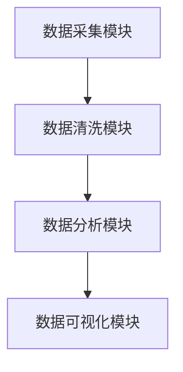
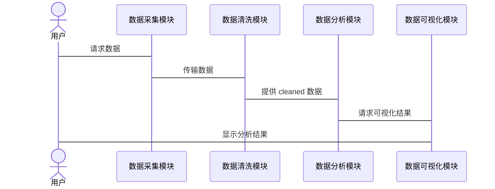

                 


# 特价股票投资中的数据分析和大数据应用

> 关键词：数据分析，大数据，股票投资，算法，机器学习，数据可视化

> 摘要：本文深入探讨了特价股票投资中的数据分析和大数据应用，结合实际案例和算法实现，详细分析了如何利用数据分析技术提高股票投资的效率和准确性。文章涵盖了数据分析的核心概念、常见算法、系统设计和项目实战，帮助读者全面了解特价股票投资中的数据驱动策略。

---

## 第一部分: 特价股票投资中的数据分析与大数据应用概述

### 第1章: 特价股票投资的背景与意义

#### 1.1 特价股票的定义与特征

##### 1.1.1 特价股票的定义
特价股票通常指价格低于市场平均水平的股票，这类股票可能因市场波动、公司基本面变化或其他因素而被低估。特价股票的投资机会往往在于其价格的潜在回升空间。

##### 1.1.2 特价股票的市场特征
- **低估值**：市盈率、市净率等指标低于行业平均水平。
- **高波动性**：价格波动较大，可能因市场情绪或外部事件影响。
- **投资风险**：高波动性意味着高风险，投资者需谨慎选择。

##### 1.1.3 特价股票的投资价值分析
投资者通过分析公司财务数据、行业趋势和市场情绪，寻找具有潜在上涨空间的特价股票。

#### 1.2 大数据在股票投资中的作用

##### 1.2.1 大数据的概念与特点
大数据是指数据量大、类型多样、处理速度快的数据集合。其特点包括**4V**（Volume、Variety、Velocity、Value）。

##### 1.2.2 大数据在金融领域的应用
- **数据挖掘**：通过分析历史数据发现投资规律。
- **实时交易**：利用大数据技术实现高频交易。
- **风险控制**：通过大数据分析评估投资风险。

##### 1.2.3 大数据如何助力特价股票投资
大数据技术可以帮助投资者快速获取和分析大量数据，发现潜在投资机会，优化投资决策。

#### 1.3 数据分析在股票投资中的重要性

##### 1.3.1 数据分析的基本概念
数据分析是通过分析数据，提取有价值的信息的过程。在股票投资中，数据分析用于评估市场趋势、公司基本面和风险因素。

##### 1.3.2 数据分析在股票投资中的应用场景
- **趋势预测**：通过历史数据分析预测股票价格走势。
- **风险评估**：分析公司财务数据和市场环境，评估投资风险。
- **投资决策支持**：提供数据支持，帮助投资者做出明智决策。

##### 1.3.3 数据分析对投资决策的影响
数据分析能够帮助投资者基于数据做出理性决策，减少主观判断的偏差，提高投资效率。

#### 1.4 本章小结
本章介绍了特价股票的定义和市场特征，分析了大数据在股票投资中的作用，强调了数据分析在投资决策中的重要性。

---

## 第二部分: 特价股票数据分析的核心概念与方法

### 第2章: 特价股票数据分析的核心概念

#### 2.1 数据分析的基本原理

##### 2.1.1 数据分析的流程
1. **数据收集**：获取相关数据。
2. **数据清洗**：处理缺失值、异常值等。
3. **数据分析**：通过统计分析或机器学习模型分析数据。
4. **数据可视化**：将分析结果以图表形式展示。

##### 2.1.2 数据分析的关键要素
- **数据来源**：数据的质量和可靠性直接影响分析结果。
- **分析方法**：选择合适的分析方法（如统计分析、机器学习）。
- **分析目标**：明确分析目标，确保分析结果与投资需求一致。

#### 2.2 大数据技术在股票分析中的应用

##### 2.2.1 数据挖掘技术
数据挖掘技术用于从大量数据中提取隐藏的模式和规律。例如，通过关联规则挖掘发现相关股票之间的关联性。

##### 2.2.2 机器学习算法
机器学习算法（如支持向量机、随机森林）用于股票价格预测和风险评估。

##### 2.2.3 自然语言处理技术
自然语言处理技术用于分析新闻、社交媒体等非结构化数据，提取市场情绪信息。

#### 2.3 特价股票数据分析的特征

##### 2.3.1 数据的实时性
股票市场数据具有高度的实时性，需要快速处理和分析。

##### 2.3.2 数据的多样性
股票数据包括价格、成交量、财务数据、新闻等多种类型的数据。

##### 2.3.3 数据的复杂性
股票市场受多种因素影响，数据关系复杂，分析难度大。

#### 2.4 本章小结
本章介绍了数据分析的基本原理，分析了大数据技术在股票分析中的应用，总结了特价股票数据分析的特征。

---

## 第三部分: 特价股票数据分析的算法与模型

### 第3章: 常见股票数据分析算法

#### 3.1 移动平均线（MA）算法

##### 3.1.1 MA算法的原理
移动平均线是一种常用的技术分析工具，通过计算一定时间内股票价格的平均值，预测价格走势。

##### 3.1.2 MA算法的实现步骤
1. 收集股票价格数据。
2. 计算一定周期内的平均价格。
3. 绘制移动平均线图表。

##### 3.1.3 MA算法在特价股票中的应用
通过移动平均线分析股票价格趋势，判断买入或卖出时机。

#### 3.2 K线图分析算法

##### 3.2.1 K线图的基本构成
K线图由开盘价、收盘价、最高价和最低价构成，用于展示股票价格的波动情况。

##### 3.2.2 K线图的形态分析
通过分析K线图的形态（如头肩顶、双底等），预测股票价格走势。

##### 3.2.3 K线图在特价股票中的应用
利用K线图分析股票价格波动，识别买卖信号。

#### 3.3 K-means聚类算法

##### 3.3.1 K-means算法的原理
K-means是一种无监督学习算法，通过将数据分成K个簇，实现数据的聚类分析。

##### 3.3.2 K-means算法的实现步骤
1. 初始化K个簇中心。
2. 计算每个数据点到簇中心的距离，将数据点分配到最近的簇。
3. 重新计算簇中心，直到收敛。

##### 3.3.3 K-means算法在股票分类中的应用
将股票按照某种特征（如行业、市值）进行聚类，帮助投资者发现潜在投资机会。

#### 3.4 决策树回归算法

##### 3.4.1 决策树回归的原理
决策树回归是一种基于树结构的回归分析方法，通过构建树状模型预测股票价格。

##### 3.4.2 决策树回归的实现步骤
1. 收集相关数据。
2. 构建决策树模型。
3. 使用模型进行预测。

##### 3.4.3 决策树回归在股票预测中的应用
通过分析历史数据，预测股票价格走势，辅助投资决策。

---

## 第四部分: 特价股票数据分析的系统设计与实现

### 第4章: 特价股票数据分析系统的架构设计

#### 4.1 系统功能设计

##### 4.1.1 数据采集模块
负责从数据源（如股票交易所、新闻网站）获取股票相关数据。

##### 4.1.2 数据清洗模块
对获取的数据进行预处理，消除噪声数据。

##### 4.1.3 数据分析模块
使用机器学习算法对数据进行分析，生成分析结果。

##### 4.1.4 数据可视化模块
将分析结果以图表形式展示，方便用户理解和决策。

#### 4.2 系统架构设计

##### 4.2.1 系统架构图（Mermaid）


##### 4.2.2 系统功能交互图（Mermaid）


#### 4.3 系统实现

##### 4.3.1 数据采集模块实现
使用Python的`pandas`库和`requests`库获取股票数据。

##### 4.3.2 数据清洗模块实现
使用`pandas`的数据清洗功能，处理缺失值和异常值。

##### 4.3.3 数据分析模块实现
使用机器学习算法（如K-means）对数据进行分类和预测。

##### 4.3.4 数据可视化模块实现
使用`matplotlib`或`seaborn`库绘制股票价格趋势图和聚类图。

#### 4.4 本章小结
本章详细设计了特价股票数据分析系统的架构，介绍了各模块的功能和实现方法。

---

## 第五部分: 特价股票数据分析的项目实战

### 第5章: 特价股票数据分析项目实战

#### 5.1 项目背景与目标
本项目旨在利用数据分析技术，筛选具有投资价值的特价股票。

#### 5.2 数据采集与预处理
从股票交易所获取历史数据，清洗数据并提取特征。

#### 5.3 数据分析与建模
使用K-means算法对股票进行聚类分析，识别具有相似特征的股票。

#### 5.4 数据可视化与结果分析
将聚类结果以图表形式展示，分析不同簇的特征，判断投资价值。

#### 5.5 项目总结
总结项目实施过程，分析结果，提出投资建议。

---

## 第六部分: 特价股票数据分析的最佳实践

### 第6章: 数据分析在特价股票投资中的最佳实践

#### 6.1 投资策略优化
通过数据分析优化投资策略，降低风险，提高收益。

#### 6.2 风险管理
利用数据分析技术实时监控市场风险，及时调整投资组合。

#### 6.3 拓展阅读
推荐相关书籍和资源，帮助读者深入学习数据分析和股票投资知识。

#### 6.4 本章小结
本章总结了数据分析在特价股票投资中的应用，提出了最佳实践建议。

---

## 作者：AI天才研究院/AI Genius Institute & 禅与计算机程序设计艺术 /Zen And The Art of Computer Programming

---

### 附录: 代码示例

#### 附录A: 移动平均线算法代码
```python
import pandas as pd
import matplotlib.pyplot as plt

# 数据加载
data = pd.read_csv('stock_prices.csv')

# 计算5日移动平均线
data['MA5'] = data['Close'].rolling(window=5).mean()

# 绘制图表
plt.plot(data['Date'], data['Close'], label='Close Price')
plt.plot(data['Date'], data['MA5'], label='5-Day Moving Average')
plt.xlabel('Date')
plt.ylabel('Price')
plt.legend()
plt.show()
```

#### 附录B: K-means聚类算法代码
```python
from sklearn.cluster import KMeans
import pandas as pd

# 数据加载
data = pd.read_csv('stock_data.csv')

# 提取特征
X = data[['Revenue', 'NetProfit', 'MarketCap']]

# 模型训练
kmeans = KMeans(n_clusters=3, random_state=0)
kmeans.fit(X)

# 预测簇标签
labels = kmeans.predict(X)

# 可视化
plt.scatter(X['Revenue'], X['NetProfit'], c=labels)
plt.xlabel('Revenue')
plt.ylabel('Net Profit')
plt.show()
```

---

通过本文的分析，读者可以全面了解特价股票投资中的数据分析和大数据应用，掌握相关的算法和系统设计方法，并通过实际案例学习如何将数据分析技术应用于股票投资中。

