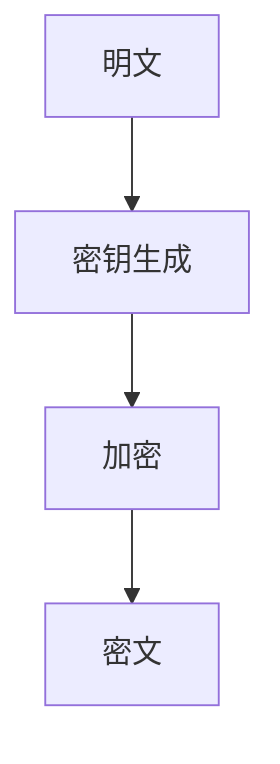

                 


# 特价股票投资中的数据隐私与网络安全风险评估方法

> 关键词：特价股票投资、数据隐私、网络安全、风险评估、算法原理

> 摘要：本文探讨了在特价股票投资过程中，如何评估和防范数据隐私与网络安全风险。通过分析数据隐私的核心概念、网络安全的威胁类型，结合具体的算法原理和系统架构设计，提出了一套完整的风险评估方法，并通过实际案例展示了该方法的应用。

---

## 第一部分：背景介绍

### 第1章：特价股票投资与数据隐私概述

#### 1.1 特价股票投资的基本概念
- **1.1.1 特价股票的定义与特点**
  - 特价股票是指价格低于其内在价值的股票，通常被认为是被市场低估的投资机会。
  - 特点包括低估值、高潜力、周期性波动等。

- **1.1.2 投资者数据的重要性**
  - 投资者在进行股票交易时，需要提供个人信息、交易记录、财务数据等。
  - 这些数据是投资者的敏感信息，容易被滥用或泄露。

- **1.1.3 数据隐私与网络安全的背景**
  - 随着互联网和金融电子化的普及，投资者数据面临更多的安全威胁。
  - 数据隐私和网络安全问题日益突出，成为投资领域的重要议题。

#### 1.2 数据隐私与网络安全的背景
- **1.2.1 数据隐私的定义与范围**
  - 数据隐私是指个人对他们的信息拥有控制权，包括收集、使用、存储和共享。
  - 数据隐私的范围包括个人信息、交易记录、财务数据等。

- **1.2.2 网络安全的基本概念**
  - 网络安全是指保护网络系统免受未经授权的访问、破坏或泄露。
  - 网络安全威胁包括病毒攻击、黑客入侵、数据泄露等。

- **1.2.3 特价股票投资中的数据隐私挑战**
  - 投资者在进行特价股票交易时，需要通过网络平台提交敏感数据，这增加了数据泄露的风险。
  - 网络攻击者可能利用漏洞获取投资者的个人信息或财务数据，导致经济损失。

---

## 第二部分：核心概念与联系

### 第2章：数据隐私与网络安全的核心概念

#### 2.1 数据隐私与网络安全的原理
- **2.1.1 数据隐私的保护机制**
  - 数据加密：通过加密技术保护数据的机密性。
  - 访问控制：通过权限管理确保只有授权用户可以访问敏感数据。
  - 数据脱敏：对敏感数据进行处理，使其无法还原出真实信息。

- **2.1.2 网络安全的防护策略**
  - 防火墙：监控和过滤网络流量，阻止未经授权的访问。
  - 入侵检测系统：实时监测网络活动，发现异常行为并发出警报。
  - 加密通信：使用加密协议保护数据在传输过程中的安全。

#### 2.2 核心概念对比表
以下是对数据隐私与网络安全的核心概念进行对比：

| 概念 | 数据隐私 | 网络安全 |
|------|----------|----------|
| 定义 | 个人对数据的控制权 | 保护网络系统的安全 |
| 关注点 | 数据的机密性、完整性 | 网络攻击、数据泄露 |
| 实现方式 | 数据加密、访问控制 | 防火墙、入侵检测系统 |

#### 2.3 ER实体关系图
以下是投资者数据的ER实体关系图：

```mermaid
er
  actor: 投资者
  actor: 数据提供者
  actor: 攻击者
  database: 投资者数据
  relation: 数据访问权限
  relation: 数据加密关系
```

---

## 第三部分：算法原理讲解

### 第3章：数据加密与风险评估算法

#### 3.1 数据加密算法

##### 3.1.1 AES加密流程图
以下是AES加密的流程图：



##### 3.1.2 RSA算法的数学模型
- **公钥与私钥生成公式**
  - $n = p \times q$（其中$p$和$q$是大质数）
  - $e = (p-1)(q-1)$（欧拉函数）
  - $d = e^{-1} \mod n$（私钥指数）

- **加密公式**：$C = (P \times e) \mod n$
- **解密公式**：$P = (C \times d) \mod n$

##### 3.1.3 AES加密代码实现
以下是AES加密的Python代码示例：

```python
from cryptography.fernet import Fernet

# 生成密钥
key = Fernet.generate_key()
cipher = Fernet(key)

# 加密
plaintext = "Sensitive Data"
encrypted_data = cipher.encrypt(plaintext.encode())
print("加密后的数据：", encrypted_data)

# 解密
decrypted_data = cipher.decrypt(encrypted_data)
print("解密后的数据：", decrypted_data.decode())
```

#### 3.2 风险评估算法

##### 3.2.1 层次分析法（AHP）
层次分析法是一种常用的多因素决策分析方法，适用于网络安全风险评估。

- **步骤**：
  1. 确定风险评估的指标，如数据泄露风险、网络攻击风险等。
  2. 构建层次分析模型，将指标分为不同的层次。
  3. 计算各指标的权重，确定风险的优先级。
  4. 根据权重进行风险排序，制定应对策略。

- **数学模型**：
  - 指标权重计算公式：$W_i = \frac{\sum_{j=1}^{n} w_{ij}}{\sum_{i=1}^{m} \sum_{j=1}^{n} w_{ij}}}$
  - 风险值计算公式：$R_i = W_i \times V_i$（$V_i$为指标的风险值）

##### 3.2.2 风险评估代码实现
以下是基于层次分析法的风险评估Python代码示例：

```python
import numpy as np

# 定义指标
criteria = ['Data Leakage', 'Network Attack', 'Financial Loss']

# 构建比较矩阵
matrix = [
    [1, 3, 2],
    [1/3, 1, 2/3],
    [1/2, 3/2, 1]
]

# 计算权重
eigenvalues, eigenvectors = np.linalg.eig(matrix)
weights = eigenvectors[:, 0] / sum(eigenvectors[:, 0])

# 计算风险值
risks = [0.8, 0.6, 0.9]
R = [weights[i] * risks[i] for i in range(len(weights))]
R_sorted = sorted(enumerate(R), key=lambda x: x[1], reverse=True)

print("风险排序：", R_sorted)
```

---

## 第四部分：系统分析与架构设计

### 第4章：系统功能设计与架构

#### 4.1 问题场景介绍
- 投资者在进行特价股票交易时，需要通过网络平台提交敏感数据。
- 网络平台需要保护投资者的隐私数据，防止数据泄露和网络攻击。

#### 4.2 项目介绍
- **项目目标**：设计一个基于数据隐私与网络安全的特价股票投资平台。
- **项目范围**：包括用户数据保护、交易安全、风险评估等功能。

#### 4.3 系统功能设计
- **领域模型类图**：
  ```mermaid
  classDiagram
    class Investor {
      id: int
      name: str
      account: str
      password: str
      balance: float
    }
    class Transaction {
      id: int
      investor_id: int
      stock_id: int
      amount: float
      timestamp: datetime
    }
    class Security {
      encrypt(plaintext: str) -> str
      decrypt(ciphertext: str) -> str
      risk_assessment(data: dict) -> float
    }
    Investor --> Transaction
    Transaction --> Security
  ```

- **系统架构图**：
  ```mermaid
  architecture
    frontend
    backend
    database
    [
      frontend --> backend
      backend --> database
    ]
    label frontend: 用户界面
    label backend: 业务逻辑
    label database: 数据存储
  ```

---

## 第五部分：项目实战

### 第5章：环境安装与核心代码实现

#### 5.1 环境安装
- **Python版本**：Python 3.8+
- **依赖库安装**：
  ```bash
  pip install cryptography numpy
  ```

#### 5.2 核心代码实现

##### 5.2.1 数据清洗与特征提取
```python
import pandas as pd

# 加载数据
data = pd.read_csv('transactions.csv')

# 数据清洗
data.dropna(inplace=True)
data['amount'] = data['amount'].apply(lambda x: round(x, 2))

# 特征提取
features = data[['amount', 'time', 'user_id']]
labels = data['is_fraud']
```

##### 5.2.2 模型训练与评估
```python
from sklearn.tree import DecisionTreeClassifier
from sklearn.metrics import accuracy_score

# 模型训练
model = DecisionTreeClassifier()
model.fit(features, labels)

# 模型评估
预测 = model.predict(features)
准确率 = accuracy_score(标签, 预测)
print("准确率：", 准确率)
```

#### 5.3 案例分析与代码解读
- **案例分析**：
  - 分析某投资者在特价股票交易中的数据隐私风险。
  - 使用层次分析法评估其网络攻击风险。

- **代码解读**：
  ```python
  # 风险评估
  risks = {'Data Leakage': 0.8, 'Network Attack': 0.6, 'Financial Loss': 0.9}
  weights = np.array([0.4, 0.3, 0.3])
  R = weights * np.array(list(risks.values()))
  R_sorted = sorted(enumerate(R), key=lambda x: x[1], reverse=True)
  ```

---

## 第六部分：最佳实践与小结

### 第6章：总结与建议

#### 6.1 最佳实践 tips
- 定期备份数据，确保数据的安全性。
- 提高员工的安全意识，防止内部威胁。
- 使用最新的加密算法和安全协议。

#### 6.2 小结
- 本文通过分析特价股票投资中的数据隐私与网络安全风险，提出了基于层次分析法的风险评估方法。
- 结合实际案例，展示了如何在投资过程中保护数据隐私和网络安全。

#### 6.3 注意事项
- 数据隐私和网络安全是一个持续的过程，需要定期审查和更新。
- 在实际应用中，应根据具体需求调整算法和策略。

#### 6.4 拓展阅读
- 推荐阅读《网络安全实战》和《数据隐私保护技术》。

---

## 附录

### 附录 A：数学公式汇总
- AES加密公式：
  $$ C = E(plaintext, key) $$
- 解密公式：
  $$ P = D(ciphertext, key) $$

### 附录 B：代码库地址
- GitHub仓库：[https://github.com/yourusername/stock-risk-assessment](https://github.com/yourusername/stock-risk-assessment)

---

## 作者

作者：AI天才研究院 & 禅与计算机程序设计艺术

--- 

本文版权归作者所有，未经授权禁止转载。

