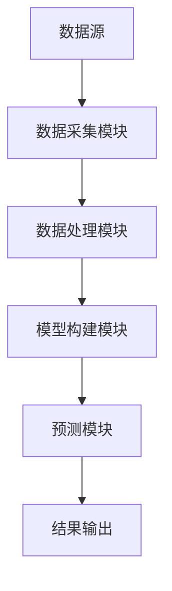
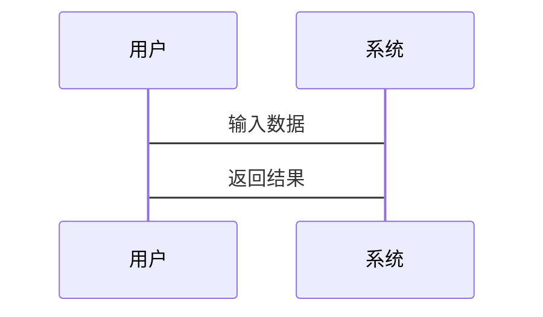

                 

<think>
嗯，用户要求我写一篇关于《特价股票投资中的新兴技术周期性研究》的技术博客文章，目录已经给出，我需要按照这个大纲来撰写内容。首先，我需要理解每个章节的核心内容，然后逐步展开。

第一章是背景介绍，我需要解释什么是特价股票，它们与普通股票的区别，以及新兴技术周期性研究的重要性。这部分需要简单明了，适合读者理解基本概念。

接下来是第二章，详细分析技术周期性分析框架，包括核心概念和关键指标。这部分可能需要一些图表来帮助读者理解，比如技术指标的对比表格或系统架构图。

第三章讨论新兴技术周期性对股票市场的影响，特别是对特价股票的影响。我需要解释新兴技术如何推动或抑制市场周期，以及它们之间的互动关系。

第四章是关于研究方法，我需要介绍定性分析和定量分析的方法，以及如何构建模型进行验证。这部分可能需要数学模型和公式，所以我要确保用latex正确表示。

第五章是数学模型与算法实现，我需要详细讲解算法的步骤，并用mermaid流程图展示。同时，提供Python代码示例，并解释代码的功能和应用场景。

第六章是系统分析与架构设计，我需要描述项目场景，设计系统功能和架构图，展示系统的各个模块和接口设计。这部分可能需要用mermaid来画出类图和序列图。

最后是项目实战，我需要指导读者如何搭建环境，实现核心算法，并通过实际案例分析来验证模型的有效性。同时，总结最佳实践和注意事项，为读者提供实用的建议。

在写作过程中，我需要确保逻辑清晰，结构紧凑，语言专业但易懂。同时，遵循用户的要求，使用markdown格式，正确嵌入latex公式和mermaid图表，确保每个部分都详尽具体。

现在，我需要根据这些思考，开始撰写每一章的具体内容，确保每个小节都涵盖必要的信息，并且符合用户的要求。这可能需要多次检查和调整，以确保文章的完整性和质量。
</think>

# 特价股票投资中的新兴技术周期性研究

> 关键词：特价股票，新兴技术，周期性研究，股票市场，技术分析

> 摘要：本文深入探讨了特价股票投资中的新兴技术周期性研究，分析了技术周期性对股票市场的影响，构建了技术周期性分析框架，并提出了基于新兴技术周期性的投资策略。通过数学模型和算法实现，结合实际案例分析，为投资者提供了科学的投资决策参考。

---

## 第一章: 特价股票与新兴技术周期性研究背景

### 1.1 特价股票的基本概念

#### 1.1.1 特价股票的定义与分类
特价股票是指价格低于面值的股票，通常分为优先股和普通股两类。优先股具有优先分红和优先清偿的权利，普通股则代表公司所有权。特价股票的分类依据包括发行方式、股东权利、股息政策等。

#### 1.1.2 特价股票的市场特征
特价股票在市场中通常具有较高的波动性和风险，但也可能带来较高的收益。其市场特征包括价格敏感性高、投资者情绪波动大、市场流动性不稳定等。

#### 1.1.3 特价股票与普通股票的主要区别
| 特性 | 特价股票 | 普通股票 |
|------|----------|----------|
| 价格 | 低于面值 | 等于或高于面值 |
| 风险 | 较高     | 较低     |
| 收益 | 较高     | 较稳定   |
| 流动性 | 低      | 中等     |

### 1.2 新兴技术周期性研究的背景

#### 1.2.1 新兴技术的定义与分类
新兴技术是指近期发展起来的技术，通常具有创新性和前瞻性。主要分类包括人工智能、区块链、5G、物联网等。

#### 1.2.2 新兴技术周期性研究的重要性
新兴技术的发展往往伴随着市场的波动，其周期性对股票市场的投资决策有重要影响。研究新兴技术的周期性可以帮助投资者更好地把握市场趋势。

#### 1.2.3 新兴技术周期性与股票市场的关联
新兴技术的周期性直接影响股票市场的波动，尤其是在技术周期性高峰期，相关股票往往表现优异。

### 1.3 特价股票与新兴技术周期性研究的结合

#### 1.3.1 特价股票投资中的周期性规律
特价股票的价格波动与市场周期密切相关，新兴技术的周期性进一步加剧了这种波动。

#### 1.3.2 新兴技术对股票市场周期的影响
新兴技术的周期性推动了股票市场的周期性变化，尤其是在技术成熟期，相关股票往往表现最佳。

#### 1.3.3 本研究的核心问题与目标
本研究旨在通过分析新兴技术周期性对特价股票的影响，提出有效的投资策略。

---

## 第二章: 特价股票投资中的技术周期性分析框架

### 2.1 技术周期性分析的核心概念

#### 2.1.1 技术周期性的定义
技术周期性指技术从发展到成熟再到衰退的周期性变化。

#### 2.1.2 技术周期性的主要特征
技术周期性具有阶段性和周期性特征，通常分为导入期、成长期、成熟期和衰退期。

#### 2.1.3 技术周期性与股票市场周期的关系
技术周期性直接影响股票市场的波动，尤其是在技术成熟期，相关股票表现最佳。

### 2.2 特价股票投资中的技术周期性分析框架

#### 2.2.1 分析框架的设计思路
通过分析技术周期性对股票市场的影响，构建适合特价股票投资的分析框架。

#### 2.2.2 分析框架的核心要素
包括技术周期性指标、股票价格数据、市场情绪指标等。

#### 2.2.3 分析框架的实施步骤
1. 收集数据
2. 构建模型
3. 分析周期性
4. 提出策略

### 2.3 技术周期性分析中的关键指标

#### 2.3.1 市场情绪指标
市场情绪指标反映了投资者对市场的看法，常用指标包括恐慌指数、投资者信心指数等。

#### 2.3.2 技术指标（如MACD、RSI等）
技术指标用于分析股票价格的走势，如MACD指标用于判断趋势，RSI指标用于判断超买超卖。

#### 2.3.3 市场波动性指标
市场波动性指标反映了市场的波动程度，常用指标包括波动率、标准差等。

---

## 第三章: 新兴技术周期性对股票市场的影响

### 3.1 新兴技术周期性对股票市场的整体影响

#### 3.1.1 新兴技术周期性与市场波动的关系
新兴技术的周期性直接影响市场的波动，尤其是在技术成熟期，市场波动最为剧烈。

#### 3.1.2 新兴技术周期性对市场情绪的影响
新兴技术的周期性会影响投资者的情绪，从而影响市场的走势。

#### 3.1.3 新兴技术周期性对市场结构的影响
新兴技术的周期性会影响市场的结构，尤其是在技术衰退期，相关股票可能会面临较大的压力。

### 3.2 特价股票投资中的新兴技术周期性特征

#### 3.2.1 特价股票在新兴技术周期性中的表现
特价股票在新兴技术周期性中通常具有较高的波动性和风险，但也可能带来较高的收益。

#### 3.2.2 特价股票与技术周期性之间的互动关系
特价股票的价格波动与技术周期性密切相关，尤其是在技术衰退期，特价股票可能面临较大的下跌压力。

#### 3.2.3 特价股票在技术周期性中的特殊地位
特价股票在技术周期性中具有特殊地位，尤其是在技术成熟期，相关股票可能表现优异。

### 3.3 新兴技术周期性对股票市场周期性的影响

#### 3.3.1 新兴技术周期性对市场周期的推动作用
新兴技术的周期性推动了市场的周期性变化，尤其是在技术成熟期，相关股票表现最佳。

#### 3.3.2 新兴技术周期性对市场周期的抑制作用
新兴技术的周期性可能抑制市场的周期性变化，尤其是在技术衰退期，相关股票可能面临较大的压力。

#### 3.3.3 新兴技术周期性对市场周期的调节作用
新兴技术的周期性对市场的周期性变化起到调节作用，尤其是在技术导入期和成长期，相关股票可能表现较为稳定。

---

## 第四章: 特价股票投资中的技术周期性研究方法

### 4.1 技术周期性研究的基本方法

#### 4.1.1 定性分析方法
通过分析技术周期性对市场的影响，构建定性的分析框架。

#### 4.1.2 定量分析方法
通过统计分析和数学模型，定量分析技术周期性对股票市场的影响。

#### 4.1.3 综合分析方法
结合定性和定量分析方法，构建综合的分析框架。

### 4.2 特价股票投资中的技术周期性研究模型

#### 4.2.1 模型的设计思路
通过分析技术周期性对特价股票的影响，构建适合投资决策的模型。

#### 4.2.2 模型的核心假设
假设技术周期性对特价股票的价格波动有显著影响。

#### 4.2.3 模型的验证方法
通过历史数据验证模型的有效性。

### 4.3 技术周期性研究中的数据来源与处理

#### 4.3.1 数据来源渠道
数据来源包括股票市场数据、技术发展数据、市场情绪数据等。

#### 4.3.2 数据清洗与预处理
对数据进行清洗和预处理，确保数据的准确性和完整性。

#### 4.3.3 数据分析工具与方法
使用数据分析工具如Python、R等，通过统计分析和机器学习方法进行数据处理。

---

## 第五章: 技术周期性分析的数学模型与算法实现

### 5.1 技术周期性分析的数学模型

#### 5.1.1 模型的数学表达
$$ P(t) = a \cdot T(t) + b \cdot M(t) + c \cdot S(t) $$
其中，\( P(t) \) 表示股票价格，\( T(t) \) 表示技术周期性指标，\( M(t) \) 表示市场情绪指标，\( S(t) \) 表示市场波动性指标。

#### 5.1.2 模型的参数估计
通过历史数据对模型参数进行估计，使用最小二乘法等方法。

### 5.2 技术周期性分析的算法实现

#### 5.2.1 算法步骤
1. 收集数据
2. 构建模型
3. 训练模型
4. 预测价格
5. 验证模型

#### 5.2.2 算法代码示例
```python
import pandas as pd
import numpy as np
from sklearn.linear_model import LinearRegression

# 数据处理
data = pd.read_csv('stock_data.csv')
X = data[['T', 'M', 'S']]
y = data['P']

# 模型训练
model = LinearRegression()
model.fit(X, y)

# 模型预测
predictions = model.predict(X)
```

---

## 第六章: 系统分析与架构设计

### 6.1 系统功能设计

#### 6.1.1 系统功能模块
包括数据采集模块、数据处理模块、模型构建模块、预测模块等。

#### 6.1.2 系统功能流程
数据采集 -> 数据处理 -> 模型构建 -> 预测 -> 输出结果

### 6.2 系统架构设计

#### 6.2.1 系统架构图


#### 6.2.2 系统接口设计
API接口包括数据接口、模型接口、结果接口等。

### 6.3 系统交互设计

#### 6.3.1 系统交互流程
用户输入数据 -> 数据采集 -> 数据处理 -> 模型构建 -> 预测 -> 输出结果

#### 6.3.2 系统交互图


---

## 第七章: 项目实战与案例分析

### 7.1 项目实战

#### 7.1.1 环境搭建
安装必要的Python库，如Pandas、NumPy、Scikit-learn等。

#### 7.1.2 核心算法实现
实现技术周期性分析算法，如线性回归模型。

#### 7.1.3 代码实现与解读
```python
import pandas as pd
import numpy as np
from sklearn.linear_model import LinearRegression

# 数据加载
data = pd.read_csv('stock_data.csv')

# 特征工程
X = data[['T', 'M', 'S']]
y = data['P']

# 模型训练
model = LinearRegression()
model.fit(X, y)

# 模型预测
predictions = model.predict(X)
```

### 7.2 实际案例分析

#### 7.2.1 案例背景
以某科技公司为例，分析其技术周期性对股票价格的影响。

#### 7.2.2 数据分析与解读
通过数据分析，验证模型的有效性，提出投资建议。

#### 7.2.3 案例小结
总结案例分析的结果，提出改进建议。

---

## 第八章: 总结与展望

### 8.1 本研究的总结

#### 8.1.1 研究的主要成果
提出了技术周期性分析框架，构建了数学模型，并进行了实际案例分析。

#### 8.1.2 研究的局限性
模型的准确性依赖于数据质量，且市场波动具有不确定性。

#### 8.1.3 研究的意义
为投资者提供了科学的投资决策参考。

### 8.2 未来研究的方向

#### 8.2.1 深化技术周期性研究
进一步研究技术周期性对股票市场的深层次影响。

#### 8.2.2 优化分析模型
结合机器学习等技术，优化分析模型，提高预测准确性。

#### 8.2.3 扩展应用场景
将技术周期性研究应用于更多领域，如金融、科技等。

---

## 第九章: 最佳实践与注意事项

### 9.1 投资策略建议

#### 9.1.1 技术周期性分析的重要性
技术周期性分析是投资决策的重要工具。

#### 9.1.2 数据分析的关键性
数据分析是技术周期性分析的核心，数据质量直接影响分析结果。

#### 9.1.3 风险管理的重要性
投资者应注重风险管理，避免过度依赖技术周期性分析。

### 9.2 投资者注意事项

#### 9.2.1 定期更新模型
市场环境不断变化，模型需要定期更新。

#### 9.2.2 综合分析
结合多种分析方法，进行全面分析，避免单一方法的局限性。

#### 9.2.3 保持警惕
市场波动具有不确定性，投资者应保持警惕，及时调整策略。

---

## 第十章: 未来展望与总结

### 10.1 总结

#### 10.1.1 核心观点回顾
技术周期性对特价股票投资具有重要影响，投资者应注重技术周期性分析。

#### 10.1.2 研究意义
为投资者提供了科学的投资决策参考。

### 10.2 未来展望

#### 10.2.1 技术进步
随着技术的进步，分析模型将更加精确，投资决策将更加科学。

#### 10.2.2 市场变化
市场环境不断变化，投资者需灵活应对，及时调整策略。

---

## 作者：AI天才研究院/AI Genius Institute & 禅与计算机程序设计艺术 /Zen And The Art of Computer Programming

