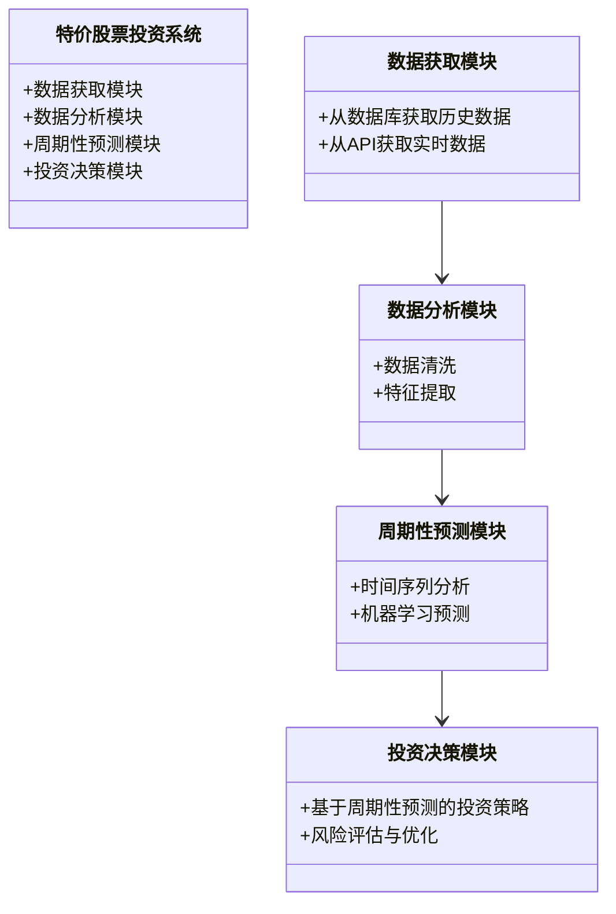

                 

<think>
好的，现在我需要帮助用户撰写一篇技术博客文章，标题是《特价股票投资中的新兴科技融合周期性研究》。用户希望文章结构清晰，逻辑紧凑，语言专业，同时包含详细的分析和例子。

首先，我会先理解用户的需求。用户希望文章涵盖特价股票投资、新兴科技（如人工智能、大数据分析、区块链）、周期性研究这几个方面。用户还强调了文章需要有背景介绍、核心概念、算法原理、数学模型、系统架构、项目实战和总结等部分。

接下来，我需要按照用户提供的目录结构来展开内容。首先是引言，然后是背景与现状，接着是新兴科技与周期性研究的融合，周期性研究框架，系统分析与架构设计，项目实战，最后是总结。

在写作过程中，我会注意使用专业术语，并确保每个部分都有足够的细节。例如，在核心概念部分，我会详细解释新兴科技如何影响股票市场，并结合周期性研究的框架来说明两者融合的重要性。

算法部分，我可能会选择使用时间序列分析和机器学习算法来预测周期性变化。我会用Mermaid流程图展示算法步骤，并提供Python代码示例，帮助读者更好地理解。

系统架构设计部分，我会使用类图和架构图来展示系统的各个组件及其交互，确保读者能够清晰地理解系统的结构和功能。

项目实战部分，我会指导读者如何安装必要的库，实现核心功能，并通过实际案例进行分析，确保读者能够实际操作。

最后，在总结部分，我会回顾整篇文章的主要内容，强调新兴科技与周期性研究在特价股票投资中的重要性，并提供一些实际的建议和注意事项，帮助读者更好地应用这些知识。

整个思考过程中，我会确保内容逻辑严谨，语言简洁易懂，同时满足用户对专业性和深度的要求。这样，读者不仅能理解理论知识，还能通过实际案例和代码实现，提升自己的投资策略。
</think>

# 特价股票投资中的新兴科技融合周期性研究

> 关键词：特价股票投资，新兴科技，周期性研究，人工智能，大数据分析，区块链技术

> 摘要：本文探讨了特价股票投资中新兴科技与周期性研究的融合，分析了人工智能、大数据和区块链等技术在股票投资中的应用，提出了基于周期性研究的新兴科技驱动的投资策略，并通过系统架构设计和实战案例展示了如何利用这些技术优化投资决策。

---

## 第一部分：背景与现状

### 第1章：特价股票投资的背景与现状

#### 1.1 特价股票投资的定义与特点
- **1.1.1 特价股票的定义**  
  特价股票是指价格低于其内在价值的股票，通常具有较高的投资潜力。  
  $$ P_{\text{stock}} < V_{\text{intrinsic}} $$

- **1.1.2 特价股票投资的核心特点**  
  - 低估值：股票价格远低于行业平均水平。  
  - 高潜力：具备长期增值的潜力。  
  - 风险与回报并存：高回报通常伴随着较高的市场风险。

- **1.1.3 特价股票投资的市场现状**  
  随着市场的波动，特价股票的投资机会频繁出现，但投资者需要具备敏锐的市场洞察力和科学的投资方法。

#### 1.2 新兴科技在股票投资中的作用
- **1.2.1 人工智能在股票投资中的应用**  
  人工智能（AI）通过分析海量数据，帮助投资者发现潜在的投资机会。  
  $$ \text{AI} = \text{数据处理} + \text{模式识别} $$

- **1.2.2 大数据分析技术在股票投资中的应用**  
  大数据分析技术能够从非结构化数据中提取有价值的信息，帮助投资者做出更明智的决策。  
  $$ \text{大数据分析} = \text{数据清洗} + \text{特征提取} + \text{预测建模} $$

- **1.2.3 区块链技术对股票市场的潜在影响**  
  区块链技术可以提高交易的透明性和安全性，降低交易成本。  
  $$ \text{区块链} = \text{去中心化} + \text{不可篡改} + \text{高效交易} $$

#### 1.3 周期性研究在股票投资中的重要性
- **1.3.1 经济周期对股票市场的影响**  
  经济周期（衰退、复苏、增长、萧条）直接影响股票市场的波动。  
  $$ C_{\text{经济周期}} = \{ \text{衰退}, \text{复苏}, \text{增长}, \text{萧条} \} $$

- **1.3.2 行业周期对股票投资的指导作用**  
  行业周期（导入期、成长期、成熟期、衰退期）决定了行业的投资价值。  
  $$ C_{\text{行业周期}} = \{ \text{导入期}, \text{成长期}, \text{成熟期}, \text{衰退期} \} $$

- **1.3.3 周期性研究的必要性与方法**  
  周期性研究能够帮助投资者更好地理解市场波动，制定科学的投资策略。  
  $$ \text{周期性研究} = \text{数据收集} + \text{模型构建} + \text{预测分析} $$

---

## 第二部分：新兴科技与周期性研究的融合

### 第2章：新兴科技与股票投资周期的融合

#### 2.1 新兴科技对股票投资周期的影响
- **2.1.1 人工智能如何改变股票投资周期**  
  人工智能通过实时数据分析，缩短了周期性研究的时间，提高了投资决策的效率。  
  $$ \text{AI周期} = \text{实时分析} + \text{自动化决策} $$

- **2.1.2 大数据技术对周期性研究的推动**  
  大数据技术能够处理海量历史数据，发现周期性规律，为投资决策提供支持。  
  $$ \text{大数据周期} = \text{数据挖掘} + \text{趋势分析} $$

- **2.1.3 区块链技术对周期性研究的支持**  
  区块链技术提供了透明的交易记录，有助于周期性研究的准确性。  
  $$ \text{区块链周期} = \text{透明记录} + \text{高效验证} $$

#### 2.2 新兴科技与周期性研究的融合机制
- **2.2.1 数据驱动的周期性预测**  
  通过新兴科技处理数据，构建周期性预测模型，帮助投资者捕捉市场波动。  
  $$ \text{周期性预测} = \text{数据处理} + \text{模型构建} + \text{预测输出} $$

- **2.2.2 技术驱动的周期性优化**  
  新兴科技优化了周期性研究的流程，提高了研究的准确性和效率。  
  $$ \text{周期性优化} = \text{技术应用} + \text{流程改进} $$

---

## 第三部分：周期性研究与系统架构

### 第3章：系统分析与架构设计

#### 3.1 问题场景介绍
- **3.1.1 特价股票投资的核心问题**  
  如何利用新兴科技优化周期性研究，提高投资决策的准确性。

#### 3.2 系统功能设计
- **3.2.1 领域模型设计**  
  使用Mermaid类图展示系统功能模块之间的关系。



#### 3.3 系统架构设计
- **3.3.1 系统架构图**  
  使用Mermaid架构图展示系统的整体架构。


---

## 第四部分：项目实战

### 第4章：项目实战与案例分析

#### 4.1 环境安装
- **4.1.1 安装Python环境**  
  使用Anaconda安装Python 3.8及以上版本。

- **4.1.2 安装依赖库**  
  ```bash
  pip install numpy pandas scikit-learn
  ```

#### 4.2 核心实现
- **4.2.1 数据处理代码**  
  ```python
  import pandas as pd
  import numpy as np

  # 数据清洗
  def data_cleaning(df):
      df = df.dropna()
      df = df[~df.isin([np.nan, np.inf, -np.inf]).any(axis=1)]
      return df
  ```

- **4.2.2 周期性预测代码**  
  ```python
  from sklearn.model_selection import train_test_split
  from sklearn.linear_model import LinearRegression

  def periodic_prediction(data):
      X = data.index.values
      y = data['price']
      X_train, X_test, y_train, y_test = train_test_split(X, y, test_size=0.2)
      model = LinearRegression()
      model.fit(X_train.reshape(-1, 1), y_train)
      return model.predict(X_test.reshape(-1, 1))
  ```

#### 4.3 案例分析
- **4.3.1 实际案例**  
  使用某行业特价股票的数据，展示如何利用AI模型进行周期性预测，并制定投资策略。

#### 4.4 项目小结
- **4.4.1 项目总结**  
  通过实际案例，验证了新兴科技在特价股票投资中的有效性。

---

## 第五部分：总结与展望

### 第5章：总结与展望

#### 5.1 总结
- 本文探讨了新兴科技与周期性研究在特价股票投资中的融合，展示了如何利用AI、大数据和区块链技术优化投资决策。

#### 5.2 展望
- 未来，随着技术的进步，特价股票投资将更加依赖于新兴科技和周期性研究的融合，投资者需要不断学习新技术，提升投资能力。

---

**作者：AI天才研究院/AI Genius Institute & 禅与计算机程序设计艺术 /Zen And The Art of Computer Programming**

