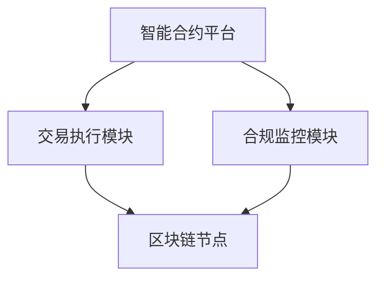

                 


# 特价股票投资中的智能合约自动化合规策略

> 关键词：智能合约，特价股票投资，自动化合规，区块链，金融技术，风险管理

> 摘要：本文探讨智能合约在特价股票投资中的应用，详细分析如何通过智能合约实现合规策略的自动化，涵盖技术原理、系统设计、法律合规、项目实战和未来趋势。

---

# 第一章：智能合约的概述

## 1.1 智能合约的基本概念

### 1.1.1 智能合约的定义

智能合约是一种基于区块链技术的自动执行协议，能够在满足特定条件时自动执行或强制执行合同条款。它通过代码实现合同的履行，无需中介参与。

### 1.1.2 智能合约的特点

智能合约具有以下特点：
- **自动化**：自动执行合同条款，减少人为干预。
- **透明性**：区块链上的交易记录公开透明，可追溯。
- **不可篡改性**：一旦部署，合约代码无法篡改，确保合同履行的可靠性。
- **去中心化**：依赖区块链技术，不依赖单一中心机构。

### 1.1.3 智能合约与传统合约的区别

| 特性 | 智能合约 | 传统合约 |
|------|----------|----------|
| 执行方式 | 自动化执行 | 手动执行 |
| 可靠性 | 高 | 依赖信任 |
| 成本 | 低 | 高 |
| 透明度 | 高 | 低 |

## 1.2 智能合约在金融领域的应用

### 1.2.1 智能合约在金融中的作用

智能合约可以用于支付清算、证券发行、风险管理等领域，提升金融交易的效率和安全性。

### 1.2.2 智能合约的优势与劣势

**优势：**
- 提高效率，减少中间环节。
- 降低人为错误和欺诈风险。
- 增强透明度和信任。

**劣势：**
- 技术复杂，开发和维护成本高。
- 合规性问题，需符合法律法规。
- 需要高度安全的区块链环境。

---

# 第二章：智能合约与特价股票投资的结合

## 2.1 特价股票投资的基本原理

### 2.1.1 市场分析方法

特价股票投资通常基于技术分析和基本面分析。技术分析包括K线图、技术指标等，基本面分析关注财务报表和行业趋势。

### 2.1.2 投资策略的选择

常见策略包括套利策略、事件驱动策略、算法交易策略等。套利策略利用价格差异获利，事件驱动策略关注公司重大事件（如并购）带来的股价波动。

## 2.2 智能合约在特价股票投资中的作用

### 2.2.1 自动化交易的实现

智能合约可以自动执行交易指令，根据预设的条件（如股价达到某个阈值）触发买卖操作。

### 2.2.2 合规性管理的优化

智能合约确保交易符合相关法律法规，自动处理合规性问题，减少人为操作风险。

---

# 第三章：智能合约的法律合规框架

## 3.1 智能合约的法律属性

### 3.1.1 智能合约的法律地位

智能合约在法律上通常被视为电子合同的一种，需遵守相关法律法规，如《电子签名法》。

## 3.2 智能合约的法律挑战

### 3.2.1 合规性问题

智能合约需确保透明性和可追溯性，避免操纵市场等违法行为。

### 3.2.2 法律纠纷的解决

智能合约的自动执行特性可能引发法律纠纷，需明确责任归属和争议解决机制。

---

# 第四章：智能合约的自动化设计

## 4.1 智能合约的模块化设计

### 4.1.1 模块划分的原则

将智能合约划分为交易执行模块、合规监控模块等，确保功能分离，便于维护。

### 4.1.2 模块之间的交互

通过事件触发机制，模块间协同工作，确保合约的正确执行。

## 4.2 智能合约的事件驱动机制

### 4.2.1 事件触发的条件

根据市场数据变化（如股价波动）或时间触发（如到期日）。

### 4.2.2 事件处理的流程

事件触发 → 状态检查 → 执行操作 → 记录日志。

---

# 第五章：系统架构设计与实现

## 5.1 系统架构的整体设计

### 5.1.1 系统架构图



## 5.2 核心模块的设计

### 5.2.1 智能合约模块

负责解析交易指令，执行智能合约。

### 5.2.2 交易执行模块

根据合约条件，执行买入或卖出操作。

---

# 第六章：项目实战

## 6.1 环境搭建

安装Solidity编译器和区块链开发环境，如以太坊。

## 6.2 系统核心实现源代码

```solidity
// 智能合约代码示例
contract StockInvestment {
    function buy(uint256 amount) public {
        // 执行买入操作
    }

    function sell(uint256 amount) public {
        // 执行卖出操作
    }
}
```

## 6.3 代码应用解读与分析

解释代码功能，如`buy`函数用于买入股票，`sell`函数用于卖出。

---

# 第七章：案例分析与经验总结

## 7.1 案例分析

### 7.1.1 案例介绍

某公司使用智能合约实现特价股票的自动交易，显著提高了效率和合规性。

### 7.1.2 案例分析

通过数据和图表展示案例效果，总结成功经验和教训。

---

# 第八章：合规策略的优化与未来展望

## 8.1 合规策略的优化

### 8.1.1 合规性优化方向

引入更严格的合规检查，增强合约的透明性和可追溯性。

## 8.2 技术创新与合规趋势

探讨未来智能合约在金融领域的潜在应用，如AI驱动的合规监控。

## 8.3 对未来展望

智能合约将在金融领域发挥更大作用，合规性管理将更加智能化和自动化。

---

# 总结

智能合约通过自动化和去中心化的特点，为特价股票投资提供了高效的合规管理解决方案。未来，随着技术进步和法规完善，智能合约的应用将更加广泛。

---

# 作者

作者：AI天才研究院/AI Genius Institute & 禅与计算机程序设计艺术 /Zen And The Art of Computer Programming

