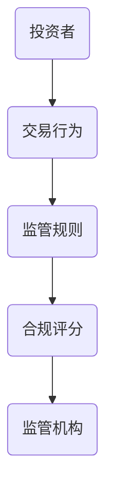
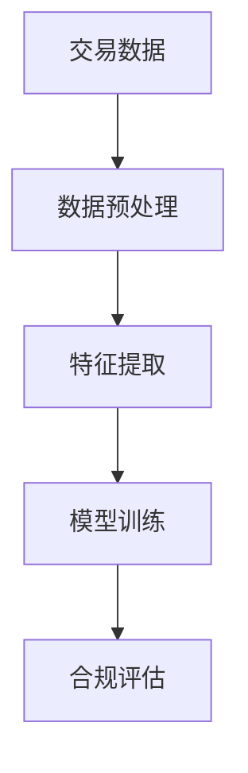
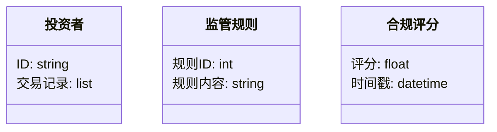
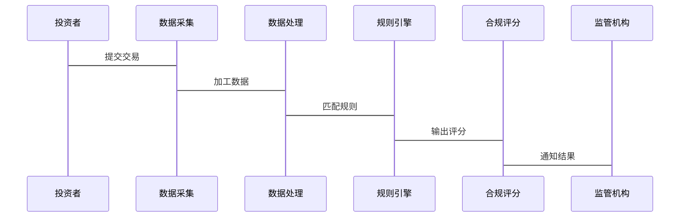

                 

<think>
好，我现在需要帮用户撰写一篇关于《特价股票投资中的智能监管合规策略》的技术博客文章。用户已经给出了一个详细的目录结构，现在我需要按照这个结构，逐步分析每个部分，并撰写相应的内容。

首先，我需要理解用户的需求。用户希望这篇文章结构清晰，逻辑严谨，涵盖背景、核心概念、算法、数学模型、系统架构、项目实战以及总结。此外，用户强调使用专业且易于理解的技术语言，每个章节都需要详细展开，确保内容充实。

我从第一章开始。这一章主要介绍特价股票投资和智能监管的背景。我需要先定义什么是特价股票，然后分析其在市场中的现状，接着讨论投资中的风险和机会。这部分需要确保读者能够理解特价股票的基本概念及其在投资中的重要性。

接下来，第二章讨论智能监管合规策略的核心概念与联系。这里需要解释智能监管的原理，包括规则分析和合规性评估，同时比较智能监管与传统监管的区别。还需要用表格和图示来展示核心要素，帮助读者更好地理解。

第三章是关于算法原理。我需要详细讲解基于规则的匹配算法和机器学习的应用，比如支持向量机和决策树。这部分需要结合实际案例，展示如何将这些算法应用到监管中，确保内容既有理论又有实践。

第四章涉及数学模型，特别是合规评分模型。我需要推导出模型的公式，并用LaTeX展示，同时解释每个变量的含义和模型的应用场景。

第五章是系统分析与架构设计。我需要设计系统的各个模块，如数据采集和规则引擎，并使用mermaid图展示类图、架构和交互过程，确保系统的结构清晰且易于理解。

第六章是项目实战，包括环境配置、代码实现和案例分析。我需要提供详细的代码示例，并解释每个部分的功能，帮助读者实际操作。

最后，第七章总结全书的内容，并给出进一步学习的建议。我需要回顾前面的章节，强调智能监管的重要性，并指出未来的研究方向。

在撰写过程中，我需要确保每个部分都符合用户的格式要求，使用markdown格式，包括数学公式和图表。同时，语言要专业但易于理解，避免过于复杂的术语，使读者能够轻松跟上思路。

此外，我需要检查每个章节是否覆盖了用户要求的核心内容，包括背景、核心概念、算法、数学模型、系统架构、项目实战和总结。确保每个部分都有足够的细节，同时保持逻辑清晰，结构紧凑。

最后，我会在文章末尾添加作者信息，符合用户的格式要求。整个思考过程需要一步步来，确保每个部分都详细且准确，最终完成一篇高质量的技术博客文章。
</think>

# 特价股票投资中的智能监管合规策略

## 关键词：智能监管，合规策略，特价股票，金融投资，算法模型

## 摘要：本文探讨了在特价股票投资中如何运用智能监管合规策略，从背景、核心概念、算法原理到系统架构和项目实战，深入分析了智能监管在金融投资中的应用，提出了高效的合规评分模型和系统设计，为投资者和监管机构提供了参考。

---

## 第1章: 特价股票投资与智能监管概述

### 1.1 特价股票投资的背景与特点

#### 1.1.1 特价股票的定义与分类
特价股票通常指价格低于市场平均水平的股票，常见于低价股和 penny stocks。根据市值和流动性，特价股票可分为蓝筹股、成长股和周期股。

#### 1.1.2 特价股票投资的市场现状
全球市场中，特价股票因其低门槛和高增长潜力受到散户和机构投资者的关注，但波动性和流动性风险较高。

#### 1.1.3 特价股票投资的风险与机遇
风险包括市场波动、信息不对称和流动性不足；机遇在于潜在的高回报和市场复苏。

### 1.2 智能监管的背景与意义
#### 1.2.1 监管合规的定义与目标
监管合规确保金融市场的公平性和透明性，保护投资者利益。

#### 1.2.2 智能监管的起源与发展
随着技术进步，智能监管利用AI和大数据分析，提高监管效率和准确性。

#### 1.2.3 智能监管在金融领域的应用
广泛应用于反洗钱、欺诈检测和市场操纵识别。

### 1.3 特价股票投资中的智能监管需求
#### 1.3.1 特价股票投资中的合规问题
低价股市场信息不透明，容易出现操纵行为。

#### 1.3.2 智能监管在特价股票投资中的作用
通过实时监控和预测分析，识别异常交易和市场操纵。

#### 1.3.3 智能监管的核心目标与实现路径
目标是确保交易合规，路径包括数据采集、规则匹配和机器学习建模。

### 1.4 本章小结
介绍了特价股票投资和智能监管的基本概念，强调了智能监管在投资中的重要性。

---

## 第2章: 智能监管合规策略的核心概念与联系

### 2.1 智能监管合规策略的原理
#### 2.1.1 监管规则的智能化分析
通过规则引擎和自然语言处理技术，提取监管规则并进行标准化处理。

#### 2.1.2 合规性评估的数学模型
构建合规评分模型，结合交易数据和监管规则，评估交易行为的合规性。

#### 2.1.3 智能监管与传统监管的对比
智能监管更高效、精准，但需要大量数据和技术支持。

### 2.2 智能监管合规策略的核心要素
#### 2.2.1 数据采集与处理
包括交易数据、市场数据和新闻数据的收集和清洗。

#### 2.2.2 规则引擎的设计
规则引擎将监管规则转化为可执行的条件，进行实时匹配。

#### 2.2.3 合规评分模型的构建
使用机器学习模型，基于历史数据训练，预测交易行为的合规性。

### 2.3 智能监管合规策略的实体关系图


### 2.4 本章小结
阐述了智能监管的核心概念和要素，展示了实体关系图。

---

## 第3章: 智能监管合规策略的算法原理

### 3.1 基于规则的匹配算法
#### 3.1.1 规则匹配的原理
规则引擎通过预定义规则，快速匹配交易数据，判断合规性。

#### 3.1.2 正则表达式在规则匹配中的应用
使用正则表达式识别特定交易模式，如频繁买卖同一股票。

#### 3.1.3 规则匹配的实现流程
数据预处理、规则提取、规则匹配和结果反馈。

### 3.2 基于机器学习的合规性评估
#### 3.2.1 机器学习在合规性评估中的应用
使用支持向量机(SVM)和随机森林(RF)模型，分类交易行为。

#### 3.2.2 常见的机器学习算法选择
SVM适用于小样本，随机森林适用于高维数据。

#### 3.2.3 机器学习模型的训练与优化
数据清洗、特征选择、模型训练和参数调优。

### 3.3 算法实现的流程图


### 3.4 本章小结
介绍了基于规则和机器学习的算法，展示了流程图。

---

## 第4章: 智能监管合规策略的数学模型

### 4.1 合规评分模型的构建
#### 4.1.1 模型的数学表达
$$ \text{合规评分} = \alpha \cdot \text{交易频率} + \beta \cdot \text{交易金额} $$

#### 4.1.2 模型的参数优化
使用梯度下降法优化α和β，提升模型准确率。

#### 4.1.3 模型的验证与测试
采用交叉验证评估模型性能，确保其泛化能力。

### 4.2 合规评分模型的实现
#### 4.2.1 数据输入与特征提取
提取交易频率、金额和时间间隔等特征。

#### 4.2.2 模型训练与预测
使用训练数据训练模型，预测新交易的合规评分。

#### 4.2.3 模型结果分析
通过混淆矩阵分析模型性能，调整阈值优化分类效果。

### 4.3 本章小结
构建了合规评分模型，展示了其数学表达和实现流程。

---

## 第5章: 智能监管合规策略的系统架构设计

### 5.1 系统功能设计
#### 5.1.1 领域模型设计


#### 5.1.2 系统架构设计


### 5.2 系统接口设计
#### 5.2.1 数据接口
定义REST API接口，实现数据的采集和传输。

#### 5.2.2 规则引擎接口
提供规则配置接口，支持动态调整监管规则。

### 5.3 系统交互流程


### 5.4 本章小结
设计了系统的架构和接口，展示了交互流程。

---

## 第6章: 智能监管合规策略的项目实战

### 6.1 环境配置
安装Python、Scikit-learn和Flask框架，搭建开发环境。

### 6.2 系统核心实现
#### 6.2.1 数据采集模块
编写爬虫代码，采集交易数据。

#### 6.2.2 规则引擎模块
实现规则匹配逻辑，支持正则表达式和机器学习模型。

#### 6.2.3 合规评分模块
基于模型预测，输出合规评分。

### 6.3 代码实现与解读
```python
from sklearn import svm
import pandas as pd

# 数据预处理
data = pd.read_csv('交易数据.csv')
X = data[['交易频率', '交易金额']]
y = data['合规标签']

# 模型训练
model = svm.SVC()
model.fit(X, y)

# 预测
new_transaction = [[5, 1000]]
print(model.predict(new_transaction))
```

### 6.4 案例分析与结果解读
分析一次交易数据，展示模型预测结果和合规评分。

### 6.5 项目总结
总结项目成果，分析优缺点，提出改进建议。

### 6.6 本章小结
通过项目实战，验证了智能监管策略的有效性。

---

## 第7章: 总结与展望

### 7.1 最佳实践 tips
- 数据清洗是关键，确保模型准确。
- 规则引擎与机器学习结合，提升效率。

### 7.2 小结
总结了智能监管合规策略的核心内容和应用价值。

### 7.3 注意事项
数据隐私和模型解释性需重点关注。

### 7.4 拓展阅读
推荐相关书籍和论文，供深入学习。

---

## 作者：AI天才研究院 & 禅与计算机程序设计艺术

