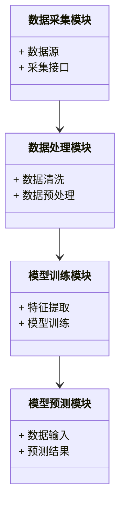
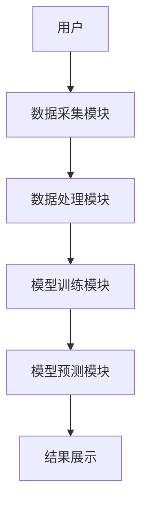
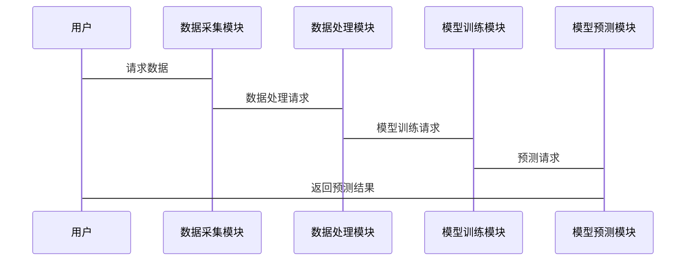

                 

# 特价股票投资中的替代数据分析与人工智能应用

## 关键词
- 替代数据，人工智能，股票投资，数据分析，机器学习，自然语言处理，强化学习

## 摘要
本文探讨了在特价股票投资中，替代数据与人工智能技术的结合应用。通过分析替代数据的来源与特征，详细介绍了机器学习、自然语言处理和强化学习等人工智能技术在股票投资中的具体应用。本文还通过实际项目案例，展示了如何利用替代数据构建有效的股票预测模型，并提供了系统架构设计与实现方案。最后，本文总结了替代数据与人工智能结合的优势与挑战，并展望了未来的研究方向。

---

# 第1章: 特价股票投资的背景与替代数据概述

## 1.1 特价股票投资的现状

### 1.1.1 特价股票的定义与特点
特价股票是指那些价格低于其内在价值，或是市场暂时低估的股票。其特点包括：
- 价格波动性大
- 投资门槛低
- 数据驱动决策
- 风险与收益并存

### 1.1.2 特价股票投资的现状与挑战
当前股票投资面临以下挑战：
- 数据量爆炸式增长
- 数据质量参差不齐
- 数据分析技术复杂

### 1.1.3 替代数据在特价股票投资中的重要性
替代数据通过提供传统数据之外的额外信息，帮助投资者做出更精准的决策。

---

## 1.2 替代数据的定义与分类

### 1.2.1 替代数据的定义
替代数据是指非传统金融数据，包括社交媒体、新闻、卫星图像等。

### 1.2.2 替代数据的主要分类
- **社交媒体数据**：Twitter、Reddit等平台的用户评论
- **新闻与舆情数据**：新闻网站、财经媒体的报道
- **卫星图像数据**：卫星图像分析供应链情况
- **供应链与物流数据**：物流数据反映企业运营状况

### 1.2.3 替代数据的特点与优势
- **实时性**：数据更新速度快
- **多样性**：覆盖多个维度的信息
- **预测性**：能够提前预判市场变化

---

## 1.3 人工智能在股票投资中的应用

### 1.3.1 人工智能在金融领域的应用概述
人工智能在金融领域的应用包括：
- 量化交易
- 风险管理
- 股票预测

### 1.3.2 人工智能在股票投资中的核心作用
- **数据处理**：处理海量数据
- **模式识别**：识别市场规律
- **预测建模**：构建股票预测模型

### 1.3.3 替代数据与人工智能的结合
通过替代数据，人工智能可以更全面地分析市场动态，提升预测精度。

---

## 1.4 替代数据在股票投资中的重要性

### 1.4.1 替代数据对投资决策的影响
- 提供新的投资视角
- 帮助识别市场情绪
- 支持投资决策

### 1.4.2 替代数据的潜在价值与应用场景
- 情绪分析
- 供应链监控
- 市场趋势预测

### 1.4.3 替代数据在股票市场中的独特优势
- 补充传统数据的不足
- 提供实时市场反馈
- 降低投资风险

---

# 第2章: 替代数据的来源与处理

## 2.1 替代数据的主要来源

### 2.1.1 社交媒体数据
- 数据来源：Twitter、Reddit等平台
- 数据特征：实时性、情感倾向

### 2.1.2 新闻与舆情数据
- 数据来源：新闻网站、财经媒体
- 数据特征：信息丰富性、事件相关性

### 2.1.3 卫星图像数据
- 数据来源：卫星图像
- 数据特征：地理信息、供应链状况

### 2.1.4 供应链与物流数据
- 数据来源：物流数据
- 数据特征：实时性、企业运营状况

### 2.1.5 其他替代数据源
- 互联网搜索数据
- 价格数据
- 社交网络数据

---

## 2.2 替代数据的特征与处理

### 2.2.1 替代数据的特征分析
| 数据类型 | 特征 |
|----------|------|
| 社交媒体数据 | 实时性、情感倾向 |
| 新闻数据 | 信息丰富性、事件相关性 |

### 2.2.2 数据清洗与预处理
- 数据清洗：去除噪音数据
- 数据标准化：统一数据格式
- 数据增强：补充缺失数据

### 2.2.3 数据格式转换与标准化
- 文本数据：分词、情感分析
- 图像数据：图像识别、特征提取

### 2.2.4 数据存储与管理
- 数据库存储：结构化数据
- 文件存储：非结构化数据

---

## 2.3 替代数据的分析与建模

### 2.3.1 数据分析方法
- 统计分析：均值、标准差
- 可视化分析：折线图、柱状图

### 2.3.2 数据建模与特征提取
- 特征提取：文本情感值、图像特征
- 建模方法：监督学习、无监督学习

### 2.3.3 数据可视化与洞察提取
- 使用Python库（Matplotlib、Seaborn）进行数据可视化
- 通过可视化发现数据规律

---

# 第3章: 人工智能在股票投资中的核心算法

## 3.1 机器学习在股票投资中的应用

### 3.1.1 监督学习与股票预测
- 监督学习模型：支持向量机（SVM）、随机森林（RF）
- 模型训练：特征选择、模型优化
- 模型评估：准确率、召回率

### 3.1.2 非监督学习与数据聚类
- 聚类算法：K均值聚类、层次聚类
- 数据聚类：识别市场趋势

### 3.1.3 强化学习与股票交易策略
- 强化学习框架：Q-learning、Deep Q-Network
- 策略优化：收益最大化、风险最小化

---

## 3.2 自然语言处理在股票投资中的应用

### 3.2.1 文本情感分析
- 情感分析模型：词袋模型、词嵌入模型
- 情感分析应用：分析社交媒体情绪

### 3.2.2 基于NLP的新闻分析
- 新闻分类：主题分类、情绪分类
- 文本生成：自动摘要

### 3.2.3 基于NLP的市场预测
- 文本到数值的映射：情感得分
- 情感得分与股价关系

---

## 3.3 基于强化学习的股票交易策略

### 3.3.1 强化学习的基本原理
- 状态空间：市场数据
- 动作空间：买入、卖出
- 奖励函数：收益最大化

### 3.3.2 强化学习算法实现
- 算法选择：Deep Q-Network
- 算法实现：神经网络训练

### 3.3.3 实验结果与分析
- 实验结果：策略表现
- 策略优化：参数调整

---

# 第4章: 替代数据与人工智能的结合

## 4.1 替代数据与人工智能的结合方式

### 4.1.1 数据输入方式
- 文本数据输入：自然语言处理
- 图像数据输入：计算机视觉
- 结构化数据输入：机器学习

### 4.1.2 模型构建与优化
- 特征工程：数据预处理
- 模型优化：超参数调整

### 4.1.3 结果分析与解释
- 模型解释：特征重要性分析
- 结果可视化：预测结果与实际数据对比

---

## 4.2 替代数据与人工智能结合的优势

### 4.2.1 提高预测精度
- 多数据源融合
- 信息互补性

### 4.2.2 增强投资决策
- 数据驱动决策
- 实时市场反馈

### 4.2.3 降低投资风险
- 数据多样性
- 风险预警

---

# 第5章: 项目实战——基于替代数据的股票预测模型

## 5.1 项目背景与目标

### 5.1.1 项目背景
- 数据来源：社交媒体、新闻数据
- 数据目标：预测股票价格

### 5.1.2 项目目标
- 构建股票预测模型
- 验证模型效果

---

## 5.2 项目环境搭建

### 5.2.1 环境要求
- Python 3.8+
- Python库：TensorFlow、Keras、Numpy

### 5.2.2 数据获取
- 数据来源：Twitter API、新闻API
- 数据处理：清洗、预处理

---

## 5.3 项目核心实现

### 5.3.1 数据预处理
- 文本分词：jieba分词
- 情感分析：情感得分计算

### 5.3.2 模型构建
- 模型选择：LSTM
- 模型训练：训练集、验证集

### 5.3.3 模型优化
- 超参数调整：学习率、批量大小
- 模型评估：准确率、损失函数

---

## 5.4 项目结果与分析

### 5.4.1 模型预测结果
- 预测结果：预测股价走势
- 实际结果：真实股价走势

### 5.4.2 结果对比分析
- 对比指标：均方误差（MSE）、平均绝对误差（MAE）
- 结果可视化：预测值与真实值对比

---

## 5.5 项目小结

### 5.5.1 项目总结
- 项目实现：构建了股票预测模型
- 项目意义：验证了替代数据与人工智能结合的有效性

### 5.5.2 项目优化建议
- 数据来源扩展
- 模型优化：引入更多特征

---

# 第6章: 系统架构与设计

## 6.1 系统模块划分

### 6.1.1 数据采集模块
- 功能：数据获取
- 接口：API接口

### 6.1.2 数据处理模块
- 功能：数据清洗、预处理
- 接口：数据输入、输出接口

### 6.1.3 模型训练模块
- 功能：模型训练
- 接口：数据输入、模型输出

### 6.1.4 模型预测模块
- 功能：模型预测
- 接口：预测结果输出

---

## 6.2 系统功能设计

### 6.2.1 功能模块类图

---

## 6.3 系统架构设计

### 6.3.1 系统架构图

---

## 6.4 系统接口设计

### 6.4.1 数据接口
- 数据输入接口：JSON格式
- 数据输出接口：CSV格式

### 6.4.2 模型接口
- 模型输入接口：特征向量
- 模型输出接口：预测结果

---

## 6.5 系统交互设计

### 6.5.1 交互流程图

---

# 第7章: 最佳实践与小结

## 7.1 最佳实践

### 7.1.1 数据质量的重要性
- 数据清洗：确保数据准确性
- 数据预处理：提升模型性能

### 7.1.2 模型优化的关键点
- 特征选择：选择关键特征
- 参数调优：优化模型性能

### 7.1.3 系统设计的注意事项
- 模块化设计：便于维护
- 高可用性：确保系统稳定

---

## 7.2 小结

### 7.2.1 替代数据与人工智能的优势
- 数据多样性：提供更多信息
- 技术先进性：提升预测精度

### 7.2.2 投资决策的注意事项
- 数据质量：确保数据准确性
- 模型解释性：便于理解决策

### 7.2.3 未来研究方向
- 更多数据源的引入
- 更复杂模型的开发
- 更高效系统的构建

---

# 作者：AI天才研究院 & 禅与计算机程序设计艺术

