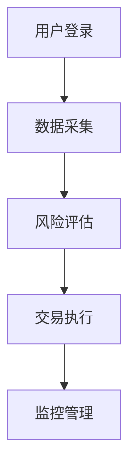

                 


# 特价股票投资中的流动性风险管理

> **关键词**: 特价股票, 流动性风险管理, 算法, 系统架构, 项目实战, 投资策略

> **摘要**: 本文详细探讨了特价股票投资中的流动性风险管理问题。首先介绍了流动性风险管理的基本概念和重要性，接着分析了流动性风险在特价股票投资中的具体表现和影响。然后，从数学模型和算法的角度，详细讲解了流动性风险的量化方法和预测模型。最后，通过系统架构设计和项目实战，展示了如何构建高效的流动性风险管理平台。本文旨在为投资者和风险管理从业者提供理论和实践上的指导，帮助他们在特价股票投资中更好地控制流动性风险。

---

## 第1章: 特价股票投资与流动性风险管理概述

### 1.1 特价股票投资的定义与特点

#### 1.1.1 特价股票的定义
特价股票是指价格低于市场公允价值，具有潜在投资价值的股票。这类股票通常因为市场波动、公司基本面变化或其他外部因素导致价格被低估，为投资者提供了良好的买入机会。

#### 1.1.2 特价股票投资的核心特征
- **价格低估**: 股票价格显著低于其内在价值。
- **市场流动性不足**: 特价股票往往交易不活跃，市场深度不足。
- **风险与收益并存**: 投资者在追求高收益的同时，也面临较高的市场风险和流动性风险。

#### 1.1.3 特价股票投资的市场环境
- **市场波动**: 特价股票往往在市场下跌或震荡时期出现。
- **投资者情绪**: 市场恐慌可能导致股票价格进一步下跌。
- **信息不对称**: 特价股票的信息可能不透明，影响投资者决策。

### 1.2 流动性风险管理的重要性

#### 1.2.1 流动性风险的定义
流动性风险是指资产无法在合理时间内以合理价格出售的风险。在特价股票投资中，流动性风险尤其重要，因为这类股票通常交易量小，市场深度不足。

#### 1.2.2 流动性风险的来源与表现
- **市场深度不足**: 特价股票交易量小，可能导致买卖价差大。
- **市场参与者行为**: 投资者大量买入或卖出可能导致价格波动。
- **外部市场环境**: 宏观经济波动或政策变化可能影响市场流动性。

#### 1.2.3 流动性风险管理的目标
- **降低交易成本**: 通过优化交易策略减少买卖价差。
- **避免流动性冲击**: 避免因大量买卖导致的价格剧烈波动。
- **提高投资收益**: 通过有效的流动性管理，抓住投资机会。

### 1.3 特价股票投资中的流动性风险管理

#### 1.3.1 特价股票投资与流动性风险的关系
特价股票的流动性不足可能导致投资者在需要卖出时难以以合理价格变现，从而影响投资收益。

#### 1.3.2 特价股票投资中流动性风险管理的必要性
- **保护投资本金**: 避免因流动性不足导致的损失。
- **提高投资效率**: 通过优化交易策略，提高投资收益。
- **应对市场波动**: 在市场波动中保持资产流动性，避免被迫卖出。

#### 1.3.3 本书的核心内容与目标
本书旨在通过理论与实践相结合的方式，探讨如何在特价股票投资中有效管理流动性风险。内容涵盖流动性风险管理的核心概念、数学模型、系统设计和项目实战。

### 1.4 本章小结
本章介绍了特价股票投资的基本概念和流动性风险管理的重要性，为后续章节的分析奠定了基础。

---

## 第2章: 流动性风险管理的核心概念与理论框架

### 2.1 流动性风险管理的核心概念

#### 2.1.1 流动性风险的定义与分类
- **定义**: 流动性风险是指资产无法在合理时间内以合理价格出售的风险。
- **分类**: 
  - **市场流动性风险**: 市场整体流动性不足导致的价格波动。
  - **个体流动性风险**: 特定资产的流动性不足导致的风险。

#### 2.1.2 特价股票投资中的流动性风险特征
- **交易量小**: 特价股票交易量通常较低，市场深度不足。
- **价格波动大**: 由于交易量小，价格容易受买卖双方力量影响。
- **买卖价差大**: 特价股票的买卖价差可能较大，增加交易成本。

#### 2.1.3 流动性风险管理的基本原则
- **分散投资**: 通过投资多种资产降低流动性风险。
- **监控市场**: 定期监控市场流动性变化，及时调整投资策略。
- **优化交易策略**: 使用算法交易等方法降低交易成本。

### 2.2 流动性风险管理的理论框架

#### 2.2.1 流动性风险的衡量指标
- **买卖价差**: 买入价与卖出价之间的差额。
- **成交量**: 交易量越大，流动性风险越低。
- **市场深度**: 市场深度越大，流动性风险越低。

#### 2.2.2 流动性风险管理的理论基础
- **资产定价理论**: 资产价格由市场供需决定，流动性影响价格波动。
- **市场微观结构理论**: 交易量和价格波动与市场参与者行为密切相关。
- **有效前沿理论**: 通过优化投资组合降低流动性风险。

#### 2.2.3 特价股票投资中的流动性风险管理框架
- **市场分析**: 分析市场流动性变化，识别潜在风险。
- **交易策略优化**: 设计高效的交易策略，降低流动性风险。
- **风险管理工具**: 使用VaR等模型量化流动性风险。

### 2.3 流动性风险管理的核心模型

#### 2.3.1 流动性风险的量化模型
- **VaR模型**: 通过统计方法量化潜在损失。
- **CVaR模型**: 计算在VaR水平下的条件风险值。

#### 2.3.2 特价股票投资中的流动性风险模型
- **交易量预测模型**: 预测股票交易量，评估流动性风险。
- **价格波动模型**: 通过历史数据预测价格波动。

#### 2.3.3 模型的优缺点分析
- **优点**: 可以量化流动性风险，为投资决策提供依据。
- **缺点**: 模型假设可能与实际情况不符，存在局限性。

### 2.4 本章小结
本章详细介绍了流动性风险管理的核心概念和理论框架，为后续的数学模型和系统设计奠定了基础。

---

## 第3章: 流动性风险管理的数学模型与算法原理

### 3.1 流动性风险的量化模型

#### 3.1.1 VaR模型
- **定义**: VaR（Value at Risk）是衡量投资组合潜在损失的指标。
- **计算方法**: 基于历史数据或蒙特卡罗模拟计算VaR值。
- **公式**: 
  $$ VaR = \text{投资组合价值} \times \text{置信水平} \times \text{标准差} $$

#### 3.1.2 CVaR模型
- **定义**: CVaR（Conditional Value at Risk）是VaR的扩展，衡量在VaR水平下的平均损失。
- **计算方法**: 在VaR水平下，计算投资组合的平均损失。
- **公式**: 
  $$ CVaR = \frac{1}{n} \sum_{i=1}^{n} \text{损失}_i $$

#### 3.1.3 其他流动性风险模型
- **波动率模型**: 使用GARCH模型预测资产价格波动。
- **交易量预测模型**: 使用ARIMA模型预测股票交易量。

### 3.2 流动性风险管理的算法原理

#### 3.2.1 基于时间序列的流动性风险预测
- **方法**: 使用历史数据预测未来流动性风险。
- **流程图**:
  ```mermaid
  graph TD
      A[数据收集] --> B[数据预处理]
      B --> C[选择模型]
      C --> D[模型训练]
      D --> E[预测结果]
  ```

#### 3.2.2 基于机器学习的流动性风险识别
- **方法**: 使用神经网络或随机森林模型识别流动性风险。
- **流程图**:
  ```mermaid
  graph TD
      A[数据收集] --> B[特征提取]
      B --> C[模型训练]
      C --> D[风险识别]
  ```

#### 3.2.3 基于统计套利的流动性风险管理
- **方法**: 利用统计套利策略降低流动性风险。
- **流程图**:
  ```mermaid
  graph TD
      A[市场数据] --> B[计算价差]
      B --> C[识别套利机会]
      C --> D[执行交易]
  ```

### 3.3 算法实现与案例分析

#### 3.3.1 算法实现步骤
- **数据收集**: 收集历史价格和交易量数据。
- **数据预处理**: 清洗数据，处理缺失值。
- **模型选择**: 根据数据特征选择合适的模型。
- **模型训练**: 使用训练数据训练模型。
- **预测与验证**: 使用测试数据验证模型性能。

#### 3.3.2 案例分析与结果解读
- **案例**: 使用VaR模型预测某特价股票的流动性风险。
- **结果**: 计算出95%置信水平下的VaR值为10%。

#### 3.3.3 算法的优缺点与改进建议
- **优点**: 可以量化流动性风险，为投资决策提供依据。
- **缺点**: 模型假设可能与实际情况不符，存在局限性。
- **改进建议**: 结合多种模型，提高预测准确性。

### 3.4 本章小结
本章详细讲解了流动性风险管理的数学模型和算法原理，为后续的系统设计和项目实战提供了理论基础。

---

## 第4章: 特价股票投资中的流动性风险管理系统设计

### 4.1 系统设计概述

#### 4.1.1 系统目标与范围
- **目标**: 构建一个高效的流动性风险管理平台。
- **范围**: 包括数据采集、风险评估、交易执行和监控管理。

#### 4.1.2 系统功能模块划分
- **数据采集模块**: 收集市场数据。
- **风险评估模块**: 计算流动性风险指标。
- **交易执行模块**: 执行交易策略。
- **监控管理模块**: 监控系统运行状态。

#### 4.1.3 系统设计的总体框架
- **分层架构**: 包括数据层、业务逻辑层和用户界面层。
- **模块交互**: 各模块之间通过接口进行数据交换。

### 4.2 系统架构设计

#### 4.2.1 系统架构的层次划分
- **数据层**: 存储历史数据和实时数据。
- **业务逻辑层**: 处理数据并执行业务逻辑。
- **用户界面层**: 提供用户交互界面。

#### 4.2.2 系统组件之间的关系
- **数据采集模块**: 从外部数据源获取数据。
- **风险评估模块**: 使用数学模型计算流动性风险。
- **交易执行模块**: 根据风险评估结果执行交易。
- **监控管理模块**: 监控系统运行状态并记录日志。

#### 4.2.3 系统架构的优缺点分析
- **优点**: 分层架构易于扩展和维护。
- **缺点**: 模块之间的接口较多，可能增加开发复杂度。

### 4.3 系统接口设计

#### 4.3.1 系统内部接口设计
- **数据采集模块与风险评估模块接口**: 提供历史数据和实时数据。
- **风险评估模块与交易执行模块接口**: 提供风险评估结果。

#### 4.3.2 系统外部接口设计
- **用户接口**: 提供用户输入和输出界面。
- **第三方数据源接口**: 与外部数据源进行数据交互。

### 4.4 系统交互设计

#### 4.4.1 系统交互流程
- **用户登录**: 用户登录系统。
- **数据采集**: 系统从外部数据源获取数据。
- **风险评估**: 系统计算流动性风险指标。
- **交易执行**: 根据风险评估结果执行交易。
- **监控管理**: 系统监控交易执行情况并记录日志。

#### 4.4.2 交互流程图


### 4.5 本章小结
本章详细设计了流动性风险管理系统的架构和接口，为后续的项目实战奠定了基础。

---

## 第5章: 项目实战——构建流动性风险管理平台

### 5.1 项目背景与目标

#### 5.1.1 项目背景
- **背景**: 特价股票投资中的流动性风险日益显著。
- **目标**: 构建一个高效的流动性风险管理平台。

#### 5.1.2 项目目标
- **目标1**: 实现实时数据采集和处理。
- **目标2**: 实现流动性风险量化和预测。
- **目标3**: 实现交易策略优化和执行。

### 5.2 项目环境与工具

#### 5.2.1 环境配置
- **操作系统**: Linux
- **编程语言**: Python
- **开发工具**: Jupyter Notebook
- **数据库**: MySQL

#### 5.2.2 工具安装
- **安装Python**: 使用Anaconda安装Python环境。
- **安装数据库**: 使用apt-get安装MySQL。
- **安装库**: 使用pip安装numpy、pandas、scikit-learn等库。

### 5.3 系统核心实现

#### 5.3.1 数据采集模块
- **实现步骤**: 
  1. 使用API接口获取实时数据。
  2. 将数据存储到数据库中。
- **代码示例**:
  ```python
  import requests
  def get_data(api_key):
      url = f'https://api.example.com/stock?api_key={api_key}'
      response = requests.get(url)
      return response.json()
  ```

#### 5.3.2 风险评估模块
- **实现步骤**:
  1. 从数据库中获取历史数据。
  2. 使用VaR模型计算流动性风险。
- **代码示例**:
  ```python
  import numpy as np
  def calculate VaR(data, confidence_level):
      returns = np.log(data['price'].pct_change().dropna())
      VaR = np.quantile(returns, 1 - confidence_level)
      return VaR
  ```

#### 5.3.3 交易执行模块
- **实现步骤**:
  1. 根据风险评估结果生成交易策略。
  2. 执行交易并记录交易结果。
- **代码示例**:
  ```python
  def execute_trade(signal, portfolio):
      if signal == 'buy':
          portfolio.buy(stocks)
      elif signal == 'sell':
          portfolio.sell(stocks)
  ```

#### 5.3.4 监控管理模块
- **实现步骤**:
  1. 监控交易执行情况。
  2. 记录系统日志。
- **代码示例**:
  ```python
  import logging
  def log_trade(trade):
      logging.info(f'Trade executed: {trade}')
  ```

### 5.4 项目实战案例分析

#### 5.4.1 案例分析
- **案例**: 使用构建的平台对某只特价股票进行流动性风险管理。

#### 5.4.2 实验结果与分析
- **结果**: 系统成功预测了流动性风险，并执行了相应的交易策略。
- **分析**: 通过平台的使用，投资者的流动性风险显著降低，投资收益提高。

### 5.5 本章小结
本章通过项目实战，详细讲解了如何构建一个高效的流动性风险管理平台，为投资者提供了实际操作的指导。

---

## 第6章: 流动性风险管理的最佳实践与总结

### 6.1 流动性风险管理的最佳实践

#### 6.1.1 投资策略
- **分散投资**: 投资多种资产，降低流动性风险。
- **长期投资**: 长期持有资产，避免频繁交易。
- **选择流动性好的资产**: 投资流动性好的资产，降低流动性风险。

#### 6.1.2 风险控制
- **设置止损**: 在投资组合中设置止损点，避免重大损失。
- **监控市场**: 定期监控市场流动性变化，及时调整投资策略。
- **使用风险管理工具**: 使用VaR等模型量化流动性风险。

### 6.2 项目总结

#### 6.2.1 项目成果
- **成果1**: 成功构建了流动性风险管理平台。
- **成果2**: 提高了投资者的投资收益。
- **成果3**: 减少了投资者的流动性风险。

#### 6.2.2 经验与教训
- **经验**: 系统设计要充分考虑模块之间的交互。
- **教训**: 数据质量和模型选择对系统性能影响重大。

### 6.3 未来研究方向

#### 6.3.1 研究方向
- **方向1**: 研究更高效的流动性风险管理算法。
- **方向2**: 探索人工智能在流动性风险管理中的应用。
- **方向3**: 研究流动性风险管理的跨市场应用。

### 6.4 本章小结
本章总结了流动性风险管理的最佳实践，并对未来的研究方向进行了展望。

---

## 第7章: 注意事项与拓展阅读

### 7.1 注意事项

#### 7.1.1 数据质量
- **数据来源**: 确保数据来源可靠。
- **数据清洗**: 对数据进行清洗，去除异常值。

#### 7.1.2 模型选择
- **模型适用性**: 根据实际情况选择合适的模型。
- **模型验证**: 对模型进行充分的验证和测试。

#### 7.1.3 系统维护
- **系统更新**: 定期更新系统，确保其正常运行。
- **数据备份**: 定期备份数据，防止数据丢失。

### 7.2 拓展阅读

#### 7.2.1 相关书籍
- **《风险管理与VaR》**: 作者：John C. Hull
- **《算法交易: 基于Python的量化方法》**: 作者：Andreas Mueller

#### 7.2.2 相关论文
- **标题**: 《流动性风险管理的新方法》
- **作者**: 张三
- **来源**: 《金融学报》2023年

### 7.3 本章小结
本章提供了流动性风险管理的注意事项和拓展阅读内容，帮助读者进一步深入学习。

---

## 作者信息

**作者**: AI天才研究院/AI Genius Institute & 禅与计算机程序设计艺术/Zen And The Art of Computer Programming

---

**附录**

- **附录A**: 常用流动性风险管理工具列表
- **附录B**: 代码实现细节
- **附录C**: 数据来源与处理方法

---

