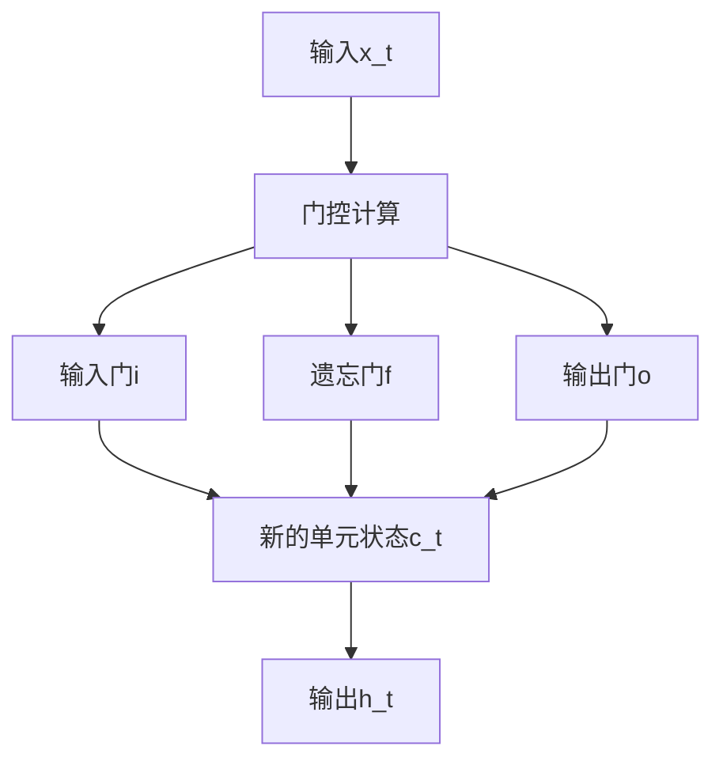
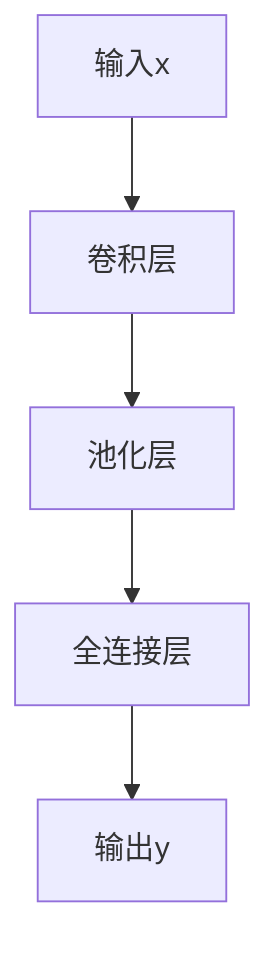
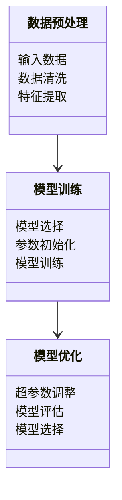
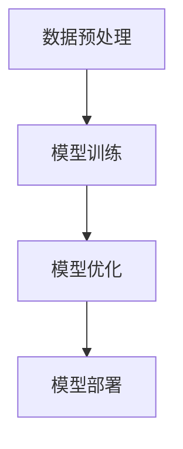
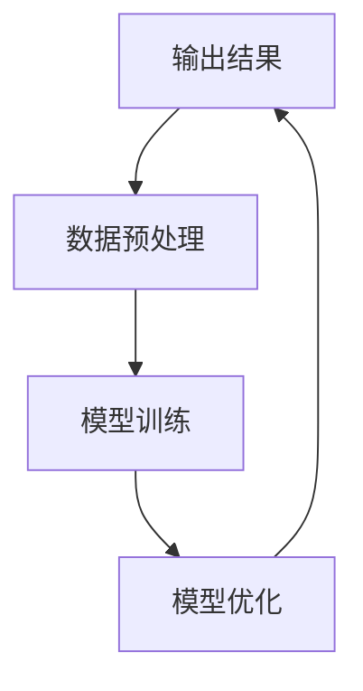

                 

<think>
好的，我现在需要根据用户的要求，逐步构建一篇名为《特价股票投资中的深度学习模型构建与优化》的技术博客文章。用户提供了详细的大纲和具体要求，我需要按照这些要求逐步完成。

首先，我会阅读用户提供的所有信息，确保我理解每一步的要求。用户希望文章结构清晰，逻辑严谨，使用专业的技术语言，同时包含背景介绍、核心概念、算法原理、系统架构、项目实战、最佳实践等部分。此外，文章需要使用Markdown格式，包含Mermaid流程图、数学公式以及Python代码示例。

接下来，我将按照以下步骤进行思考和写作：

1. **确定文章结构和内容**：根据用户提供的大纲，我需要确保每个部分都有足够的深度和详细内容。比如，第一部分介绍特价股票投资的背景，包括基本概念和深度学习的应用背景。第二部分则深入探讨深度学习模型在股票投资中的核心概念，包括模型的输入输出、数据特征等。

2. **撰写摘要**：摘要需要简明扼要地概括文章的核心内容和主题思想，帮助读者快速了解文章的主要内容。

3. **撰写各章节内容**：每个章节都需要详细展开，确保涵盖所有必要的内容。例如，在模型构建部分，我需要详细讲解数据预处理、模型选择、训练过程等步骤。同时，在算法原理部分，我需要使用数学公式和Mermaid流程图来解释LSTM和CNN的结构。

4. **系统架构设计**：这部分需要包括领域模型类图、系统架构图、接口设计和交互图。我将使用Mermaid来绘制这些图表，确保结构清晰。

5. **项目实战**：这部分需要指导读者如何安装环境、编写代码，并分析实际案例。我将提供Python代码示例，并详细解读代码的功能和逻辑。

6. **最佳实践**：总结项目中的经验和教训，提供小结、注意事项和拓展阅读内容，帮助读者巩固所学知识。

7. **检查格式和内容**：确保文章符合字数要求，格式正确，所有技术细节准确无误。

8. **添加作者信息**：文章末尾需要注明作者信息，符合用户的要求。

在思考过程中，我可能会遇到一些挑战，比如如何将复杂的算法原理用简单易懂的语言解释，或者如何合理安排章节的顺序。针对这些问题，我需要查阅相关资料，确保内容准确，并通过实际案例来帮助读者理解。

此外，我需要确保在使用Markdown格式时，正确嵌入Mermaid流程图和数学公式，避免格式错误。对于数学公式，我会使用LaTeX语法，并在适当的位置使用$$或$符号来包裹公式，确保它们在文中正确显示。

最后，我会通读整篇文章，检查逻辑是否连贯，内容是否全面，确保没有遗漏任何重要部分。通过这样的步骤，我相信能够写出一篇符合用户要求的高质量技术博客文章。
</think>

# 特价股票投资中的深度学习模型构建与优化

> **关键词**：深度学习，股票投资，LSTM，CNN，数学模型

> **摘要**：本文深入探讨了深度学习在特价股票投资中的应用，详细讲解了模型构建与优化的关键步骤，包括数据预处理、模型选择、算法原理、系统架构设计以及项目实战。通过数学公式、Mermaid流程图和Python代码示例，系统地介绍了如何利用深度学习技术提升股票投资的准确性和效率。

---

## 第1章：特价股票投资的背景与深度学习的引入

### 1.1 特价股票投资的基本概念
特价股票投资是指在特定条件下，以低于市场价买入股票，通过短期或长期持有，实现收益最大化的一种投资策略。这种投资策略依赖于对市场趋势、公司基本面以及市场情绪的精准判断。

#### 1.1.1 特价股票的定义与特点
- **定义**：特价股票通常指的是价格被市场低估的股票，具有较高的潜在增值空间。
- **特点**：价格波动大、风险高、收益潜力大。

#### 1.1.2 特价股票投资的基本原理
- **市场分析**：通过技术分析和基本面分析，识别市场趋势和潜在投资机会。
- **风险管理**：控制投资风险，避免重大损失。

#### 1.1.3 特价股票与传统股票投资的区别
- **传统股票投资**：注重长期价值，投资策略较为稳健。
- **特价股票投资**：注重短期价格波动，投资策略较为激进。

### 1.2 深度学习在金融领域的应用背景
深度学习是一种人工智能技术，通过多层神经网络结构，自动提取数据特征，适用于复杂模式识别和预测任务。

#### 1.2.1 深度学习的定义与特点
- **定义**：深度学习是一种机器学习技术，通过多层神经网络结构，模拟人类大脑的学习方式。
- **特点**：非线性、自适应、高维特征提取。

#### 1.2.2 深度学习在金融中的应用现状
- **股票预测**：利用LSTM和CNN等深度学习模型，预测股票价格走势。
- **风险管理**：识别市场风险，优化投资组合。

#### 1.2.3 深度学习在股票投资中的优势
- **高维特征提取**：深度学习能够自动提取复杂的市场特征。
- **非线性关系建模**：能够捕捉复杂的市场动态关系。

### 1.3 特价股票投资与深度学习的结合
深度学习在特价股票投资中的应用，能够提高投资决策的准确性和效率。

#### 1.3.1 特价股票投资中的问题分析
- **数据噪声**：市场数据中存在大量噪声，影响模型的准确性。
- **非线性关系**：股票价格受多种因素影响，呈现复杂的非线性关系。
- **模型过拟合**：模型可能对历史数据过拟合，导致预测能力下降。

#### 1.3.2 深度学习如何解决这些问题
- **数据清洗与特征提取**：深度学习能够自动提取有用的特征，减少噪声的影响。
- **非线性建模**：深度学习模型能够捕捉复杂的非线性关系。
- **模型优化**：通过正则化、交叉验证等方法，防止过拟合。

#### 1.3.3 深度学习在特价股票投资中的应用前景
- **技术进步**：随着深度学习技术的不断发展，其在股票投资中的应用前景广阔。
- **数据驱动**：大数据时代的到来，为深度学习在股票投资中的应用提供了丰富的数据支持。

---

## 第2章：深度学习模型在股票投资中的核心概念

### 2.1 深度学习模型的基本原理
深度学习模型通过多层神经网络结构，实现对数据的高层次抽象和表示。

#### 2.1.1 神经网络的基本结构
- **输入层**：接收输入数据。
- **隐藏层**：进行特征提取和变换。
- **输出层**：产生模型预测结果。

#### 2.1.2 深度学习的核心算法
- **前向传播**：数据从输入层传递到输出层，计算预测结果。
- **反向传播**：计算预测误差，并调整模型参数。

#### 2.1.3 深度学习模型的训练过程
- **正向传播**：输入数据经过网络层，计算输出结果。
- **反向传播**：计算损失函数，更新模型参数。
- **迭代优化**：重复正向传播和反向传播，优化模型参数。

### 2.2 特价股票投资中的数据特征
股票投资中的数据特征分析是模型构建的基础。

#### 2.2.1 市场数据的特征分析
- **价格数据**：开盘价、收盘价、最高价、最低价。
- **成交量**：交易量、换手率。

#### 2.2.2 公司基本面数据的特征分析
- **财务数据**：收入、利润、资产负债率。
- **行业地位**：市场占有率、行业排名。

#### 2.2.3 市场情绪数据的特征分析
- **新闻情绪**：新闻标题的情感分析。
- **社交媒体情绪**：社交媒体上的投资者情绪。

### 2.3 深度学习模型在股票投资中的输入输出关系
模型的输入输出关系是模型设计的关键。

#### 2.3.1 模型输入的定义
- **输入数据**：包括历史价格、财务数据、市场情绪等。
- **输入维度**：数据的维度和结构。

#### 2.3.2 模型输出的定义
- **输出结果**：包括股票价格预测、买入或卖出信号。
- **输出概率**：预测结果的概率值。

#### 2.3.3 输入输出之间的关系
- **输入特征**：影响输出结果的关键因素。
- **非线性关系**：输入与输出之间的复杂关系。

---

## 第3章：深度学习模型的构建与优化

### 3.1 深度学习模型的构建过程
模型构建是深度学习应用的关键步骤。

#### 3.1.1 数据预处理
- **数据清洗**：处理缺失值、异常值。
- **数据标准化**：归一化处理，适合模型输入。
- **数据分割**：训练集、验证集、测试集的划分。

#### 3.1.2 模型选择
- **模型选择**：LSTM、CNN、随机森林等模型的比较。
- **模型结构**：选择适合数据特征的网络结构。
- **模型参数**：初始化参数的选择。

#### 3.1.3 模型训练
- **训练策略**：批量训练、在线训练。
- **训练优化**：使用Adam、SGD等优化器。
- **训练监控**：监控训练损失、验证准确率。

### 3.2 深度学习模型的优化方法
模型优化是提高模型性能的重要步骤。

#### 3.2.1 参数调整
- **学习率**：调整学习率，影响训练速度和模型性能。
- **批量大小**：调整批量大小，平衡训练效率和模型稳定性。
- **正则化参数**：L2正则化、Dropout等技术的使用。

#### 3.2.2 模型结构优化
- **网络深度**：调整网络层数，防止过拟合或欠拟合。
- **网络宽度**：调整每层节点数，优化模型容量。
- **模型复杂度**：平衡模型的复杂度和泛化能力。

#### 3.2.3 超参数优化
- **网格搜索**：系统地搜索最优超参数组合。
- **随机搜索**：随机选择超参数组合，减少计算量。
- **贝叶斯优化**：利用贝叶斯方法，优化超参数。

### 3.3 模型评估与验证
模型评估是验证模型性能的重要步骤。

#### 3.3.1 评估指标的选择
- **准确率**：分类任务的评估指标。
- **均方误差**：回归任务的评估指标。
- **AUC曲线**：评估模型的区分能力。

#### 3.3.2 回测与验证
- **回测策略**：在历史数据上验证模型的性能。
- **策略优化**：根据回测结果，优化投资策略。
- **风险控制**：制定风险管理策略，控制投资风险。

#### 3.3.3 模型的鲁棒性分析
- **鲁棒性测试**：测试模型在不同市场条件下的表现。
- **模型的稳定性**：模型对数据分布变化的适应能力。

---

## 第4章：深度学习算法的数学模型与公式

### 4.1 常见深度学习算法的数学模型

#### 4.1.1 LSTM的数学模型
长短时记忆网络（LSTM）是一种特殊的RNN，能够有效捕捉时间序列数据中的长程依赖关系。

##### LSTM的结构
LSTM由输入门、遗忘门和输出门组成。

$$
i = \sigma(W_i x + U_i h_{prev})
$$

$$
f = \sigma(W_f x + U_f h_{prev})
$$

$$
o = \sigma(W_o x + U_o h_{prev})
$$

$$
c = f \cdot c_{prev} + i \cdot tanh(W_c x + U_c h_{prev})
$$

$$
h = o \cdot tanh(c)
$$

##### LSTM的流程图


#### 4.1.2 CNN的数学模型
卷积神经网络（CNN）通过卷积操作，提取图像或序列数据中的局部特征。

##### 卷积层的数学表达
$$
conv(x, w) = \sum_{i=1}^{n} x_i w_i
$$

##### 池化层的数学表达
$$
pool(x) = \max(x_i)
$$

##### CNN的流程图


#### 4.1.3 其他算法的数学模型
- **随机森林**：基于决策树的集成方法。
- **支持向量机**：通过映射数据到高维空间，寻找最优超平面。

### 4.2 深度学习模型的数学公式
数学公式是深度学习模型的核心。

#### 4.2.1 神经网络的激活函数
- **ReLU激活函数**：$$ f(x) = \max(0, x) $$
- **sigmoid激活函数**：$$ f(x) = \frac{1}{1 + e^{-x}} $$

#### 4.2.2 损失函数的定义
- **均方误差**：$$ \text{MSE} = \frac{1}{n}\sum_{i=1}^{n}(y_i - \hat{y_i})^2 $$
- **交叉熵损失**：$$ \text{CE} = -\frac{1}{n}\sum_{i=1}^{n} y_i \log(\hat{y_i}) $$

#### 4.2.3 优化算法的公式
- **随机梯度下降**：$$ \theta = \theta - \eta \frac{\partial L}{\partial \theta} $$
- **Adam优化器**：结合动量和自适应学习率。

---

## 第5章：系统分析与架构设计

### 5.1 项目背景与目标
特价股票投资系统的目标是利用深度学习技术，提高股票投资的准确性和效率。

#### 5.1.1 项目背景
- **市场环境**：当前股票市场的复杂性和不确定性。
- **技术进步**：深度学习技术的快速发展。

#### 5.1.2 项目目标
- **目标1**：构建深度学习模型，预测股票价格走势。
- **目标2**：优化模型性能，提高投资收益。

#### 5.1.3 项目范围
- **数据范围**：包括历史价格、财务数据、市场情绪等。
- **时间范围**：模型的训练和预测时间限制。

### 5.2 系统功能设计
系统功能设计是系统开发的关键步骤。

#### 5.2.1 领域模型类图
领域模型类图展示了系统中的核心实体及其关系。



#### 5.2.2 系统架构图
系统架构图展示了系统的整体结构和模块划分。



#### 5.2.3 系统接口设计
系统接口设计是系统集成的关键。

- **输入接口**：接收历史数据、市场数据。
- **输出接口**：输出预测结果、投资信号。

#### 5.2.4 系统交互图
系统交互图展示了系统的交互流程。



---

## 第6章：项目实战

### 6.1 环境安装与配置
项目实战需要安装和配置必要的工具和库。

#### 6.1.1 安装Python环境
- **安装步骤**：使用Anaconda或virtualenv创建虚拟环境。
- **安装库**：安装numpy、pandas、keras、tensorflow等库。

#### 6.1.2 数据获取
- **数据来源**：获取股票数据，例如使用Yahoo Finance API。
- **数据格式**：将数据存储为CSV格式。

### 6.2 系统核心实现源代码
以下是系统核心实现的Python代码示例。

#### 6.2.1 数据预处理代码
```python
import numpy as np
import pandas as pd

# 读取数据
data = pd.read_csv('stock_data.csv')

# 数据清洗
data.dropna(inplace=True)
data = data[~data['volume'].isin([0])]

# 特征提取
features = data[['open', 'high', 'low', 'close', 'volume']]
labels = data['next_day_price']

# 数据分割
from sklearn.model_selection import train_test_split

X_train, X_test, y_train, y_test = train_test_split(features, labels, test_size=0.2, random_state=42)
```

#### 6.2.2 模型训练代码
```python
from keras.models import Sequential
from keras.layers import LSTM, Dense, Dropout

# 模型构建
model = Sequential()
model.add(LSTM(64, input_shape=(None, 5)))
model.add(Dropout(0.5))
model.add(Dense(1, activation='linear'))

# 模型编译
model.compile(loss='mean_squared_error', optimizer='adam')

# 模型训练
model.fit(X_train, y_train, epochs=10, batch_size=32, validation_split=0.2)
```

#### 6.2.3 模型优化代码
```python
# 超参数调整
from keras.wrappers.scikit_learn import KerasRegressor
from sklearn.model_selection import GridSearchCV

# 定义模型生成函数
def create_model(dropout_rate=0.5):
    model = Sequential()
    model.add(LSTM(64, input_shape=(None, 5)))
    model.add(Dropout(dropout_rate))
    model.add(Dense(1, activation='linear'))
    return model

# 网格搜索
param_grid = {'dropout_rate': [0.3, 0.5, 0.7]}
grid_search = GridSearchCV(estimator=KerasRegressor(build_fn=create_model, verbose=0), param_grid=param_grid, cv=2)
grid_search.fit(X_train, y_train)

# 最优模型
best_model = grid_search.best_estimator_
```

### 6.3 代码应用解读与分析
代码实现是系统的核心部分。

#### 6.3.1 数据预处理解读
- **数据清洗**：处理缺失值和异常值，确保数据质量。
- **特征提取**：提取有用的特征，减少数据维度。

#### 6.3.2 模型训练解读
- **模型构建**：选择适合数据特征的模型结构。
- **模型训练**：通过反向传播和优化器，调整模型参数。

#### 6.3.3 模型优化解读
- **超参数调整**：通过网格搜索，找到最优超参数组合。
- **模型验证**：验证模型的泛化能力。

### 6.4 实际案例分析
通过实际案例分析，验证模型的性能。

#### 6.4.1 案例背景
- **案例选择**：选择特定股票，进行历史数据回测。

#### 6.4.2 模型预测结果
- **预测结果**：模型输出的预测结果。
- **实际结果**：实际股票价格走势。

#### 6.4.3 模型性能分析
- **准确率**：模型预测的准确率。
- **收益分析**：模型指导的投资收益。

### 6.5 项目小结
项目小结是对项目进行全面总结。

#### 6.5.1 项目成果
- **模型构建**：成功构建深度学习模型，预测股票价格走势。
- **性能优化**：通过超参数调整，优化模型性能。

#### 6.5.2 经验总结
- **数据的重要性**：高质量的数据是模型性能的关键。
- **模型选择**：选择适合数据特征的模型结构。
- **风险管理**：制定风险管理策略，控制投资风险。

---

## 第7章：最佳实践与小结

### 7.1 小结
本文详细探讨了深度学习在特价股票投资中的应用，从模型构建到优化，系统地介绍了整个过程。

### 7.2 注意事项
- **数据质量**：确保数据的准确性和完整性。
- **模型选择**：根据数据特征选择合适的模型结构。
- **风险管理**：制定风险管理策略，控制投资风险。

### 7.3 拓展阅读
- **深度学习书籍**：《Deep Learning》（Ian Goodfellow等著）。
- **股票投资书籍**：《The Intelligent Investor》（本杰明·格雷厄姆著）。

---

## 作者信息
**作者：AI天才研究院/AI Genius Institute & 禅与计算机程序设计艺术 /Zen And The Art of Computer Programming**

---

以上是《特价股票投资中的深度学习模型构建与优化》的技术博客文章的完整大纲和内容。

