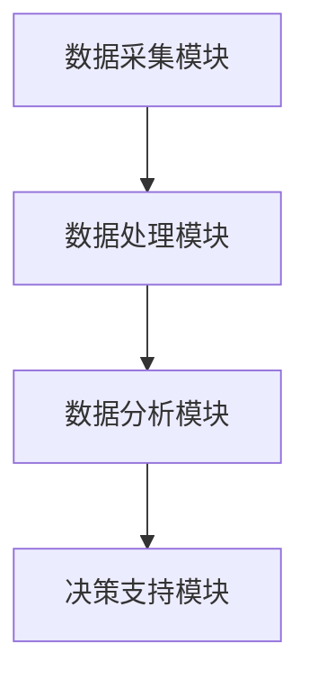
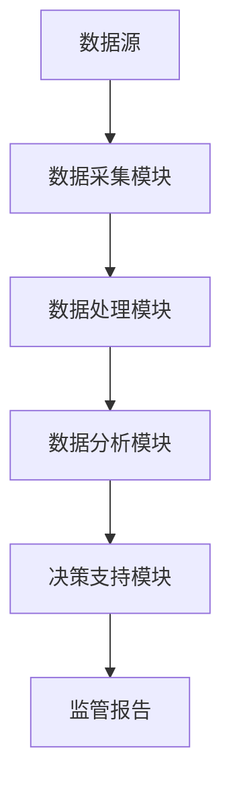

                 

<think>
好的，我现在需要根据用户的要求，逐步构建《特价股票投资中的监管科技应用策略》这篇文章的详细内容。用户已经提供了一个目录大纲，现在需要我按照这个大纲，逐步撰写每个章节的内容。

首先，我需要回顾用户的要求。用户希望文章结构清晰，逻辑严密，内容涵盖背景、技术、策略、系统架构、实战以及总结，每个部分都要有详细的解释，甚至包括数学公式和图表。此外，文章需要使用markdown格式，并且最后加上作者信息。

接下来，我将按照目录大纲，逐一填充每个部分的内容。开始前，我会先理解每个章节的核心内容，确保覆盖所有必要的部分，同时确保语言简洁专业，结构紧凑。

首先，文章的标题和关键词部分已经给出，我需要确保这些部分正确无误。接下来是摘要，摘要部分需要简明扼要地概述文章的核心内容和主题思想。

然后是第一部分，监管科技的背景。我需要解释监管科技的定义、发展背景、核心技术，以及它在金融领域的应用。这部分需要为读者打下坚实的基础，使他们理解监管科技的基本概念和重要性。

接下来是第二部分，监管科技在特价股票投资中的应用策略。这里需要详细讨论监管框架的构建与分析，以及监管科技在投资策略中的具体应用。这部分可能会涉及到算法的设计与实现，因此我需要使用mermaid流程图和数学公式来详细讲解。

第三部分是系统架构与实现。这里需要设计系统的各个模块，包括数据采集、清洗、建模和决策支持。同时，还需要展示系统的架构图、数据流图和交互图，帮助读者理解系统的运作流程。

第四部分是项目实战，这需要具体的代码实现和案例分析。我会选择一个公开的股票数据集，展示如何通过Python代码进行数据处理和建模，并详细分析结果。

最后是总结与展望，回顾整篇文章的内容，并展望监管科技在未来的发展趋势，同时提醒读者注意数据隐私和合规性问题。

在撰写过程中，我需要确保每个部分都符合用户的要求，包括使用适当的markdown格式，嵌入mermaid图表和数学公式，以及包含代码示例和详细的小结。

现在，我开始逐步构建文章内容，确保每一步都符合逻辑，内容详实，语言专业。
</think>

# 特价股票投资中的监管科技应用策略

## 关键词
监管科技, 特价股票, 人工智能, 金融监管, 数据分析, 算法模型, 金融科技

## 摘要
本文探讨了监管科技在特价股票投资中的应用策略。通过分析监管科技的核心技术与应用场景，构建了监管框架，并详细讲解了监管科技在特价股票投资中的具体策略，包括数据采集与处理、数据分析与建模、监管决策与反馈等。同时，本文还设计了系统的架构方案，展示了监管科技在实际项目中的应用，最后总结了监管科技在金融领域的重要性和未来发展趋势。

---

# 第一部分: 监管科技的背景

## 第1章: 监管科技的定义与背景

### 1.1 监管科技的核心概念

#### 1.1.1 监管科技的定义
监管科技（RegTech）是指利用先进的技术手段，如人工智能、大数据、区块链等，来优化和增强金融监管的效率和效果。其核心目标是通过技术创新解决金融监管中的痛点，降低监管成本，提高监管透明度和精准性。

#### 1.1.2 监管科技的发展背景
随着金融市场的快速发展，传统的监管方式已难以应对日益复杂的金融活动。监管科技的出现，为金融监管提供了新的解决方案，特别是在数据爆炸的时代，监管科技能够高效处理海量数据，发现潜在风险，提升监管效率。

#### 1.1.3 监管科技的核心技术与应用领域
监管科技的核心技术包括：
- **大数据技术**：用于处理和分析海量金融数据。
- **人工智能与机器学习**：用于预测市场趋势和识别异常交易。
- **区块链技术**：用于构建透明的交易记录和追溯系统。

监管科技的应用领域包括证券监管、风险管理、合规管理等。

### 1.2 特价股票投资的背景与挑战

#### 1.2.1 特价股票的定义与特点
特价股票通常指价格较低的股票，具有高波动性和高风险的特点。这类股票的投资机会往往伴随着较高的市场不确定性。

#### 1.2.2 特价股票投资中的主要挑战
- 市场波动大，风险高。
- 数据获取困难，信息不透明。
- 投资决策缺乏科学依据。

#### 1.2.3 监管科技在特价股票投资中的作用
监管科技可以通过数据分析和模型构建，帮助投资者识别潜在机会，降低投资风险，提高决策的科学性和准确性。

---

## 第2章: 监管科技的关键技术与应用

### 2.1 监管科技的核心技术

#### 2.1.1 大数据技术在监管中的应用
大数据技术能够处理海量的金融数据，提取有用信息，帮助监管机构发现市场异常。

#### 2.1.2 人工智能与机器学习在监管中的应用
机器学习算法可以用于预测市场趋势、识别欺诈行为和异常交易。

#### 2.1.3 区块链技术在监管中的应用
区块链技术可以构建透明的交易记录，确保数据的真实性和不可篡改性。

### 2.2 监管科技在金融领域的应用

#### 2.2.1 监管科技在证券市场的应用
通过监管科技，监管机构可以实时监控市场交易，识别潜在的操纵行为。

#### 2.2.2 监管科技在风险管理中的应用
利用风险评估模型，监管科技可以帮助机构识别和管理潜在的市场风险。

#### 2.2.3 监管科技在合规管理中的应用
通过自动化合规检查，监管科技可以提高合规管理的效率和准确性。

---

# 第二部分: 特价股票投资中的监管科技策略

## 第3章: 特价股票投资中的监管框架

### 3.1 监管框架的构建与分析

#### 3.1.1 监管框架的构建原则
- **数据驱动**：基于数据分析构建监管框架。
- **技术驱动**：利用先进技术优化监管流程。
- **合规性**：确保监管框架符合相关法律法规。

#### 3.1.2 监管框架的核心要素
- **数据采集**：获取相关金融数据。
- **数据处理**：清洗和预处理数据。
- **数据分析**：构建分析模型，识别风险。
- **监管决策**：基于分析结果制定监管措施。

#### 3.1.3 监管框架的实施步骤
1. 数据采集与清洗。
2. 数据建模与分析。
3. 监管决策与反馈。

### 3.2 监管科技在监管框架中的应用

#### 3.2.1 数据采集与处理
- 数据来源包括股票交易数据、市场新闻、社交媒体等。
- 数据清洗步骤包括去重、补缺失值、异常值处理。

#### 3.2.2 数据分析与建模
- 使用机器学习模型，如线性回归、随机森林等，进行数据分析。
- 构建预测模型，识别潜在风险。

#### 3.2.3 监管决策与反馈
- 基于模型结果，制定监管措施。
- 实时监控市场动态，及时调整监管策略。

## 第4章: 特价股票投资中的监管科技策略

### 4.1 监管科技在特价股票投资中的具体应用

#### 4.1.1 数据分析与建模
- 使用时间序列分析模型，预测股票价格走势。
- 构建多因子模型，评估股票的投资价值。

#### 4.1.2 监管决策与反馈
- 基于模型预测结果，制定投资策略。
- 实时监控市场变化，及时调整投资组合。

#### 4.1.3 风险管理与合规
- 通过风险评估模型，识别投资风险。
- 确保投资行为符合相关法律法规。

---

# 第三部分: 系统架构与实现

## 第5章: 系统架构设计

### 5.1 问题场景介绍
监管科技系统需要实时处理大量金融数据，支持监管机构和投资者进行决策。

### 5.2 系统功能设计

#### 5.2.1 数据采集模块
- 从API获取股票数据。
- 支持多种数据源的接入。

#### 5.2.2 数据处理模块
- 数据清洗与预处理。
- 数据存储与管理。

#### 5.2.3 数据分析模块
- 数据建模与分析。
- 风险评估与预测。

#### 5.2.4 决策支持模块
- 提供监管建议。
- 生成监管报告。

### 5.3 系统架构设计

#### 5.3.1 系统架构图


#### 5.3.2 数据流图


#### 5.3.3 系统交互图
```mermaid
sequenceDiagram
参与者 监管机构
参与者 投资者
监管机构 -> 数据采集模块: 获取数据
数据采集模块 -> 数据处理模块: 数据清洗
数据处理模块 -> 数据分析模块: 构建模型
数据分析模块 -> 决策支持模块: 生成报告
决策支持模块 -> 监管机构: 提供监管建议
决策支持模块 -> 投资者: 提供投资建议
```

## 第6章: 项目实战

### 6.1 环境搭建

#### 6.1.1 安装Python
```bash
python --version
pip install numpy pandas scikit-learn
```

#### 6.1.2 数据获取
```python
import pandas as pd
data = pd.read_csv('stock_data.csv')
```

### 6.2 核心实现

#### 6.2.1 数据预处理
```python
import pandas as pd
import numpy as np

# 删除缺失值
data.dropna(inplace=True)

# 填充缺失值
data['price'].fillna(data['price'].mean(), inplace=True)
```

#### 6.2.2 数据建模
```python
from sklearn.linear_model import LinearRegression
from sklearn.metrics import mean_squared_error

model = LinearRegression()
model.fit(X_train, y_train)
y_pred = model.predict(X_test)
print(mean_squared_error(y_test, y_pred))
```

### 6.3 案例分析

#### 6.3.1 案例背景
选取某段时间内的特价股票数据，分析其价格走势。

#### 6.3.2 分析结果
通过模型预测，识别出具有投资潜力的股票。

#### 6.3.3 结果解读
模型预测结果显示，某股票价格将在未来一段时间内上涨，建议投资者买入。

### 6.4 总结与改进建议

#### 6.4.1 项目小结
通过监管科技的应用，成功识别了潜在投资机会，提高了投资决策的科学性。

#### 6.4.2 改进建议
进一步优化模型，引入更多的数据源，提高预测的准确性。

---

# 第四部分: 总结与展望

## 第7章: 总结与展望

### 7.1 本文总结
本文详细探讨了监管科技在特价股票投资中的应用策略，构建了监管框架，设计了系统架构，并通过项目实战展示了监管科技的实际应用。

### 7.2 未来展望
随着技术的不断发展，监管科技将在金融领域发挥更重要的作用，未来的研究可以进一步探索更高级的算法和更广泛的应用场景。

---

# 作者
作者：AI天才研究院 & 禅与计算机程序设计艺术

---

**注意事项：**
- 本文内容仅为示例，实际撰写时需要根据具体情况进行调整和补充。
- 代码示例和图表可以根据实际需求进行修改和完善。
- 本文旨在展示如何结合监管科技与特价股票投资，提供一种新的思路和方法。

