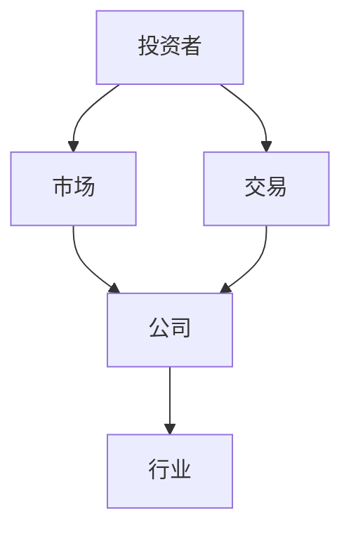
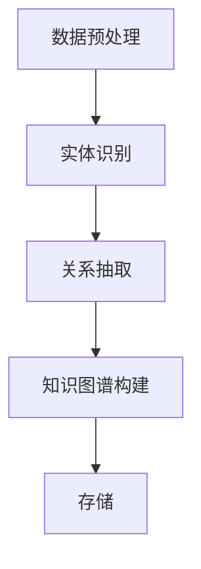
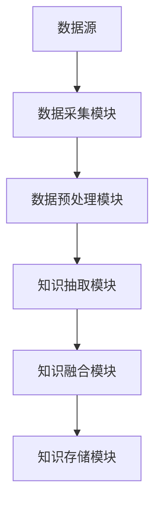
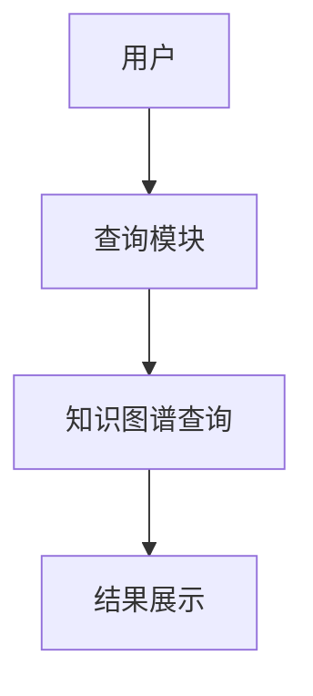

                 

<think>
嗯，我现在需要根据用户的要求，设计一个详细的目录大纲，涵盖特价股票投资中的知识图谱模型构建与优化。用户明确要求目录超过7章，内容要完整，结构清晰。

首先，我需要明确这本书的主题：特价股票投资，特别是如何利用知识图谱模型来优化投资策略。这涉及到数据的收集、处理、分析，以及模型的构建和优化。

接下来，我要考虑章节的安排。通常，技术书籍的结构包括背景介绍、核心概念、算法原理、系统设计、项目实战、优化与挑战等部分。用户给的示例目录已经涵盖了从背景到项目实战，所以我需要按照这个结构来扩展。

第一章应该是背景与概述，介绍特价股票投资的基本概念、现状，以及知识图谱在其中的作用。这章需要让读者了解为什么需要这种模型。

第二章介绍知识图谱的核心概念，包括实体、关系、属性等，同时进行概念对比，并用图表展示结构，帮助读者理解模型的构成。

第三章深入算法原理，解释如何从数据中提取知识，构建图谱。这里需要详细讲解不同算法，用流程图和代码示例来辅助说明。

第四章系统分析与架构设计，讨论项目的整体结构，模块划分，以及系统之间的交互。这部分需要图表来展示系统的各个部分和它们如何协同工作。

第五章项目实战，让读者实际操作，从环境配置到代码实现，再到案例分析，帮助他们理解如何在实际中应用这些模型。

第六章优化与挑战，探讨如何提升模型的性能，解决实际应用中的问题，如数据质量和计算效率。

第七章总结与展望，回顾全书内容，并展望未来的研究方向，激发读者进一步学习的兴趣。

在设计每个章节时，要确保内容详细，涵盖理论和实际应用。同时，使用图表和代码示例，使内容更具可读性和实用性。例如，在算法原理部分，用Mermaid流程图展示构建过程，并提供Python代码作为示例，帮助读者理解。

最后，确保整个目录结构逻辑连贯，从基础到应用，层层递进，让读者能够系统地掌握特价股票投资中的知识图谱模型构建与优化方法。

总的来说，我需要将用户的需求转化为一个结构合理、内容详实的目录大纲，确保每部分内容都符合要求，并且能够帮助读者全面理解相关知识。
</think>

# 特价股票投资中的知识图谱模型构建与优化

> 关键词：知识图谱，股票投资，特价股票，数据挖掘，深度学习，算法优化

> 摘要：本文将详细探讨在特价股票投资中构建和优化知识图谱模型的方法。通过分析特价股票的特点、知识图谱的核心概念，以及构建模型的算法原理，本文旨在为投资者提供一种基于知识图谱的高效投资策略。文章内容涵盖从理论到实践的全过程，包括系统架构设计、项目实战和优化建议，帮助读者全面掌握特价股票投资中的知识图谱模型构建与优化技术。

---

## 第一章: 特价股票投资的背景与知识图谱概述

### 1.1 特价股票投资的定义与特点
#### 1.1.1 特价股票的定义
特价股票是指在特定条件下（如促销、折扣或市场波动）以低于其市场价发行的股票。这种股票通常具有较高的投资回报潜力，但也伴随着较高的风险。

#### 1.1.2 特价股票投资的特点
- **低买价**：特价股票通常以低于市场价发行，为投资者提供低价买入的机会。
- **高波动性**：由于价格波动较大，投资者需要具备敏锐的市场洞察力。
- **短期机会**：特价股票的投资机会往往短暂，需要快速决策。

#### 1.1.3 特价股票与传统股票投资的区别
| 特性 | 特价股票 | 传统股票 |
|------|----------|-----------|
| 投资门槛 | 较低     | 较高       |
| 风险 | 较高      | 中等       |
| 投资周期 | 短期     | 长期       |
| 收益潜力 | 高       | 中等       |

### 1.2 知识图谱的定义与特点
#### 1.2.1 知识图谱的定义
知识图谱是一种以结构化方式表示知识的数据模型，由节点（实体）和边（关系）组成，能够表示复杂的语义关系。

#### 1.2.2 知识图谱的核心特点
- **结构化**：通过节点和边表示实体及其关系。
- **语义丰富**：能够捕捉数据中的深层语义信息。
- **可扩展性**：支持大规模数据的存储和分析。

#### 1.2.3 知识图谱与传统数据分析的区别
| 特性 | 知识图谱 | 传统数据分析 |
|------|----------|---------------|
| 数据结构 | 图结构    | 表格结构       |
| 分析深度 | 高       | 中等           |
| 可视化 | 网络图     | 柱状图、折线图   |

### 1.3 特价股票投资中知识图谱的应用价值
#### 1.3.1 知识图谱在股票投资中的潜在应用领域
- **市场趋势分析**：通过分析市场中的实体关系，预测股票价格波动。
- **风险评估**：识别潜在风险因素，如公司财务状况、行业趋势等。
- **投资决策支持**：为投资者提供基于知识图谱的决策支持。

#### 1.3.2 知识图谱在特价股票投资中的优势
- **数据整合**：能够整合来自不同来源的数据，提供全面的市场视角。
- **关系挖掘**：通过挖掘实体之间的关系，发现潜在的投资机会。
- **实时更新**：能够实时更新市场数据，确保投资决策的及时性。

#### 1.3.3 知识图谱应用的挑战与机遇
- **挑战**：数据质量和实时性要求高，构建和维护知识图谱需要大量资源。
- **机遇**：能够提供更精准的投资建议，帮助投资者在竞争激烈的市场中占据优势。

---

## 第二章: 知识图谱模型的核心概念与联系

### 2.1 知识图谱模型的原理
#### 2.1.1 知识图谱模型的基本原理
知识图谱模型通过构建实体（如公司、投资者、市场）及其关系（如购买、影响）的网络，帮助投资者理解市场中的复杂关系。

#### 2.1.2 知识图谱模型的核心要素
- **实体**：市场中的参与者，如公司、投资者、交易数据。
- **关系**：实体之间的联系，如“公司影响市场”。
- **属性**：实体的特征，如公司的市值、行业的波动性。

#### 2.1.3 知识图谱模型的构建流程
1. **数据采集**：从多种来源（如新闻、社交媒体）收集数据。
2. **数据预处理**：清洗数据，提取关键信息。
3. **知识抽取**：通过自然语言处理技术提取实体和关系。
4. **知识融合**：整合来自不同来源的知识，消除冲突。
5. **知识存储**：将知识存储在图数据库中，如Neo4j。

### 2.2 知识图谱模型的核心概念对比
#### 2.2.1 实体与关系的对比
| 特性 | 实体     | 关系     |
|------|----------|----------|
| 定义 | 实体是独立存在的对象 | 关系是实体之间的联系 |
| 示例 | 公司、投资者 | 影响、购买 |

#### 2.2.2 属性与节点的对比
| 特性 | 属性   | 节点   |
|------|--------|--------|
| 定义 | 描述实体的特征 | 表示实体本身 |
| 示例 | 公司的市值 | 公司节点 |

#### 2.2.3 知识图谱与传统数据库的对比
| 特性 | 知识图谱       | 传统数据库     |
|------|---------------|---------------|
| 数据结构 | 图结构         | 表格结构       |
| 查询效率 | 较低           | 较高           |
| 可视化 | 网络图         | 表格、图表       |

### 2.3 知识图谱模型的ER实体关系图


---

## 第三章: 知识图谱模型的算法原理

### 3.1 知识图谱模型的构建算法
#### 3.1.1 基于规则的实体识别算法
- **原理**：通过预定义的规则（如关键词匹配）识别实体。
- **流程**：
  1. 数据预处理：清洗数据，提取文本。
  2. 规则匹配：使用正则表达式识别实体。
  3. 实体存储：将识别出的实体存储在知识图谱中。

#### 3.1.2 统计方法
- **原理**：基于统计学方法（如TF-IDF）提取关键词。
- **流程**：
  1. 数据预处理：分词，去除停用词。
  2. 统计分析：计算关键词的TF-IDF值。
  3. 实体识别：根据TF-IDF值排序，提取关键词作为实体。

#### 3.1.3 深度学习模型
- **原理**：使用深度学习模型（如BERT）进行实体识别。
- **流程**：
  1. 数据预处理：分词，标注实体。
  2. 模型训练：使用预训练的BERT模型进行微调。
  3. 实体识别：利用训练好的模型识别实体。

### 3.2 知识图谱构建算法的数学模型
#### 3.2.1 实体嵌入表示
- **公式**：
  $$ E_i = f(x_i) $$
  其中，\( E_i \) 表示实体 \( i \) 的嵌入向量，\( x_i \) 表示输入数据。

#### 3.2.2 关系表示
- **公式**：
  $$ R_{ij} = g(E_i, E_j) $$
  其中，\( R_{ij} \) 表示实体 \( i \) 和 \( j \) 之间的关系，\( g \) 是一个函数。

### 3.3 算法流程图


---

## 第四章: 知识图谱模型的系统分析与架构设计

### 4.1 系统架构设计
#### 4.1.1 系统功能设计
- **数据采集模块**：从多种来源采集数据。
- **数据预处理模块**：清洗数据，提取关键信息。
- **知识抽取模块**：使用自然语言处理技术提取实体和关系。
- **知识融合模块**：整合来自不同来源的知识，消除冲突。
- **知识存储模块**：将知识存储在图数据库中。

#### 4.1.2 系统架构图


#### 4.1.3 系统交互图


---

## 第五章: 知识图谱模型的项目实战

### 5.1 环境安装
- **Python**：安装Python 3.8及以上版本。
- **TensorFlow**：安装TensorFlow库。
- **Neo4j**：安装Neo4j图数据库。

### 5.2 核心代码实现
#### 5.2.1 数据预处理
```python
import pandas as pd
data = pd.read_csv('data.csv')
data = data.dropna()
```

#### 5.2.2 知识抽取
```python
from spacy import load
nlp = load('en_core_web_sm')
doc = nlp('This company is influenced by market trends.')
for token in doc:
    print(token.text)
```

#### 5.2.3 知识图谱构建
```python
from neo4j import GraphDatabase
driver = GraphDatabase.driver('bolt://localhost:7687', auth=('user', 'password'))
session = driver.session()
session.run('CREATE (a:Company {name: "Company A"})')
session.run('CREATE (b:Market {name: "Market B"})')
session.run('CREATE (a)-[r:INFLUENCED_BY]->(b)')
```

---

## 第六章: 知识图谱模型的优化与挑战

### 6.1 知识图谱模型的优化策略
#### 6.1.1 数据质量优化
- **数据清洗**：去除重复数据和噪声。
- **数据增强**：通过数据增强技术提升数据质量。

#### 6.1.2 模型优化
- **参数调整**：通过网格搜索优化模型参数。
- **模型融合**：结合多种模型提升性能。

### 6.2 知识图谱模型的挑战与解决方案
#### 6.2.1 数据质量
- **挑战**：数据来源多样，可能存在冲突。
- **解决方案**：使用知识融合技术消除冲突。

#### 6.2.2 计算效率
- **挑战**：大规模数据处理需要高性能计算。
- **解决方案**：使用分布式计算技术优化性能。

---

## 第七章: 总结与展望

### 7.1 总结
本文详细探讨了在特价股票投资中构建和优化知识图谱模型的方法。通过分析特价股票的特点、知识图谱的核心概念，以及构建模型的算法原理，本文为投资者提供了一种基于知识图谱的高效投资策略。

### 7.2 展望
未来的研究方向包括：
- **实时更新**：开发实时更新的知识图谱，提升投资决策的及时性。
- **多模态数据**：结合文本、图像等多种数据源，提升知识图谱的丰富性。
- **智能化应用**：研究知识图谱在智能投资决策中的应用。

---

## 作者信息

作者：AI天才研究院/AI Genius Institute & 禅与计算机程序设计艺术 /Zen And The Art of Computer Programming

