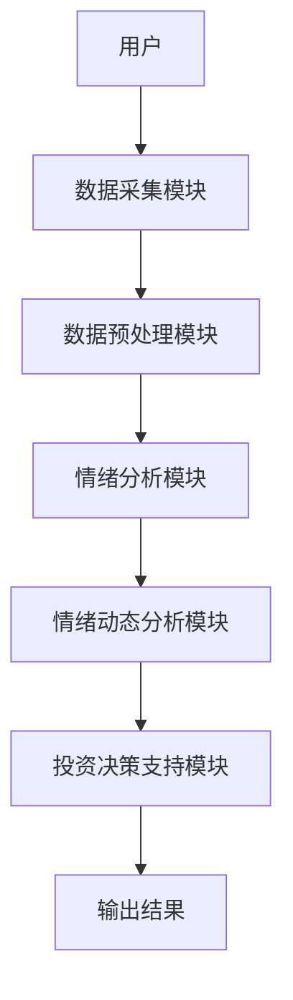
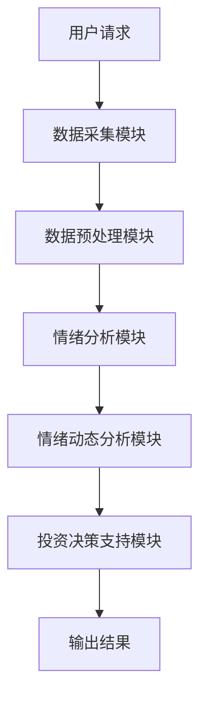
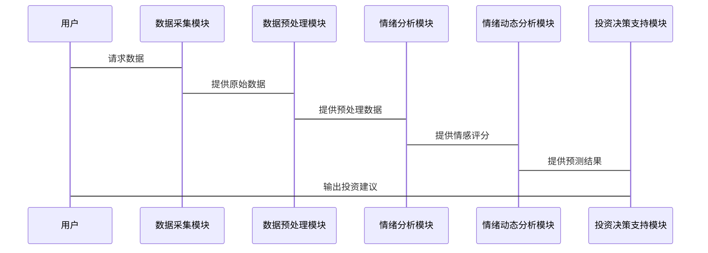

                 

<think>
好，我需要帮助用户撰写一篇关于“特价股票投资中的社交媒体情绪动态分析与应用”的技术博客文章。用户希望文章结构清晰，逻辑严谨，内容深入，同时使用吸引人的章节标题，并且包含必要的技术细节和实际案例。

首先，我需要理解“特价股票”和“社交媒体情绪分析”这两个核心概念。特价股票通常指价格低于正常水平的股票，可能是由于市场波动、公司业绩不佳等原因导致的。社交媒体情绪分析则是通过分析社交媒体上的文本数据，来判断市场情绪，从而辅助投资决策。

接下来，我需要确定文章的结构。用户已经提供了一个详细的目录大纲，我需要按照这个大纲逐步展开每个部分，确保内容详实、逻辑连贯。

在写作过程中，我需要特别注意以下几点：

1. **核心概念解释**：确保读者能够理解“特价股票”和“社交媒体情绪分析”这两个术语，特别是在背景部分详细说明它们的定义、分类和特点。

2. **情绪分析的原理**：详细讲解文本预处理、特征提取和情感分类算法，包括传统机器学习和深度学习方法，并给出具体的代码示例和数学模型。

3. **情绪动态分析的算法**：介绍时间序列分析和情绪传播网络分析的方法，使用Mermaid流程图和数学公式来解释这些算法的原理和实现。

4. **系统设计与架构**：描述系统的各个模块，包括数据采集、预处理、分析和可视化，并用Mermaid图展示系统架构。

5. **项目实战与案例分析**：通过实际案例展示如何利用社交媒体情绪分析辅助特价股票投资，包括环境搭建、代码实现和结果解读。

6. **总结与注意事项**：在结尾部分总结关键点，提醒读者注意情绪分析的局限性，并提出投资策略建议。

在写作时，我需要确保语言专业且易懂，逻辑清晰，每个章节都包含足够的技术细节和实际应用示例。同时，要注意使用适当的代码和数学公式来增强文章的深度和可读性。

接下来，我将按照目录大纲逐步撰写每个章节，确保覆盖所有必要的内容，并且保持文章的连贯性和专业性。
</think>

# 特价股票投资中的社交媒体情绪动态分析与应用

> 关键词：特价股票，社交媒体情绪分析，情感分类，时间序列分析，深度学习，投资策略

> 摘要：本文探讨了如何利用社交媒体上的情绪数据来分析和预测特价股票的投资价值。通过结合情感计算、自然语言处理和金融数据分析，提出了一套基于社交媒体情绪动态分析的投资策略，为投资者提供了新的视角和工具。

---

## 第1章: 特价股票与社交媒体情绪分析概述

### 1.1 特价股票的基本概念

#### 1.1.1 特价股票的定义
特价股票是指市场价格低于其内在价值或行业平均水平的股票。这些股票通常被认为是被市场低估的投资机会，吸引了许多追求价值投资的投资者。

#### 1.1.2 特价股票的分类与特点
特价股票可以分为以下几类：
- **周期性股票**：受经济周期影响较大的股票，如制造业和建筑业。
- **成长型股票**：未来增长潜力较大的股票，尽管当前价格可能较高。
- **防御型股票**：在经济衰退时表现相对稳定的股票，如公用事业和消费品行业。

特点：
- 价格波动较大，存在较高的风险和回报潜力。
- 市场关注度较低，信息不对称较为严重。

#### 1.1.3 特价股票的投资价值分析
投资者通常通过基本面分析（如市盈率、市净率）和技术分析来评估特价股票的价值。然而，市场情绪的变化也对股票价格产生重要影响。

---

### 1.2 社交媒体情绪分析的定义与特点

#### 1.2.1 社交媒体情绪分析的定义
社交媒体情绪分析是通过对社交媒体上的文本数据进行处理，提取其中的情感倾向，从而了解市场参与者对特定股票或市场的看法。

#### 1.2.2 社交媒体情绪分析的核心要素
- **文本数据**：包括社交媒体帖子、评论、新闻标题等。
- **情感倾向**：分为正面、负面和中性。
- **情绪强度**：衡量情感的强烈程度。

#### 1.2.3 社交媒体情绪分析的应用场景
- 实时监控市场情绪。
- 辅助投资决策。
- 风险管理。

---

### 1.3 特价股票与社交媒体情绪分析的结合

#### 1.3.1 特价股票投资中的情绪驱动因素
投资者的情绪往往受到市场趋势、公司新闻和社交媒体的影响。社交媒体上的讨论可以反映市场参与者的真实情感，从而影响股票价格。

#### 1.3.2 社交媒体情绪对股票价格的影响机制
- **情绪传染**：社交媒体上的负面情绪可能导致抛售压力，进而压低股价。
- **情绪滞后效应**：市场情绪的变化往往滞后于实际信息发布，为投资者提供交易机会。

#### 1.3.3 情绪动态分析在特价股票投资中的价值
通过分析社交媒体上的情绪变化，投资者可以更及时地捕捉市场情绪，优化投资策略，降低投资风险。

---

## 第2章: 社交媒体情绪分析的核心概念与原理

### 2.1 情绪分析的基本原理

#### 2.1.1 情感计算的定义与目标
情感计算旨在通过分析文本、语音和视觉信息，理解人类情感，并将其应用于人机交互、金融分析等领域。

#### 2.1.2 情感计算的关键技术
- **文本预处理**：包括分词、去除停用词、去除标点符号等。
- **特征提取**：利用词袋模型或词嵌入技术提取文本特征。
- **情感分类**：使用机器学习或深度学习算法对文本进行分类。

#### 2.1.3 情感计算的分类与流程
- 分类：分为二元分类（正面/负面）和多分类（正面、中性、负面）。
- 流程：数据采集 → 数据预处理 → 特征提取 → 情感分类 → 结果分析。

---

### 2.2 文本预处理与特征提取

#### 2.2.1 文本清洗与标准化
- 去除特殊字符、数字和标点符号。
- 转换为小写，统一格式。

#### 2.2.2 词袋模型与词嵌入
- **词袋模型**：将文本表示为词汇的集合，不考虑顺序。
- **词嵌入**：使用Word2Vec等模型将词语映射为低维向量。

#### 2.2.3 情感特征提取方法
- **基于词频（TF-IDF）**：计算每个词语在文本中的重要性。
- **基于深度学习**：使用卷积神经网络（CNN）提取局部特征。

---

### 2.3 情感分类算法

#### 2.3.1 基于传统机器学习的情感分类
- **支持向量机（SVM）**：适用于小规模数据，分类效果好。
- **朴素贝叶斯（Naive Bayes）**：适用于文本分类，计算简单。

#### 2.3.2 基于深度学习的情感分类
- **循环神经网络（RNN）**：适用于长文本序列。
- **双向长短期记忆网络（Bi-LSTM）**：能够捕捉上下文信息。

#### 2.3.3 情感分类算法的优缺点对比
| 算法       | 优点                           | 缺点                             |
|------------|--------------------------------|-----------------------------------|
| SVM        | 分类效果好，易于解释           | 不适合大规模数据                 |
| Naive Bayes| 计算简单，适合文本分类         | 对特征独立性假设较强             |
| RNN        | 能处理序列数据                 | 训练时间长，参数多                |
| Bi-LSTM    | 能捕捉上下文信息               | 需要大量计算资源                 |

---

## 第3章: 情绪动态分析的算法原理

### 3.1 情绪时间序列分析

#### 3.1.1 时间序列数据的特征
- 趋势性：数据呈现上升或下降趋势。
- 季节性：数据在特定时间段内呈现规律性变化。
- 随机性：数据无明显规律。

#### 3.1.2 基于ARIMA的情绪预测模型
- **ARIMA模型**：适用于线性时间序列数据，通过自回归和移动平均部分拟合数据。
- **模型步骤**：
  1. 数据平稳化（差分）。
  2. 确定模型参数（p, d, q）。
  3. 模型拟合与验证。
  4. 预测与结果分析。

#### 3.1.3 基于LSTM的情绪预测模型
- **LSTM网络**：适用于非线性时间序列数据，能够捕捉长期依赖关系。
- **模型结构**：
  1. 输入层 → LSTM层 → 全连接层 → 输出层。

---

### 3.2 情绪传播网络分析

#### 3.2.1 社会网络分析的基本概念
- **节点**：代表社交媒体用户。
- **边**：代表用户之间的互动（如转发、评论）。

#### 3.2.2 情绪传播网络的构建方法
- **数据采集**：收集社交媒体上的用户互动数据。
- **网络构建**：基于情感强度构建加权网络。
- **网络分析**：计算节点的中心性（如度中心性、介数中心性）。

#### 3.2.3 情绪传播网络的分析与应用
- **识别关键意见领袖**：通过中心性分析找到情绪传播的核心用户。
- **预测情绪扩散趋势**：基于网络结构预测情绪传播路径。

---

### 3.3 情绪强度分析与情感评分模型

#### 3.3.1 情绪强度的定义与计算
- 情绪强度表示情感的强烈程度，通常使用0到1之间的分数表示。
- 计算方法：基于情感词的权重和出现频率。

#### 3.3.2 情感评分模型的构建
- **线性回归模型**：根据情感词和情感强度训练模型。
- **机器学习模型**：使用随机森林或梯度提升树进行预测。

#### 3.3.3 情感评分模型的优化与应用
- **模型优化**：通过交叉验证调整模型参数。
- **实际应用**：对社交媒体文本进行实时评分，辅助投资决策。

---

## 第4章: 特价股票投资中的情绪动态分析系统

### 4.1 系统功能设计

#### 4.1.1 数据采集模块
- 从社交媒体平台（如Twitter、Reddit）获取相关文本数据。
- 数据清洗：去除无关信息，提取关键词。

#### 4.1.2 数据预处理模块
- 文本标准化：统一格式，去除停用词。
- 分词：将文本分割为词语或短语。

#### 4.1.3 情绪分析模块
- 使用预训练模型对文本进行情感分类。
- 计算情绪强度，生成情感评分。

#### 4.1.4 情绪动态分析模块
- 对情绪时间序列进行建模，预测未来情绪趋势。
- 构建情绪传播网络，分析情绪扩散路径。

#### 4.1.5 投资决策支持模块
- 基于情绪分析结果，生成投资建议。
- 提供风险预警，帮助投资者规避市场波动。

---

### 4.2 系统架构设计

#### 4.2.1 系统架构图


#### 4.2.2 数据流设计


#### 4.2.3 模块交互设计


---

### 4.3 系统接口设计

#### 4.3.1 数据接口
- **输入**：社交媒体文本数据。
- **输出**：清洗后的文本数据。

#### 4.3.2 用户接口
- **输入**：用户查询关键词。
- **输出**：情感分析结果和投资建议。

#### 4.3.3 分析结果接口
- **输入**：情绪评分数据。
- **输出**：预测的情绪趋势和传播网络。

---

## 第5章: 项目实战与应用案例

### 5.1 环境搭建与数据准备

#### 5.1.1 开发环境安装与配置
- 安装Python、Jupyter Notebook、scikit-learn、Keras、TensorFlow等工具。

#### 5.1.2 数据来源与数据清洗
- 数据来源：Twitter API、Reddit API。
- 数据清洗：去除无关信息，提取关键词。

#### 5.1.3 数据预处理与特征提取
- 分词：使用jieba库进行中文分词。
- 特征提取：使用TF-IDF提取关键词。

---

### 5.2 情绪分析算法实现

#### 5.2.1 基于机器学习的情感分类实现
```python
from sklearn.feature_extraction.text import TfidfVectorizer
from sklearn.svm import SVC

# 数据预处理
vectorizer = TfidfVectorizer()
X = vectorizer.fit_transform(texts)
y = [0 if label == 'negative' else 1 for label in labels]

# 模型训练
model = SVC()
model.fit(X, y)

# 预测
test_texts = ["股票表现不错"]
test_X = vectorizer.transform(test_texts)
print(model.predict(test_X))
```

#### 5.2.2 基于深度学习的情感分类实现
```python
from tensorflow.keras.models import Sequential
from tensorflow.keras.layers import Dense, LSTM

# 模型定义
model = Sequential()
model.add(LSTM(64, input_shape=(None, 1)))
model.add(Dense(1, activation='sigmoid'))
model.compile(loss='binary_crossentropy', optimizer='adam', metrics=['accuracy'])

# 训练
model.fit(X_train, y_train, epochs=10, batch_size=32)
```

---

### 5.3 情绪动态分析与投资策略制定

#### 5.3.1 情绪时间序列分析实现
```python
from statsmodels.tsa.arima_model import ARIMA

# 数据准备
data = [1.0, 0.8, 0.6, 0.7, 0.8, 0.9, 1.0, 1.2, 1.1, 1.0]

# 模型训练
model = ARIMA(data, order=(1, 1, 1))
model_fit = model.fit(disp=0)

# 预测
forecast = model_fit.forecast(steps=5)
print(forecast)
```

#### 5.3.2 情绪传播网络分析实现
```python
import networkx as nx

# 网络构建
G = nx.Graph()
G.add_edges_from([('A', 'B'), ('B', 'C'), ('C', 'D')])

# 中心性计算
degree_cent = nx.degree_centrality(G)
between_cent = nx.betweenness_centrality(G)
print(degree_cent, between_cent)
```

---

### 5.4 实际案例分析

#### 5.4.1 案例
假设我们关注一只特价股票，通过分析社交媒体上的情绪数据，发现近期负面情绪增加，情绪强度较高。结合时间序列分析，预测未来情绪可能进一步恶化，建议投资者短期内避免买入。

---

## 第6章: 总结与注意事项

### 6.1 最佳实践 tips
- 数据质量是关键，确保数据来源可靠。
- 结合多种分析方法，提高预测准确性。
- 定期更新模型，适应市场变化。

### 6.2 小结
社交媒体情绪分析为特价股票投资提供了新的视角和工具。通过结合情感计算、自然语言处理和金融数据分析，投资者可以更全面地理解市场情绪，优化投资策略。

### 6.3 注意事项
- 情绪分析结果仅供参考，不能完全依赖。
- 考虑市场其他因素，如宏观经济指标和公司基本面。

### 6.4 拓展阅读
- 《LSTM网络：从基础到实战》
- 《情感计算在金融中的应用》
- 《社交媒体数据挖掘与分析》

---

## 作者：AI天才研究院/AI Genius Institute & 禅与计算机程序设计艺术 /Zen And The Art of Computer Programming

---

本文通过详细分析特价股票和社交媒体情绪分析的核心概念、算法原理和系统设计，结合实际案例，展示了如何利用社交媒体情绪分析辅助投资决策。希望本文能为投资者提供新的思路，帮助他们在复杂多变的市场中做出更明智的投资决策。

