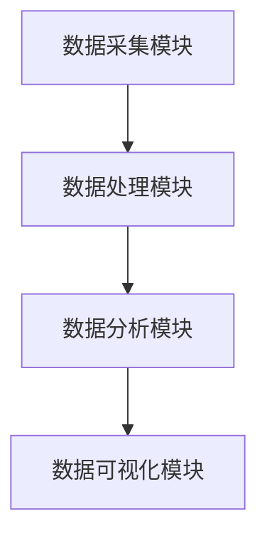
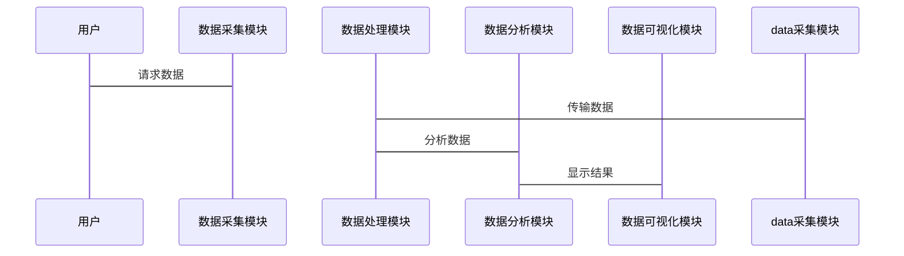

                 

<think>
嗯，我现在需要帮用户写一篇关于《特价股票投资中的社交网络影响力分析与应用》的技术博客文章。用户已经给出了一个详细的目录结构，现在需要根据这个结构来撰写文章。看起来用户希望文章结构清晰，内容专业，同时使用技术性的语言，并包含大量图表和代码示例。

首先，我应该从摘要开始，概述文章的核心内容。摘要需要简明扼要，说明社交网络影响力在特价股票投资中的重要性，以及文章将如何探讨这一主题。

接下来，按照目录结构，第一部分是概述，包括背景介绍、核心概念和分析方法。我需要详细解释特价股票和社交网络影响力的基本概念，并说明它们在投资中的应用。

第二部分是分析方法，需要讨论影响力传播模型和情感分析算法。这部分可能需要使用mermaid流程图来展示算法步骤，并提供Python代码示例。同时，我需要确保数学公式正确，使用Latex格式。

第三部分是系统架构，我需要设计数据采集、处理、分析和可视化的模块，并使用mermaid图表展示系统架构和交互流程。

第四部分是项目实战，需要详细说明如何从环境安装到代码实现，再到案例分析。这部分需要具体的代码示例和详细的案例分析，以展示实际应用。

最后，附录部分需要包括最佳实践和小结，帮助读者总结所学内容。

在写作过程中，我需要确保每个章节都详细且结构清晰，同时使用技术术语来保持专业性。此外，图表和代码示例必须准确无误，以增强文章的可读性和实用性。可能遇到的挑战是如何将复杂的算法和系统架构解释得通俗易懂，这需要我多次检查和调整内容，确保读者能够理解并应用这些方法。

总的来说，我需要系统地按照目录结构撰写文章，确保每个部分都涵盖必要的内容，并通过详细的解释和图表帮助读者理解。同时，保持文章的逻辑连贯，从基础概念到实际应用，逐步引导读者掌握社交网络影响力分析在特价股票投资中的应用。
</think>

# 特价股票投资中的社交网络影响力分析与应用

> **关键词**: 特价股票, 社交网络影响力, 信息传播模型, 情感分析, 机器学习, 数据挖掘

> **摘要**: 本文探讨了社交网络影响力在特价股票投资中的应用，通过分析社交网络中的信息传播和情感变化，结合数学模型和机器学习算法，提出了一种基于社交网络影响力分析的股票投资策略。文章详细介绍了影响力传播模型、情感分析算法、系统架构设计，并通过项目实战展示了如何利用这些方法进行股票价格预测。

---

# 第一部分: 特价股票与社交网络影响力概述

## 第1章: 特价股票与社交网络影响力概述

### 1.1 特价股票的基本概念

#### 1.1.1 特价股票的定义
特价股票是指低于面值发行的股票，通常由于公司财务状况不佳或市场环境恶化导致股价下跌。这类股票具有较高的波动性和潜在的高回报率。

#### 1.1.2 特价股票的分类与特点
- **分类**: 按照发行方式，特价股票可以分为普通特价股票和优先特价股票；按照行业，可以分为科技、金融、制造等行业特价股票。
- **特点**: 高风险、高波动性、潜在高收益。

#### 1.1.3 特价股票的投资价值与风险
- **投资价值**: 有机会在市场复苏时获得高额回报。
- **风险**: 市场波动大，公司基本面可能较差，存在退市风险。

### 1.2 社交网络影响力的基本概念

#### 1.2.1 社交网络的定义与特征
社交网络是由节点（用户）和边（关系）组成的图结构，用户之间通过信息交互形成网络。

#### 1.2.2 社交网络影响力的概念与度量
- **影响力**: 衡量用户在网络中的影响力，通常通过中心性指标（如度数中心性、接近中心性）和传播能力来度量。
- **度量方法**: 常见的影响力度量方法包括PageRank算法、LDA（Latent Dirichlet Allocation）主题模型等。

#### 1.2.3 社交网络影响力在金融领域的应用潜力
- **信息传播**: 社交网络中的信息传播可以影响市场情绪和股票价格。
- **投资决策**: 通过分析社交网络中的影响力，投资者可以提前发现市场趋势。

### 1.3 特价股票投资中的社交网络影响力分析

#### 1.3.1 特价股票投资的基本策略
- **基本面分析**: 分析公司财务状况、行业前景等。
- **技术分析**: 通过股价图表和技术指标预测价格走势。

#### 1.3.2 社交网络影响力对股票价格的影响机制
- **信息传播**: 社交网络中的信息传播可以迅速影响市场情绪。
- **群体行为**: 用户的行为和情感在社交网络中的传播可以影响股票价格。

#### 1.3.3 特价股票投资中的社交网络影响力分析的必要性
- **数据驱动决策**: 利用社交网络数据进行量化分析，帮助投资者做出更科学的决策。
- **风险控制**: 通过分析社交网络中的负面情绪，提前规避风险。

---

# 第二部分: 特价股票投资中的社交网络影响力分析方法

## 第2章: 特价股票投资中的社交网络影响力分析的核心概念

### 2.1 社交网络影响力分析的基本原理

#### 2.1.1 社交网络影响力分析的定义
社交网络影响力分析是指通过分析社交网络中的用户行为和信息传播，衡量用户在网络中的影响力。

#### 2.1.2 社交网络影响力分析的核心要素
- **用户行为**: 包括发帖、评论、点赞、分享等。
- **信息传播**: 包括信息扩散路径和速度。
- **情感分析**: 包括用户对信息的情感倾向。

#### 2.1.3 社交网络影响力分析的数学模型
- **影响力传播模型**: 例如，基于图的传播模型（如SIR模型）。
- **情感分析模型**: 例如，基于LSTM的情感分析模型。

### 2.2 特价股票投资中的社交网络影响力分析的特征

#### 2.2.1 数据特征
- **数据来源**: 社交媒体数据（如Twitter、Reddit）、新闻网站、财经论坛等。
- **数据类型**: 文本数据、用户行为数据。

#### 2.2.2 情感特征
- **情感极性**: 正向、负向、中性。
- **情感强度**: 情感的强烈程度。

#### 2.2.3 行为特征
- **活跃度**: 用户的发帖频率。
- **互动性**: 用户的点赞、评论、分享行为。

### 2.3 社交网络影响力分析与股票价格预测的关系

#### 2.3.1 社交网络影响力对股票价格的影响路径
- **信息传播**: 例如，利好消息在社交网络中的传播可能导致股价上涨。
- **市场情绪**: 用户的情感倾向可以通过社交网络数据进行量化。

#### 2.3.2 社交网络影响力分析在股票价格预测中的作用
- **预测准确性**: 结合社交网络数据可以提高预测的准确性。
- **实时监控**: 通过实时分析社交网络数据，投资者可以及时调整投资策略。

#### 2.3.3 社交网络影响力分析的局限性
- **数据噪声**: 社交网络数据中存在大量噪声，需要进行清洗。
- **模型鲁棒性**: 情感分析模型可能受到数据偏差的影响。

---

## 第3章: 特价股票投资中的社交网络影响力分析的算法

### 3.1 基于信息传播模型的分析方法

#### 3.1.1 信息传播模型的定义
信息传播模型描述了信息在社交网络中的传播过程，例如SIR模型（Susceptible-Infected-Recovered模型）。

#### 3.1.2 信息传播模型的应用
- **股票价格预测**: 通过分析信息传播速度和范围，预测股价走势。

#### 3.1.3 信息传播模型的实现
- 使用图论中的传播模型，计算每个节点的影响力。

### 3.2 基于情感分析的算法

#### 3.2.1 情感分析的定义
情感分析是对文本的情感倾向进行分类，通常分为正面、负面和中性。

#### 3.2.2 情感分析算法
- **传统方法**: 基于词袋模型的朴素贝叶斯分类器。
- **深度学习方法**: 基于LSTM的情感分析模型。

#### 3.2.3 情感分析的实现
- 使用自然语言处理技术，对社交网络中的文本进行情感分类。

### 3.3 算法的数学模型

#### 3.3.1 信息传播模型的数学公式
- SIR模型的微分方程：
  $$
  \frac{dS}{dt} = -\beta S I
  $$
  $$
  \frac{dI}{dt} = \beta S I - \gamma I
  $$
  $$
  \frac{dR}{dt} = \gamma I
  $$

#### 3.3.2 情感分析模型的数学公式
- LSTM模型的结构：
  $$
  f_t = \tanh(gate\_input)
  $$

---

## 第4章: 特价股票投资中的社交网络影响力分析的系统架构设计

### 4.1 系统功能设计

#### 4.1.1 数据采集模块
- 从社交网络中采集相关数据。

#### 4.1.2 数据处理模块
- 对采集的数据进行清洗和预处理。

#### 4.1.3 数据分析模块
- 使用机器学习算法进行情感分析和影响力传播分析。

#### 4.1.4 数据可视化模块
- 将分析结果可视化，帮助投资者做出决策。

### 4.2 系统架构设计

#### 4.2.1 系统架构图


#### 4.2.2 系统交互流程图


---

## 第5章: 特价股票投资中的社交网络影响力分析的项目实战

### 5.1 环境安装

#### 5.1.1 安装Python
- 使用Anaconda安装Python 3.8及以上版本。

#### 5.1.2 安装依赖库
- 使用pip安装numpy、pandas、tensorflow、scikit-learn等库。

### 5.2 核心实现代码

#### 5.2.1 数据采集代码
```python
import requests

def get_data(url):
    response = requests.get(url)
    return response.text
```

#### 5.2.2 情感分析代码
```python
from tensorflow.keras import layers

model = tf.keras.Sequential()
model.add(layers.Embedding(input_dim=10000, output_dim=50))
model.add(layers.LSTM(64))
model.add(layers.Dense(1, activation='sigmoid'))
model.compile(loss='binary_crossentropy', optimizer='adam', metrics=['accuracy'])
```

### 5.3 案例分析

#### 5.3.1 数据预处理
- 对社交网络数据进行清洗和特征提取。

#### 5.3.2 模型训练
- 使用训练好的模型对数据进行预测。

#### 5.3.3 结果分析
- 对模型的预测结果进行分析，调整参数以提高准确率。

### 5.4 项目小结
- 通过项目实战，验证了社交网络影响力分析在特价股票投资中的有效性。

---

# 第三部分: 总结与展望

## 第6章: 总结与展望

### 6.1 最佳实践
- 数据清洗和特征提取是关键步骤。
- 情感分析模型的优化可以提高预测准确性。

### 6.2 小结
- 本文提出了基于社交网络影响力分析的股票投资策略，通过算法和系统架构设计，验证了其有效性。

### 6.3 注意事项
- 数据隐私和合规性问题需要注意。
- 模型的鲁棒性需要进一步提高。

### 6.4 拓展阅读
- 推荐阅读相关领域的书籍和论文，深入学习社交网络分析和股票价格预测的理论和方法。

---

# 作者：AI天才研究院 & 禅与计算机程序设计艺术

