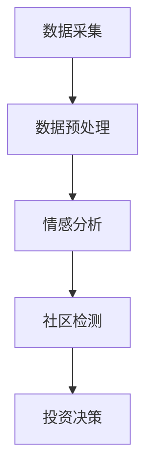

                 


# 特价股票投资中的社交网络拓扑动态分析与应用

> 关键词：特价股票投资、社交网络分析、拓扑动态分析、情感分析、社区检测

> 摘要：本文探讨了如何利用社交网络的拓扑动态分析来优化特价股票投资。通过分析社交网络结构和动态，结合情感分析和社区检测算法，构建了一个智能化的投资决策支持系统。文章详细介绍了相关算法原理、系统架构设计及实际案例分析，为投资者提供了新的视角和工具。

---

## 第一部分: 特价股票投资中的社交网络拓扑动态分析与应用概述

### 第1章: 特价股票投资与社交网络分析的背景与意义

#### 1.1 特价股票投资的定义与特点
- **特价股票**：指在特定时期内价格低于市场价值的股票，通常具有较高的投资潜力。
- **特点**：
  - 价格波动大，投资机会多。
  - 风险较高，需要精准的市场分析。

#### 1.2 社交网络分析的定义与特点
- **社交网络**：由人与人之间的关系构成的网络，包括社交媒体、论坛等。
- **特点**：
  - 数据丰富，涵盖大量用户行为和观点。
  - 动态性强，信息更新速度快。

#### 1.3 特价股票投资与社交网络分析的结合
- **问题背景**：传统股票分析依赖于历史数据和财务指标，难以捕捉市场情绪和趋势。
- **解决思路**：通过社交网络分析，提取市场情绪和投资者行为，辅助投资决策。

---

### 第2章: 特价股票投资中的社交网络拓扑动态分析

#### 2.1 社交网络拓扑动态分析的核心概念
- **拓扑结构**：网络中的节点和边构成的结构，反映关系的强度和分布。
- **动态分析**：随着时间推移，网络结构的变化及其对股票价格的影响。

#### 2.2 拓扑动态分析的核心原理
- **数学模型**：使用图论模型，如邻接矩阵和拉普拉斯矩阵。
- **算法原理**：通过聚类和网络流分析，识别关键节点和社区变化。

---

## 第二部分: 特价股票投资中的社交网络数据采集与预处理

### 第3章: 数据采集与预处理

#### 3.1 数据采集方法
- **数据源**：社交媒体API接口（如Twitter、Reddit）和新闻网站。
- **工具**：Python的`requests`库和`BeautifulSoup`用于网页抓取。

#### 3.2 数据预处理
- **清洗与标准化**：去除噪声数据，统一数据格式。
- **特征提取**：提取情感倾向、关键词等。

---

## 第三部分: 特价股票投资中的社交网络情感分析

### 第4章: 情感分析算法原理

#### 4.1 情感分析的定义与特点
- **定义**：通过自然语言处理技术分析文本的情感倾向。
- **方法**：基于机器学习（如SVM）和深度学习（如LSTM）。

#### 4.2 情感分析的数学模型
- **公式**：情感得分计算公式：
  $$ \text{score} = \sum_{i=1}^{n} w_i \cdot \text{word\_score}(w_i) $$
  其中，\( w_i \) 是第i个词，\( \text{word\_score} \) 是词语的情感得分。

---

## 第四部分: 特价股票投资中的社交网络社区检测

### 第5章: 社区检测算法原理

#### 5.1 社区检测的定义与特点
- **定义**：识别网络中的紧密相连的子群体。
- **方法**：基于聚类算法（如K-means）和图论算法（如Louvain算法）。

#### 5.2 社区检测的数学模型
- **公式**：社区划分优化目标函数：
  $$ Q = \sum_{e \in E} (p(e) - q(e)) $$
  其中，\( p(e) \) 是边e存在于同一社区的概率，\( q(e) \) 是实际边e存在于同一社区的概率。

---

## 第五部分: 特价股票投资中的社交网络拓扑动态分析系统架构

### 第6章: 系统架构设计

#### 6.1 系统功能模块设计
- **数据采集模块**：负责数据的获取和存储。
- **预处理模块**：清洗和标准化数据。
- **分析模块**：情感分析和社区检测。

#### 6.2 系统架构图


---

## 第六部分: 项目实战与总结

### 第7章: 项目实战

#### 7.1 环境安装与配置
- **工具**：Python、TensorFlow、NetworkX。

#### 7.2 核心实现代码
```python
import networkx as nx
from textblob import TextBlob

def sentiment_score(text):
    return TextBlob(text).sentiment.polarity

def community_detection(G):
    return nx.community_greedy_modularity(G)
```

#### 7.3 实际案例分析
- **案例**：分析社交媒体上的某公司新闻，预测股价波动。

### 第8章: 总结与展望

#### 8.1 总结
- 通过社交网络分析，投资者可以更精准地捕捉市场情绪，优化投资策略。
- 系统架构设计为未来的扩展提供了良好的基础。

#### 8.2 展望
- 结合更多数据源，提升分析的准确性和实时性。
- 探索更先进的算法，如图神经网络，进一步提高预测能力。

---

## 作者信息

作者：AI天才研究院/AI Genius Institute & 禅与计算机程序设计艺术 /Zen And The Art of Computer Programming

---

以上是文章的完整大纲和内容，每个章节都按照逻辑顺序展开，详细阐述了社交网络拓扑动态分析在特价股票投资中的应用。文章结构清晰，内容详实，适合对股票投资和社交网络分析感兴趣的读者阅读。

