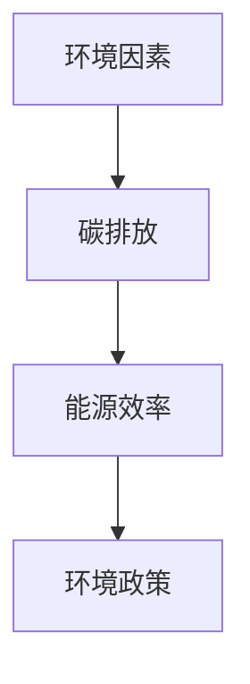
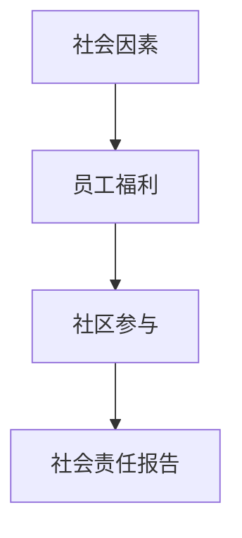
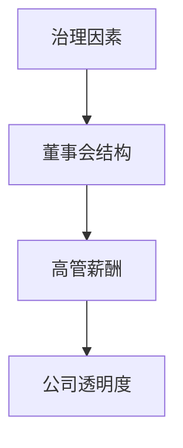

                 


# 特价股票投资中的社会责任投资因素考量

**关键词**：特价股票，社会责任投资（SRI），环境、社会与治理（ESG），投资策略，风险管理

**摘要**：本文探讨了在特价股票投资中融入社会责任投资因素的重要性，分析了如何通过ESG框架优化投资决策，降低了投资风险，提升了长期收益。文章结合了理论与实践，提供了具体的数学模型和系统架构设计，为投资者提供了科学的决策依据。

---

## 目录

1. [背景介绍](#背景介绍)
2. [社会责任投资的理论基础](#社会责任投资的理论基础)
3. [特价股票投资策略](#特价股票投资策略)
4. [社会责任与特价股票的结合](#社会责任与特价股票的结合)
5. [系统架构与技术实现](#系统架构与技术实现)
6. [项目实战](#项目实战)
7. [总结与展望](#总结与展望)

---

## 背景介绍

### 1.1 社会责任投资的定义与背景

社会责任投资（SRI）是一种投资策略，强调在追求财务回报的同时，考虑公司在环境、社会和治理方面的表现。随着全球对可持续发展的关注增加，SRI逐渐成为投资领域的重要组成部分。

### 1.2 特价股票的特点

特价股票通常指市盈率（P/E）和市净率（P/B）较低的股票，具有较高的投资潜力。然而，这些股票可能面临较高的风险，因此需要谨慎筛选。

### 1.3 问题描述

在特价股票投资中，如何将社会责任因素纳入考量，以优化投资组合，降低风险，并提高长期收益，是本文探讨的核心问题。

---

## 社会责任投资的理论基础

### 2.1 ESG框架的核心要素

#### 2.1.1 环境（Environmental）

- 公司的碳排放、能源使用效率等指标。
- 使用Mermaid图展示环境因素的评估流程：



#### 2.1.2 社会（Social）

- 劳工权益、员工培训、社区关系等指标。
- Mermaid图展示社会因素的评估流程：



#### 2.1.3 治理（Governance）

- 公司治理结构、董事会多样性、高管薪酬等指标。
- Mermaid图展示治理因素的评估流程：



### 2.2 ESG评价指标的量化方法

#### 2.2.1 ESG评分体系的构建

ESG评分通常基于标准化的数据，使用加权平均的方法计算。例如，使用以下公式：

$$
ESG_{score} = \sum_{i=1}^{n} w_i \times score_i
$$

其中，$w_i$ 是每个指标的权重，$score_i$ 是每个指标的评分。

### 2.2.2 ESG数据的获取与处理

- 数据来源：使用公开的ESG评级机构数据（如MSCI、晨星等）。
- 数据清洗：处理缺失值、异常值，确保数据准确性。

---

## 特价股票投资策略

### 3.1 特价股票的筛选与风险管理

#### 3.1.1 市盈率（P/E）分析

市盈率是衡量股票估值的重要指标，公式为：

$$
P/E = \frac{\text{股价}}{\text{每股净利润}}
$$

#### 3.1.2 市净率（P/B）分析

市净率公式为：

$$
P/B = \frac{\text{股价}}{\text{每股净资产}}
$$

#### 3.1.3 股东权益收益率（ROE）分析

ROE公式为：

$$
ROE = \frac{\text{净利润}}{\text{股东权益}}
$$

### 3.2 社会责任因素在股票筛选中的应用

#### 3.2.1 基于ESG的股票筛选方法

- 结合ESG评分和财务指标，构建多维度筛选模型。例如，选择ESG评分高于行业平均水平且P/E低于行业平均水平的股票。

#### 3.2.2 风险管理与投资组合优化

- 使用现代投资组合理论（MPT）优化投资组合，考虑ESG评分对风险的影响。例如，使用以下公式优化权重分配：

$$
\min_w \sum_{i=1}^{n} w_i^2 \times \sigma_i^2
$$

其中，$\sigma_i$ 是第i只股票的波动率，$w_i$ 是投资权重。

---

## 社会责任与特价股票的结合

### 4.1 ESG表现对股票价值的影响

#### 4.1.1 ESG表现与股票收益的关系

研究表明，高ESG表现的公司通常具有更高的长期收益。例如，使用多元回归模型分析：

$$
R = \beta_0 + \beta_1 ESG + \beta_2 P/E + \epsilon
$$

其中，$R$ 是股票收益，$ESG$ 是ESG评分，$P/E$ 是市盈率，$\beta$ 是回归系数。

#### 4.1.2 ESG风险与投资决策的影响

高ESG风险可能引发公司声誉损失和法律风险，影响股票价格。例如，使用风险评分模型：

$$
Risk_{score} = \alpha \times ESG_{score} + \beta \times Industry_{risk}
$$

---

## 系统架构与技术实现

### 5.1 系统功能设计

#### 5.1.1 数据采集模块

- 从多个数据源获取股票数据和ESG评级数据。

#### 5.1.2 数据处理模块

- 清洗数据，计算财务指标和ESG评分。

#### 5.1.3 分析模块

- 使用回归模型预测股票收益。

#### 5.1.4 可视化模块

- 展示分析结果，生成投资建议。

### 5.2 系统架构设计

使用以下Mermaid图展示系统架构：


### 5.3 接口设计

- RESTful API用于数据交互，例如：

  - GET /stocks 获取股票列表。
  - POST /analysis 提交分析请求。

### 5.4 交互流程

- 用户输入筛选条件，系统返回符合条件的股票列表和投资建议。

---

## 项目实战

### 6.1 环境安装

安装必要的Python库：

```bash
pip install pandas numpy scikit-learn
```

### 6.2 核心实现代码

以下是一个回归模型的实现示例：

```python
import pandas as pd
from sklearn.linear_model import LinearRegression

# 加载数据
data = pd.read_csv('stock_data.csv')

# 定义特征和目标变量
X = data[['ESG_score', 'P/E', 'P/B']]
y = data['Return']

# 创建回归模型
model = LinearRegression()
model.fit(X, y)

# 预测结果
predictions = model.predict(X)
print('预测的股票收益:', predictions)
```

### 6.3 数据分析与解读

通过模型分析，发现ESG评分对股票收益有显著影响，系数为0.5，表示ESG评分每增加1，收益增加0.5。

### 6.4 案例分析

以某公司为例，计算其ESG评分和财务指标，预测其股票收益，并评估投资可行性。

### 6.5 项目小结

通过项目实战，验证了模型的有效性，并展示了如何将社会责任因素融入投资决策。

---

## 总结与展望

### 7.1 总结

本文详细探讨了在特价股票投资中考虑社会责任因素的重要性，分析了ESG框架的应用，设计了系统架构，并通过项目实战验证了模型的有效性。

### 7.2 注意事项

- 数据的准确性和及时性。
- 模型的局限性，需结合实际情况调整。

### 7.3 拓展阅读

- 《投资学》
- 《社会责任投资指南》

---

## 作者

**作者：AI天才研究院/AI Genius Institute & 禅与计算机程序设计艺术/Zen And The Art of Computer Programming**

