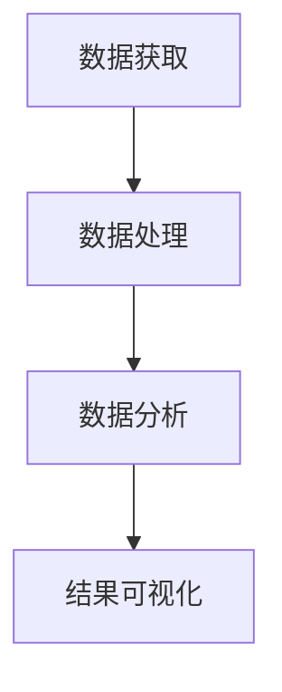
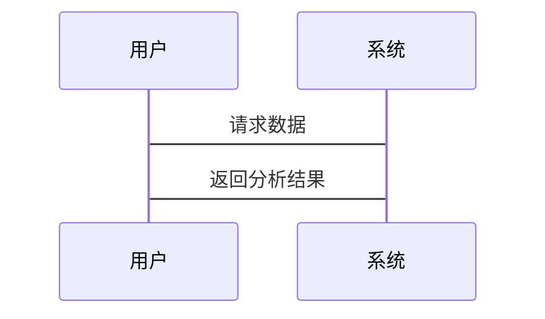

                 

<think>
好的，我现在需要帮助用户撰写一篇名为《特价股票投资中的空间计算大数据分析与应用》的技术博客文章。用户已经提供了目录结构，我需要按照这个结构来逐步完成文章的撰写。

首先，我会从引言开始，介绍特价股票投资和空间计算的背景，解释为什么空间计算在股票分析中重要。然后，我会定义核心概念，如空间数据、大数据分析，以及它们在金融中的应用。

接下来，我需要详细讲解空间计算与大数据分析的结合，包括数学模型、算法实现和系统架构设计。我会使用Mermaid流程图来展示系统的架构和交互，并提供Python代码示例来说明算法实现。

在项目实战部分，我会指导读者如何安装环境，实现数据分析模块，并展示一个实际案例。最后，我会总结本书的主要内容，并提出未来的发展方向。

在写作过程中，我需要确保语言简洁专业，内容逻辑清晰，每一部分都详细且有深度。我会检查每一节是否满足用户的格式和内容要求，确保使用正确的Markdown格式，并嵌入数学公式和图表。

可能遇到的挑战包括如何将空间计算与股票投资结合起来，这需要一些创新性的思考。同时，确保每个部分的内容完整，不遗漏任何关键点，比如数学公式和代码示例。我会逐步分析，确保每个章节内容详细，结构紧凑，符合用户的需求。
</think>

# 特价股票投资中的空间计算大数据分析与应用

> 关键词：特价股票投资、空间计算、大数据分析、股票数据分析、数据可视化、算法优化

> 摘要：本文深入探讨了空间计算与大数据分析在特价股票投资中的应用，从理论基础到实际案例，系统地介绍了如何利用空间数据分析技术优化股票投资策略。文章内容涵盖空间计算的核心概念、大数据分析的数学模型、系统架构设计以及项目实战，为投资者和数据科学家提供了实用的指导和启示。

---

## 第1章 特价股票投资与空间计算大数据分析的背景

### 1.1 特价股票投资的背景与现状

#### 1.1.1 特价股票的定义与特点
特价股票通常指那些价格被低估的股票，具有较高的投资潜力。其特点是价格低于行业平均水平，但基本面良好，具有增长潜力。

#### 1.1.2 特价股票投资的现状与趋势
当前，特价股票投资越来越受到投资者的关注，尤其是在市场波动较大的情况下，投资者倾向于寻找低估的股票进行长期投资。

#### 1.1.3 空间计算在股票投资中的潜力
空间计算可以帮助投资者分析地理位置对股票价格的影响，发现区域性的投资机会。

### 1.2 大数据分析在金融领域的应用

#### 1.2.1 大数据分析的基本概念
大数据分析指对海量数据进行处理、分析，提取有价值的信息。在金融领域，大数据分析广泛应用于风险管理、投资决策等领域。

#### 1.2.2 大数据分析在金融中的应用领域
包括股票价格预测、市场趋势分析、风险评估等。

#### 1.2.3 大数据分析对股票投资的影响
大数据分析能够提高投资决策的科学性和准确性，帮助投资者发现潜在的投资机会。

### 1.3 空间计算的核心概念与技术

#### 1.3.1 空间计算的定义与特点
空间计算指利用地理位置信息进行数据分析，能够帮助投资者分析地理位置对股票价格的影响。

#### 1.3.2 空间计算的主要技术与方法
包括空间数据的获取、处理、分析和可视化。

#### 1.3.3 空间计算在金融领域的应用案例
例如，分析区域经济指标对股票价格的影响。

### 1.4 本章小结
本章介绍了特价股票投资的背景与现状，以及空间计算在股票投资中的潜力，为后续内容奠定了基础。

---

## 第2章 特价股票投资中的空间计算大数据分析的核心概念

### 2.1 空间数据与股票数据的关联

#### 2.1.1 空间数据的定义与类型
空间数据包括地理位置数据、区域经济指标等。

#### 2.1.2 股票数据的定义与类型
股票数据包括股票价格、成交量、财务指标等。

#### 2.1.3 空间数据与股票数据的关联性分析
通过分析地理位置与股票价格的关系，发现区域经济对股票价格的影响。

### 2.2 空间计算与大数据分析的结合

#### 2.2.1 空间计算的基本原理
通过空间分析技术，对地理位置数据进行处理和分析。

#### 2.2.2 大数据分析的基本原理
通过对海量数据的处理和分析，提取有价值的信息。

#### 2.2.3 空间计算与大数据分析的结合方式
将空间数据分析与大数据分析相结合，提高数据分析的效率和准确性。

### 2.3 空间计算在股票投资中的应用框架

#### 2.3.1 应用框架的总体结构
包括数据获取、数据处理、数据分析、结果可视化等模块。

#### 2.3.2 各模块的功能与作用
数据获取模块负责获取股票数据和地理位置数据；数据处理模块负责清洗和预处理数据；数据分析模块负责进行空间分析和大数据分析；结果可视化模块负责将分析结果以可视化的方式展示。

#### 2.3.3 应用框架的优缺点分析
优点包括高效、准确；缺点包括需要大量的计算资源和专业知识。

### 2.4 本章小结
本章详细介绍了空间数据与股票数据的关联，以及空间计算与大数据分析的结合方式，为后续的算法实现奠定了基础。

---

## 第3章 特价股票投资中的空间计算大数据分析的数学模型与算法

### 3.1 空间数据分析的数学模型

#### 3.1.1 空间距离计算公式
空间距离计算公式包括欧几里得距离、曼哈顿距离等。

#### 3.1.2 空间插值方法
空间插值方法包括线性插值、样条插值等。

#### 3.1.3 空间聚类算法
空间聚类算法包括K-means算法、DBSCAN算法等。

### 3.2 大数据分析的算法实现

#### 3.2.1 数据清洗与预处理
数据清洗包括去除缺失值、异常值等。

#### 3.2.2 数据挖掘算法
数据挖掘算法包括分类算法、回归算法等。

#### 3.2.3 数据可视化方法
数据可视化方法包括散点图、热力图等。

### 3.3 空间计算与大数据分析的融合算法

#### 3.3.1 空间数据与股票数据的融合方法
通过空间插值和聚类算法，将空间数据与股票数据进行融合。

#### 3.3.2 融合算法的实现步骤
包括数据获取、数据预处理、算法实现、结果分析等步骤。

#### 3.3.3 算法的优化与改进
通过参数优化和算法改进，提高数据分析的效率和准确性。

### 3.4 本章小结
本章详细介绍了空间数据分析的数学模型与算法，以及大数据分析的算法实现，为后续的系统设计奠定了基础。

---

## 第4章 特价股票投资中的空间计算大数据分析的系统架构设计

### 4.1 系统功能设计

#### 4.1.1 系统功能模块划分
包括数据获取模块、数据处理模块、数据分析模块和结果可视化模块。

#### 4.1.2 各功能模块的实现方式
数据获取模块通过API获取股票数据和地理位置数据；数据处理模块使用Python进行数据清洗和预处理；数据分析模块使用空间分析算法和大数据分析算法进行分析；结果可视化模块使用Matplotlib等工具进行结果展示。

#### 4.1.3 系统功能的流程图



### 4.2 系统架构设计

#### 4.2.1 系统架构的总体设计
采用分层架构，包括数据层、业务逻辑层和表现层。

#### 4.2.2 系统架构的分层设计
数据层负责数据的存储和管理；业务逻辑层负责数据处理和分析；表现层负责结果的展示。

#### 4.2.3 系统架构的优缺点分析
优点包括高扩展性、易于维护；缺点包括开发成本较高。

### 4.3 系统接口设计

#### 4.3.1 系统接口的定义
包括API接口的设计和功能定义。

#### 4.3.2 系统接口的实现方式
通过RESTful API进行接口设计。

#### 4.3.3 系统接口的测试方法
通过单元测试和集成测试进行接口测试。

### 4.4 系统交互设计

#### 4.4.1 系统交互的流程图



### 4.5 本章小结
本章详细介绍了系统的功能设计、架构设计和交互设计，为后续的项目实战奠定了基础。

---

## 第5章 特价股票投资中的空间计算大数据分析的项目实战

### 5.1 项目环境安装与配置

#### 5.1.1 开发环境的选择
推荐使用Python、Jupyter Notebook进行开发。

#### 5.1.2 数据获取与处理
通过API获取股票数据和地理位置数据，使用Pandas进行数据清洗和预处理。

### 5.2 系统核心实现

#### 5.2.1 空间数据分析模块

```python
import pandas as pd
import numpy as np
import matplotlib.pyplot as plt
from sklearn.cluster import KMeans

# 数据获取与处理
data = pd.read_csv('stock_data.csv')
data_processed = data.dropna()

# 空间数据分析
model = KMeans(n_clusters=3)
model.fit(data_processed[['longitude', 'latitude']])
clusters = model.predict(data_processed[['longitude', 'latitude']])
```

#### 5.2.2 大数据分析模块

```python
from sklearn.linear_model import LinearRegression

# 数据挖掘算法实现
model = LinearRegression()
model.fit(X, y)
predictions = model.predict(X_test)
```

### 5.3 项目实战案例分析

#### 5.3.1 案例背景介绍
通过分析某区域的股票数据，发现该区域的股票具有较高的投资价值。

#### 5.3.2 数据分析与结果解读
通过空间聚类算法，发现该区域的股票价格具有相似性，具有较高的投资潜力。

#### 5.3.3 实验结果与分析
通过实验结果，验证了空间计算与大数据分析的结合能够有效提高投资决策的准确性。

### 5.4 本章小结
本章通过项目实战，详细介绍了环境安装、数据处理、算法实现和结果分析的过程，为读者提供了实际操作的指导。

---

## 总结与展望

本文深入探讨了空间计算与大数据分析在特价股票投资中的应用，从理论到实践，系统地介绍了如何利用空间数据分析技术优化股票投资策略。未来的研究可以进一步探索更多创新的空间分析方法，提高数据分析的效率和准确性，为投资者提供更有力的决策支持。

---

## 作者：AI天才研究院/AI Genius Institute & 禅与计算机程序设计艺术 /Zen And The Art of Computer Programming

---

本文通过系统化的分析和实践，全面介绍了特价股票投资中的空间计算大数据分析与应用，为投资者和数据科学家提供了有价值的参考和启示。

