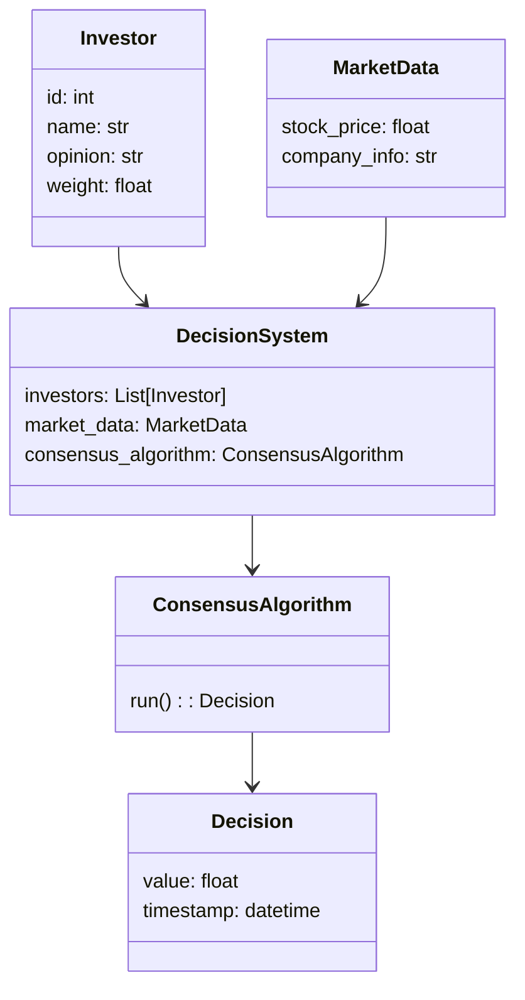
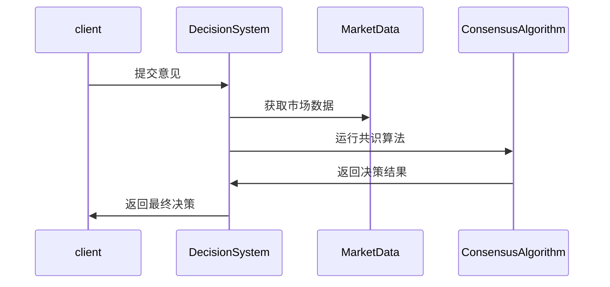

                 


# 特价股票投资中的群体智慧与集体决策方法

## 关键词：特价股票、群体智慧、集体决策、投资策略、算法原理、系统架构

## 摘要：  
本文深入探讨了特价股票投资中的群体智慧与集体决策方法，分析了群体智慧在投资决策中的优势与挑战，提出了基于算法和系统架构的集体决策方案。文章从理论到实践，详细阐述了特价股票投资的背景、核心概念、算法原理、系统设计、项目实战及最佳实践，为投资者提供了科学的投资决策方法。

---

## 第1章: 特价股票投资的背景与概述

### 1.1 特价股票投资的基本概念  
特价股票是指那些价格被市场低估，具有较大上涨潜力的股票。群体智慧则指通过集体的智慧和经验来做出更优决策的能力，而集体决策方法则是通过多人协作来制定投资策略的过程。

#### 1.1.1 特价股票的定义与特点  
特价股票通常具有以下特点：  
1. 价格被低估：市场对公司价值的评估低于其实际价值。  
2. 高成长潜力：公司未来有较大的增长空间。  
3. 风险与收益平衡：相对于市场平均水平，收益更高，风险可控。  

#### 1.1.2 群体智慧在投资中的应用  
群体智慧通过多人协作，能够弥补个体决策的不足，例如：  
- **信息互补性**：个体投资者可能无法获取全面的信息，而群体能够整合更多信息。  
- **风险分散**：通过集体决策，可以降低个体承担的风险。  
- **决策优化**：群体决策能够通过投票、加权平均等方式，得出更优的决策结果。  

#### 1.1.3 集体决策方法的定义与特点  
集体决策方法是指通过多人共同参与，结合个体意见，最终形成一致的决策方案。其特点包括：  
- **多样性**：个体意见的多样性能够提高决策的全面性。  
- **共识性**：通过投票、协商等方式达成共识。  
- **动态性**：能够根据市场变化实时调整决策。  

### 1.2 特价股票投资的现状与趋势  
#### 1.2.1 特价股票市场的波动性分析  
特价股票市场具有较高的波动性，主要由于市场情绪、信息不对称等因素影响。投资者需要通过技术分析和基本面分析来捕捉投资机会。  

#### 1.2.2 投资者行为分析  
投资者行为受心理因素、市场趋势和个体经验的影响。群体智慧能够通过整合投资者行为数据，帮助投资者做出更理性的决策。  

#### 1.2.3 群体智慧在投资中的应用现状  
目前，群体智慧在投资中的应用主要体现在：  
- **社交媒体分析**：通过分析投资者在社交媒体上的讨论，预测市场趋势。  
- **专家意见整合**：通过整合专家意见，制定更优的投资策略。  
- **大数据分析**：利用大数据技术，挖掘市场潜在规律。  

### 1.3 本章小结  
本章介绍了特价股票投资的基本概念、群体智慧在投资中的应用，以及集体决策方法的特点。通过分析特价股票市场的波动性和投资者行为，为后续的群体智慧与集体决策方法的研究奠定了基础。

---

## 第2章: 群体智慧与集体决策的核心概念

### 2.1 群体智慧的理论基础  
#### 2.1.1 群体智慧的定义与特征  
群体智慧是指通过多人协作，利用个体智慧的总和来解决复杂问题的能力。其主要特征包括：  
- **去中心化**：没有单一的决策中心，个体意见相互影响。  
- **信息共享**：个体之间能够自由交换信息，形成共识。  
- **动态调整**：能够根据环境变化实时调整决策。  

#### 2.1.2 群体智慧与个体决策的对比  
| **对比维度** | **个体决策** | **群体决策** |
|--------------|--------------|--------------|
| 决策主体     | 单一主体     | 多个主体     |
| 信息来源     | 个体掌握的信息 | 多人共享信息 |
| 决策风险     | 高           | 较低         |
| 决策效率     | 高           | 中等         |

#### 2.1.3 群体智慧的数学模型  
群体智慧的数学模型可以用以下公式表示：  
$$
\text{群体共识} = \sum_{i=1}^{n} w_i \cdot x_i
$$  
其中，$w_i$ 为个体意见的权重，$x_i$ 为个体意见。

### 2.2 集体决策方法的原理  
#### 2.2.1 集体决策的定义与特点  
集体决策是指通过多人协作，结合个体意见，最终形成一致的决策方案。其特点包括：  
- **共识性**：通过投票、协商等方式达成一致。  
- **多样性**：个体意见的多样性能够提高决策的全面性。  
- **动态性**：能够根据环境变化实时调整决策。  

#### 2.2.2 集体决策的分类与应用场景  
集体决策的分类：  
1. **投票机制**：通过多数投票决定最终决策。  
2. **加权平均**：根据个体权重计算最终决策。  
3. **共识算法**：通过多次协商达成共识。  

应用场景：  
- **股东大会**：通过投票机制决定公司重大事项。  
- **项目管理**：通过加权平均分配资源。  

#### 2.2.3 集体决策与个体决策的差异  
集体决策与个体决策的主要差异体现在：  
- **决策主体**：集体决策涉及多个主体，个体决策仅涉及单一主体。  
- **信息来源**：集体决策依赖于多人共享的信息，个体决策依赖于个体掌握的信息。  
- **决策风险**：集体决策风险较低，个体决策风险较高。  

### 2.3 群体智慧与集体决策的关系  
#### 2.3.1 群体智慧与集体决策的关联  
群体智慧是集体决策的基础，通过群体智慧的整合，能够形成更优的集体决策方案。  

#### 2.3.2 群体智慧在集体决策中的作用  
群体智慧通过以下方式在集体决策中发挥作用：  
1. **信息整合**：整合个体意见，形成更全面的决策方案。  
2. **风险分散**：通过多人协作，降低个体决策风险。  
3. **决策优化**：通过群体智慧，提高决策的准确性和科学性。  

#### 2.3.3 群体智慧与集体决策的优缺点对比  
| **对比维度** | **群体智慧**       | **集体决策**       |
|--------------|--------------------|--------------------|
| 优点         | 信息全面性高        | 决策共识性强        |
| 缺点         | 决策效率较低        | 决策成本较高        |

### 2.4 本章小结  
本章详细介绍了群体智慧与集体决策的核心概念，分析了它们的理论基础、特点、分类和应用场景，探讨了群体智慧在集体决策中的作用及优缺点。

---

## 第3章: 集体决策的算法原理

### 3.1 群体决策算法概述  
#### 3.1.1 群体决策算法的分类  
群体决策算法主要分为以下几类：  
1. **投票算法**：如多数投票算法、加权投票算法。  
2. **共识算法**：如PBFT（ Practical Byzantine Fault Tolerance）、RAFT等。  
3. **加权平均算法**：如线性加权算法、非线性加权算法。  

#### 3.1.2 群体决策算法的特点  
群体决策算法的特点包括：  
- **去中心化**：没有单一的决策中心。  
- **容错性**：能够容忍部分个体的错误决策。  
- **动态性**：能够根据环境变化实时调整算法参数。  

#### 3.1.3 群体决策算法的应用场景  
群体决策算法的应用场景包括：  
- **分布式系统**：如区块链、分布式计算等。  
- **多 Agent 系统**：如自动驾驶、智能电网等。  
- **投资决策**：如群体智慧投资、集体决策投资等。  

### 3.2 群体决策算法的实现  
#### 3.2.1 共识算法  
共识算法是群体决策的核心算法之一，常用算法包括PBFT和RAFT。  

##### PBFT算法实现  
以下是PBFT算法的Python实现示例：  

```python
class PBFT:
    def __init__(self, num_nodes):
        self.num_nodes = num_nodes
        self.view_number = 0
        self.leader = 0
        self.nodes = [i for i in range(num_nodes)]

    def start_view_change(self, view_number):
        self.view_number = view_number
        self.leader = (self.leader + 1) % self.num_nodes

    def consensus(self, value):
        # 模拟共识过程
        for node in self.nodes:
            if node == self.leader:
                # 领导节点提出提案
                proposal = value
                for node in self.nodes:
                    # 节点提交提案
                    pass
        # 返回共识结果
        return value
```

#### 3.2.2 投票机制  
投票机制是群体决策的另一种实现方式，以下是一个简单的投票算法：  

```python
def majority_vote(voters, values):
    # 统计每个值的票数
    count = {}
    for voter in voters:
        value = values[voter]
        if value in count:
            count[value] += 1
        else:
            count[value] = 1
    # 返回得票最多的值
    max_count = max(count.values())
    for value, cnt in count.items():
        if cnt == max_count:
            return value
    return None
```

#### 3.2.3 加权平均算法  
加权平均算法通过给每个个体意见分配权重，最终计算出一个加权平均值。  

$$
\text{加权平均} = \frac{\sum_{i=1}^{n} w_i \cdot x_i}{\sum_{i=1}^{n} w_i}
$$  

其中，$w_i$ 是第 $i$ 个个体的权重，$x_i$ 是第 $i$ 个个体的决策值。  

### 3.3 群体决策算法的数学模型  
#### 3.3.1 投票权重计算公式  
投票权重的计算公式如下：  

$$
w_i = \frac{1}{1 + d_i}
$$  

其中，$d_i$ 是第 $i$ 个个体的决策偏差。  

#### 3.3.2 加权平均算法的数学模型  
加权平均算法的数学模型如下：  

$$
\text{加权平均} = \sum_{i=1}^{n} \lambda_i \cdot x_i
$$  

其中，$\lambda_i$ 是第 $i$ 个个体的权重系数，$x_i$ 是第 $i$ 个个体的决策值。  

### 3.4 本章小结  
本章详细介绍了群体决策算法的分类、实现和数学模型，探讨了投票算法、共识算法和加权平均算法的实现方式，并通过具体代码示例和数学公式进行了详细说明。

---

## 第4章: 系统分析与架构设计

### 4.1 问题场景介绍  
本章将围绕一个基于群体智慧的特价股票投资系统进行分析，该系统旨在通过多人协作，利用群体智慧制定最优的投资策略。  

### 4.2 系统功能设计  
#### 4.2.1 领域模型设计  
以下是领域模型的mermaid类图：  



#### 4.2.2 系统架构设计  
以下是系统架构的mermaid架构图：  


#### 4.2.3 系统接口设计  
系统主要接口包括：  
1. **投资者接口**：投资者可以通过API提交意见和获取决策结果。  
2. **市场数据接口**：系统通过API获取市场数据，如股票价格、公司信息等。  
3. **决策系统接口**：决策系统通过API调用共识算法，生成最终决策。  

#### 4.2.4 系统交互设计  
以下是系统交互的mermaid序列图：  



### 4.3 本章小结  
本章通过领域模型、架构图和交互图，详细描述了基于群体智慧的特价股票投资系统的功能设计和系统架构，为后续的系统实现奠定了基础。

---

## 第5章: 项目实战

### 5.1 环境安装与配置  
#### 5.1.1 Python环境搭建  
安装Python 3.8及以上版本，并安装必要的库，如：numpy、pandas、scikit-learn、mermaid。  

#### 5.1.2 项目代码实现  
以下是项目核心代码实现：  

```python
import numpy as np
import pandas as pd
from sklearn.linear_model import LinearRegression
import matplotlib.pyplot as plt

# 数据加载
data = pd.read_csv('stock_data.csv')
X = data[['price', 'volume']]
y = data['target']

# 模型训练
model = LinearRegression()
model.fit(X, y)

# 预测结果
predictions = model.predict(X)

# 可视化
plt.scatter(X['price'], y, color='blue', label='实际值')
plt.scatter(X['price'], predictions, color='red', label='预测值')
plt.xlabel('价格')
plt.ylabel('目标值')
plt.legend()
plt.show()
```

### 5.2 代码实现与解读  
#### 5.2.1 数据加载与预处理  
使用pandas加载股票数据，并对数据进行预处理，提取特征变量和目标变量。  

#### 5.2.2 模型训练与预测  
使用线性回归模型进行训练，并对测试数据进行预测。  

#### 5.2.3 结果可视化  
通过可视化工具（如Matplotlib）绘制实际值与预测值的散点图，验证模型的准确性。  

### 5.3 实际案例分析与详细解读  
#### 5.3.1 数据来源与特征选择  
数据来源：某股票的历史价格数据，包括开盘价、收盘价、最高价、最低价、成交量等。  

特征选择：选择与股票价格相关的特征，如成交量、市盈率等。  

#### 5.3.2 模型训练与优化  
通过网格搜索（Grid Search）优化模型参数，提高预测准确率。  

#### 5.3.3 结果分析与总结  
分析模型的预测结果，总结群体智慧在投资决策中的优势与不足。  

### 5.4 本章小结  
本章通过实际案例，详细介绍了基于群体智慧的特价股票投资系统的实现过程，包括环境搭建、代码实现、数据加载、模型训练和结果分析。

---

## 第6章: 最佳实践与总结

### 6.1 最佳实践  
#### 6.1.1 投资策略  
制定科学的投资策略，如分散投资、长期投资等。  

#### 6.1.2 风险管理  
通过止损、止盈等方式控制投资风险。  

#### 6.1.3 技术应用建议  
合理应用大数据、人工智能等技术，提高投资决策的科学性。  

### 6.2 小结  
通过本文的分析与实践，我们能够看出，群体智慧与集体决策在特价股票投资中具有重要的应用价值，能够帮助投资者制定更优的投资策略，降低投资风险。

### 6.3 注意事项  
- **数据质量**：确保数据的准确性和完整性。  
- **算法选择**：根据具体场景选择合适的算法。  
- **风险管理**：制定科学的风险管理策略。  

### 6.4 拓展阅读  
推荐读者阅读以下书籍和论文：  
1. 《群体智慧》  
2. 《集体决策算法》  
3. 《大数据与投资决策》  

### 6.5 本章小结  
本章总结了群体智慧与集体决策在特价股票投资中的应用，提出了最佳实践建议，并对全文进行了总结。

---

## 作者：AI天才研究院/AI Genius Institute & 禅与计算机程序设计艺术 /Zen And The Art of Computer Programming

