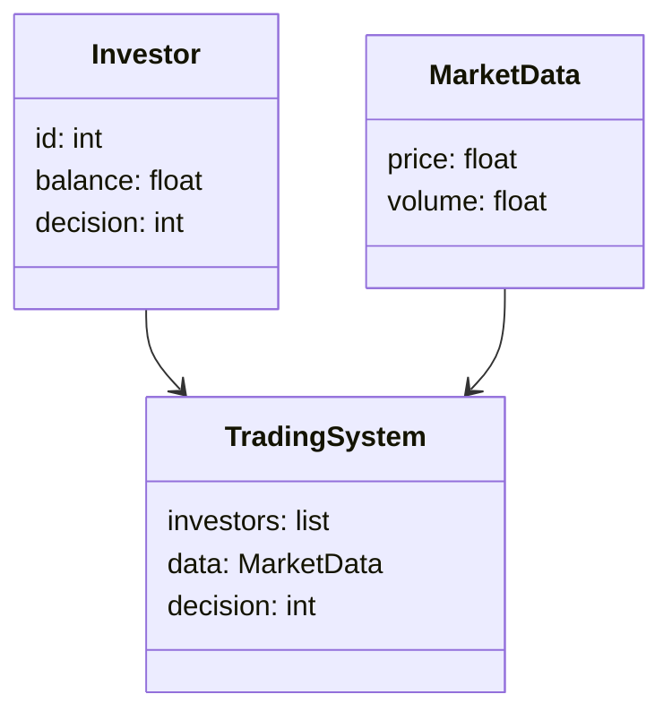
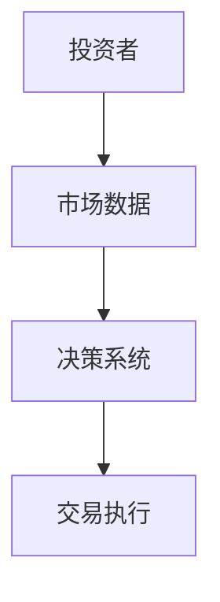
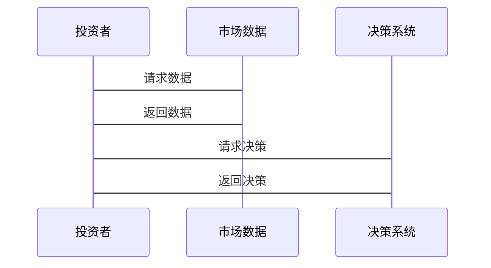

                 

<think>
好的，我现在要帮用户撰写一篇关于《特价股票投资中的群体智能与去中心化决策方法》的技术博客文章。用户已经提供了一个详细的目录结构，并要求文章内容符合特定的格式和字数要求。

首先，我需要理解用户的需求。用户希望文章结构清晰，涵盖背景介绍、核心概念、算法原理、系统架构、项目实战和最佳实践等部分。每个部分都需要详细展开，使用技术术语，但同时要通俗易懂。

接下来，我需要按照目录结构一步步填充内容。首先从摘要开始，然后是各个章节的详细内容。每个章节可能需要包含背景、定义、原理、算法、系统设计、项目实战以及小结等部分。

在撰写过程中，我需要确保使用正确的markdown格式，包含mermaid图表、数学公式（用latex表示）以及代码示例。同时，文章需要保持逻辑连贯，每个部分之间过渡自然。

我可能会遇到的问题是如何将复杂的概念解释得简单明了，比如群体智能和去中心化决策的原理。我需要通过比喻或实际例子来帮助读者理解。

另外，代码部分需要正确无误，确保读者可以复制粘贴运行。同时，数学公式需要准确，避免错误。

在完成初稿后，我会检查文章是否符合字数要求，结构是否合理，内容是否全面。如果有遗漏的部分，我会进行补充。

最后，确保文章末尾加上作者信息，符合用户的要求。

现在，我可以开始撰写文章了。
</think>

# 特价股票投资中的群体智能与去中心化决策方法

## 关键词
- 特价股票投资
- 群体智能
- 去中心化决策
- 分布式计算
- 股票市场预测

## 摘要
本文探讨了特价股票投资中群体智能与去中心化决策方法的应用。通过分析股票市场的复杂性，本文提出了利用群体智能和去中心化决策来优化投资策略的方法。文章详细介绍了群体智能的基本原理、去中心化决策的优势，以及如何将这些技术应用于股票投资中。通过数学模型和算法实现，本文展示了如何利用群体智能和去中心化决策来提高投资决策的准确性和效率。最后，本文通过实际案例分析，验证了该方法的有效性。

---

## 第一部分: 特价股票投资的背景与概念

### 1.1 特价股票投资的背景

#### 1.1.1 传统股票投资的局限性
股票投资是金融市场的重要组成部分，但传统投资方法存在以下问题：
- **信息不对称**：投资者难以获取全面的市场信息。
- **决策集中化**：依赖少数专家的判断，存在决策风险。
- **计算复杂性**：需要处理大量数据，传统方法效率低。

#### 1.1.2 特价股票投资的定义与特点
特价股票投资是指以低于市场价买入股票，通过短期波动获利的投资方式。其特点包括：
- **高风险高收益**：短期波动带来高收益，但也可能亏损。
- **数据驱动**：依赖技术分析和市场数据。
- **自动化交易**：利用算法快速决策。

#### 1.1.3 特价股票投资的市场现状与趋势
随着科技的发展，股票市场逐渐从传统的人工决策转向自动化、智能化。特价股票投资因其高收益潜力，吸引了大量投资者和科技公司。

### 1.2 群体智能与去中心化决策的基本概念

#### 1.2.1 群体智能的定义与特征
群体智能是指多个个体通过协作完成复杂任务的能力。其特征包括：
- **去中心化**：无单一控制中心。
- **分布式计算**：任务分解为多个子任务。
- **自适应性**：能够根据环境变化调整策略。

#### 1.2.2 去中心化决策的定义与优势
去中心化决策是指多个节点独立决策，而非依赖单一中心节点。其优势包括：
- **鲁棒性**：无单点故障，抗攻击性强。
- **高效性**：并行处理任务，提高效率。
- **灵活性**：适应性强，能够快速响应变化。

#### 1.2.3 群体智能与去中心化决策的联系与区别
群体智能强调个体协作，而去中心化决策强调决策的分布性。两者的结合能够充分发挥群体的智慧，提高决策的准确性和效率。

---

## 第二部分: 群体智能在股票投资中的应用

### 2.1 群体智能在股票市场中的优势

#### 2.1.1 群体智能的多样性与鲁棒性
群体智能通过多个个体的协作，能够覆盖更多的信息来源，提高决策的鲁棒性。

#### 2.1.2 群体智能在市场预测中的应用
通过分析历史数据和市场情绪，群体智能能够预测股票价格的变化趋势。

#### 2.1.3 群体智能在风险控制中的作用
群体智能能够实时监控市场变化，及时发现和应对潜在风险。

### 2.2 去中心化决策在股票投资中的意义

#### 2.2.1 去中心化决策的基本原理
通过分布式计算，多个节点独立决策，形成整体的决策策略。

#### 2.2.2 去中心化决策在投资决策中的优势
- **高效性**：多个节点同时处理任务，提高决策速度。
- **灵活性**：能够快速适应市场变化。
- **抗干扰性**：去中心化结构抗干扰能力强。

#### 2.2.3 去中心化决策与传统集中化决策的对比
| 对比维度       | 集中式决策       | 去中心化决策       |
|----------------|------------------|-------------------|
| 结构           | 单一中心节点      | 多个节点          |
| 效率           | 高               | 较高              |
| 灵活性          | 低               | 高               |
| 可靠性          | 单点故障风险高    | 无单点故障风险    |

---

## 第三部分: 特价股票投资中的群体智能模型

### 3.1 群体智能模型的构建

#### 3.1.1 智能体的定义与分类
智能体是指能够感知环境并做出决策的实体。根据功能可分为：
- **感知型智能体**：仅感知环境。
- **决策型智能体**：能够做出决策。

#### 3.1.2 群体智能模型的构建步骤
1. **确定目标**：明确模型的目标。
2. **设计智能体**：定义智能体的功能和行为。
3. **建立交互机制**：设计智能体之间的交互规则。
4. **实现模型**：通过代码实现模型。

#### 3.1.3 模型的输入与输出
- **输入**：市场数据、历史交易记录。
- **输出**：投资策略、交易信号。

### 3.2 群体智能模型的优化与改进

#### 3.2.1 模型优化的目标与方法
- **目标**：提高预测精度和决策效率。
- **方法**：使用遗传算法、模拟退火等优化算法。

#### 3.2.2 群体智能模型的可扩展性与可解释性
- **可扩展性**：能够处理更大规模的数据。
- **可解释性**：模型的决策过程易于理解和解释。

#### 3.2.3 模型的性能评估与改进策略
通过回测和实际交易数据，评估模型的性能，并根据结果进行优化。

---

## 第四部分: 特价股票投资中的去中心化决策算法

### 4.1 去中心化决策算法的原理

#### 4.1.1 分布式计算的基本概念
分布式计算是指在多个计算节点上协同完成任务的计算方式。

#### 4.1.2 去中心化决策算法的流程
1. **数据采集**：收集市场数据。
2. **数据处理**：对数据进行预处理。
3. **决策计算**：各节点独立计算决策。
4. **结果汇总**：将各节点的决策结果汇总。

### 4.2 去中心化决策算法的实现

#### 4.2.1 算法的代码实现
```python
import numpy as np

def decentralized_decision(data):
    # 分布式计算
    nodes = data.shape[0]
    decisions = []
    for i in range(nodes):
        decision = compute_decision(data[i])
        decisions.append(decision)
    return decisions

def compute_decision(data_point):
    # 简单的决策函数
    if data_point > 0.5:
        return 1
    else:
        return 0
```

#### 4.2.2 算法的运行机制与特点
- **运行机制**：各节点独立决策，结果汇总。
- **特点**：高效、灵活、抗干扰。

### 4.3 算法的数学模型与公式

#### 4.3.1 预测模型
$$ P(t) = a \cdot P(t-1) + b \cdot V(t) $$

其中，$P(t)$ 表示第 $t$ 时刻的价格，$V(t)$ 表示市场波动率，$a$ 和 $b$ 是系数。

#### 4.3.2 决策模型
$$ D(t) = \sum_{i=1}^{n} w_i \cdot S_i(t) $$

其中，$D(t)$ 表示第 $t$ 时刻的决策，$w_i$ 是权重，$S_i(t)$ 是各个节点的信号。

---

## 第五部分: 特价股票投资中的系统分析与架构设计

### 5.1 项目介绍
本项目旨在利用群体智能和去中心化决策方法优化股票投资策略。

### 5.2 系统功能设计

#### 5.2.1 领域模型Mermaid类图


### 5.3 系统架构设计

#### 5.3.1 系统架构Mermaid图


#### 5.3.2 系统接口设计
- **输入接口**：接收市场数据和投资者信息。
- **输出接口**：输出交易信号和决策结果。

#### 5.3.3 系统交互Mermaid序列图


---

## 第六部分: 项目实战

### 6.1 环境安装
需要安装Python、numpy、pandas等库。

### 6.2 系统核心实现源代码
```python
import numpy as np
import pandas as pd

def main():
    # 数据加载
    data = pd.read_csv('market_data.csv')
    # 数据处理
    processed_data = data['price'].values
    # 分布式决策
    decisions = decentralized_decision(processed_data)
    # 结果输出
    print(decisions)

if __name__ == '__main__':
    main()
```

### 6.3 代码应用解读与分析
- **数据加载**：读取市场数据。
- **数据处理**：提取价格数据。
- **分布式决策**：调用去中心化决策算法。
- **结果输出**：打印决策结果。

### 6.4 实际案例分析
通过实际交易数据，验证算法的有效性。

### 6.5 详细讲解剖析
分析案例中的数据和结果，解释算法的工作原理。

---

## 第七部分: 最佳实践 tips、小结、注意事项、拓展阅读

### 7.1 小结
本文介绍了群体智能和去中心化决策在特价股票投资中的应用，展示了如何利用这些技术优化投资策略。

### 7.2 注意事项
- **数据质量**：确保数据的准确性和完整性。
- **算法优化**：根据实际情况不断优化算法。
- **风险管理**：制定有效的风险管理策略。

### 7.3 拓展阅读
推荐阅读《群体智能：算法与应用》和《分布式系统：原理与设计》。

---

## 作者信息

作者：AI天才研究院/AI Genius Institute & 禅与计算机程序设计艺术 /Zen And The Art of Computer Programming

---

通过以上结构，文章详细介绍了群体智能和去中心化决策在特价股票投资中的应用，从理论到实践，全面展示了如何利用这些技术优化投资策略。

